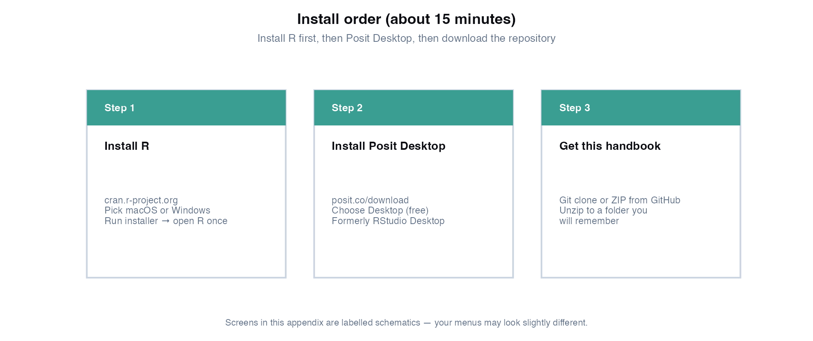
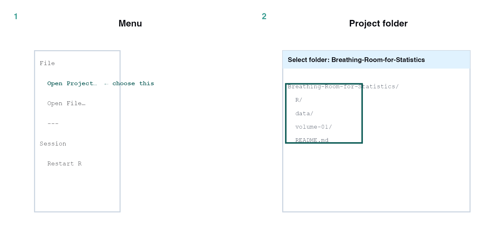
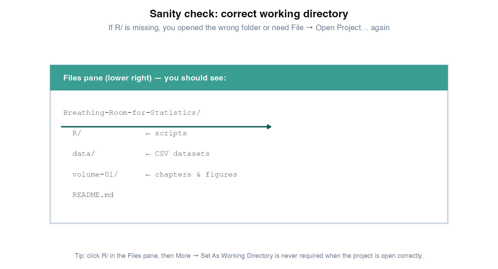
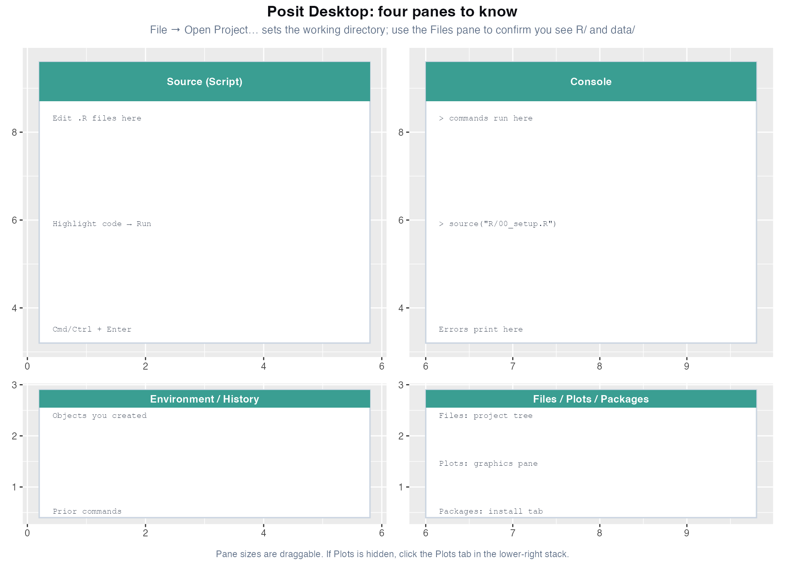
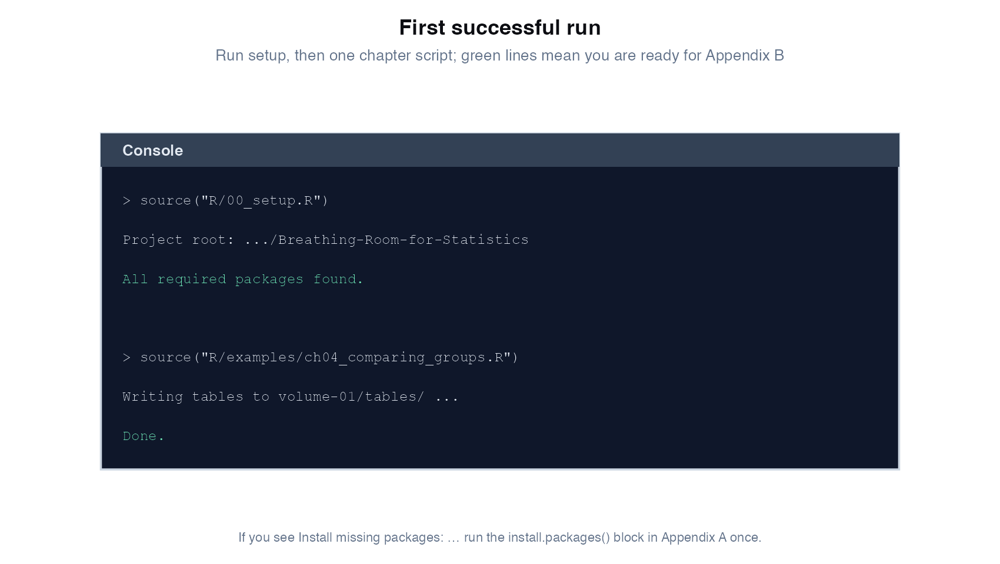
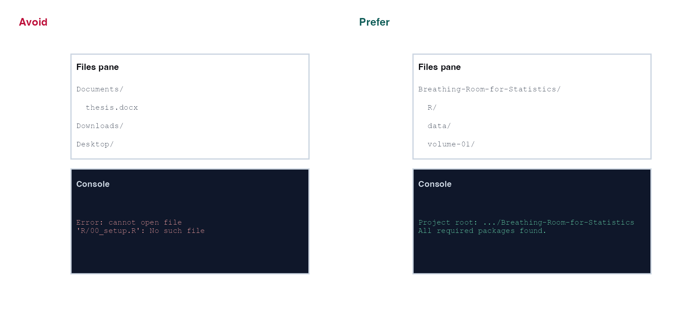

# Appendix A: R environment {.unnumbered}

This appendix is for readers who want to **run the CASTOR scripts** alongside the handbook. It is **not** a full R course: it gets you from zero to a successful first plot. For a **complete beginner SOP** (install, navigation, data import/export, core functions, learning path, Word export), see [R Getting Started SOP](R_GETTING_STARTED_SOP.md). For dplyr, ggplot2, and workflow fundamentals, see [R for Data Science](https://r4ds.hadley.nz/).

**How to use this appendix:** follow the numbered steps in order the first time. Screens are **labelled schematics** (not live screenshots) so they stay readable in print and do not go out of date when Posit tweaks menus. Your computer may look slightly different; match the **labels**, not every pixel.

---

## What you need

| Tool | Purpose | Download |
|------|---------|----------|
| **R** (≥ 4.2 recommended) | Language and packages | [https://cran.r-project.org](https://cran.r-project.org) |
| **Posit Desktop** (recommended) | Editor, console, plots, project manager | [https://posit.co/download/](https://posit.co/download/) |
| **This repository** | Chapters, `data/`, `R/examples/` | [github.com/kimonntotsis/Breathing-Room-for-Statistics](https://github.com/kimonntotsis/Breathing-Room-for-Statistics) |

Posit Desktop was formerly called **RStudio Desktop**. Either name is fine; the workflow below is the same.

---

## Install R and Posit Desktop (about 15 minutes)

{width=100%}

### Step 1. Install R

1. Open [https://cran.r-project.org](https://cran.r-project.org).
2. Click **Download R for macOS** or **Download R for Windows** (under “Download and Install R”).
3. Run the installer with default options.
4. Open **R** once from your Applications folder (macOS) or Start menu (Windows) and confirm a plain console window appears. Close it: you will use Posit Desktop from here on.

### Step 2. Install Posit Desktop

1. Open [https://posit.co/download/](https://posit.co/download/).
2. Choose **Posit Desktop** (free; formerly RStudio Desktop). Do **not** confuse this with Posit Cloud (paid/hosted) unless you already use a cloud account.
3. Run the installer. On first launch, Posit may ask which R version to use: pick the R you installed in Step 1.

### Step 3. Get this handbook on your computer

**Option A: Git (recommended)**

```bash
git clone https://github.com/kimonntotsis/Breathing-Room-for-Statistics.git
cd Breathing-Room-for-Statistics
```

**Option B: ZIP**

Download the repository as a ZIP from [GitHub](https://github.com/kimonntotsis/Breathing-Room-for-Statistics/archive/refs/heads/main.zip), unzip, and note the folder path (e.g. `~/Projects/Breathing-Room-for-Statistics`).

---

## Open the handbook as a project

Opening the repository as a **project** sets the working directory automatically. That is more reliable than typing `setwd()` and prevents the most common error (`cannot open file 'R/00_setup.R'`).

{width=100%}

1. In Posit Desktop: **File → Open Project…**
2. Select the **repository root** folder `Breathing-Room-for-Statistics` (the folder that directly contains `R/`, `data/`, and `volume-01/`).
3. Do **not** open only `volume-01/` or a single chapter folder.

**Sanity check**, the **Files** pane (lower right) should show:

{width=92%}

If `R/` is missing, repeat **File → Open Project…** and pick the correct parent folder.

---

## Learn the four panes

{width=100%}

| Pane | What it does | Handbook habit |
|------|--------------|----------------|
| **Source (Script)** | Edit `.R` files | Open scripts from `R/examples/`; run with **Cmd+Enter** (macOS) or **Ctrl+Enter** (Windows) |
| **Console** | Commands execute here | Paste `source("R/00_setup.R")` here first every session |
| **Environment / History** | Objects and past commands | After **Session → Restart R**, re-run setup |
| **Files / Plots / Packages** | Project tree; graphics; package installer | Confirm `R/` visible in **Files**; view chapter plots in **Plots** |

---

## Install R packages (once)

**Reproducible environments:** this repository ships **`renv.lock`**. After cloning, open the project and run:

```r
install.packages("renv")   # once per machine
renv::restore()            # installs pinned versions from renv.lock
source("R/00_setup.R")
```

To refresh the lockfile after adding packages: `renv::snapshot()`. Optional packages without lockfile entries: `source("R/package_manifest.R"); install_optional()`.

**First-time install without renv** (fallback):

```r
source("R/package_manifest.R")
install_core()
```

Some optional packages appear in individual chapters or exercises (`pwr`, `logistf`, `mice`, `emmeans`, `rpart`, `xgboost`, **omics analyst track** in [Appendix L](appendix-l-omics-analyst-track.md)). Install when a script asks for them:

```r
install.packages(c("mice", "xgboost", "pscl", "car", "logistf", "emmeans", "pwr"))
```

**Reproducible environments:** for frozen package versions, use `renv::restore()` (see lockfile note above). Run all core examples with `source("R/run_all_examples.R"); run_all_examples()`. Bioconductor scripts: `run_all_examples(include_omics = TRUE)`.

**Windows:** if packages fail to compile, install [Rtools](https://cran.r-project.org/bin/windows/Rtools/) matching your R version.

**macOS:** if compilation fails, install Xcode Command Line Tools (`xcode-select --install` in Terminal).

**Packages tab:** you can also tick packages in the **Packages** pane and click **Install**, but the `install.packages()` block above is the reproducible list for this handbook.

---

## First session (every time you work)

Paste into the **Console**:

```r
source("R/00_setup.R")           # paths + package check
source("R/generate_data.R")      # rebuild CASTOR CSV files in data/
source("R/examples/ch04_comparing_groups.R")  # one chapter example
```

You should see output like this:

{width=92%}

`00_setup.R` finds the project root automatically if you opened the folder as a project. It prints the path and stops with a clear message if a package is missing.

**Optional, regenerate all handbook figures:**

```r
source("R/00_setup.R")
source("R/examples/generate_figures.R")
```

**Smoke test, all chapter scripts:**

```r
source("R/run_all_examples.R")
run_all_examples()                 # core path (Ch 1–22 minus Bioconductor)
# run_all_examples(include_omics = TRUE)  # optional Appendix L
```

Outputs land in `data/`, `volume-01/figures/`, and `volume-01/tables/` depending on the script.

---

## Working directory: wrong vs right

{width=100%}

| Problem | Likely cause | Fix |
|---------|--------------|-----|
| `cannot open file 'R/00_setup.R'` | Wrong working directory | **File → Open Project…** → select `Breathing-Room-for-Statistics` |
| `Install missing packages: …` | First-time setup | Run `install.packages(...)` block above |
| `volume-01/tables/...` not found | Figures not generated yet | Run the chapter's `R/examples/chXX_*.R` script |
| Script works in Console but not in Quarto | Different working directory | Always `source("R/00_setup.R")` first; use paths from `paths$data` in scripts |
| Package update broke old code | Version drift | **Session → Restart R** after `update.packages()` |

---

## Posit Desktop shortcuts (essentials)

| Action | Windows / Linux | macOS |
|--------|-----------------|-------|
| Run current line or selection | `Ctrl+Enter` | `Cmd+Enter` |
| Run entire script | `Ctrl+Shift+Enter` | `Cmd+Shift+Enter` |
| Restart R (clear environment) | Session → Restart R | Session → Restart R |
| Go to file | `Ctrl+.` | `Cmd+.` |
| Comment / uncomment lines | `Ctrl+Shift+C` | `Cmd+Shift+C` |
| Open project | File → Open Project… | File → Open Project… |

Full cheat sheets: [Posit cheat sheets](https://posit.co/resources/cheatsheets/) (ggplot2, dplyr, etc.).

---

## Building the PDF (authors only)

Readers do not need this to use the statistics content. To render the book:

```bash
cd volume-01
quarto render --to pdf
```

Requires [Quarto](https://quarto.org/docs/get-started/) and a LaTeX distribution (e.g. TeX Live). From the repository root: `./build-handbook-pdf.sh` copies the PDF to `Breathing-Room-for-Statistics.pdf`.

---

## Where to learn R properly

| Resource | Best for |
|----------|----------|
| [R for Data Science](https://r4ds.hadley.nz/) | tidyverse workflow, ggplot2, wrangling |
| [Posit Primers](https://posit.cloud/learn/primers) | Short interactive lessons |
| [STAT 545](https://stat545.com/) | Data science conventions in R |

Return to the handbook at [Appendix B](appendix-b-quick-reference.md) when you are ready to choose a method.
