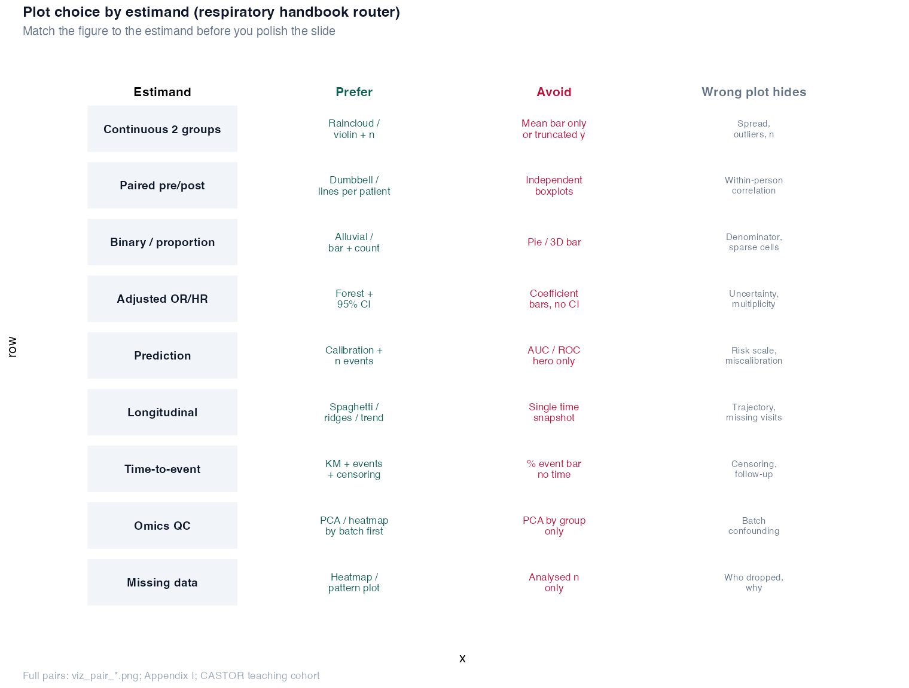

# Appendix I: Figure hygiene (right vs wrong) {.unnumbered}

Plots are not decoration. They are **compressed evidence**. A slide can look decisive while hiding spread, pairing, censoring, batch structure, or missingness. This appendix pairs with [Chapter 3](chapters/03-descriptive-analysis.md) and the **Figure hygiene** callouts in Chapters 4–20.

**Who this is for:** investigators reviewing steering slides, fellows drafting Figure 1, analysts sanity-checking `ggplot` before export.

---

## One-page router

{width=100%}

| If your estimand is… | Prefer | Avoid | Wrong plot often hides |
|----------------------|--------|-------|------------------------|
| Continuous, 2 groups | Box/violin + points + *n* | Mean bar only; truncated *y* | Spread, outliers, overlap |
| Paired pre/post | Lines per participant | Independent boxplots | Within-person correlation |
| Binary proportion | Bar + event/total | Pie; 3D bars | Denominator, sparse cells |
| Adjusted OR / HR | Forest + 95% CI | Coefficient bars, no CI | Uncertainty, null reference |
| Prediction | Calibration + event counts | AUC-only hero | Risk scale, miscalibration |
| Longitudinal | Spaghetti / fitted trend | Single-week snapshot | Dropout, visit structure |
| Time-to-event | KM + events + censoring | % event bar | Timing, follow-up |
| Omics QC | PCA by **batch** first | PCA by group only | Batch confounding |
| Missing data | Pattern plot + flow | Analysed *n* only | Who dropped, why |

Full method routing (tests and models): [Appendix B](appendix-b-quick-reference.md). Investigator read order: [Appendix J](appendix-j-investigator-minimum-path.md) → [Appendix H](appendix-h-clinicians-route.md).

---

## Paired figures in the handbook

Each `viz_pair_*.png` uses **the same CASTOR (or CASTOR-HD) data** twice: left = common mistake, right = estimand-respecting plot.

| Figure | Chapter | What the wrong panel masks |
|--------|---------|----------------------------|
| `viz_pair_ch03_scale_trap.png` | [Ch 3](chapters/03-descriptive-analysis.md) | Axis truncation exaggerates mean gap |
| `viz_pair_ch04_continuous.png` | [Ch 4](chapters/04-comparing-groups.md) | Spread and outliers behind mean bars |
| `viz_pair_ch04_paired.png` | [Ch 4](chapters/04-comparing-groups.md) | Pairing structure (bronchodilator) |
| `viz_pair_ch06_forest.png` | [Ch 6](chapters/06-generalized-linear-models.md) | CI and null (OR = 1) |
| `viz_pair_ch09_prediction.png` | [Ch 9](chapters/09-prediction-vs-inference.md) | Calibration on the risk scale |
| `viz_pair_ch14_batch_pca.png` | [Ch 14](chapters/14-batch-effects.md) | Batch-driven separation |
| `viz_pair_ch18_longitudinal.png` | [Ch 18](chapters/18-longitudinal-mixed-models.md) | Visit history and dropout |
| `viz_pair_ch19_survival.png` | [Ch 19](chapters/19-survival-analysis.md) | Censoring and event timing |
| `viz_pair_ch20_missingness.png` | [Ch 20](chapters/20-missing-data.md) | Pattern of who is missing |
| `viz_pair_ch05_residuals.png` | [Ch 5](chapters/05-linear-models.md) | Linearity and leverage |
| `viz_pair_ch07_model_building.png` | [Ch 7](chapters/07-model-building.md) | Stepwise optimism |
| `viz_pair_ch10_pca.png` | [Ch 10](chapters/10-dimensionality-reduction.md) | Component count discipline |
| `viz_pair_ch11_clustering.png` | [Ch 11](chapters/11-clustering.md) | Endotype overclaiming |
| `viz_pair_ch16_screen.png` | [Ch 16](chapters/16-antibody-discovery.md) | Rank without PPV |
| `viz_pair_ch21_causal.png` | [Ch 21](chapters/21-causal-inference.md) | Causal wording without balance |
| `viz_pair_ch22_mediation.png` | [Ch 22](chapters/22-mediation-analysis.md) | Direct OR reported as total effect |
| `viz_signoff_checklist.png` | [Ch 12](chapters/12-case-studies.md) | Pre-submission gates |

**Related teaching figures (single panel):** `ch15_pseudoreplication_demo.png` ([Ch 15](chapters/15-flow-cytometry.md)), `ch14_group_batch_overlap.png` ([Ch 14](chapters/14-batch-effects.md)), `ch13_proteomics_missingness_by_group.png` ([Ch 13](chapters/13-differential-analysis-fdr.md)).

**APATE vignette (no figure):** [APATE_VIGNETTE](APATE_VIGNETTE.md): CASTOR vs messy registry prose.

**Shortest investigator read:** [Appendix J](appendix-j-investigator-minimum-path.md).

Regenerate all pairs:

```r
source("R/00_setup.R")
source("R/examples/generate_viz_pairs.R")
```

---

## Three questions before you approve a figure

1. **Estimand match:** If I cover the title, can a reader still tell whether the plot shows means, ranks, risks, rates, or survival?
2. **Denominator:** Are *n*, events, person-time, and censoring visible or in the caption?
3. **Sensitivity:** Would the story change if I showed batch colour, full *y*-axis, paired lines, or a missingness strip?

If any answer is no, revise before journal or sponsor sign-off.

---

## Reporting captions (templates)

**Right (continuous RCT):** “FEV1 (L) by randomised arm; box = IQR, points = participants, diamond = mean; *n* = … per arm.”

**Right (survival):** “Kaplan-Meier estimate of time to first exacerbation; ticks = censored observations; *n* events = …”

**Wrong (do not ship):** “Groups differ on FEV1” on a truncated bar chart with no CI and no *n*.

---

## Where this appendix leads

- Descriptive grammar: [Chapter 3](chapters/03-descriptive-analysis.md)
- Comparison and pairing: [Chapter 4](chapters/04-comparing-groups.md)
- CONSORT / STROBE / TRIPOD figure standards: [Chapter 8](chapters/08-validation-reporting.md)
- Integrated omics slides: [Chapter 17](chapters/17-integrated-castor-hd.md), [HIGH_DIM_REPORTING_TEMPLATES](HIGH_DIM_REPORTING_TEMPLATES.md)
