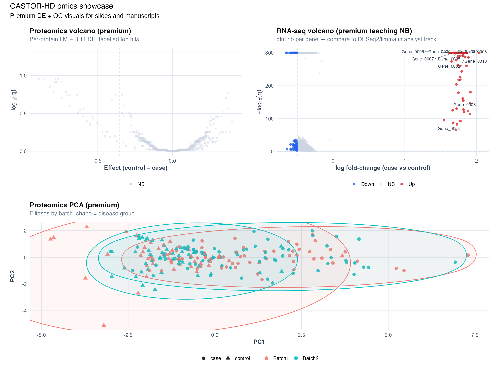

# Appendix L: Omics analyst track {.unnumbered}

> **Optional parallel path** for analysts who want production Bioconductor workflows alongside the investigator-focused Chapters 13–17. Investigator chapters teach *what to ask and how to report*; this appendix teaches *how to run DESeq2, limma-voom, fgsea, and ComBat* on the same CASTOR-HD files [@love2014deseq2; @ritchie2015limma; @johnson2007combat].

## Who should read this

| Reader | Path |
|--------|------|
| **Investigator / PI** | Ch [13](chapters/13-differential-analysis-fdr.md)–[17](chapters/17-integrated-castor-hd.md) + [Appendix M](appendix-m-bioinformatics-deliverables.md) |
| **Analyst / bioinformatics trainee** | This appendix + R scripts below |
| **Self-study omics course** | [Appendix A](appendix-a-r-setup.md) → Ch 13 core → **Appendix L** labs → Ch 14 batch |

## Install Bioconductor packages

```r
if (!requireNamespace("BiocManager", quietly = TRUE)) {
  install.packages("BiocManager")
}
BiocManager::install(c("DESeq2", "limma", "edgeR", "fgsea", "sva"))
install.packages(c("ggrepel", "msigdbr"))
```

Also: `source("R/viz_omics.R")` for premium DE/QC plots (volcano labels, enrichment dot plots, PCA ellipses).

## Analyst scripts (run in order)

| Step | Script | Output |
|------|--------|--------|
| 1 | `R/examples/ch13_differential_fdr.R` | Teaching per-gene models (investigator baseline) |
| 2 | `R/examples/ch13_analyst_deseq2.R` | DESeq2 volcano, MA, heatmap, PCA |
| 3 | `R/examples/ch13_analyst_limma_voom.R` | limma-voom volcano + method comparison |
| 4 | `R/examples/ch13_analyst_fgsea.R` | Pathway enrichment dot plot (fgsea) |
| 5 | `R/examples/ch13_omics_premium_visuals.R` | Premium showcase panel |
| 6 | `R/examples/ch14_analyst_combat.R` | ComBat before/after PCA |

One-liner from repo root:

```r
source("R/00_setup.R")
source("R/generate_data.R")
source("R/examples/ch13_analyst_deseq2.R")
source("R/examples/ch13_analyst_limma_voom.R")
source("R/examples/ch13_analyst_fgsea.R")
source("R/examples/ch13_omics_premium_visuals.R")
source("R/examples/ch14_analyst_combat.R")
```

## Premium figures (slide-ready)

{width=95%}

| Figure | Description |
|--------|-------------|
| `ch13_analyst_deseq2_volcano.png` | DESeq2 volcano with labelled top genes |
| `ch13_analyst_deseq2_ma.png` | DESeq2 MA plot |
| `ch13_analyst_deseq2_heatmap.png` | Top hits heatmap (VST z-score) |
| `ch13_analyst_deseq2_pca.png` | RNA PCA with batch ellipses |
| `ch13_analyst_limma_volcano.png` | limma-voom volcano |
| `ch13_analyst_method_compare.png` | Teaching vs DESeq2 vs limma discovery counts |
| `ch13_analyst_fgsea_dotplot.png` | ClusterProfiler-style enrichment dot plot |
| `ch13_analyst_fgsea_running.png` | Running enrichment trace |
| `ch14_analyst_combat_pca.png` | ComBat before/after PCA panels |
| `ch13_proteomics_volcano_premium.png` | Enhanced proteomics volcano |
| `ch13_rnaseq_volcano_premium.png` | Enhanced RNA volcano |

## Method comparison (teaching point)

The teaching `glm.nb` loop and specialist pipelines should be **directionally similar** when batch is in the model. Large disagreement flags model misspecification, normalization, or filtering differences. See `volume-01/tables/ch13_rnaseq_method_compare.csv`.

**Multiplicity note:** analyst pipelines report BH-adjusted *p*-values via DESeq2/limma defaults. That is **not** the same as Storey π₀-based *q*-values; label results accordingly ([Ch 13](chapters/13-differential-analysis-fdr.md#bh-adjusted-p-values-vs-storey-q-values)).

## What this appendix does NOT cover

- FASTQ → BAM → count matrix (see [Appendix M](appendix-m-bioinformatics-deliverables.md))
- Single-cell RNA-seq (see [Appendix N](appendix-n-bulk-vs-singlecell.md))
- Mass spectrometry proteomics (Olink-like panel only in CASTOR-HD)

## Related chapters

- [Ch 13: Differential analysis + FDR](chapters/13-differential-analysis-fdr.md)
- [Ch 14: Batch effects](chapters/14-batch-effects.md)
- [Ch 17: Integrated CASTOR-HD](chapters/17-integrated-castor-hd.md)
- [FIGURE_INDEX](FIGURE_INDEX.md)
