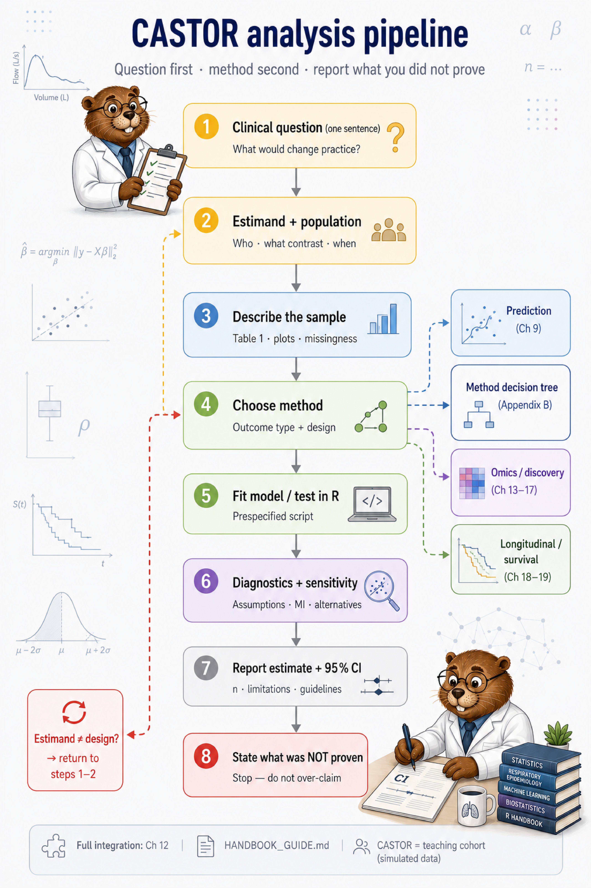

# Chapter 1: Statistical Thinking in Respiratory Research

> **Part I: Foundations**

## Opening scene: Monday morning, wrong tests on every column

Dr Okonkwo’s registry export lands in Mei Lin’s inbox: twelve columns, four hundred rows, one instruction from a student, *“Run stats on everything by smoking.”* The slide deck for lab meeting shows six *p*-values. FEV₁ looks “significant.” So does exacerbation coded 0/1, analysed as if it were a Gaussian outcome. Exacerbation **counts** get the same Welch *t*-test. No one has written the estimand.

Dr Rivera stops on slide 4. *“So smoking affects everything?”* Mei replies: *“We tested everything. We answered nothing. Pick one question first.”*

That hallway moment is why this chapter exists. Later chapters assume you have already written **one sentence** for what you are estimating. Without it, a correct *t*-test or Cox model still answers the wrong question [@harrell2015rms].

---

## Why this chapter

Investigators use this chapter to align with their analyst before recruitment closes. Analysts use it to push back when a protocol says only “compare groups.” You will separate three layers every analysis has, clinical, statistical, and data, and you will meet **CASTOR**, the workflow and synthetic cohort that carry the rest of the book.

*"Is FEV₁ lower in smokers?"* is not yet an analysis until you specify population, contrast, timing, and what decision the answer would inform. Write the estimand in one sentence **before** you open a method router.

---

## Three layers of every analysis

Every analysis has three layers. When they disagree, the output looks fine and the conclusion is still wrong. Mei checks alignment **before** opening R.

**Clinical layer:** what would change in practice if the answer were known? Dr Rivera might need a regulatory story on exacerbations while a steering deck highlights symptom scores, that is a protocol conversation, not a menu choice in SPSS.

**Statistical layer:** what exact contrast are you estimating? Mean FEV₁ at week 12 is not the same estimand as risk difference on ≥1 exacerbation, even on the same spreadsheet.

**Data layer:** what was measured, in whom, when, and what is missing? Post-bronchodilator FEV₁ in one arm and pre-BD in another is a data failure no test repairs.

The table below is a checklist when layers drift apart:

| Layer | Question | Example error |
|-------|----------|---------------|
| Clinical | What decision or knowledge? | Symptom score on slide when approval needs exacerbations |
| Statistical | What estimand/hypothesis? | Mean FEV₁ when the SAP specifies risk difference |
| Data | What was measured, in whom? | Ignoring missing spirometry or mixed BD protocols |

Sponsor timelines compress analysis into a test name. The durable step is five minutes on the estimand in the analysis plan before the first line of R. That prevents more errors than revising the model choice later.

**Common mistake:** open software and pick “Compare Means.” **Instead:** write the estimand, then route via Appendix B, then code.

## What CASTOR means

**CASTOR** names both the working sequence in this book and the synthetic cohort that carries the examples. The sequence is fixed; the data file grows from core trial variables to omics in **CASTOR-HD** (RECURRING_COHORT).

> **Chronic lung disease (CLD) and beyond.** CASTOR is **COPD-flavoured** in the synthetic data so examples stay comparable. The same CASTOR path applies to **CLD** and to other pulmonary work when endpoints align: spirometry, exacerbation rates, longitudinal follow-up, survival, not only when the protocol says “COPD.” Match **estimand and design** first; swap disease wording in your Methods.

**Real registries deceive if you analyse them like CASTOR.** CASTOR omits site clustering, spirometry QC failures, and protocol deviations on purpose. **POLLUX** / **APATE** is the handbook’s prose-only vignette of that mess: read it before signing off real Methods (Handbook resources). Extended “in the room” stories: Appendix K (Handbook resources).

**C. Clinical question.** One sentence on what would change in practice if the answer were known. Endpoints and estimands follow from that sentence, not from a software menu.

**A. Assess design and data.** Classify outcome type, follow-up structure, missingness, and confounding while the question can still be revised.

**S. Select method.** Match the estimand to a technique (Appendix B, METHOD_MAP); never reverse the order.

**T. Test and fit.** Estimate with stated assumptions; run the sensitivity analysis you prespecified, not the one that rescues the *p*-value.

**O. Output estimand.** Report effect size and uncertainty. A *p*-value alone is not an output.

**R. Report limits.** State explicitly what the analysis did not establish (transport, causality, generalisation, multiplicity).

The figure below expands the six letters into eight operational steps (description, diagnostics, written limits). Step 4 links to the `method_decision_tree.png` for outcome-specific choice; branches cover prediction, omics, and longitudinal designs.

### The pipeline in eight steps

{width=92%}

*Same path for a Welch *t*-test on FEV1, a Cox model for time to exacerbation, or a batch-aware omics screen: question, data, method, estimate, limits.*

---

## PICO for respiratory studies

PICO is not a test, it is a **target**. Mei asks investigators to fill four cells on one slide before anyone names a model:

| Element | Question | COPD example |
|---------|----------|--------------|
| **P** Population | Who? | Moderate-severe COPD, GOLD II-III, adults ≥40 |
| **I** Intervention/Exposure | What treatment or factor? | Triple therapy vs dual bronchodilator |
| **C** Comparator | Compared to what? | Standard care, placebo, active control |
| **O** Outcome | What endpoint? | FEV1 at 12 weeks; ≥1 moderate/severe exacerbation in 12 months |

If the **O** cell holds three endpoints, you do not have a PICO yet, you have a wish list. Write PICO before choosing software [@celli2015copdresearch].

### Reporting template

**Methods (study question):**

> We asked whether [intervention] improves [outcome] compared with [comparator] in [population] over [timeframe]. The primary estimand was [one sentence].

---

## Estimands: the target of inference

The **estimand** is the number you would put in the abstract if you could know the truth; not the *p*-value, not “significance,” not the test statistic. Under trial guidance (ICH E9(R1)), estimands tie treatment, population, variable, and intercurrent events; this handbook uses plain language first [@schulz2010consort].

Ask your analyst: *“What one number answers my question?”* If they cannot say, pause.

| Study | Estimand |
|-------|----------|
| COPD RCT | Mean difference in FEV1 (L) at 12 weeks: intervention − control, ITT population |
| Observational cohort | Adjusted odds ratio for ≥1 exacerbation comparing current smokers to never-smokers, conditional on age and FEV1 % predicted |
| Bronchodilator test | Mean change in FEV1 (post − pre) on same visit |
| Prediction model (Ch 9) | 12-month exacerbation risk for a patient with specified covariates, **not** the same as an OR estimand |

Reporting *p* = 0.06 without an effect size is not reporting an estimand. Report the estimate and 95% CI in Results; not *p* alone.

---

## Study designs: what each can support

| Design | Strength | Limit for causal claims | Vol I methods |
|--------|----------|-------------------------|---------------|
| **RCT** | Randomisation balances confounders | ITT vs per-protocol; non-adherence | Ch 4-8 |
| **Cohort** | Temporal order; incidence | Residual confounding | Ch 5-6 (associations) |
| **Case-control** | Efficient for rare outcomes | OR not RR; selection bias | Ch 6 logistic |
| **Cross-sectional** | Prevalence, description | No temporal order for causation | Ch 3-5 |
| **Clustered** | Real-world multi-centre | Wrong SEs if ignored | Vol II |

Design **limits language**. An adjusted logistic OR from an observational cohort is an **association**. Mei will not let you call it proof that stopping smoking **causes** fewer exacerbations without a design that supports that claim [@vonelm2007strobe].

Full data-structure detail: Chapter 2.

---

## Type I error, Type II error, and power

| Term | Plain language | Typical setting |
|------|----------------|-----------------|
| **Type I error (α)** | False alarm - declare effect when none | Often α = 0.05 for confirmatory tests |
| **Type II error (β)** | Miss a real effect | Depends on sample size and effect size |
| **Power** | 1 − β; chance to detect effect if true | Target 80-90% at design stage |

Underpowered exacerbation studies produce **wide CIs** compatible with both null and clinically important effects [@harrell2015rms]. A non-significant p-value does **not** prove "no effect" - remember: wide CIs can include both null and clinically important effects.

### Practice check

If a trial has 60 patients and a soft endpoint, a "negative" result may mean **inconclusive**, not **futile**.

---

## Bias: threats to valid inference

| Bias | Respiratory example | Mitigation |
|------|---------------------|------------|
| **Confounding** | Smoking distorts therapy–FEV1 association | Adjust measured confounders; design (RCT) |
| **Selection** | Sicker patients drop out of follow-up spirometry | Report attrition; sensitivity analyses |
| **Information** | Misclassified exacerbations (patient recall) | Standardised definitions [@hurst2010exacerbation] |
| **Lead-time** | Screening detects mild disease earlier | Survival artefacts - Vol II |
| **Measurement** | Mixed pre/post bronchodilator FEV1 | Protocol standardisation [@graham2019spirometry] |

### Wrong analysis ⚠

Claim causation from observational adjustment alone → use associational language; cite design limits [@vonelm2007strobe].

---

## Inference vs prediction

| | Inference / explanation | Prediction |
|---|-------------------------|------------|
| **Goal** | Estimate adjusted associations; test hypotheses | Rank or classify new patients |
| **CASTOR example** | Smoking OR for exacerbation (Ch 6) | Exacerbation risk score (Ch 9) |
| **Evaluation** | CI, LRT, prespecified estimand | Calibration, AUC, external validation [@moons2015tripod] |
| **Variable selection** | Prespecified prespecified confounders | CV, LASSO - different rules |

Do not evaluate an explanatory model **only** by AUC [@shmueli2010predict]. Do not treat a high-AUC predictor as proof of causation.

Full treatment: Chapter 9.

---

## Reporting frameworks (overview)

| Guideline | Design | Key reference |
|-----------|--------|---------------|
| **CONSORT** | RCT | [@schulz2010consort] |
| **STROBE** | Observational cohorts, case-control | [@vonelm2007strobe] |
| **TRIPOD** | Prediction model development/validation | [@moons2015tripod] |
| **RECORD** | Routinely collected health data | [@benchimol2015record] |

Checklists improve **transparency**; they do not replace correct analysis [@harrell2015rms]. Use CONSORT/STROBE wording when you draft Methods and Discussion.

---

## Navigating the method map

This handbook provides four linked tools:

| Tool | Use when |
|------|----------|
| `analysis_pipeline.png` | You need the **full process** (question → report) |
| Appendix B | You know outcome type; need test/model now |
| METHOD_MAP | Full inventory and decision tree text |
| `method_decision_tree.png` | Visual routing by outcome type |

**Workflow:** pipeline steps 1–3 → method decision tree (step 4) → chapter technique card → R script → report + limitations (steps 7–8).

---

## Catalog of wrong analyses (thinking chapter)

| Wrong | Right |
|-------|-------|
| Menu-driven statistics | Estimand-first workflow |
| p-value without CI | Estimate + CI + n [@harrell2015rms] |
| "Trend" without prespecified trend test | Pre-specify or label exploratory |
| Causal language from cohort OR | Associational language + limitations |
| Evaluate explanatory model by AUC only | Match metrics to goal [@shmueli2010predict] |
| Skip protocol definitions for exacerbation | Cite definition [@hurst2010exacerbation] |

---

## Alternatives & extensions (how to strengthen the thinking layer)

These are not “more statistics.” They are ways to make the same methods more defensible.

| Need | Add | Where |
|---|---|---|
| Formal causal language | DAGs + identification assumptions | Ch 21 |
| Trial estimand precision | ICH E9(R1) estimand framework | Trial protocol work |
| Clinical decision framing | Decision thresholds / net benefit | Ch 9 extensions |
| Reporting discipline | Protocol + checklist alignment | manuscript sign-off |

**Rule:** choose the smallest extension that solves the real problem (confounding, clustering, time-to-event), rather than adding complexity for its own sake.

---


## R lab: first look at CASTOR

```r
source("R/00_setup.R")
source("R/generate_data.R")
library(tidyverse)

spirometry <- read_csv(
 file.path(paths$data, "spirometry.csv"),
 show_col_types = FALSE
)

# Describe before infer
spirometry %>%
 group_by(group) %>%
 summarise(
 n = n(),
 mean_fev1 = mean(fev1),
 sd_fev1 = sd(fev1),
 .groups = "drop"
 )

# Estimand: mean FEV1 difference by group - method justified in Ch 4
t.test(
 fev1 ~ group,
 data = spirometry,
 var.equal = FALSE
)
```

Always **describe** (Ch 3) before **compare** (Ch 4).

---

## Quick reference: where questions go in this handbook

*Routes you to **chapters**.*

| Your question type | Open first | Do not skip |
|--------------------|------------|-------------|
| **Who is in the study?** | [Ch 3](03-descriptive-analysis.md) | Table 1, missingness |
| **Are groups different?** | [Ch 4](04-comparing-groups.md) | Estimand + pairing |
| **Adjusted continuous association** | [Ch 5](05-linear-models.md) | Diagnostics |
| **Binary / count outcomes** | [Ch 6](06-generalized-linear-models.md) | OR vs RR, offset |
| **Many predictors / model building** | [Ch 7](07-model-building.md) | Prespecification |
| **Reporting / CONSORT** | [Ch 8](08-validation-reporting.md) | Limits section |
| **Prediction** | [Ch 9](09-prediction-vs-inference.md) | Calibration |
| **Subgroups / omics exploration** | [Ch 10–11](10-dimensionality-reduction.md) | Claim ladder only |
| **Full worked narratives** | [Ch 12](12-case-studies.md) | Sign-off checklist |
| **Proteomics / screens** | [Ch 13–17](13-differential-analysis-fdr.md) | Batch + FDR |
| **Repeated visits** | [Ch 18](18-longitudinal-mixed-models.md) | Not week-52 *t*-test |
| **Time to event** | [Ch 19](19-survival-analysis.md) | Censoring |
| **Missing data** | [Ch 20](20-missing-data.md) | Pattern + sensitivity |
| **Observational confounding** | [Ch 21](21-causal-inference.md) | Association ≠ causation |

Pipeline figure (`analysis_pipeline.png`), decision tree (`method_decision_tree.png`).

## Where we go next

The CASTOR trial protocol is taking shape: primary FEV₁ at week 12, secondary exacerbation endpoints, four hundred participants. **Chapter 2** is where Mei opens the data dictionary and classifies every column before anyone says “run a *t*-test.” Keep your estimand sentence from this chapter on hand.

## Related chapters

| Chapter | When to open it |
|---------|------------------|
| [Chapter 2: Respiratory data](02-respiratory-data.md) | Outcome type, unit of analysis, CASTOR files |
| [Chapter 3: Descriptive analysis](03-descriptive-analysis.md) | Table 1, plots, distribution checks |
| [Chapter 4: Comparing groups](04-comparing-groups.md) | Welch *t*, proportions, group comparisons |
| [Chapter 8: Validation & reporting](08-validation-reporting.md) | CONSORT, CIs, limits, calibration |
| [Chapter 9: Prediction vs inference](09-prediction-vs-inference.md) | AUC, calibration, nested CV |
| [Chapter 21: Causal inference](21-causal-inference.md) | Confounding, IPW, DAGs |

## Handbook resources

| Resource | When to use it |
|----------|----------------|
| [Appendix B: Quick reference](../appendix-b-quick-reference.md) | Choose a test or model by outcome and design |
| [Appendix I: Figure hygiene](../appendix-i-figure-hygiene.md) | Right vs wrong plot pairs for slides and papers |
| [Appendix K: In the room, short stories](../appendix-k-in-the-room-stories.md) | Extended vignettes of common analysis mistakes |
| [METHOD_MAP](../METHOD_MAP.md) | Full method inventory and decision-tree text |
| [RECURRING_COHORT](../RECURRING_COHORT.md) | CASTOR dataset glossary and narrative spine |
| [POLLUX / APATE vignette](../POLLUX_VIGNETTE.md) | Prose-only messy registry, what CASTOR deliberately hides |

## Further reading

- Harrell, *Regression Modeling Strategies* [@harrell2015rms]
- Shmueli, "To explain or to predict?" [@shmueli2010predict]
- ATS/ERS COPD research statement [@celli2015copdresearch]

## Exercises ([Solutions](../solutions/ch01_solutions.md))
