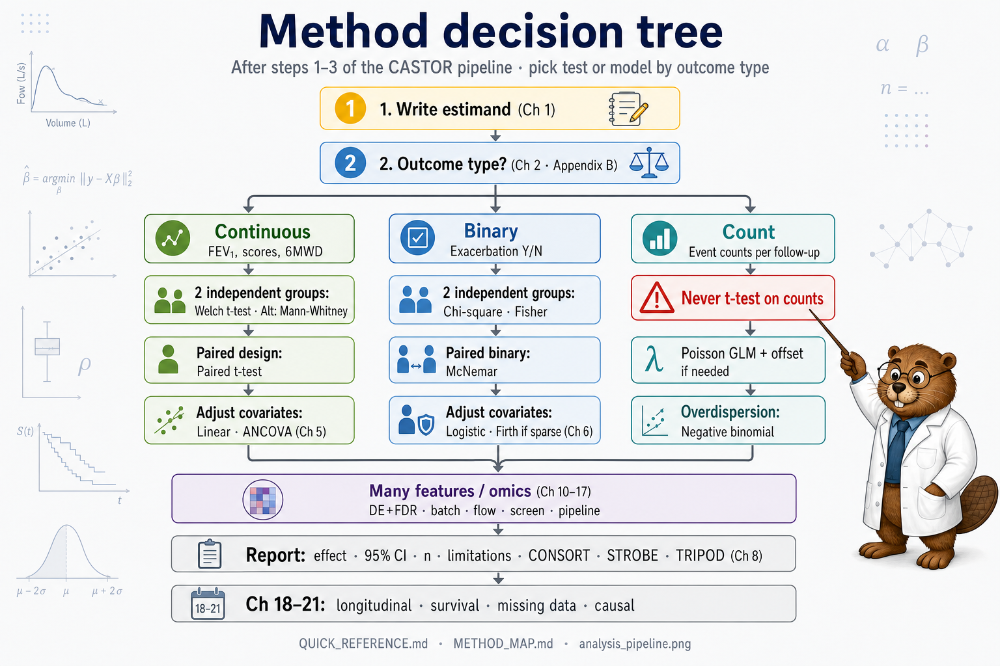

# Chapter 2: Data in Respiratory Research

> **Part I: Foundations**

## At a glance

| | |
|---|---|
| **Focus** | Classify variables, outcomes, and study structures |
| **Key idea** | Outcome type → method (see [QUICK_REFERENCE](../QUICK_REFERENCE.md)) |
| **Recurring cohort** | [CASTOR](../RECURRING_COHORT.md) - `data/*.csv` |
| **Exercises** | [ch02](../exercises/ch02_exercises.md), [Solutions](../solutions/ch02_solutions.md) |

**Also see:** [HANDBOOK_GUIDE](../HANDBOOK_GUIDE.md), [QUICK_REFERENCE](../QUICK_REFERENCE.md), [METHOD_MAP](../METHOD_MAP.md), [GLOSSARY](../GLOSSARY.md), [Decision tree](../figures/method_decision_tree.png)
## Learning objectives

1. Distinguish outcome, exposure, and covariate roles.
2. Classify respiratory outcomes (continuous, binary, count, ordinal, time-to-event, high-dimensional).
3. Recognise data structures: cross-sectional, longitudinal, clustered, case-control.
4. Apply respiratory-specific quality checks (spirometry, exacerbations, omics).
5. Map outcome type to handbook chapter using the quick reference.
6. Complete the pre-analysis checklist before any model.

## Prerequisites

[Chapter 1](01-statistical-thinking.md) - estimands and design.

---

## Why this chapter

The wrong method usually starts with the wrong **outcome type**, not the wrong R function. This chapter is where you classify continuous FEV1, binary exacerbation, counts, survival, and omics before opening a test. Keep [QUICK_REFERENCE](../QUICK_REFERENCE.md) closed until you can complete the checklist at the end of this chapter.

## Opening question

You receive a spreadsheet with patient ID, age, smoking status, therapy, and FEV1. Is that enough to know which methods apply?

**No.** You need the **outcome type**, **study design**, **unit of analysis**, and **research question**. This chapter classifies respiratory data so [QUICK_REFERENCE.md](../QUICK_REFERENCE.md) and Chapters 3-11 can match methods correctly.

---

## The data classification workflow

1. **Name the estimand** in one sentence ([Ch 1](01-statistical-thinking.md)).
2. **Identify the outcome** column and its type (continuous, binary, count, …).
3. **Identify the unit of analysis** (patient, visit, cell, protein).
4. **Map design**: cross-sectional, paired, longitudinal, clustered, survival.
5. **List roles**: exposure, confounders, mediators (do not fish).
6. **QC**: ranges, IDs, missingness, units.
7. **Route**: [QUICK_REFERENCE](../QUICK_REFERENCE.md) → chapter.

---

## Worked vignette: one spreadsheet, three different questions

Same CASTOR columns (`patient_id`, `age`, `sex`, `smoking`, `therapy`, `fev1`): three valid analyses, three method paths:

| Question | Outcome | Unit | Route |
|----------|---------|------|-------|
| Mean FEV1 by smoking? | `fev1` (continuous) | Patient | Welch *t*-test [Ch 4](04-comparing-groups.md) |
| 12-month exacerbation by smoking? | `exacerbation_12m` (binary) | Patient | Logistic [Ch 6](06-generalized-linear-models.md) |
| FEV1 trajectory on therapy? | `fev1` at each visit | Patient (repeated) | Mixed model [Ch 18](18-longitudinal-mixed-models.md) |

**Wrong:** run all three and report whichever has the smallest *p*-value.

---

## Variables: outcome, exposure, covariate

### Technique card

| Role | Definition | Respiratory examples |
|------|------------|----------------------|
| **Outcome** | What you measure as the result | FEV1, exacerbation, death, hospitalisation |
| **Exposure/predictor** | Factor hypothesised to influence outcome | Treatment, smoking, biomarker, air pollution |
| **Covariate/confounder** | Other factors to account for | Age, sex, height, severity, centre |

The same variable **changes role by question**. *Therapy* is an **exposure** in a treatment-effect analysis and a **covariate** when studying biomarkers on a background of standard care.

**CASTOR example:** In `exacerbation.csv`, `smoking` may be exposure when predicting `exacerbation_12m`, but a **confounder** when studying a biomarker's association with FEV1 if smoking affects both.

### Dual interpretation

**Plain language:** know which column is the "answer" and which columns might distort the link.

**Precise language:** causal diagrams ([Ch 21](21-causal-inference.md)) formalise which variables must be adjusted; earlier chapters use subject-matter knowledge and protocol [@harrell2015rms].

**Clinician read:** if you adjust for a variable **caused by** the exposure (a mediator), you may hide a real effect - discuss with your analyst.

### In practice

Real spreadsheets mix litres and millilitres, duplicate IDs, and “exacerbation” columns defined differently across sites. Run the quality checks in this chapter **before** you fit models, not after the output looks interesting.

### Wrong analysis ⚠

| | |
|---|---|
| **Mistake** | Treat every column as a predictor in a fishing expedition |
| **Do instead** | Prespecify outcome, exposure, confounders ([Ch 7](07-model-building.md)) |

---

## Outcome types: the master routing table

Choosing the wrong outcome type - treating a **count** as **binary**, or a **binary** endpoint as **continuous** - is among the most common errors in applied work [@stoltzfus2019biostatistics].

| Type | Examples | Handbook methods | Chapter |
|------|----------|------------------|---------|
| **Continuous** | FEV1 (L), FVC, 6MWD, scores | Mean, *t*-test, linear regression | Ch 3–5 |
| **Binary** | ≥1 exacerbation Y/N; died Y/N | Proportions, Fisher, logistic | Ch 4, 6 |
| **Count** | Exacerbations per year | Poisson, negative binomial | Ch 6 |
| **Proportion** | % with response (large *n*) | Logistic or linear | Ch 4 |
| **Ordinal** | mMRC dyspnoea 0–4 | Ordinal logistic | Ch 6 |
| **Time-to-event** | Time to first exacerbation | Kaplan-Meier, Cox | Ch 19 |
| **High-dimensional** | Proteomics, transcriptomics | PCA, clustering, penalized ML | Ch 10–17 |
| **Proportions (bounded)** | Flow cell-type % | Participant-level models | Ch 15 |



Start at the outcome node, not at “we always use a t-test”: the tree routes to the chapter that matches your estimand.

**Handbook link:** full routing tables in [QUICK_REFERENCE.md](../QUICK_REFERENCE.md).

### Clinician "so what?"

If the protocol defines exacerbations as a **count** but the analyst runs a *t*-test on raw counts, the p-value may be wrong and the effect size uninterpretable → insist on Poisson/NB models ([Ch 6](06-generalized-linear-models.md)).

---

## Data structures

| Structure | Definition | Unit of analysis | Handbook note |
|-----------|------------|------------------|---------------|
| **Cross-sectional** | One row per person, one time point | Patient | Independence assumed in Ch 4-6 |
| **Longitudinal** | Repeated measures per person | Patient-visit | Mixed models | [Ch 18](18-longitudinal-mixed-models.md) |
| **Survival** | Time to event with censoring | Patient | Kaplan-Meier, Cox | [Ch 19](19-survival-analysis.md) |
| **Clustered** | Units nested (patients in hospitals) | Patient (with cluster adjustment) | Cluster-robust SE / mixed models | [Ch 18](18-longitudinal-mixed-models.md) |
| **Case-control** | Sample enriched for cases | Case or control | OR natural; incidence not estimable [@agresti2018introduction] |
| **Paired** | Two measurements same subject | Patient | Paired *t*, McNemar | [Ch 4](04-comparing-groups.md) |
| **Per-cell omics/flow** | Many rows per person | **Not** independent patients | Summarise to participant first | [Ch 15](15-flow-cytometry.md) |

### Dual interpretation

**Plain language:** repeated FEV1 on the same patients is **not** the same as two independent groups of people.

**Precise language:** longitudinal and clustered data violate independence assumptions of standard *t*-tests and GLMs unless extended [@harrell2015rms].

---

## Respiratory-specific data domains

| Domain | Common variables | Pitfalls | Reference |
|--------|------------------|----------|-----------|
| **Spirometry** | FEV1, FVC, FEV1/FVC, % predicted | Pre- vs post-bronchodilator; quality grades | [@graham2019spirometry] |
| **Symptoms** | CAT, SGRQ, ACT | Patient-reported missingness; ordinal nature |
| **Exacerbations** | Binary, count, severity | Definition varies by trial | [@hurst2010exacerbation] |
| **Imaging** | Emphysema fraction, airway wall area | High dimensionality; segmentation error |
| **Omics** | Thousands of markers | *p* >> *n*; batch effects | [@mcshane2011biomarker] |
| **ICU / ventilation** | Waveforms, ventilator settings | Missing not at random; high frequency |

Always document **definitions** in Methods. An exacerbation in one COPD trial is not necessarily the same in another [@hurst2010exacerbation].

### Technique card: spirometry essentials

| | |
|---|---|
| **Must specify** | Pre- or post-bronchodilator; reference equation for % predicted; quality flags |
| **Common error** | Mix pre-BD in one arm and post-BD in another |
| **When to use % predicted** | Comparing across age/sex/height |
| **When to use litres** | Within-trial mean differences with narrow eligibility |
| **Standard** | ATS/ERS spirometry standardisation [@graham2019spirometry] |

---

## Data quality checks (pre-analysis)

Before any model:

| Check | Action | Example failure |
|-------|--------|-----------------|
| **Range** | Plausible min/max | FEV1 < 0; FEV1/FVC > 1 |
| **Consistency** | Age, sex, height vs lung function | Adult with FEV1 6 L and height 150 cm |
| **IDs** | One row per estimand unit | Duplicate patient_id |
| **Missingness** | Pattern and amount | 40% missing FEV1 in one arm only |
| **Units** | Litres vs mL; pack-years definition | Mixed units in one column |
| **Protocol** | BD timing, visit windows | Visit 2 spirometry outside window |

### Reporting template

**Methods (data):**

> Spirometry was performed according to ATS/ERS standards [@graham2019spirometry]. Pre-bronchodilator FEV1 (litres) was the primary lung function outcome. Exacerbations were defined as [prespecified definition] [@hurst2010exacerbation]. Data quality checks included range validation and duplicate ID review.

---

## From question to data checklist

Complete **before** opening [QUICK_REFERENCE](../QUICK_REFERENCE.md):

| # | Question | If unclear → |
|---|----------|--------------|
| 1 | What is the **outcome** variable and its **type**? | Re-read protocol |
| 2 | What is the **unit of analysis** (patient, visit, cluster)? | Ch 2 §2.3 |
| 3 | Are observations **independent**, **paired**, or **clustered**? | Ch 4 design row |
| 4 | Was **randomisation** used? | Limits causal language |
| 5 | What **confounders** are available and justified? | Ch 7 |
| 6 | How much **missing data** and what pattern? | [Ch 20](20-missing-data.md) |
| 7 | What is the **estimand** in one sentence? | Ch 1 |

---

## CASTOR datasets: outcome type map

| File | Key variables | Outcome type | Primary chapter |
|------|---------------|--------------|-----------------|
| spirometry.csv | fev1, group, smoking | Continuous | Ch 3-5 |
| spirometry_trial.csv | baseline and follow-up FEV1 | Continuous (longitudinal; ANCOVA) | Ch 4, 5 |
| bronchodilator_paired.csv | fev1_pre, fev1_post | Continuous, paired | Ch 4 |
| exacerbation.csv | exacerbation_12m | Binary | Ch 6 |
| exacerbation_counts.csv | exacerbations_12m, person_years | Count | Ch 6 |
| marker_panel.csv | M1-M30, processing_batch | High-dimensional | Ch 10-11 |
| longitudinal_spirometry.csv | fev1 by visit, group | Continuous, repeated | [Ch 18](18-longitudinal-mixed-models.md) |
| time_to_exacerbation.csv | time_days, event | Time-to-event | [Ch 19](19-survival-analysis.md) |

See [RECURRING_COHORT.md](../RECURRING_COHORT.md).

---

## CASTOR-HD datasets (high-dimensional biology preview)

These files are designed for later "advanced discovery" chapters in a single-volume book. They illustrate recurring problems: \(p \gg n\), batch/plate/run effects, censored/missing values, multiplicity (FDR), and honest validation.

| File | What it represents | Key teaching points |
|------|---------------------|---------------------|
| proteomics_olink_like.csv | Olink-like protein panel (~1000 proteins) | LOD missingness, plate/batch effects, differential abundance, FDR |
| rnaseq_counts.csv | RNA-seq gene counts (~1200 genes) | library size, NB models, DE, batch runs, FDR |
| flowcytometry_summary.csv | per-subject flow summaries | proportions, marker medians, drift, group comparisons |
| flowcytometry_cells_toy.csv | small per-cell flow toy dataset | gating vs clustering, visualization vs inference |
| antibody_screen.csv | screening signals (replicates, batch) | hit calling, replicate agreement, ranking stability |
| antibody_confirmation.csv | confirmation assay (KD + positives) | screen PPV, confirmation discipline |

Reporting templates for these analyses are in [HIGH_DIM_REPORTING_TEMPLATES.md](../HIGH_DIM_REPORTING_TEMPLATES.md).

---

## Catalog of wrong analyses (data chapter)

| Wrong | Why it fails | Right |
|-------|--------------|-------|
| *t*-test on binary exacerbation Y/N | Wrong outcome type | Fisher / logistic [Ch 4, 6] |
| *t*-test on exacerbation **counts** | Count, skewed, bounded | Poisson / NB [Ch 6] |
| `lm()` on 0/1 outcome | Predictions outside [0,1] | Logistic [Ch 6] |
| Ignore pairing in pre/post BD | Inflated false positives | Paired *t* [Ch 4] |
| Analyse repeated FEV1 as independent | Wrong SEs | Mixed models [Ch 18](18-longitudinal-mixed-models.md) |
| Analyse survival as 12-month binary only | Loses timing | [Ch 19](19-survival-analysis.md) |
| Pool flow cells as n | Pseudo-replication | [Ch 15](15-flow-cytometry.md) |
| Cluster on markers + FEV1, then "predict" FEV1 | Circular | Cluster on markers only [Ch 11] |
| Omics heatmap without batch check | Technical artefacts | [Ch 14](14-batch-effects.md) |

---

## Alternatives & extensions (data structures that change the method)

If any of these apply, the “default” methods in Vol I need an extension.

| Data feature | What breaks | What to do |
|---|---|---|
| Repeated FEV1 over time | independence | [Ch 18](18-longitudinal-mixed-models.md): mixed models / GEE |
| Time to exacerbation | censoring | [Ch 19](19-survival-analysis.md): survival analysis |
| Multi-centre clustering | SEs too small | [Ch 18](18-longitudinal-mixed-models.md): cluster-robust / mixed |
| High-dimensional omics p>>n | unstable estimates | Ch 7, 10, [13–17](13-differential-analysis-fdr.md) |
| Routine EHR data | selection/measurement bias | RECORD-style reporting [@benchimol2015record] + sensitivity |

---


## R lab: inspect CASTOR data

```r
source("R/00_setup.R")
source("R/generate_data.R")
library(tidyverse)

spirometry <- read_csv(file.path(paths$data, "spirometry.csv"), show_col_types = FALSE)
exacerbation <- read_csv(file.path(paths$data, "exacerbation.csv"), show_col_types = FALSE)
counts <- read_csv(file.path(paths$data, "exacerbation_counts.csv"), show_col_types = FALSE)

glimpse(spirometry)
summary(spirometry$fev1)

# Quality summary
spirometry %>%
  summarise(
    n = n(),
    pct_missing_fev1 = mean(is.na(fev1)),
    min_fev1 = min(fev1),
    max_fev1 = max(fev1)
  )

# Outcome type routing
message("fev1: continuous → Ch 4–5")
message("exacerbation_12m: binary → Ch 6 logistic")
message("exacerbations_12m: count → Ch 6 Poisson/NB")
```

---

## Chapter summary

- Classify **outcome type** and **data structure** before choosing any test.
- Respiratory data require domain definitions (spirometry, exacerbations, omics).
- Use the pre-analysis checklist (§2.6) every time.
- Route to methods via [QUICK_REFERENCE.md](../QUICK_REFERENCE.md).

## Where this chapter leads

**Next:** [Chapter 3](03-descriptive-analysis.md) describes the cohort before [Chapter 4](04-comparing-groups.md) compares groups. If you already know you need survival or mixed models, skim [Ch 18–19](18-longitudinal-mixed-models.md) after the checklist here.

## Further reading

- ATS/ERS spirometry standardisation [@graham2019spirometry]  
- COPD exacerbation impact [@hurst2010exacerbation]  
- Stoltzfus, *Biostatistics for Health and Biological Science Users of R* [@stoltzfus2019biostatistics]

## Exercises ([Solutions](../solutions/ch02_solutions.md))

**E2.1** Classify FEV1, exacerbation Y/N, and exacerbations/year.

**E2.2** Same variable `therapy` as exposure vs confounder: give scenarios.

**E2.3** What is the unit of analysis for `longitudinal_spirometry.csv`?

**E2.4** Route `time_to_exacerbation.csv` to the correct handbook chapter.

**Applied**

1. Run the R lab below on `spirometry.csv` and `exacerbation.csv`.
2. Complete the seven-item checklist for a hypothetical smoking–FEV1 question.
3. For each CASTOR file in the outcome map, state outcome type in one word.

**Next:** [Chapter 3 - Descriptive Analysis and Visualization](03-descriptive-analysis.md)
