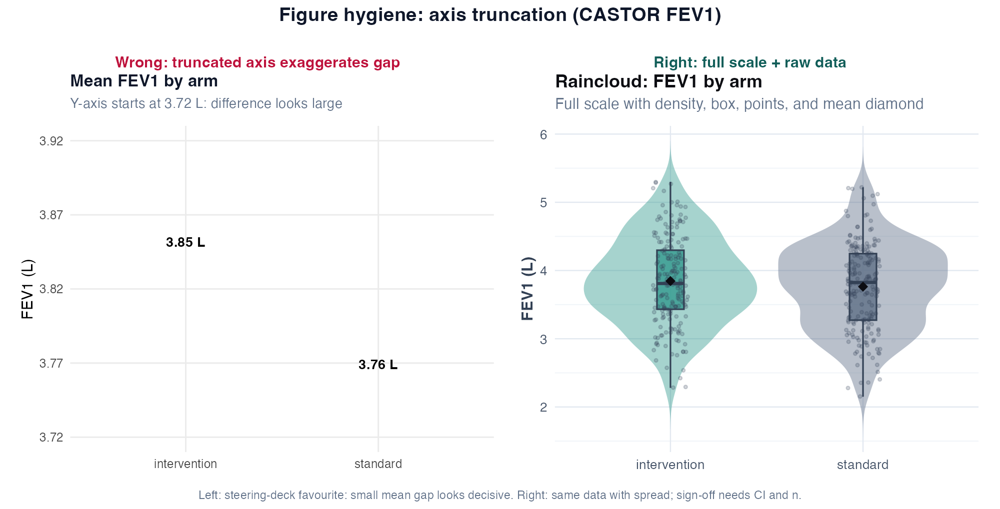
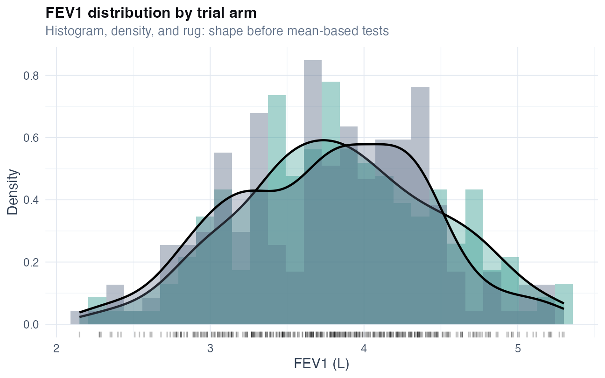
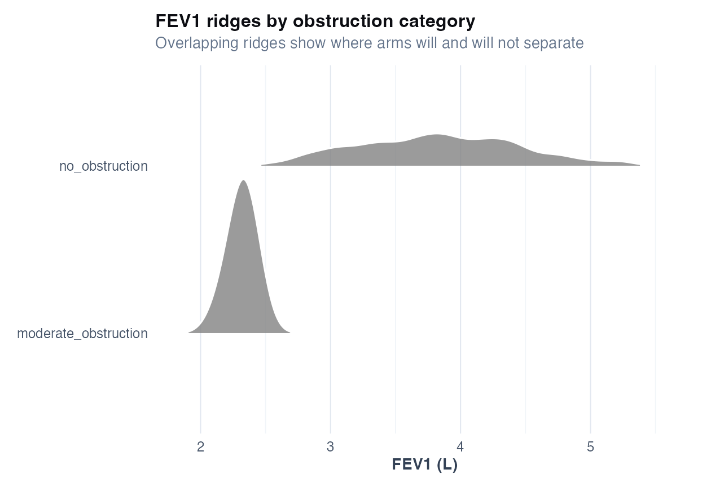
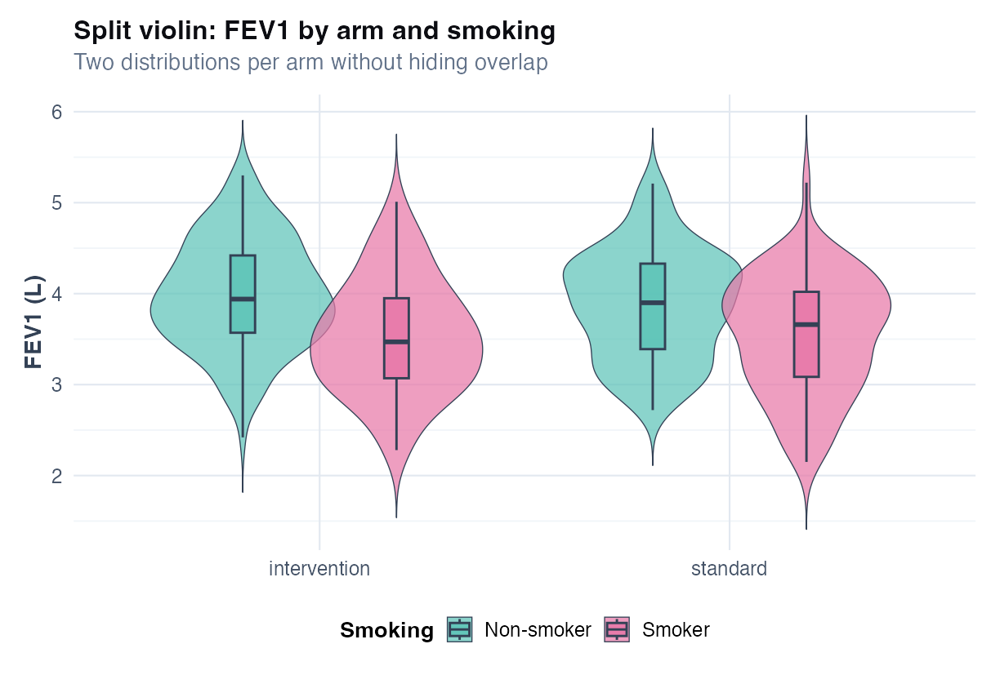
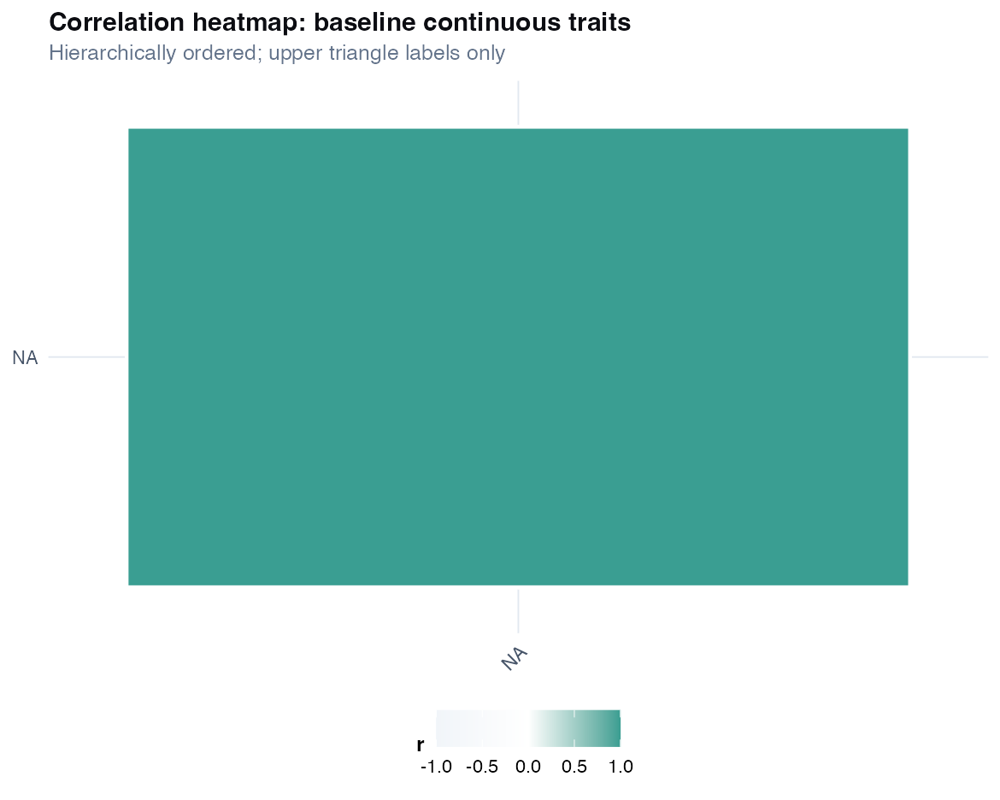
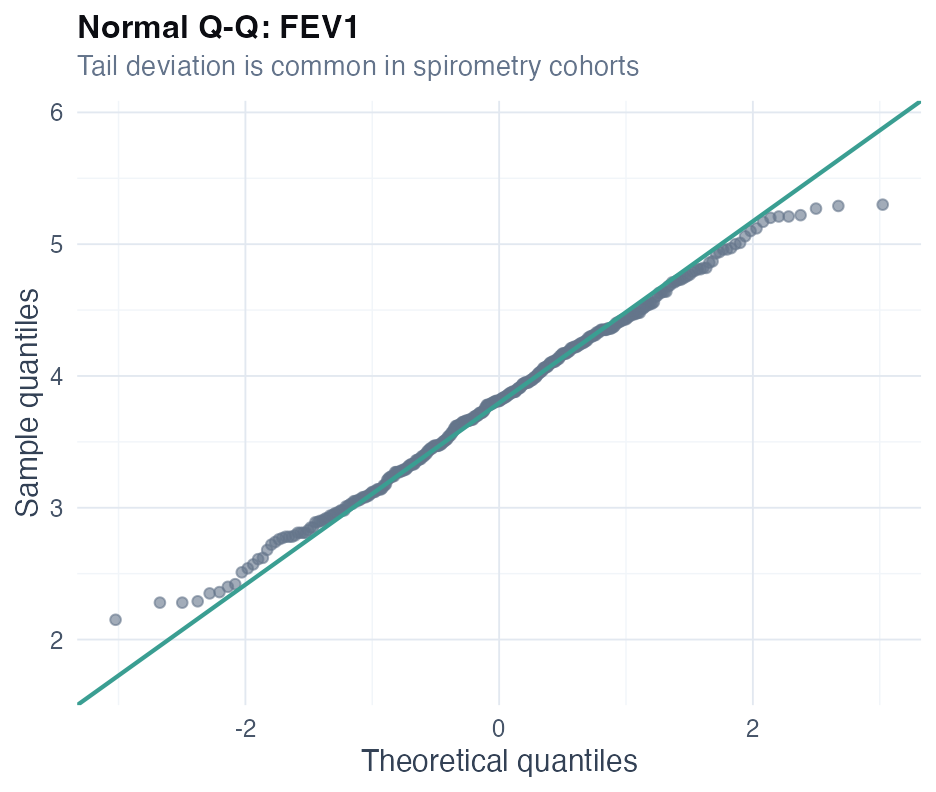
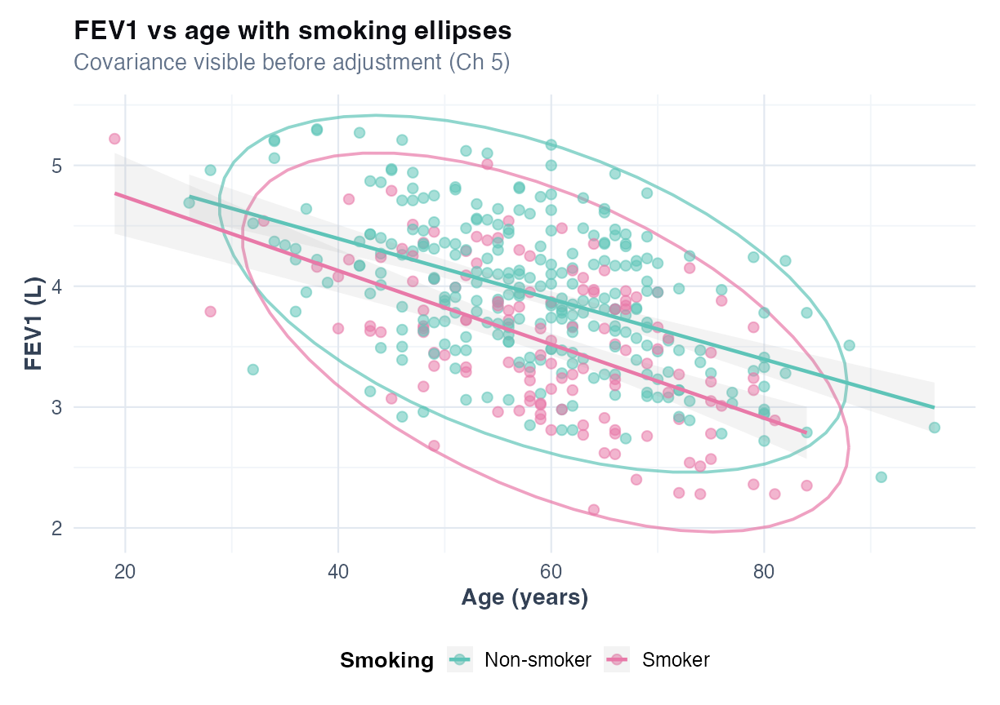

# Chapter 3: Descriptive Analysis and Visualization

> **Part II: Description Before Inference**

## Opening scene: the steering committee wants numbers

Two weeks before interim lock, the DSMB asks for baseline balance. Dr Rivera needs Table 1 by tomorrow. Mei has the CASTOR export but not yet a prespecified primary test — and that is fine. Description comes **first**.

A sponsor slide shows mean FEV₁ bars with a cropped *y*-axis; the arms look worlds apart. Mei replaces it with violins on the full scale. *"If this is our only figure,"* she tells Rivera, *"would you still sign the SAP?"*

---

## Why this chapter

Reviewers meet your study in Table 1 and Figure 1. Description is not preamble — it is where missingness, skew, and protocol quirks become visible. CASTOR starts here so you see the same four hundred participants before any inferential claim.

> **How to read this chapter:** Table 1 and plot-choice sections first; technique cards below are reference — jump to your variable type.

---

## The descriptive workflow

1. **Inventory** - n, variables, types, missingness
2. **Summarise** - Table 1 by exposure/arm
3. **Visualise** - distributions and relationships
4. **Decide** - symmetric → mean/t-test path; skewed → median/nonparametric
5. **Report** - before primary analysis

---

## Plot choice by estimand

Description is where **figure choice** meets **method choice**. The plot must show the same quantity you will test: spread for a mean difference, pairing for pre/post, denominators for proportions, uncertainty for adjusted effects.

{width=96%}


### Figure hygiene: axis truncation

Steering decks often crop the *y*-axis so a small mean difference looks decisive. The pair below uses the same CASTOR FEV1 by arm.



| Panel | Shows | Masks if used alone |
|-------|--------|---------------------|
| **Wrong (left)** | Mean bars on a truncated scale (3.72–3.92 L) | Full distribution, outliers, clinical overlap |
| **Right (right)** | Violin + box + points + mean diamond on full scale | Nothing critical if *n* is in the caption |

**Practice read:** if the right panel were your only slide, would you still sign off the primary analysis? If not, the figure is doing its job.

**Caption template:** “FEV1 (L) by randomised arm; box = IQR, points = participants, diamond = mean; *n* = … per arm.”

Truncating the *y*-axis or dropping points makes arms look separated when the full-scale plot would show overlap — pair every inferential figure with Table 1 and the prespecified test (Ch 4).

---

## Technique: Table 1 (baseline characteristics)

Table 1 answers: *who entered the study, and do the arms look comparable on what we measured?* It is **descriptive only** — not evidence that treatment worked. For CASTOR, Mei builds it with `gtsummary::tbl_summary(by = group)` before any primary test [@schulz2010consort; @vonelm2007strobe].

**Practice read:** if arms differ sharply on baseline FEV₁ or smoking, an unadjusted week-12 comparison is harder to defend — plan adjustment in Ch 5–6. Do not treat baseline *p*-values as if they were the trial primary; reviewers see that mistake often.

Watch for: different *n* on each row (hidden attrition), collapsed GOLD categories that hide severity, and baseline-only snapshots that ignore later missingness. Table 1 is often drafted by a junior author while the analyst is on another project — agree variable definitions first or Table 1 and the model will describe different populations.

**Common mistakes:** skipping Table 1 and jumping to an outcome *p*-value; or citing baseline *p* < 0.05 as proof the arms will differ on the primary endpoint.

### Reporting template

**Methods:** Baseline characteristics were summarised by treatment arm. Continuous variables are mean (SD); categorical variables n (%). Analyses used R (gtsummary).

**Results:** Table 1 shows 400 participants (198 intervention, 202 standard). Mean age 58.7 years; 33% smokers; mean FEV1 3.80 L. Groups were similar on observed baseline variables.

### R lab

```r
source("R/examples/ch03_descriptive.R")
```

---

## Technique: Summary statistics (mean, median, SD, IQR)

Summaries describe **typical** and **spread**. For roughly symmetric FEV₁ in litres, mean (SD) is standard. For skewed outcomes — ICU length of stay, costs, some biomarkers — median [IQR] tells a truer story. Binary variables are always *n* (%).

For FEV₁ specifically: a single mean can hide bimodality in mixed asthma–COPD cohorts; SD describes patient spread while the CI describes uncertainty in the **mean** — do not confuse them. Label litres vs % predicted clearly [@graham2019spirometry].

---

## Technique: Histogram and density plot

Before a *t*-test, look at the shape. Histograms and density curves show skew, floor effects, and outliers that a mean bar would hide. CASTOR figures: `ch03_fev1_histogram.png`, `ch03_fev1_ridge.png`.

**Practice read:** a cluster of very low FEV₁ values (severe obstruction) is a signal to consider median-based summaries or rank tests in Ch 4 — not a reason to truncate the axis on a slide.



The combo plot shows where most CASTOR FEV1 values fall before you choose mean vs median summaries.



Ridge densities compare cohort subsets without collapsing to a single bar.

With small *n*, a bar chart of mean ± SE alone is misleading — show the distribution or individual points.

---

## Technique: Boxplot and violin plot

Boxplots show median, IQR, and outliers; violins show the full density — useful when arms **overlap** more than a mean bar suggests. CASTOR: `ch03_fev1_violin.png`. Outliers may be real severe patients; investigate before deleting points.



Compare spread between arms and smoking strata, not only central tendency.



Heatmaps surface collinearity before regression (Ch 5–7).

---

## Technique: QQ plot (normality check)

QQ plots ask a narrow question: *are these data roughly normal enough for a mean-based test?* Points near the diagonal suggest yes; heavy tail curvature suggests skew or outliers. Run one before a *t*-test on small or moderate *n* — not as a ritual on every large trial, where Shapiro–Wilk often rejects trivial deviations [@harrell2015rms]. CASTOR figure: `ch03_fev1_qq.png`; in R, `stat_qq() + stat_qq_line()`.

**Practice read:** mild tail deviation is common in spirometry. With *n* ≈ 400, pair the visual with the planned Welch test rather than swapping methods because Shapiro *p* < 0.05. After regression, QQ on **residuals** matters more than QQ on raw FEV₁.



---

## Technique: Scatterplot and correlation

Scatterplots show whether two continuous measures move together — FEV₁ vs age, for example — before you commit to a regression line. Pearson *r* assumes linearity; Spearman ρ is safer when the relationship is monotonic but curved. CASTOR: `ch03_fev1_scatter.png`.

Correlation is not causation, and a few influential points can drive *r*. Colouring by smoking often reveals confounding structure that a single correlation coefficient hides.

**Common mistake:** correlating binary smoking (0/1) with FEV₁ and calling it an “effect” — use regression (Ch 5) for an adjusted statement.



Association in the scatter motivates adjusted models; it does not prove causation.

---

## Missing data in descriptives

Report n for each variable. Note if complete-case n drops. Missing FEV1 in spirometry trials often informative (sicker patients skip test) - see Ch 20.

---

## CASTOR worked example

**Step 1:** Table 1 by `group`.
**Step 2:** Histogram and violin of FEV1 (figures above).
**Step 3:** QQ plot → roughly symmetric → Welch t reasonable (Ch 4) [@welch1947t].
**Step 4:** Scatter FEV1 vs age, coloured by smoking → motivates adjusted regression (Ch 5).

---

## Catalog of wrong analyses (descriptive chapter)

The recurring failures are predictable: hiding missing *n*, treating Table 1 *p*-values as the trial primary, summarising heavy skew with a mean, leaving units off axes, or skipping plots and trusting a test you never looked at. Each of those is fixable in an hour if you catch it before submission — expensive if a reviewer does.

---


## R lab

```r
source("R/examples/ch03_descriptive.R")
```

---

## Quick reference: methods in this chapter

| Method | When to use | Why |
|--------|-------------|-----|
| **Mean ± SD** | Approximately normal continuous (FEV1 litres) | Standard; pair with n and units |
| **Median [IQR]** | Skewed outcomes (LOS, costs, some biomarkers) | Robust centre and spread |
| **Count (% )** | Binary and categorical variables | Clear for exacerbation history, smoking |
| **Histogram / density** | Check skew, bimodality before *t*-tests | Informs Ch 4–6 method choice |
| **Q–Q plot** | Formal normality check (sensitivity) | Supports or challenges Gaussian methods |
| **Boxplot / violin by group** | Visual arm comparison before inference | Shows overlap and outliers |
| **Scatter (FEV1 vs age)** | Bivariate relationships | Motivates adjustment in Ch 5 |
| **Table 1** | Baseline characteristics by arm | Required before comparative claims |
| **Missingness table / plot** | Any variable with &gt;0% missing | Documents who is excluded later |
| **SMD instead of Table 1 *p*-values** | Describe balance without hypothesis tests | *p*-values confound balance with sample size |

**Extensions:** ECDF, ridgeline plots in [Alternatives & extensions](#alternatives--extensions-choose-by-data).

---

## Alternatives & extensions (choose by data)

Descriptives are where you decide what later methods are plausible. Use these alternatives when the data demand it.

### Technique: Standardized mean differences (SMD) instead of Table 1 p-values

| | |
|---|---|
| **Use when** | You want to describe baseline balance without hypothesis testing |
| **Why** | SMD is scale-free; p-values depend heavily on n |
| **Common R** | `cobalt` package; or compute SMD directly |

### Technique: Robust summaries for skew/outliers

| Data pattern | Prefer |
|---|---|
| Heavy right tail (LOS, ICU days) | Median [IQR], trimmed mean |
| Outliers likely | Median absolute deviation (MAD), winsorized summaries |

### Technique: Missingness visualization

| | |
|---|---|
| **Use when** | Many variables with missing data; patterns may be informative |
| **Common R** | `naniar::vis_miss()`, `mice::md.pattern()` (Vol II expands MI) |

### Technique: Distributional comparison plots

| Plot | Use when |
|---|---|
| ECDF | Compare full distributions across groups |
| Ridgeline density | Many groups; need compact distribution comparison |

### Technique: Transformations (for later modelling)

| | |
|---|---|
| **Use when** | Positive skewed outcomes; multiplicative variability |
| **Examples** | log-transform biomarkers; log(1+y) for counts *only descriptively* |
| **Caution** | Transformation changes estimand; report scale clearly |

## Where we go next

The DSMB slide is done: Table 1 balanced, violins on full scale, missingness noted. Rivera closes the laptop. *"So — can we call the primary?"* That question moves to **Chapter 4**, with the same CASTOR arms and the prespecified Welch estimand Mei has been defending since week one.

## Related chapters

| Chapter | When to open it |
|---------|------------------|
| [Chapter 4: Comparing groups](04-comparing-groups.md) | Welch *t*, proportions, group comparisons |
| [Chapter 5: Linear models](05-linear-models.md) | ANCOVA, adjusted continuous associations |
| [Chapter 20: Missing data](20-missing-data.md) | MAR/MNAR, MICE, sensitivity analyses |

## Handbook resources

| Resource | When to use it |
|----------|----------------|
| [Appendix B: Quick reference](../appendix-b-quick-reference.md) | Choose a test or model by outcome and design |
| [Appendix I: Figure hygiene](../appendix-i-figure-hygiene.md) | Right vs wrong plot pairs for slides and papers |

## Further reading

- Harrell, *Regression Modeling Strategies* - descriptive summaries before modelling [@harrell2015rms]
- Stoltzfus, *Biostatistics for Health and Biological Science Users of R* [@stoltzfus2019biostatistics]
- Wickham, *ggplot2* [@wickham2016ggplot2]
- CONSORT / STROBE baseline reporting [@schulz2010consort; @vonelm2007strobe]

## Exercises ([Solutions](../solutions/ch03_solutions.md))

