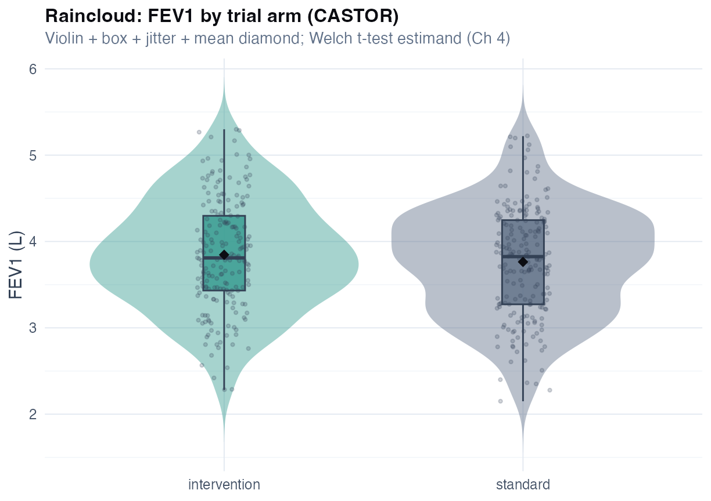
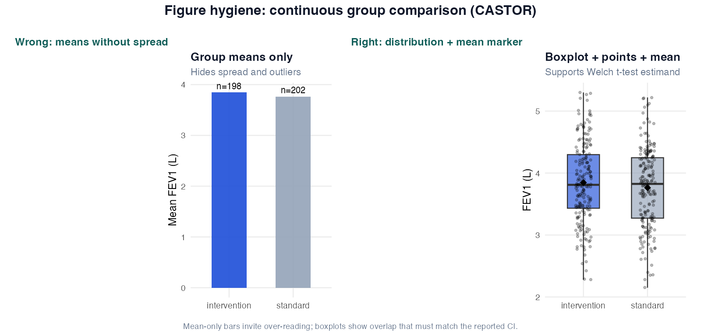
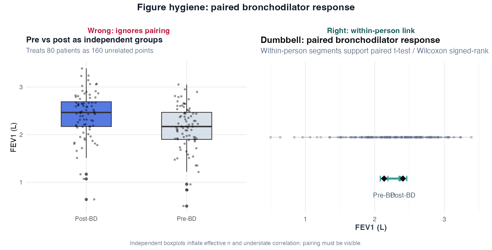
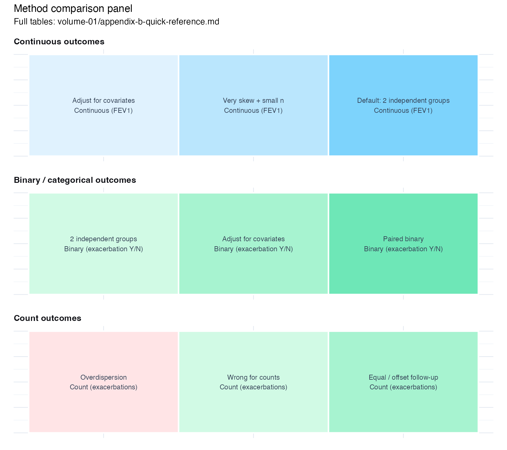

# Chapter 4: Comparing Groups

> **Part II: Inference for Common Respiratory Outcomes**

## Opening scene: "Can we call this a win?"

Interim CASTOR results land: mean FEV₁ 3.85 L intervention vs 3.76 L standard care. The forest-plot snippet looks encouraging; *p* = 0.20. A steering member reads significance from colour alone.

Mei projects the mean difference and 95% CI: 0.09 L (−0.04 to 0.21). The prespecified MCID was 0.10 L. *"Non-significant superiority is inconclusive,"* she says, *"not proof the arms are equal. We report the estimand we wrote in the SAP."*

This chapter is the reference for that conversation — and for every other group comparison in respiratory work.

---

## Why this chapter

Most respiratory papers hinge on a comparison: means, proportions, or rates between arms. The mistakes repeat — wrong pairing, wrong outcome family, *p*-values without effect sizes. Work through the CASTOR primary here; bookmark the chapter when your endpoint changes.

Pre- and post-bronchodilator timing must match across arms. Classify exacerbation endpoints as **proportion vs count** before you pick a row in the master table — counts belong in GLMs, not here. **Welch *t*** is the default for two independent continuous groups; always pair it with **mean difference + 95% CI**, not *p* alone. A non-significant week-12 FEV₁ result is **inconclusive**, not proof of equivalence unless the SAP prespecified an equivalence margin. Wilcoxon compares **ranks**; if mean and median stories diverge, report both.

> **How to read this chapter:** Reference sections — read the opening scene and [Quick reference](#quick-reference-methods-in-this-chapter) first; jump to your outcome type. You do not read every technique sequentially.

---

## The comparison workflow

Every group comparison follows five steps:

1. **Estimand** - mean difference? median difference? risk difference?
2. **Design** - independent, paired, or clustered?
3. **Outcome type** - continuous, binary, count?
4. **Method** - matched to 1-3 with stated assumptions
5. **Report** - effect estimate, 95% CI, n, test/ model, limitations

---

## Unadjusted, adjusted, and multiple endpoints

Sponsor slides often mix three distinct decisions: a **crude arm difference**, a **covariate-adjusted** effect, and **several lung endpoints on one page**. Treat each as its own estimand with its own reporting rule.

### Unadjusted vs adjusted

| Analysis | Estimand (plain) | When it is primary | Report with |
|----------|------------------|--------------------|-------------|
| **Unadjusted** | Raw mean or proportion difference between groups | Balanced RCT with prespecified simple comparison; Table 1 shows acceptable balance (Ch 3) | Point estimate + 95% CI + **n** (and **events** for binary outcomes) |
| **Adjusted** | Difference **holding prespecified covariates fixed** (age, sex, baseline FEV1, centre, …) | Observational cohorts; baseline imbalance; pulmonary RCTs using ANCOVA | Same + **list covariates**; residual checks (Ch 5) |

**RCT rule:** prespecify in the SAP whether the primary analysis is unadjusted ITT, **ANCOVA with baseline FEV1**, or a prespecified change score. Do not run all three and promote the smallest *p*.

**Observational rule:** adjusted logistic or linear models are the main analysis; unadjusted comparisons are **sensitivity** analyses that show how much confounding matters: not proof of effect (Ch 21).

**Wording:** unadjusted → “mean difference between groups”; adjusted → “associated with … after adjustment for …” unless the design supports stronger causal language.

**Practice read:** Case B in Ch 12 shows crude proportions beside an adjusted exacerbation model: mirror that pattern when baseline imbalance or confounding is plausible.

#### Wrong analysis ⚠

Do not report a Fisher odds ratio or Welch mean difference as “adjusted” without covariates — label unadjusted explicitly and route adjustment to regression (next two chapters in Part III). Do not change covariates after seeing results; prespecify confounders in the SAP before unblinding and treat post-hoc tweaks as sensitivity only.

### Linking multiple clinical outcomes

FEV1, FVC, symptom scores, and exacerbation rate are **clinically related** but **statistically separate**. Link them in the **protocol**, not by running many primary *p*-values.

| Layer | Rule | Where to write it |
|-------|------|-------------------|
| **One primary** | Single estimand drives sample size and trial success | SAP + CONSORT primary line |
| **Secondaries in a family** | Prespecify order; **Holm** or gatekeeping across the family | [Multiplicity](#multiplicity) below; SAP |
| **Exploratory** | Hypothesis-generating; honest labelling | Discussion limits; Case 12 capstone |
| **Omics / biomarkers** | Separate testing family from clinical endpoints; FDR, not Holm on FEV1 | Part VI |
| **Unsupervised clusters** | Not linked to outcomes until externally validated | Ch 11 |

**Composite endpoints** (e.g. FEV₁ responder **and** no exacerbation): freeze components, missing-data rules, and the winning definition in the SAP **before** database lock — not after a borderline *p*-value. Typical analysis: risk difference in responder proportion + 95% CI; secondaries in a separate Holm family. This handbook does not treat composite construction in depth; borrow from trial-statistics references and mirror the single-endpoint discipline in Case A (Ch 12).

**Common mistakes:** four primary *p*-values on one slide; omics volcano beside week-12 FEV₁ as one confirmatory package; Fisher/Welch labelled “adjusted” without covariates — route adjustment to Part III regression.

---

## Continuous outcomes: two independent groups

### Technique: Welch two-sample t-test

Welch's *t*-test compares **means** between two independent groups on a continuous outcome — FEV₁, FVC, 6MWD — without assuming equal variances. One measurement per patient; approximate normality within groups (or large *n*); independence. Estimand: mean difference (group A − group B). R: `t.test(y ~ group, var.equal = FALSE)`.

**Practice read (CASTOR primary):** mean difference 0.09 L (95% CI −0.04 to 0.21) — does the interval exclude, straddle, or include the prespecified MCID (~0.10 L in many COPD trials)? That question matters more than *p* = 0.20 [@cazzola2008mcid; @welch1947t].

Do not use Welch on binary/count outcomes, paired measurements, strongly skewed small samples, or clustered data. Non-significant superiority is **inconclusive**, not proof of equivalence. Pre- and post-bronchodilator protocol must match between groups [@graham2019spirometry]. For skewed FEV₁, prespecify Mann–Whitney as sensitivity and report median [IQR] alongside the mean-based primary.

```r
t.test(fev1 ~ group, data = spirometry, var.equal = FALSE)
```

**Methods:** FEV1 (L) at 12 weeks compared between arms using Welch's *t*-test (two-sided α = 0.05); estimand = mean difference (intervention − standard).

**Results:** Mean FEV1 3.85 L (SD 0.64, *n* = 198) vs 3.76 L (SD 0.64, *n* = 202). Mean difference 0.09 L (95% CI −0.04 to 0.21; *p* = 0.20). **Do not say:** “No effect”; “trend toward benefit” without a prespecified trend test.

### Technique: Pooled two-sample t-test

Assumes equal variances — rarely needed; Welch is the default. Use only with strong domain reason and Levene supporting equality: `t.test(..., var.equal = TRUE)`.

### Technique: Mann–Whitney U (Wilcoxon rank-sum)

Rank-based comparison when FEV₁ is clearly skewed with small *n*, or as a **prespecified sensitivity** to Welch. Tests whether **distributions** differ, not whether **means** differ unless shifts are symmetric [@mann1947test]. Report median [IQR] or Hodges–Lehmann alongside any mean-based primary.

```r
wilcox.test(fev1 ~ group, data = spirometry)
```

**Common mistake:** run Mann–Whitney and report only the mean difference. **Instead:** if tests disagree, report mean difference + CI **and** median [IQR].

---

## Continuous outcomes: one sample

**One-sample *t*-test** — is the cohort mean FEV₁ different from a reference $\mu_0$? Use sparingly; reference equations are population-specific. Prefer % predicted or regression when comparing to “normal” spirometry.

```r
t.test(spirometry$fev1, mu = 3.0)
```

**Common mistake:** compare clinic mean to textbook “normal” FEV₁ without age/sex/height standardization.

---

## Continuous outcomes: paired measurements

### Technique: Paired t-test

Same patient, two measurements — pre/post bronchodilator FEV₁ (`bronchodilator_paired.csv`). Tests whether mean pairwise difference ≠ 0. Standardise BD protocol across visits [@graham2019spirometry]. **Common mistake:** Welch *t* on pre vs post as independent groups.

```r
bronchodilator <- read_csv(
 "data/bronchodilator_paired.csv",
 show_col_types = FALSE
)
t.test(bronchodilator$fev1_pre, bronchodilator$fev1_post, paired = TRUE)
```

**Practice read:** mean change ~0.25 L — compare to MCID for bronchodilator response [@cazzola2008mcid]. For skewed paired differences, use `wilcox.test(pre, post, paired = TRUE)`.

**Results template:** Mean FEV1 increased 0.25 L post-bronchodilator (95% CI 0.24 to 0.27; paired *t*, *p* < 0.001; *n* = 80).

---

## Continuous outcomes: three or more groups

**One-way ANOVA** tests whether any group means differ (CASTOR: FEV₁ by `diagnosis`). A significant F-test only says *some* pair differs — follow with **prespecified contrasts** or Tukey, not every pairwise test without adjustment.

```r
fit_aov <- aov(fev1 ~ diagnosis, data = spirometry)
summary(fit_aov)
TukeyHSD(fit_aov)
```

**Kruskal-Wallis** — nonparametric alternative when skew or ordinal severity dominates: `kruskal.test(fev1 ~ diagnosis, data = spirometry)`.

**Common mistake:** ANOVA significant → test all pairs without adjustment. **Results template:** FEV₁ differed by diagnosis (ANOVA *F* = 49.6, *p* < 0.001). Tukey: no obstruction vs moderate mean diff 1.52 L (95% CI …).

---

## Adjusting for baseline (preview)

When groups differ at baseline or you want greater precision in an RCT, ask whether follow-up FEV₁ differs **after adjusting baseline FEV₁ and prespecified covariates**. Full ANCOVA is **Chapter 5** — not a substitute for randomisation in causal claims.

```r
# lm(fev1_followup ~ group + fev1_baseline + age + sex, data = trial)
```

---

## Binary outcomes: comparing proportions

**Chi-square** tests independence in larger tables (expected counts ≥ ~5 per cell). **Fisher exact** when tables are sparse. Always report **risk difference, RR, or OR with 95% CI** — not *p* alone.

```r
tab <- table(exacerbation$therapy, exacerbation$exacerbation_12m)
chisq.test(tab)
# fisher.test(tab, simulate.p.value = TRUE, B = 10000)  # sparse tables
```

**Practice read (CASTOR smoking × exacerbation):** is the exacerbation rate different in smokers? Report absolute risk difference alongside any *p*-value — *"2.9% more events"* is clearer than *p* alone.

Unadjusted tables ignore age, FEV₁, and prior history. For adjusted associations, use logistic regression (Part III). **Common mistakes:** chi-square only with no effect size; reporting an unadjusted OR as an “adjusted effect.”

**Results template:** Exacerbation occurred in 13/171 smokers (7.6%) and 5/179 non-smokers (2.8%). Fisher exact *p* = 0.05; unadjusted OR 2.86 (95% CI 0.93 to 10.5). Confounders not adjusted.

### Effect measures for binary outcomes

| Measure | Meaning |
|---------|---------|
| **Risk difference** | Absolute difference in proportions |
| **Risk ratio** | Relative proportion |
| **Odds ratio** | Ratio of odds (logistic output) |

Risk difference tells you how many more patients per 100 experience the event. RD = $p_1 - p_2$; RR = $p_1/p_2$.

```r
prop.test(
 x = c(sum(exacerbation$exacerbation_12m[exacerbation$smoking]),
 sum(!exacerbation$exacerbation_12m[exacerbation$smoking])),
 n = c(sum(exacerbation$smoking), sum(!exacerbation$smoking))
)
```

### McNemar test (paired binary)

Same patient, before/after binary outcome (e.g. sputum culture positive pre vs post therapy). **Not** for independent groups — do not run chi-square on stacked before/after rows.

```r
# mcnemar.test(table(before, after))  # rows=before, cols=after
```

**Results template:** McNemar *p* = …; 12 improved, 3 worsened among discordant pairs (*n* = …).

---

## Count outcomes: comparing rates

For **exacerbation counts** between groups, Poisson or negative binomial regression is preferred over t-tests on raw counts. Use count/binary GLMs (Chapter 6).

Quick two-group comparison (equal follow-up):

```r
counts <- read_csv(
 "data/exacerbation_counts.csv",
 show_col_types = FALSE
)
wilcox.test(
 exacerbations_12m ~ factor(smoking),
 data = counts
) # descriptive
# Inferential: Poisson GLM (Ch 6)
```

---

## Effect sizes

### Cohen's d (two groups)

$$
d = \frac{\bar{x}_1 - \bar{x}_2}{s_p}
$$

where $s_p$ is pooled SD.

```r
cohen_d <- function(x, g) {
 stats <- tapply(x, g, function(v) {
 c(mean = mean(v), sd = sd(v), n = length(v))
 })
 m1 <- stats[[1]]["mean"]; m2 <- stats[[2]]["mean"]
 s1 <- stats[[1]]["sd"]; s2 <- stats[[2]]["sd"]
 n1 <- stats[[1]]["n"]; n2 <- stats[[2]]["n"]
 sp <- sqrt(((n1 - 1) * s1^2 + (n2 - 1) * s2^2) / (n1 + n2 - 2))
 (m1 - m2) / sp
}
cohen_d(spirometry$fev1, spirometry$group)
```

Rule-of-thumb (Cohen): |d| ≈ 0.2 small, 0.5 medium, 0.8 large — MCID and clinical context matter more in pulmonary trials.

---

## Permutation tests and sample size (Tier C)

**Permutation test:** shuffle group labels when *n* is small or distributions are doubtful — complements Welch; prespecify the statistic. **Power:** anchor on MCID or published mean difference before enrolment closes, not post hoc (`pwr::pwr.t.test(...)`). **Multiplicity:** one prespecified primary; Holm/gatekeeping for secondaries; separate FDR family for omics (see [Unadjusted, adjusted, and multiple endpoints](#unadjusted-adjusted-and-multiple-endpoints)).

---

## Master decision table

*Quick lookup by outcome × design. For **when** and **why**, see [Method choice at a glance](#method-choice-at-a-glance) above.*

**Primary test by outcome and design**

| Outcome | Design | Primary method |
|---------|--------|----------------|
| Continuous | 1 vs reference | One-sample *t* |
| Continuous | 2 independent groups | Welch *t* |
| Continuous | 2 paired measurements | Paired *t* |
| Continuous | 3+ independent groups | ANOVA + contrasts |
| Binary | 2 independent groups | Chi-square / Fisher |
| Binary | 2 paired measurements | McNemar |
| Count | 2+ independent groups | Poisson / NB GLM |

**Alternative or adjusted analysis**

| Outcome | Design | Alternative / next step |
|---------|--------|------------------------|
| Continuous | 1 vs reference | Wilcoxon signed-rank vs median |
| Continuous | 2 independent groups | Mann-Whitney |
| Continuous | 2 paired measurements | Wilcoxon signed-rank |
| Continuous | 3+ independent groups | Kruskal-Wallis |
| Binary | 2 independent groups | Logistic regression (adjusted) |
| Binary | 2 paired measurements | Logistic GEE (adjust covariates) |
| Count | 2+ independent groups | Negative binomial; Wilcoxon sensitivity |

Full map: METHOD_MAP; Visual: `method_decision_tree.png`



Overlapping distributions warn against reading a small mean difference as clinically certain without the CI and sample size.

### Figure hygiene: continuous comparison (mean bar vs distribution)



| Panel | Shows | Masks |
|-------|--------|-------|
| **Wrong** | Mean bar heights only | Spread, outliers, per-arm *n* on the plot |
| **Right** | Raincloud + mean diamond | (pair with Welch *t* CI in text) |

**Practice read:** would a sponsor infer “clear separation” from the wrong panel alone? The right panel should match the overlap in your 95% CI.

### Figure hygiene: paired bronchodilator (independence vs pairing)



| Panel | Shows | Masks |
|-------|--------|-------|
| **Wrong** | Pre and post as two independent boxplots | Within-person correlation; paired estimand |
| **Right** | Dumbbell / paired segments | (supports paired *t* / Wilcoxon signed-rank) |




Side-by-side panels show how the same CASTOR subset looks under different comparison choices; use this to sanity-check pairing and outcome type before picking a test.

---

## Worked example: COPD trial FEV1

**Design:** Parallel RCT, n ≈ 200 per arm.
**Estimand:** Difference in mean FEV1 (litres) at 12 weeks (intervention − standard).
**Analysis:** Welch t-test (prespecified); linear model with baseline covariates as sensitivity.

**Results template:**

> Mean FEV1 was 3.85 L (SD 0.64) in the intervention arm and 3.76 L (SD 0.64) in standard care (n = 198 and 202). The mean difference was 0.09 L (95% CI −0.04 to 0.21; Welch t, p = 0.20). The difference is compatible with no effect and with clinically small benefits; this trial was not powered for a prespecified MCID of 0.10 L.

**Practice read:** not statistically significant; CI includes values that may or may not matter clinically — interval estimation preferred over “failed trial” language [@harrell2015rms].

---


## R lab

Run the full script:

```r
source("R/examples/ch04_comparing_groups.R")
```

Includes: Welch t, Wilcoxon, ANOVA, Tukey, ANCOVA, permutation test, power calculation, chi-square, Fisher, Cohen's d, paired bronchodilator test.

---

## Common pitfalls in respiratory research

1. **Mixed spirometry standards** - pre- vs post-bronchodilator compared across groups.
2. **Ignoring clustering** - patients within hospitals analysed as independent.
3. **Multiple endpoints** - fishing without multiplicity control.
4. **Mean vs median** - skewed ICU length-of-stay analysed with t-test on small n.
5. **Baseline imbalance** - unadjusted observational comparison of FEV1 by exposure.

---

## Alternatives & extensions (choose by data and design)

Chapter 4 covers the default comparisons. Use these alternatives when the **assumptions, design, or estimand** differ.

### Continuous outcomes: beyond “t vs Wilcoxon”

| Situation | Alternative | Why / note |
|---|---|---|
| Heavy tails/outliers | **Trimmed-mean tests** (e.g. Yuen) | Robust mean-like estimand; report trimming |
| Small n; unclear distribution | **Permutation test** (already in Ch 4) | Minimal assumptions; prespecify statistic |
| Want CI without formulas | **Bootstrap CI** | Bootstrap CI as optional sensitivity |
| Want distributional effect size | **Cliff’s delta** / rank-biserial | Nonparametric effect size |

### Binary outcomes: beyond chi-square/Fisher

| Situation | Alternative | Why / note |
|---|---|---|
| Stratified 2×2 tables | **Mantel-Haenszel** OR/RR | Adjust for one stratifier without full regression |
| Common outcome; want RR | **RR model** (log-binomial / modified Poisson) | See Ch 6 |
| Small samples | **Exact CIs** for OR/RR | Fisher test is exact; CI choice still matters |

### Count outcomes: compare *rates*, not raw counts

| Situation | Alternative | Why / note |
|---|---|---|
| Different follow-up time | **Poisson/NB + offset(log person-time)** | Ch 6 |
| Many zeros | **Zero-inflated / hurdle models** | Ch 6 (ZIP/ZINB) |

### Design extensions: clustered, crossover, NI, longitudinal

Standard Ch 4 tests assume **independent** observations.

**Clustered units (ICU wards, centres):** patients within a cluster correlate — Welch *t* on all rows gives SEs that are too small. Use mixed models or GEE with cluster random effects (Part VIII). Report number of **clusters** randomised, not only patients. Unstable with only 2–3 clusters.

**Crossover / paired bronchodilator:** same patient, two manoeuvres — **paired** *t* or Wilcoxon signed-rank, not two independent groups. Document BD dose and wait time [@graham2019spirometry].

**Non-inferiority / equivalence:** prespecify margin Δ and test CI against Δ (often 90% CI for NI) — *p* > 0.05 from a superiority test is **not** equivalence. Methods template: *Non-inferiority of [intervention] vs [control] on [endpoint] tested with margin Δ = … using [TOST / CI against margin].* Full NI/equivalence detail: [Appendix O](../appendix-o-ch04-comparison-extensions.md#technique-non-inferiority-and-equivalence-trials).

**Repeated visits / time-to-event:** use Part VIII (mixed models, survival) — not a week-52 *t*-test on stacked rows.

---

## Catalog of wrong analyses (comparison chapter)

| # | Wrong | Right |
|---|-------|-------|
| 1 | t-test on binary exacerbation Y/N | Logistic / compare proportions |
| 2 | t-test on count of exacerbations | Poisson / NB |
| 3 | Ignore pairing in pre/post BD | Paired t or Wilcoxon signed-rank |
| 4 | ANOVA then all pairwise without plan | Prespecified contrasts or Tukey with multiplicity awareness |
| 5 | Claim equivalence from p > 0.05 | NI trial with prespecified margin (TOST) |
| 6 | Pool sites without clustering check | Mixed model `(1 \| centre)` or GEE (Ch 18) |
| 7 | Cluster RCT analysed with patient-level Welch *t* | Cluster-aware mixed model / GEE |

---

---

## Quick reference: methods in this chapter

| Method | When to use | Why |
|--------|-------------|-----|
| **Welch *t*-test** | Two independent groups; continuous FEV₁/FVC | Default for arm comparison; unequal variances OK |
| **Paired *t*-test** | Pre/post BD, crossover periods | Within-patient correlation |
| **Mann–Whitney** | Skewed continuous; sensitivity to Welch | Ranks, not means — report both if they diverge |
| **ANOVA + contrasts** | 3+ independent groups | F-test then prespecified contrasts |
| **Chi-square / Fisher** | Binary proportions, larger/sparse tables | Effect size + CI required |
| **McNemar** | Paired binary (before/after) | Not for independent groups |
| **ANCOVA preview** | RCT with baseline FEV₁ | Full treatment in Ch 5 |

Use the **[Master decision table](#master-decision-table)** for outcome × design routing. CASTOR primary (Case A): Welch on week-12 FEV₁; report **mean difference + 95% CI** against prespecified MCID.

**Extensions:** permutation, NI/equivalence, clustered designs in [Alternatives & extensions](#alternatives--extensions-choose-by-data-and-design).

## Exercises

[Chapter 4 exercises](../exercises/ch04_exercises.md); [Solutions](../solutions/ch04_solutions.md)

## Where we go next

The steering deck is filed, but Table 1 showed baseline FEV₁ imbalance across arms. Rivera asks whether the week-12 comparison should be adjusted. **Chapter 5** is that conversation — ANCOVA and linear models on continuous outcomes. If the secondary endpoint is exacerbation yes/no, stay in Part III but skip to **Chapter 6**; repeated visits are a different design entirely (Part VIII).

## Related chapters

| Chapter | When to open it |
|---------|------------------|
| [Chapter 3: Descriptive analysis](03-descriptive-analysis.md) | Table 1, plots, distribution checks |
| [Chapter 5: Linear models](05-linear-models.md) | ANCOVA, adjusted continuous associations |
| [Chapter 6: GLMs](06-generalized-linear-models.md) | Logistic, Poisson, count and binary outcomes |
| [Chapter 7: Model building](07-model-building.md) | Covariate choice, LASSO, prespecification |
| [Chapter 8: Validation & reporting](08-validation-reporting.md) | CONSORT, CIs, limits, calibration |
| [Chapter 11: Clustering](11-clustering.md) | Unsupervised subgroups — claim discipline |
| [Chapter 12: Case studies](12-case-studies.md) | Integrated CASTOR narratives A–E |
| [Chapter 13: Differential analysis & FDR](13-differential-analysis-fdr.md) | Omics discovery, BH-FDR |
| [Chapter 17: Integrated CASTOR-HD](17-integrated-castor-hd.md) | Full omics pipeline story |
| [Chapter 18: Longitudinal mixed models](18-longitudinal-mixed-models.md) | Repeated FEV₁, slopes, clustering |
| [Chapter 19: Survival analysis](19-survival-analysis.md) | Time to exacerbation, censoring |
| [Chapter 21: Causal inference](21-causal-inference.md) | Confounding, IPW, DAGs |

## Handbook resources

| Resource | When to use it |
|----------|----------------|
| [Appendix B: Quick reference](../appendix-b-quick-reference.md) | Choose a test or model by outcome and design |
| [Appendix I: Figure hygiene](../appendix-i-figure-hygiene.md) | Right vs wrong plot pairs for slides and papers |
| [METHOD_MAP](../METHOD_MAP.md) | Full method inventory and decision-tree text |

## Further reading

- Agresti, *An Introduction to Categorical Data Analysis* [@agresti2018introduction]
- Harrell, *Regression Modeling Strategies* - comparison and MCID context [@harrell2015rms]
- ATS/ERS spirometry standardisation [@graham2019spirometry]
- Welch (1947); Mann & Whitney (1947) - original test papers [@welch1947t; @mann1947test]

