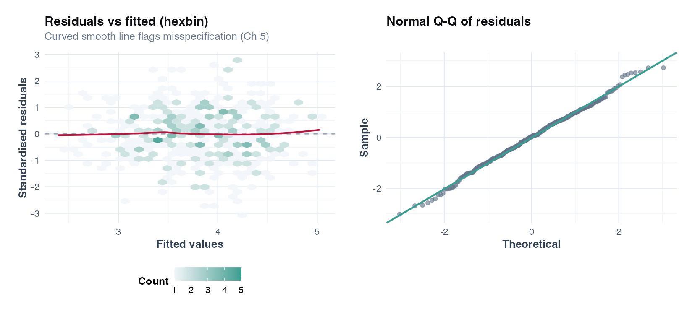
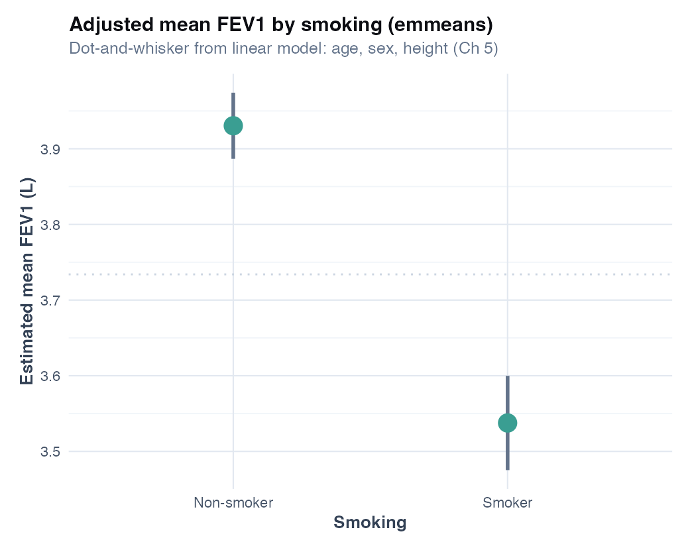
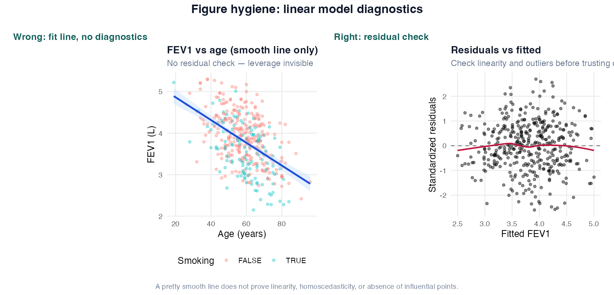

# Chapter 5: Linear Models for Continuous Respiratory Outcomes

> **Part III: Regression for Continuous Outcomes**

## Opening scene: "Can we adjust for baseline?"

The primary Welch *t*-test on week-12 FEV₁ is prespecified; the sponsor now asks whether baseline FEV₁ changes the story. That is not a post hoc rescue — it is ANCOVA, if it was in the SAP. Separately, an observational question arrives from the same cohort: *Is FEV₁ lower in smokers after age and height?* Different estimand, same regression family.

Mei draws two columns on the whiteboard: **trial contrast** vs **adjusted association**. Same `lm()` syntax; different sentences in the abstract.

---

## Why this chapter

Linear models carry adjusted mean differences, ANCOVA, and diagnostic discipline. You need them when a *t*-test is too crude or when confounders are part of the question — not when you are fishing for significance.

---

## When linear regression is the right tool

| You have | You want | Use |
|----------|----------|-----|
| Continuous outcome (FEV1, FVC, 6MWD) | Adjusted association | Multiple linear regression |
| Continuous outcome + baseline | Trial follow-up comparison | ANCOVA |
| Continuous outcome, 2 groups, no covariates | Unadjusted comparison | t-test (Ch 4) - regression equivalent |
| Binary/count outcome | - | GLM (Ch 6) - **not** linear regression on 0/1 |

---

## Technique: Multiple linear regression (MLR)

Multiple linear regression estimates the **adjusted association** between predictors and a mean continuous outcome — FEV1 litres, change in FEV1, symptom scores — in cross-sectional, trial follow-up (with care), or cohort designs. Assumes linearity in parameters, independent homoscedastic errors, and approximate normality of residuals (especially with small *n*) [@harrell2015rms]. Report **β** as mean difference or slope with 95% CI.

**R:** `lm(fev1 ~ smoking + age + sex + height_cm, data = spirometry)`

Use MLR when multiple confounders matter and the outcome is continuous. Do **not** use it for binary/count outcomes, repeated measures without extension, or causal claims from observational data without design support. It does **not** prove causation, prediction accuracy (Ch 9), or mechanism.

**Plain language:** after accounting for age, sex, and height, smokers have lower average FEV1 by about 0.39 L. **Precise language:** the smoking coefficient is the expected difference in mean FEV1 between smokers and non-smokers with other covariates held fixed.

**Practice read:** is ~0.4 L meaningful given MCID (~0.1 L in many COPD contexts)? Possibly — but this is observational; unmeasured confounding may remain [@cazzola2008mcid].

Watch for: association ≠ causation; FEV1 vs age non-linearity (splines); collinearity when FEV1 and FVC are both in the model; extrapolation outside observed ranges; cross-sectional models ≠ longitudinal decline (Ch 18); mixing % predicted and litres. "Adjust for baseline FEV1" usually means ANCOVA, not change scores unless prespecified.

**Common mistakes:** `lm(exacerbation_12m ~ smoking)` on 0/1 outcomes (predictions outside [0,1]; use Ch 6 logistic); dropping non-significant covariates after fitting (inflates type I error — prespecify in the SAP); causal language from cross-sectional data ("smoking **causes** lower FEV1" → "smoking was **associated with** lower FEV1 after adjustment…").

**Methods:** FEV1 (litres) was modelled with multiple linear regression adjusting for age, sex, and height. We report coefficients with 95% CIs; residual diagnostics were examined.

**Results:** In 400 participants, smoking was associated with 0.39 L lower mean FEV1 (95% CI −0.47 to −0.32; p < 0.001) after adjustment. Do not cite $R^2$ as primary evidence.

### R lab

```r
source("R/examples/ch05_linear_models.R")
fit <- lm(fev1 ~ smoking + age + sex + height_cm, data = spirometry)
broom::tidy(fit, conf.int = TRUE); plot(fit)
```

**Sensitivity:** log(FEV1) if heavily skewed; `splines::ns(age, df = 3)` if curvature is prespecified.

---

## Technique: Simple linear regression (SLR)

One continuous predictor: `lm(fev1 ~ age, data = spirometry)`.

**β_age:** mean change in FEV1 per additional year.

Use SLR for bivariate exploration; prefer MLR when confounders matter (almost always in respiratory epidemiology).

---

## Dummy coding and reference categories

R default treatment contrasts: first level alphabetically is reference.

```r
spirometry$sex <- factor(spirometry$sex) # reference: female
# sexmale coefficient = mean difference male vs female
```

**Always state reference category** in tables and text.

---

## Interactions

`fev1 ~ smoking * age` - smoking effect **varies by age**.

**Plain language:** the FEV1 gap between smokers and non-smokers may be larger in older patients.

**Report:** stratified coefficients or marginal effects - not only the interaction p-value.

```r
fit_int <- lm(fev1 ~ smoking * age + sex + height_cm, data = spirometry)
anova(
 lm(fev1 ~ smoking + age + sex + height_cm, data = spirometry),
 fit_int
)
```

---

## ANCOVA: follow-up FEV1 adjusting baseline

See Chapter 4 for trial context.

```r
trial <- read_csv("data/spirometry_trial.csv", show_col_types = FALSE)
lm(fev1_followup ~ group + fev1_baseline + age + sex, data = trial)
```

**Estimand choice:** follow-up adjusted for baseline vs change score - prespecify in protocol.

### Caveats: ANCOVA

| Caveat | Detail |
|--------|--------|
| Regression to the mean | Extreme baseline values pull follow-up toward mean |
| Balanced RCT | ANCOVA adds precision; unadjusted comparison also valid if prespecified |
| Same spirometry protocol | Pre/post BD must match |

---

## Model diagnostics (required)

| Plot / test | Checks |
|-------------|--------|
| Residuals vs fitted | Linearity, homoscedasticity |
| Q-Q plot | Normality of residuals |
| Scale-location | Heteroscedasticity |
| Cook's distance | Influential points |

```r
plot(cooks.distance(fit), type = "h", main = "Cook's distance")
```

Investigate data errors before removing points. One patient with FEV1 = 0.1 L may be entry error.



Check pattern in residuals before trusting the adjusted smoking coefficient.

---

## Multicollinearity (VIF)

When predictors correlate strongly (FEV1 model with FVC and FEV1/FVC):

```r
car::vif(fit) # values > 5–10 warrant attention
```

**Fix:** drop redundant predictors, combine, or use ridge (prediction context, Ch 7).

---

## CASTOR worked example: full narrative

**Question:** Is smoking associated with lower FEV1 after adjustment?

**Steps:**

1. Table 1 by smoking (Ch 3)
2. Fit `lm(fev1 ~ smoking + age + sex + height_cm)`
3. Check residuals
4. Report β_smoking with CI
5. Contextualize with MCID

**Three-reader summary:**

- **Statistician:** adjusted mean difference −0.39 L (95% CI −0.47 to −0.32); model assumptions reasonable.
- **Practice:** ~400 mL lower FEV1 in smokers - clinically substantial if causal; observational design limits causal claim.
- **General reader:** smokers in this dataset have notably lower lung function even after accounting for age, sex, and height.



Report the interval on this scale; the plot supports the coefficient table, not replaces it.

---

## What linear regression does NOT do

- Model binary exacerbations (Ch 6)
- Handle repeated FEV1 visits (Ch 18 mixed models)
- Prove smoking **caused** lower FEV1 in observational data
- Automatically select important predictors (Ch 7 - prespecification)

---


## R lab

```r
source("R/examples/ch05_linear_models.R")
```

### Figure hygiene: smooth line vs residuals



| Panel | Shows | Masks |
|-------|--------|-------|
| **Wrong** | Age–FEV1 smooth line only | Non-linearity, outliers, leverage |
| **Right** | Residuals vs fitted | Pattern suggesting wrong functional form |

---

## Alternatives & extensions (choose by data)

Linear regression (Gaussian errors) is the default for continuous outcomes, but many respiratory endpoints push you to variants.

### Continuous outcome but strong skew (e.g., biomarker concentration)

| Option | When to use | Note |
|---|---|---|
| **Transform outcome** (log) | Multiplicative variability; positive skew | Changes estimand; report on original scale if needed |
| **Gamma regression** (GLM) | Positive continuous with mean-variance link | Often better than forcing normality |
| **Quantile regression** | Median (or other quantiles) is the estimand | Robust to outliers; different interpretation |

### Outliers or heavy tails

| Option | When to use | Note |
|---|---|---|
| **Robust regression** | Outliers expected; want slope resistant to leverage | Sensitivity, not a magic fix |
| **Winsorization / trimming** | Clear artefacts; documented rule | Must be prespecified for confirmatory work |

### Clear nonlinearity

| Option | When to use | Note |
|---|---|---|
| **Splines / GAM** | Curvature in age-FEV1 or exposure-response | Prespecify df/smoothness; avoid p-hacking |

### Design requires Ch 18–19

| Feature | Why lm() fails | What to use |
|---|---|---|
| Repeated FEV1 visits | correlated residuals | Ch 18 mixed models / GEE |
| Multi-centre clustering | SEs too small if ignored | Ch 18 cluster-robust / mixed |

---

## Quick reference: methods in this chapter

| Method | When to use | Why |
|--------|-------------|-----|
| **Simple linear regression (SLR)** | One predictor; continuous FEV1 | Baseline adjusted association; one coefficient to report |
| **Multiple linear regression (MLR)** | Several covariates; continuous outcome | Adjusted mean differences; standard for observational spirometry |
| **ANCOVA (baseline in model)** | RCT; baseline FEV1 measured | Often more efficient than change score; prespecify |
| **Interaction terms** | Effect differs by subgroup (prespecified) | Tests modification; not post hoc fishing |
| **Robust / Huber regression** | Outliers in biomarkers or LOS | Sensitivity to leverage points |
| **Log-transform outcome** | Strong right skew; multiplicative effects | Changes estimand; report on original scale if needed |
| **Splines / GAM** | Non-linear age–FEV1 (prespecified) | Flexible curvature; avoid p-hacking ([Ch 7](07-model-building.md)) |
| **Mixed model** | Repeated FEV1 visits | `lm()` on stacked rows is wrong ([Ch 18](18-longitudinal-mixed-models.md)) |

**Extensions:** gamma GLM, quantile regression in [Alternatives & extensions](#alternatives--extensions-choose-by-data).

---


## Where we go next

Regulatory affairs wants the exacerbation tables by Friday — binary and count versions of the same flare-up story. **Chapter 6** is where `lm()` on 0/1 finally gets retired. If the team starts adding predictors after unblinding, **Chapter 7** is the argument you will need before the next steering call.

## Related chapters

| Chapter | When to open it |
|---------|------------------|
| [Chapter 4: Comparing groups](04-comparing-groups.md) | Welch *t*, proportions, group comparisons |
| [Chapter 6: GLMs](06-generalized-linear-models.md) | Logistic, Poisson, count and binary outcomes |
| [Chapter 18: Longitudinal mixed models](18-longitudinal-mixed-models.md) | Repeated FEV₁, slopes, clustering |

## Handbook resources

| Resource | When to use it |
|----------|----------------|
| [Appendix B: Quick reference](../appendix-b-quick-reference.md) | Choose a test or model by outcome and design |

## Further reading

- Harrell, *Regression Modeling Strategies* [@harrell2015rms]
- Venables & Ripley, *Modern Applied Statistics with S* [@venables2002modern]

## Exercises ([Solutions](../solutions/ch05_solutions.md))

