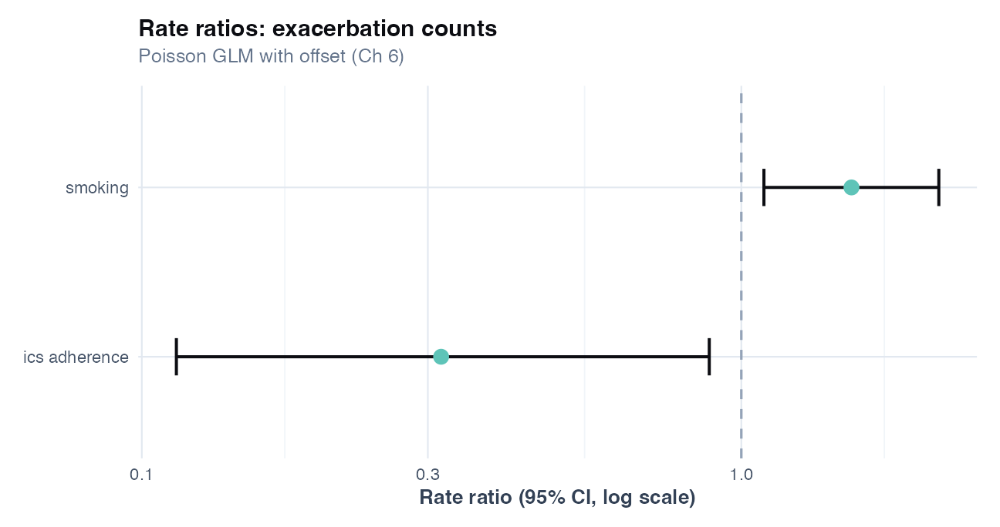
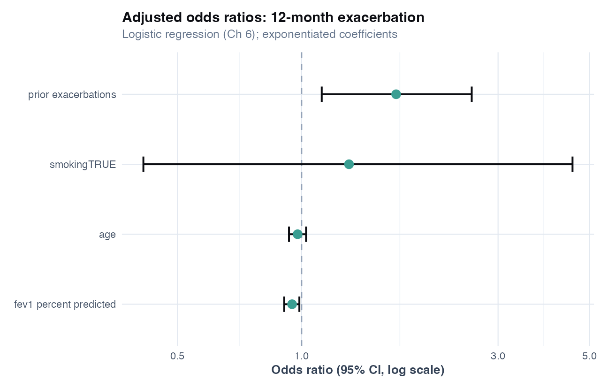
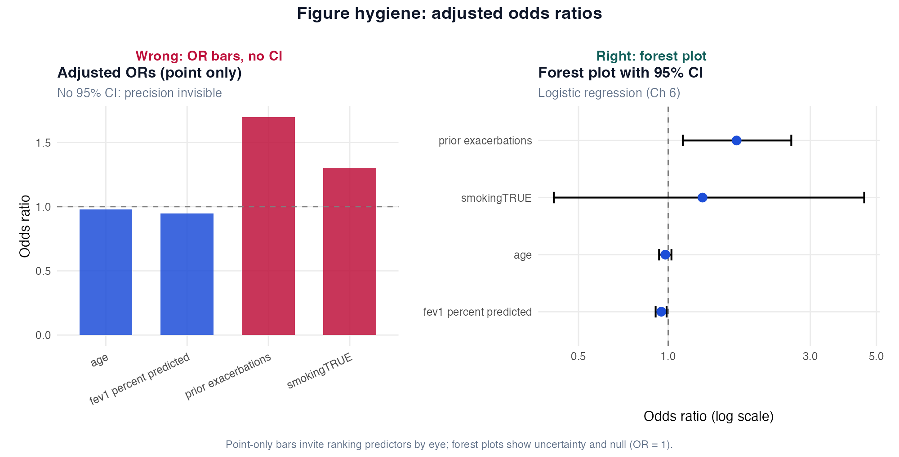

# Chapter 6: Generalized Linear Models

> **Part III: Regression for Non-Continuous Outcomes**

## Opening scene: the secondary endpoint email

Regulatory affairs asks for exacerbation results. Binary: any vs none in twelve months. Count: events per person-year. A fellow already ran `lm()` on 0/1 exacerbation; coefficients look tidy and completely wrong.

Mei converts the thread into two families: **logistic** for proportions, **Poisson/negative binomial** for rates with exposure time. Rivera gets one slide with event tables, not six mislabelled *p*-values.

---

## Why this chapter

Respiratory endpoints are often binary or count-shaped. CASTOR's exacerbation variables get the right model family here, including why `lm()` on 0/1 fails quietly.

**Odds ratios** mislead when exacerbations are common: prefer risk difference, RR, or predicted risks. Check **events per variable** in logistic models (~18 events in CASTOR, wide CIs). Default to **negative binomial** when Poisson shows overdispersion. Use **offset(log person-time)** when follow-up varies. *"Any exacerbation"* and *"exacerbations per year"* are different estimands, do not swap models for convenience.

> **How to read this chapter:** Jump to **logistic** (binary) or **Poisson/NB** (counts). [Quick reference](#quick-reference-methods-in-this-chapter) at the end lists all methods.

---

## GLM framework

A GLM assumes:

$$
g(\mu) = \eta = \beta_0 + \beta_1 X_1 + \cdots + \beta_p X_p
$$

where $\mu = E(Y)$ and $g$ is the **link function**.

| Component | Role |
|-----------|------|
| **Random component** | Distribution of Y (binomial, Poisson, …) |
| **Systematic component** | Linear predictor η |
| **Link** | Connects μ to η |

Estimation: **maximum likelihood** (iteratively reweighted least squares for many GLMs) [@venables2002modern].

---

## Binary outcomes: logistic regression

### Technique: Logistic regression

| | |
|---|---|
| **Answers** | How is binary outcome associated with predictors on log-odds scale? |
| **Outcome** | Binary (0/1, TRUE/FALSE) |
| **Link** | logit: log(p/(1−p)) |
| **Effect measure** | Odds ratio = exp(β) |
| **R** | `glm(y ~ x, family = binomial)` |
| **Report** | OR, 95% CI, n, number of events |
| **Avoid when** | Outcome is count; data clustered; interpreting OR as RR when outcome common |

Smoking multiplies the odds of exacerbation by exp(β), holding other variables fixed.

```r
logit_fit <- glm(
 exacerbation_12m ~ smoking + age +
 fev1_percent_predicted + prior_exacerbations,
 data = exac,
 family = binomial
)
broom::tidy(logit_fit, conf.int = TRUE, exponentiate = TRUE)
```

Prior exacerbations are among the strongest predictors, consistent with clinic. OR is not “X% more likely” unless events are rare. When events are common (>10–15%), ask for risk differences or log-binomial RRs. CASTOR has ~18 events (~4.5 per variable), consider Firth if separation appears [@firth1993bias]. Observational smoking associations are not causal without design.

**Common mistakes:** `lm()` on 0/1; reporting OR as RR when events are common; stepwise selection with 18 events.

Exacerbation counts of 0, 1, 2, 3 dominate COPD cohorts. Poisson may look fine and fail on overdispersion; check Pearson χ²/df before trusting rate ratios.

### In practice

mMRC **items** (0–4) and **CAT bands** are ordered categories, not continuous measurements. **CAT/ACQ total scores** are often treated as approximately continuous in trials when prespecified and justified; that is a separate estimand from item-level or banded ordinal models. `lm(mMRC ~ treatment)` on 0–4 implies equal spacing between categories; use [ordinal logistic](#technique-ordinal-logistic-regression-mmrccat) for ordered items/bands or median-based summaries instead.

### Other respiratory settings

Logistic and Poisson models in CASTOR target **COPD exacerbations**. The model family follows the outcome type; the event definition follows the protocol:

- **Asthma:** Severe exacerbations (steroid bursts, ED visits) are often **counts**; mMRC items and ACQ/CAT **bands** need **ordinal** methods (above). **ACQ/CAT totals** may be prespecified as continuous secondary endpoints when justified.
- **TB:** Culture conversion, smear clearance, or death during treatment are typical endpoints. Use Ch 6 count models or Ch 19 survival with those definitions; spirometry is usually secondary.

Report absolute risks or rate differences when events are common.

#### Reporting template

**Methods:** Logistic regression modelled 12-month exacerbation (yes/no) adjusting for smoking, age, FEV1 % predicted, and prior exacerbation count. We report odds ratios with 95% CIs (Wald). With only ~18 events, intervals are wide; consider exact or bootstrap CIs for primary inference if prespecified. Model fit assessed by event count and residual deviance.

**Results:** Among 350 patients (18 events), prior exacerbations were associated with higher odds of a new event (OR 1.70, 95% CI 1.12 to 2.59). FEV1 % predicted OR 0.95 per 1% (95% CI 0.91 to 0.99). Smoking OR imprecise (95% CI included 1).

**Do not say:** "Smoking causes exacerbation" (observational); treat high AUC as proof of causation when the goal was association.

### Odds vs risk

| | Odds ratio | Risk ratio |
|---|------------|------------|
| **Scale** | Odds | Probability |
| **Common in** | Case-control, logistic output | Cohort, trials |
| **Approximation** | OR ≈ RR when outcome rare (<10%) | Exact for cohort |

When events are common, OR exaggerates RR. Consider log-binomial or reporting **marginal** adjusted risks (`marginaleffects`, `emmeans`).

```r
# Adjusted predicted probabilities by smoking (conceptual)
if (requireNamespace("emmeans", quietly = TRUE)) {
 emmeans::emmeans(logit_fit, ~ smoking, type = "response")
}
```

---

## Separation and sparse data: Firth penalized logistic

### Technique: Firth penalized logistic

When a predictor perfectly predicts outcome in a category (**complete separation**), MLE coefficients diverge. **Firth penalized logistic** gives finite OR estimates via Jeffreys-prior penalized likelihood, stable when ordinary logistic "blows up," with slight shrinkage as the cost [@firth1993bias]. CASTOR has ~18 events / 350, wide CIs; separation possible in subgroups.

**R:** `logistf::logistf(...)` **Effect measure:** OR (penalized). Use for complete/quasi separation or small event counts. Does **not** create information from sparse events, state penalization in Methods; evaluate calibration separately when the goal is risk scoring.

```r
logistf::logistf(
 exacerbation_12m ~ smoking + age +
 fev1_percent_predicted + prior_exacerbations,
 data = exac
)
```

**Common mistake:** report Firth OR with narrow causal language and no event count.

**Methods:** Firth penalized logistic regression was used due to sparse events (n events = …).

---

## Log-binomial regression: direct risk ratios

### Technique: Log-binomial GLM

**Log-binomial GLM** estimates an adjusted **risk ratio** (not odds ratio) on the log link, `glm(y ~ x, family = binomial(link = "log"))`. Use in cohorts and trials when the outcome is common (>10%); convergence failures may require **modified Poisson** (`family = poisson`) with **robust (sandwich) SEs** — see `R/examples/ch06_glm.R`. Predicted risks must stay ≤ 1.

Smokers have RR × exp(β) times the risk of exacerbation, adjusted. RR is often closer to "percent increase in risk" than OR when events are common.

**Common mistake:** report logistic OR as RR when 30% event rate → log-binomial or marginal RD.

```r
glm(
 exacerbation_12m ~ smoking + age,
 data = exac,
 family = binomial(link = "log")
)
```

**Results template:** Adjusted RR for smoking = … (95% CI …) from log-binomial model.

| Model | Effect measure | When |
|-------|----------------|------|
| Logistic | OR | Rare outcome; case-control |
| Log-binomial | RR | Cohort/trial, common outcome |
| Marginal predictions | RD | Absolute risk for steering committees |

### Technique: Probit regression

Same role as logistic on a latent scale, coefficients not comparable to ORs across links. Use when a field standard requires probit: `family = binomial(link = "probit")`. Probit and logistic usually rank predictors similarly.

---

## Count outcomes: Poisson regression

### Technique: Poisson GLM

**Poisson GLM** models non-negative integer counts (exacerbations, ED visits) on a log link; **rate ratio** = exp(β). Assumes mean = variance (equidispersion) [@cameron2013regression]. **R:** `glm(y ~ x, family = poisson)`.

Each unit increase in ICS adherence is associated with lower expected exacerbation counts when rate ratio < 1. Formally: exp(β) multiplies expected count on a multiplicative scale.

Watch for: **overdispersion** (exacerbation counts often more variable than Poisson); **unequal follow-up** without offset; excess **zeros** (consider ZIP/ZINB); matching exposure window to exacerbation definition.

**Common mistakes:** *t*-test on counts; Poisson without checking dispersion (Pearson χ²/df > 1 → NB or quasi).

```r
pois_fit <- glm(exacerbations_12m ~ smoking + ics_adherence,
 data = counts, family = poisson)
broom::tidy(pois_fit, conf.int = TRUE, exponentiate = TRUE)
```

**Results:** In Poisson regression, ICS adherence was associated with lower exacerbation rate (rate ratio 0.28 per unit adherence scale, 95% CI …). Pearson dispersion 1.09 suggested mild overdispersion; negative binomial sensitivity gave similar inference.



Rate ratios belong on a multiplicative scale; pair with dispersion checks before signing off Poisson inference.

### Technique: Poisson offset (person-time)

When follow-up varies, add **offset(log(person_years))** so the model estimates rate per person-year, required in `exacerbation_counts.csv`. Offset does not fix overdispersion alone; zero follow-up is invalid.

$$\log(\mu_i) = \log(t_i) + \beta_0 + \beta_1 X_i$$

```r
glm(
 exacerbations_12m ~ smoking + ics_adherence +
 offset(log(person_years)),
 data = counts,
 family = poisson
)
```

**Common mistake:** compare total counts without standardizing for 6 vs 12 month follow-up.

## Overdispersion and alternatives

**Quasi-Poisson** scales SEs when variance > mean, quick fix, not a generative model: `family = quasipoisson`.

**Negative binomial** is the default sensitivity when Pearson χ²/df > 1, `MASS::glm.nb(...)`. Still use offset when follow-up varies.

```r
MASS::glm.nb(
  exacerbations_12m ~ smoking + ics_adherence + offset(log(person_years)),
  data = counts
)
```

**Zero-inflated Poisson/NB** (`pscl::zeroinfl`), exploratory when structural zeros dominate; do not label clusters as validated phenotypes from one dataset.

---

## Model comparison for GLMs

Nested models: **likelihood ratio test**

```r
anova(reduced_model, full_model, test = "Chisq")
```

Non-nested: **AIC/BIC** - predictive/in-sample comparison, not formal test.

---

## Goodness of fit

| Context | Tool |
|---------|------|
| Inference | Residual deviance, Pearson $\chi^2$, careful interpretation |
| Prediction | Calibration plot, Brier score (prediction chapter) |
| Count | Check overdispersion; compare Poisson vs NB |

**Hosmer-Lemeshow** for logistic calibration - useful but sensitive to group choice; prefer calibration plots for prediction.

---

## Decision table: which GLM?

*Quick lookup. For **when** and **why**, see [Method choice at a glance](#method-choice-at-a-glance) above.*

| Outcome | First choice | If problem |
|---------|--------------|------------|
| Binary | Logistic | Separation → Firth; common outcome → consider RR model |
| Count, equal follow-up | Poisson | Overdispersion → NB or quasi |
| Count, varying follow-up | Poisson + offset | Overdispersion → NB + offset |
| Ordinal (mMRC 0-4) | Ordinal logistic (Vol II) | - |



Odds ratios above 1 increase odds of the outcome; check CIs that cross 1 and whether OR language matches the clinical estimand (risk vs odds).

### Figure hygiene: forest plot vs OR bars



| Panel | Shows | Masks |
|-------|--------|-------|
| **Wrong** | OR point estimates as bars | 95% CI, null at OR = 1, log-scale context |
| **Right** | Forest plot with horizontal CIs |: (matches Methods/Results table) |

Would you rank “strongest predictor” from the wrong panel? Forest plots force uncertainty into the slide.

---

## Worked example: exacerbation logistic model

**Estimand:** Adjusted odds ratio for smoking and 12-month exacerbation.
**Model:** `exacerbation_12m ~ smoking + age + fev1_percent_predicted + prior_exacerbations`
**Interpretation template:**

> After adjustment, prior exacerbations were associated with higher odds of a new event (OR 1.70, 95% CI 1.12 to 2.59). A 1-unit increase in prior count is not necessarily one extra event - verify coding. FEV1 % predicted showed association (OR 0.95 per 1% increase). Smoking OR was imprecise in this sample.

Always state **event count and n**.

**Sensitivity analyses to report:**

1. Firth logistic if separation / sparse events
2. Log-binomial if OR would mislead (common outcome)
3. NB instead of Poisson if overdispersed
4. Marginal risks for practice reporting (`emmeans`)

---

## Catalog of wrong analyses (GLM chapter)

| # | Wrong | Right |
|---|-------|-------|
| 1 | Linear regression on 0/1 outcome | Logistic |
| 2 | OR as RR in common outcomes | Log-binomial or marginal RD |
| 3 | Poisson ignoring person-time | Offset log(person-years) |
| 4 | Ignore overdispersion | Quasi-Poisson / NB |
| 5 | Causal claim from adjusted logistic | Associative language + design limits |
| 6 | 50 predictors, 20 events | Penalized / reduce predictors |

---


## R lab

```r
source("R/examples/ch06_glm.R")
```

Covers: logistic, probit, Firth (`logistf`), log-binomial, Poisson with offset, quasi-Poisson, negative binomial, zero-inflated (`pscl`), LRT, emmeans.

---

## Pitfalls

1. OR interpreted as RR when events are common.
2. Poisson without offset when follow-up varies.
3. Ignoring overdispersion → false precision.
4. Causal language from observational logistic models.
5. Reporting model without number of events.

---

## Technique: Ordinal logistic regression (mMRC/CAT) {#technique-ordinal-logistic-regression-mmrccat}

| | |
|---|---|
| **Answers** | Is treatment associated with **higher or lower ordered** symptom category? |
| **Outcome** | Ordinal (mMRC 0–4, CAT bands, Likert scales) |
| **Design** | Cross-sectional or single visit; extensions for repeated ordinal → mixed ordinal (advanced) |
| **Assumptions** | Proportional odds (parallel slopes across categories); check with Brant test / sensitivity |
| **Effect measure** | Odds ratio per unit increase (proportional odds model) or cumulative OR |
| **R** | `MASS::polr(ordered_factor ~ predictors, Hess = TRUE)` or `ordinal` package |
| **Report** | OR + 95% CI; state proportional-odds assumption; median category by arm as descriptive |
| **Avoid when** | Treating 0–4 as continuous (`lm`); collapsing to binary without prespecification |

mMRC 3 is worse than 2, but not necessarily “one unit” on a lung-function scale; model **order**, not distance.

Formally: proportional odds logistic model estimates cumulative log-odds of being in category *j* or below [@agresti2018introduction].

“OR 1.4 per mMRC point” is hard to interpret clinically; pair with **proportions in each category** or median shift.

#### Wrong analysis ⚠

| Mistake | Why it fails | Do instead |
|---------|--------------|------------|
| Linear regression on mMRC 0–4 | Equal spacing assumed | Ordinal logistic or nonparametric comparison |
| Collapse mMRC to binary “≥2” without protocol | Changes estimand | Prespecify threshold or use full ordinal model |

#### Reporting template

**Methods:** mMRC (0–4) was modelled as an ordered factor using proportional odds logistic regression, adjusting for … Proportional odds was assessed with …

**Results:** Adjusted OR for **treatment** = … (95% CI …) on the proportional-odds scale (higher cumulative odds of worse mMRC category in the treatment arm vs control). Distribution by arm: [table of category counts].

---

## Alternatives & extensions (choose by outcome nuance)

### Binary outcomes: link and estimand alternatives

| Goal / nuance | Alternative | Why / note |
|---|---|---|
| Want **risk ratio** (not OR) | Log-binomial or modified Poisson | OR can mislead when outcome common |
| Need absolute risks | Marginal risks / risk differences | Often easier to interpret than OR alone |
| Complementary hazard-type interpretation | complementary log-log link | Ch 19 |
| Clustered binary outcomes | GEE / mixed logistic | Ch 18 |

### Count outcomes: beyond Poisson/NB

| Data pattern | Alternative | Why / note |
|---|---|---|
| Only patients with ≥1 event included | Zero-truncated Poisson/NB | Selection changes likelihood |
| Two processes (any event vs number of events) | Hurdle model | Separates “ever” from “how many” |
| High exposure heterogeneity | Offset + interaction / stratification | Person-time is essential |

### Model family beyond GLM (Ch 18–19)

| Outcome | Why GLM may be wrong | Handbook chapter |
|---|---|---|
| Ordinal (mMRC 0-4) | ordered categories | [Ordinal logistic](#technique-ordinal-logistic-regression-mmrccat) (this chapter) |
| Time-to-event | censoring | Ch 19 survival analysis |
| Repeated counts over time | correlation + time trends | Ch 18 mixed models / GEE |

---

## Quick reference: methods in this chapter

| Method | When to use | Why |
|--------|-------------|-----|
| **Logistic regression** | Binary outcome (exacerbation Y/N); adjust covariates | Correct variance for 0/1; OR or predicted risks + CI |
| **Firth penalized logistic** | Sparse events; separation (coefficients → ∞) | Stabilises MLE when tables are sparse |
| **Log-binomial / modified Poisson** | Common binary outcome; want **risk ratio** | OR overstates when events are frequent |
| **Poisson GLM** | Count exacerbations; equal follow-up | Models event counts; check overdispersion |
| **Poisson + offset(log person-time)** | Count outcomes; **varying** follow-up | Converts counts to rates; required when exposure time differs |
| **Negative binomial** | Count data; variance >> mean (overdispersion) | Default sensitivity to Poisson |
| **Zero-inflated Poisson/NB** | Excess zeros beyond sampling | Separates “structural zero” from count process |
| **Ordinal logistic** | Ordered categories (mMRC 0–4, CAT bands) | Respects ordering; not `lm()` on 0–4 |
| **GEE / mixed logistic** | Clustered binary (centres, wards) | Correlated outcomes need cluster-aware SEs ([Ch 18](18-longitudinal-mixed-models.md)) |

**Extensions** (hurdle models, complementary log-log): [Alternatives & extensions](#alternatives--extensions-choose-by-outcome-nuance) at chapter end.

## Exercises

[Chapter 6 exercises](../exercises/ch06_exercises.md); [Solutions](../solutions/ch06_solutions.md)

## Where we go next

The exacerbation models are fit; a fellow starts dropping non-significant covariates to “clean up” the table. **Chapter 7** is where Mei freezes the variable list that was in the SAP. Part IV (validation and reporting) arrives when the manuscript lands on her desk; not in the same afternoon as the GLM output.

## Related chapters

| Chapter | When to open it |
|---------|------------------|
| [Chapter 18: Longitudinal mixed models](18-longitudinal-mixed-models.md) | Repeated FEV₁, slopes, clustering |
| [Chapter 19: Survival analysis](19-survival-analysis.md) | Time to exacerbation, censoring |

## Handbook resources

| Resource | When to use it |
|----------|----------------|
| [Appendix B: Quick reference](../appendix-b-quick-reference.md) | Choose a test or model by outcome and design |

## Further reading

- Agresti, *An Introduction to Categorical Data Analysis* [@agresti2018introduction]
- Hosmer, Lemeshow & Sturdivant, *Applied Logistic Regression* [@hosmer2013applied]
- Hilbe, *Modeling Count Data* [@hilbe2014count]
- Cameron & Trivedi, *Regression Analysis of Count Data* [@cameron2013regression]
- TRIPOD statement for prediction models using binary outcomes.

