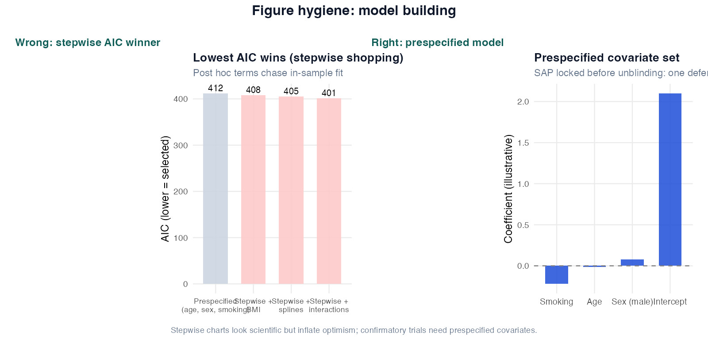

# Chapter 7: Model Building and Selection

> **Part IV: Building Defensible Models**

## At a glance

| | |
|---|---|
| **Recurring cohort** | [CASTOR](../RECURRING_COHORT.md) |
| **Format** | Technique cards + Caveats + Wrong analysis + Reporting ([template](../CHAPTER_TEMPLATE.md)) |
| **Key methods** | Prespecification, LRT, AIC/BIC, LASSO, splines, missing-data overview |
| **R scripts** | `R/examples/ch07_model_building.R` |
| **Exercises** | [ch07 exercises](../exercises/ch07_exercises.md) |
| **Figure hygiene** | `viz_pair_ch07_model_building.png` |

**Also see:** [Appendix B § Step 6](../appendix-b-quick-reference.md), Inference vs prediction: [Ch 1](01-statistical-thinking.md#inference-vs-prediction)

> **Sounds like your lab?** [Story 3](../appendix-k-in-the-room-stories.md#story-3--the-excel-lm-on-01-exacerbation): only 24 events but tempted to add predictors? → [Technique: Prespecified confounder adjustment](#technique-prespecified-confounder-adjustment).

---

## In this chapter

1. [Three model-building modes](#three-model-building-modes-choose-first): confirmatory vs exploratory vs prediction
2. [Method choice at a glance](#method-choice-at-a-glance): prespecification vs LASSO vs splines
3. **Practice read** on stepwise selection
4. [Reporting template](#reporting-template) if present in main technique
5. [Alternatives & extensions](#alternatives--extensions-model-building-menus)

**Analyst read:** LRT, LASSO, R lab below.

---

## Method choice at a glance

| Method | When to use | Why |
|--------|-------------|-----|
| **Prespecified covariate set** | Confirmatory trial or observational inference | Subject-matter confounders; avoids p-hacking |
| **Likelihood ratio test (nested)** | Prespecified extra term | Valid comparison of nested models |
| **AIC / BIC** | Exploratory ranking; prediction focus | In-sample; not for confirmatory p-values |
| **LASSO / ridge / elastic net** | Many predictors; prediction goal ([Ch 9](09-prediction-vs-inference.md)) | Penalisation; use with CV |
| **Splines for age/FEV1** | Non-linearity prespecified | Flexible; limit df to avoid overfit |
| **Stepwise selection** | Avoid in confirmatory work | Inflates optimism; invalid CIs |
| **Complete-case vs MI** | Predictors have missing values | MI inside resampling for prediction ([Ch 20](20-missing-data.md)) |
| **EPV rule (events per variable)** | Logistic with few events | &lt;10–15 events per coefficient is fragile |

**Extensions:** [Alternatives & extensions](#alternatives--extensions-model-building-menus) at chapter end.

---

1. Match model-building strategy to inference vs prediction goal.
2. Select confounders by subject-matter knowledge, not p-hacking.
3. Compare nested models correctly (LRT / F-test).
4. Use penalization and CV for prediction - not stepwise for confirmatory p-values.
5. Handle nonlinearity and missing data at introductory level.

## Prerequisites

Chapters 5-6.

---

## Why this chapter

Model building is where optimism hides: too many predictors, data-driven selection, and overfitted “risk scores.” This chapter separates prespecified adjustment from fishing. Read it before adding “one more covariate” because it improved the p-value.

## Opening question (CASTOR)

*Which variables should enter the CASTOR exacerbation logistic model - and how do we choose without fooling ourselves?*

Model building is where good studies become invalid: data dredging, stepwise selection, and tuning on test data [@harrell2015rms].

---

## Three model-building modes (choose first)

| Mode | Variable selection | Evaluation | CASTOR example |
|------|-------------------|------------|----------------|
| **Confirmatory inference** | Prespecified confounders | CI, LRT for prespecified extras | Smoking + age + FEV1% + prior exac |
| **Exploratory** | Flexible | Generate hypotheses only | Subgroup scans - label exploratory |
| **Prediction** | CV / LASSO / RF | AUC, calibration on held-out data | Ch 9 shootout [@james2023ISL] |

**Never mix modes without labelling which is which** [@shmueli2010predict].

---

## Technique: Prespecified confounder adjustment

### Technique card

| | |
|---|---|
| **Answers** | Which covariates adjust the exposure-outcome association? |
| **Basis** | Causal DAG, clinical knowledge, protocol - **not** p < 0.20 screening |
| **When to use** | Observational COPD studies; secondary adjusted RCT analyses |
| **When NOT to use** | To "shop" covariates until exposure is significant |
| **Does NOT prove** | Causal effect - only reduces confounding if confounders measured |

### Dual interpretation

**Plain language:** we adjust for factors that could distort the smoking-exacerbation link.

**Precise language:** conditional association given measured covariates; unmeasured confounding may remain.

### Caveats box

| Caveat | Detail |
|--------|--------|
| Colliders | Adjusting for mediators or colliders biases |
| Overadjustment | Adjusting for variables on causal path |
| Table 2 fallacy | Changing coefficients by adding variables without theory |
| MRC / GOLD | Severity measures may be mediators depending on question |

### In practice

Stepwise selection after seeing results is still common in submitted manuscripts. If variables were not in the prespecified SAP, call the model exploratory and show stability (bootstrap or penalization), not a definitive p-value.

### Wrong analysis ⚠

| | |
|---|---|
| **Mistake** | Univariate screen: keep vars with p < 0.2 |
| **Why wrong** | Data-driven; inflates false positives |
| **Do instead** | Prespecify minimal sufficient adjustment set |

### Reporting template

**Methods:** The primary model adjusted for age, FEV1 % predicted, and prior exacerbation count, prespecified in the analysis plan. Smoking was the exposure of interest.

---

## Technique: Nested model comparison (LRT / F-test)

### Technique card

| | |
|---|---|
| **Answers** | Does adding predictors improve fit significantly? |
| **Linear** | `anova(m_small, m_big)` - F-test |
| **GLM** | `anova(m_small, m_big, test = "Chisq")` - LRT |
| **Requires** | Nested models (big contains small) |
| **When to use** | Prespecified nested hypotheses (e.g. interaction term) |
| **Does NOT prove** | That added variables are causal |

### CASTOR example

```r
reduced <- glm(
 exacerbation_12m ~ smoking + age,
 data = exac,
 family = binomial
)
full <- glm(
 exacerbation_12m ~ smoking + age +
 fev1_percent_predicted + prior_exacerbations,
 data = exac,
 family = binomial
)
anova(reduced, full, test = "Chisq")
```

### Caveats

Multiple LRTs without multiplicity control inflate error. LRT after stepwise invalid.

### Wrong analysis ⚠

Compare non-nested models with LRT → use AIC or CV instead.

---

## Technique: AIC / BIC

### Technique card

| | |
|---|---|
| **Answers** | Which model balances fit and complexity in-sample? |
| **Lower** | Preferred (with caution) |
| **Use for** | Exploratory comparison; prediction prototyping |
| **Avoid for** | Confirmatory p-values; causal inference |

### Caveats

AIC favours prediction; BIC penalizes complexity more. Neither replaces prespecification in trials.

---

## Technique: LASSO (penalized regression)

### Technique card

| | |
|---|---|
| **Answers** | Which predictors predict outcome when p is large relative to n? |
| **Method** | L1 penalty; some coefficients → 0 |
| **R** | `glmnet::cv.glmnet(..., alpha = 1)` |
| **When to use** | Prediction; many weak predictors [@james2023ISL] |
| **When NOT to use** | Confirmatory inference on prespecified OR |
| **Does NOT prove** | Causal importance of selected variables |

### Dual interpretation

**Plain language:** LASSO picks a sparse set of predictors that predict exacerbation in cross-validation.

**Precise language:** penalized logistic regression with λ chosen by CV; coefficients biased but prediction may improve.

### Caveats box

| Caveat | CASTOR note |
|--------|-------------|
| Low events | ~18 events - LASSO unstable; mostly teaching here |
| Tuning leakage | Tune λ only on training folds |
| Selected vars change | Bootstrap stability recommended |

### Wrong analysis ⚠

| | |
|---|---|
| **Mistake** | LASSO-selected model → report unpenalized p-values |
| **Why wrong** | Selection ignored in inference |
| **Do instead** | Report prediction metrics (Ch 9) or use debiased methods |

### R lab

```r
source("R/examples/ch07_model_building.R")
```

---

## Technique: Splines for nonlinearity

### Technique card

| | |
|---|---|
| **Answers** | Is the age-FEV1 relationship linear? |
| **R** | `lm(fev1 ~ smoking + splines::ns(age, df = 3) + sex, data = spirometry)` |
| **When to use** | Clear curvature; large n |
| **Caution** | Overfitting with small n; df prespecify |

### Wrong analysis ⚠

Add spline, pick df that minimizes p-value without prespecification.

---

## Technique: Why NOT stepwise selection

### Technique card

| | |
|---|---|
| **Methods** | forward, backward, stepAIC |
| **Problem** | Inflated type I error; biased coefficients; overfit [@harrell2015rms] |
| **Use** | Avoid for confirmatory clinical trials and primary publications |
| **Alternative** | Prespecification; LASSO for prediction [@james2023ISL] |

### Wrong analysis ⚠ (signature example)

**Mistake:** stepwise logistic on 30 variables with 18 events → "significant" OR for exposure.

**Do instead:** prespecify 4 confounders; report OR with CI; label exploratory scans separately.

---

## Missing data (introductory)

Complete-case analysis drops rows with any missing covariate - may bias if missing not random.

**Report:** n analysed vs n enrolled. **Missing data:** [Ch 20](20-missing-data.md) (multiple imputation).

### Caveats

Missing FEV1 often sicker patients - MNAR. Do not silently complete-case without note.

---

## CASTOR worked example: model building path

**Inference path (prespecified):**

```
exacerbation_12m ~ smoking + age +
 fev1_percent_predicted + prior_exacerbations
```

**Sensitivity:** add therapy class if not on causal path; Firth if separation.

**Prediction path (Ch 9):** same predictors → train/test → LASSO λ by CV - evaluate AUC, not stepwise p.

---

## Catalog of wrong analyses

| Wrong | Right |
|-------|-------|
| Stepwise for primary endpoint | Prespecified model |
| Tune on test set | CV on training only |
| 30 predictors, 18 events | Reduce predictors / penalize |
| Adjust for collider | DAG-informed adjustment |
| Report AIC-min model as confirmatory | Label exploratory |

---

## Reporting template

**Methods:** Confounders (age, FEV1 % predicted, prior exacerbations) were prespecified. Nested models compared with likelihood ratio tests where stated. No stepwise selection was used for primary inference.

---


## R lab

```r
source("R/examples/ch07_model_building.R")
```

### Figure hygiene: stepwise AIC vs prespecification



| Panel | Shows | Masks |
|-------|--------|-------|
| **Wrong** | Lowest-AIC model from stepwise shopping | Optimism, invalid confirmatory CIs |
| **Right** | Prespecified covariate set | One SAP-aligned model |

---

## Alternatives & extensions (model building menus)

### Penalization family (prediction-focused)

| Method | When to use | Note |
|---|---|---|
| **Ridge** | many correlated predictors; keep all | stabilizes coefficients; less sparse |
| **Elastic net** | correlated blocks; want some sparsity | between ridge and LASSO |
| **Stability selection** | want reproducible feature set | still needs external validation |

### Uncertainty about model form

| Option | When to use | Note |
|---|---|---|
| **Bootstrap model averaging** | avoid single “best” exploratory model | report as exploratory |
| **Pre-registered analysis plan** | confirmatory inference | reduces researcher degrees of freedom |

### Causal selection ([Ch 21](21-causal-inference.md))

| Concept | Why it matters | Chapter |
|---|---|---|
| DAG-informed adjustment | avoid colliders/mediators | [Ch 21](21-causal-inference.md) |

## Chapter summary

- Goal determines method: inference → prespecify; prediction → CV/penalize [@shmueli2010predict].
- Stepwise is not a substitute for thinking [@harrell2015rms].
- LRT for nested prespecified comparisons; LASSO for prediction with low EPV caution [@james2023ISL].

## Where this chapter leads

**Next:** [Chapter 8](08-validation-reporting.md) for honest reporting; [Chapter 9](09-prediction-vs-inference.md) if the goal is risk prediction rather than association.

## Further reading

- Harrell, *Regression Modeling Strategies* [@harrell2015rms]
- James et al., *An Introduction to Statistical Learning* [@james2023ISL]
- Shmueli, "To explain or to predict?" [@shmueli2010predict]

## Exercises ([Solutions](../solutions/ch07_solutions.md))

**Next:** [Chapter 8](08-validation-reporting.md)
