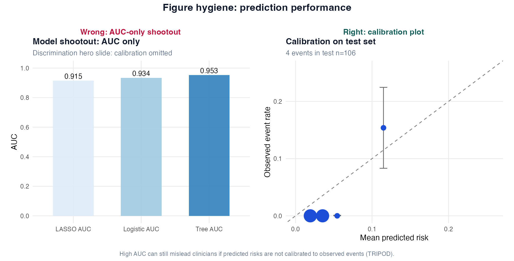
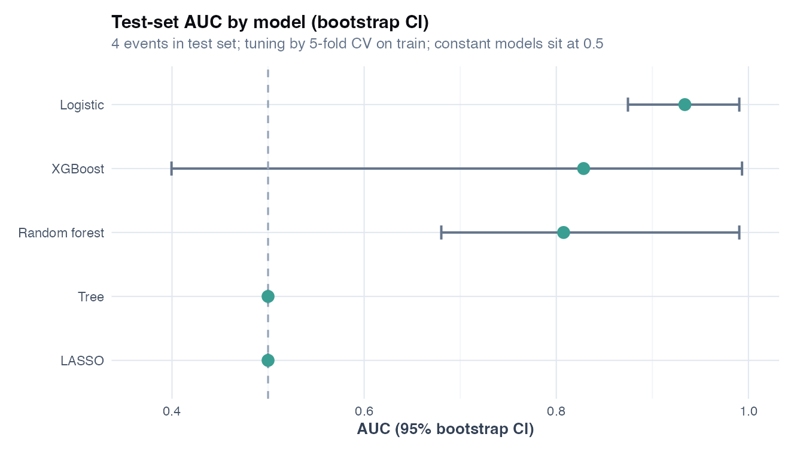

# Chapter 9: From Explanation to Prediction

> **Part IV: Validation, Reporting, and Prediction**

## Opening scene: the partner wants a risk score

An industry collaborator loves the CASTOR baseline variables. *"Can we predict twelve-month exacerbation for clinic triage?"* Different question from *"Does treatment reduce exacerbation?"* Mei pulls up Story 2 from the grant appendix: random forest, training-set AUC, no calibration, a deck that cannot answer *"what risk for this patient?"*

---

## Why this chapter

Prediction and inference share code but not goals. Evaluate discrimination **and** calibration here, and refuse causal language for a risk score.

---

## Opening question (CASTOR cohort)

*Can we predict which CASTOR participants will have ≥1 exacerbation in 12 months using baseline smoking, age, FEV1 % predicted, and prior exacerbation history?*

That is a **prediction** question. The answer is a **risk score**, not an odds ratio paragraph [@shmueli2010predict; @steyerberg2019clinical].

---

## Inference vs prediction: choose your lane

| | Inference (Ch 6) | Prediction (this chapter) |
|---|------------------|---------------------------|
| **Question** | Is X associated with Y? | What is Y for a new patient? |
| **Output** | OR, CI, p-value | Probability or class |
| **Success metric** | Valid CI, prespecified model | Calibration + discrimination on **new** data |
| **Complexity** | Parsimony often preferred | Flexible models OK **if validated** |
| **CASTOR example** | "Smoking OR for exacerbation" | "Predicted 12-month risk 8%" |

**You can use logistic regression for both, but evaluation differs** [@hosmer2013applied; @shmueli2010predict].

---

## How to do prediction / machine learning in respiratory research

Use the same CASTOR habit as Chapter 1, adapted for risk models:

1. **Clinical question:** Who needs a risk estimate, for what decision, at what time horizon (e.g. 12-month exacerbation)?
2. **Design and data:** Baseline predictors only; define enrolment and follow-up; count **events** in train and test.
3. **Prespecify validation:** For moderate *n*, a hold-out test set **or** bootstrap / repeated CV on all data; with tuning, use **nested CV**. CASTOR uses a **70/30 split for illustration only** (~18 total events); production work should prefer resampling or nested CV.
4. **Select model family:** Start with logistic; add LASSO / trees / ensembles only when EPV and biology justify complexity.
5. **Evaluate:** AUC **and** calibration **and** Brier on held-out data; bootstrap CIs when events allow.
6. **Report limits:** No causation, no external validation claim, no clinical deployment without transportability work.

For **p ≫ n** omics prediction (1000+ proteins, few patients), use nested CV as in Chapter 17; not a single 70/30 split on four clinical variables.

{width=75%}

*Prediction sits at steps 4–6: method choice, fit with validation discipline, report what you did not prove.*

---

## Technique: Binary prediction model (general)

**Question:** What is P(exacerbation in 12 months | baseline predictors)? **Output:** predicted risk on **held-out** data; not an OR paragraph [@steyerberg2019clinical].

Use `glm(..., family=binomial)` + `predict(..., type="response")`. Predictors must be measured **before** the outcome window; tune and select features **inside train** only. Success = calibration **and** discrimination (AUC), not training-set fit.

CASTOR has ~18 events / 350, models overfit easily. Contemporary prediction sample-size guidance treats **events per variable (EPV)** as a rule of thumb, not a hard cutoff: aim for adequate events in **both train and test**, and prefer resampling when EPV is low [@harrell2015rms; @riley2019minimum]. AUC of 0.85 on four test events is not deployable.

**Common mistakes:** report training AUC; tune λ or trees on full data then split; cite RF importance as biomarker discovery; trust OR-based risk without calibration.

---

## Questions to ask before trusting a model

1. **How many events in the test set?** (Not just total *n*.)
2. **Was calibration shown**, not only AUC?
3. **Were predictors all measured before** the outcome window?
4. **Was feature selection / tuning done without** peeking at the test set?
5. **Would this population match** my clinic or trial?
6. **What does the model explicitly not claim** (cause, cure, regulatory approval)?

If the answer to (2) or (4) is unclear, treat the model as exploratory.

---

## What this machine learning analysis does not prove

State these in every prediction Discussion:

| Claim | Why you usually **cannot** say it |
|-------|-----------------------------------|
| **X causes exacerbation** | Predictors selected for association with outcome, not intervention |
| **Validated clinical tool** | Internal test-set performance ≠ external validation [@moons2015tripod] |
| **Superior biology** from RF importance | Importance reflects prediction, not mechanism |
| **Safe deployment** | Threshold, calibration, and net benefit not established |
| **Better than expert judgment** | No comparator or decision-curve analysis |

---

## TRIPOD-aligned workflow (CASTOR)

Follow TRIPOD for transparent prediction reporting [@moons2015tripod]:

1. **Population:** CASTOR synthetic respiratory cohort
2. **Outcome:** `exacerbation_12m` within 12 months
3. **Predictors:** smoking, age, FEV1 % predicted, prior exacerbations; all baseline
4. **Split:** 70% train / 30% test (seed 42) for the **teaching shootout**; same indices for all models. With only four test events, treat this split as **illustrative**; production work should use repeated or nested cross-validation.
5. **Tuning:** LASSO λ, tree `cp`, forest `mtry`, and boosting hyperparameters chosen by **5-fold CV on train only**
6. **Metrics:** AUC (bootstrap CI on test when stable; constant predictions yield AUC = 0.50 with CI 0.50–0.50), Brier, calibration intercept/slope mindset, calibration bins
7. **Report:** *n*, events in train/test, EPV, software version

---

## Model shootout: one split, comparable tuning discipline

| Model | Role | Tune on train? |
|-------|------|----------------|
| **Logistic** | Interpretable baseline | No |
| **LASSO** | Penalized selection | Yes (`cv.glmnet`, λ~1se, 5-fold) |
| **rpart tree** | Nonlinear rules | Yes (`cp` grid, 5-fold CV AUC) |
| **Random forest** | Ensemble | Yes (`mtry` grid, 5-fold CV AUC) |
| **XGBoost** (optional) | Gradient boosting | Yes (small grid on train CV) |

**Rule:** never compare models tuned on different information or evaluated on training rows. With CASTOR's low EPV (~3.5 events per predictor in the training split), **complex models often tie or lose to logistic**; that is a feature, not a bug. When test events are sparse, **binned calibration plots are unstable**; emphasize Brier score, calibration-in-the-large, and resampling on train before trusting ranking differences.

**LASSO** (`cv.glmnet`, λ~1se on train): pulls weak predictors toward zero when many candidates exist; not when CASTOR has four predictors and ~14 train events. **Trees** (`rpart`): interpretable if–then rules; unstable with sparse events, keep shallow (`cp`, `minbucket`). **Random forest** and **XGBoost** (optional): nonlinear ensembles; often better ranking but opaque; variable importance ≠ causality. Same calibration standards as logistic; install `xgboost` only for the teaching shootout.

```r
source("R/examples/ch09_prediction.R")
```

---

## Technique: Discrimination and calibration 

**Discrimination (AUC):** how well the model **ranks** cases above non-cases, good for triage ordering, not enough to trust the percentage shown to patients. With ~4 test events, bootstrap AUC CIs are wide or unstable.

**Calibration:** do predicted probabilities match observed event rates? TRIPOD expects calibration when a model informs treatment thresholds [@steyerberg2019clinical]. Report binned predicted vs observed (3–5 bins when events sparse), Brier score, and figure `ch09_calibration_logistic.png`.



| Panel | Shows | Masks |
|-------|--------|-------|
| **Wrong** | Model AUC bar chart shootout | Whether predicted **risks** match observed event rates |
| **Right** | Calibration plot on test set | Discrimination (AUC) if shown without calibration |

High AUC alone does not tell a pulmonologist whether “20% risk” means 20% or 5%.

---

## Classification metrics at a threshold

Default 0.5 is often **not** the clinical optimum. With rare events, sensitivity at 0.5 may be zero while specificity is high, report the threshold explicitly.

```r
# See ch09_prediction.R ; class_metrics() helper
```

---

## Cross-validation and nested CV

- **LASSO:** `cv.glmnet` selects λ; never use the test set for λ [@james2023ISL].
- **Single split:** simple but noisy when test events are few.
- **Nested CV (p ≫ n):** outer fold = performance; inner fold = tuning. Required for elastic net on proteomics. Chapter 17.

---

## CASTOR worked example: full narrative

**Goal:** Predict 12-month exacerbation on CASTOR (`seed = 42`, 70/30 split).

**Train:** *n* = 244, **14 events** (EPV ≈ 3.5; below ideal 10–15).
**Test:** *n* = 106, **4 events**.

Run `source("R/examples/ch09_prediction.R")` and read [ch09_model_comparison.csv](../tables/ch09_model_comparison.csv). Example output:



| Model | AUC (95% boot. CI) | Brier |
|-------|-------------------|-------|
| Logistic | 0.93 (0.87–0.99) | 0.033 |
| LASSO | 0.50 (0.50–0.50) | 0.037 |
| Tree | 0.50 (0.50–0.50) | 0.037 |
| Random forest | 0.81 (0.68–0.99) | 0.044 |
| XGBoost (if installed) | ~0.83 (wide CI) | ~0.034 |

**Interpretation:** with so few test events, **penalized and tree models may collapse to constant predictions** (AUC = 0.50; bootstrap CI also 0.50–0.50). Logistic remains the defensible primary model; forest/boost may rank better but with **very wide** bootstrap intervals — **do not interpret model-to-model AUC differences** as meaningful with four events. This illustrates low-EPV warnings better than a synthetic "RF wins" story.

**Calibration:** binned calibration plot with **3–5 risk groups** given four test events (figure `ch09_calibration_logistic.png`); inspect highest-risk bin event counts. Do not label this a decile plot when events are too sparse for ten bins.

**Results paragraph (template filled):**

> Among 106 test-set patients (4 events), logistic regression achieved AUC 0.93 (bootstrap 95% CI 0.87 to 0.99) and Brier score 0.033. LASSO and classification trees did not outperform chance ranking (AUC 0.50), consistent with low EPV in training. Random forest AUC was 0.81 (wide CI 0.68 to 0.99). Calibration by risk group showed sparse events in high-risk bins. **External validation would be required before clinical use.**

**What this does NOT prove:** causal effects of FEV1 or smoking; that RF or XGBoost "discovered" pathways; readiness for deployment.

---

## Reporting template (TRIPOD-style)

**Methods:**

> We developed prediction models for 12-month exacerbation (yes/no) using baseline smoking, age, FEV1 % predicted, and prior exacerbation count. The cohort was split 70/30 (seed 42). Models included logistic regression, LASSO (**5-fold** CV for λ on the training set), classification trees, random forests (500 trees), and optionally gradient boosting (XGBoost, **5-fold** train-only tuning). Performance was assessed on the held-out test set using AUC with bootstrap 95% CIs, Brier score, and calibration by predicted risk group [@moons2015tripod].

**Results:**

> The training set included *n* = … with … events (EPV = …). The test set included *n* = … with … events. [Primary model] AUC = … (95% CI …); Brier = …. Calibration plot …. At prespecified threshold …, sensitivity = …, specificity = ….

**Do not say:** "AI model proves risk factors"; "validated tool" without external cohort.

---

## When ML adds value, and when it does not

**Adds value:** many weak predictors; unknown nonlinearities; enough events for tuning; explicit risk tool **after** external validation.

**Does not add value:** ~14 training events and four predictors (CASTOR); logistic often sufficient [@harrell2015rms]; causal questions; reporting train AUC; skipping calibration.

---

## R lab

```r
source("R/examples/ch09_prediction.R")
readr::read_csv("volume-01/tables/ch09_model_comparison.csv")
```

Optional: `install.packages("xgboost")` to include gradient boosting in the shootout.

---

## Alternatives & extensions (prediction reporting and validation)

### Calibration and recalibration

| Option | When to use | Note |
|--------|-------------|------|
| Calibration intercept/slope | Systematic under/overprediction | Complements binned plot |
| Recalibration in new site | Transport to new clinic | Report limits; may need local data |

### Clinical usefulness (beyond AUC)

| Option | When to use | Note |
|--------|-------------|------|
| **Decision curve analysis (DCA)** | Threshold-based treat/don't-treat | Separates discrimination from **net benefit** |
| Net benefit | Screening or triage policies | Requires explicit harm/cost of false positives |

DCA asks whether using the model improves decisions versus treating everyone or no one at a given risk threshold [@steyerberg2019clinical]. You do not need DCA in every teaching exercise, but reviewers increasingly ask for it in deployment claims.

### Validation designs

| Validation | When to use | Note |
|------------|-------------|------|
| Bootstrap / repeated CV | Small *n*; unstable single split | Can **replace** random split for **internal** validation; **nested** when tuning |
| Hold-out test set | Adequate events; simple teaching demo | CASTOR 70/30 is **illustrative** with four test events |
| Temporal validation | Later cohort, same protocol | Mimics future deployment |
| Geographic validation | Different centres | Key in multi-centre respiratory research |
| **Nested CV** | p ≫ n, many tunable hyperparameters | Outer = performance; inner = tuning (Ch 17) |
| External validation | Independent cohort | **Required** for clinical deployment; internal validation never substitutes [@moons2015tripod] |

### Model families (summary)

| Situation | Alternative | Handbook location |
|-----------|-------------|-------------------|
| Few predictors, low EPV | **Logistic** (primary) | This chapter |
| Many predictors, moderate *n* | LASSO / ridge | This chapter; Ch 7 |
| Nonlinear rules | Trees, RF, boosting | This chapter |
| p ≫ n omics | Elastic net + **nested CV** | Ch 17 |

---

## Catalog of wrong analyses (prediction chapter)

| # | Wrong | Right |
|---|-------|-------|
| 1 | Train AUC in abstract | Test or nested-CV AUC |
| 2 | ML beats logistic because AUC 0.01 higher on 4 test events | Report CIs; prefer simpler prespecified model |
| 3 | Importance plot = biomarker hit list | Separate discovery pipeline (Ch 13+) |
| 4 | No calibration figure | Binned plot + Brier |
| 5 | Impute/test leakage in CV folds | Impute inside train folds (Ch 20) |
| 6 | Claim deployment-ready without external data | Label internal validation only |

---

## Quick reference: methods in this chapter

| Method | When to use | Why |
|--------|-------------|-----|
| **Logistic regression** | Few predictors; interpretable risk model | Baseline for binary prediction; coefficients have meaning |
| **LASSO / elastic net** | Many predictors; moderate *n* | Penalisation; nested CV when tuning ([Ch 7](07-model-building.md)) |
| **Classification trees (rpart)** | Nonlinear thresholds; explainability | Simple rules; unstable without CV |
| **Random forest / boosting** | Flexible boundaries; prediction focus | Often higher AUC; harder to interpret |
| **Train/test split** | Initial model comparison | Simple; unstable with small event counts |
| **Bootstrap / k-fold CV** | Small *n*; unstable single split | More stable performance estimate |
| **Nested CV** | p ≫ n omics prediction ([Ch 17](17-integrated-castor-hd.md)) | Tuning without leakage |
| **Calibration plot + Brier** | Any risk model for clinical use | Discrimination (AUC) ≠ calibrated probabilities |
| **External validation** | Deployment or multi-site claims | Required by TRIPOD for transportability |

**Extensions:** DCA, recalibration in [Alternatives & extensions](#alternatives--extensions-prediction-reporting-and-validation).

---

## Where we go next

**Next:** Unsupervised structure → [Chapters 10–11](10-dimensionality-reduction.md). End-to-end CASTOR stories → [Chapter 12](12-case-studies.md). High-dimensional omics prediction → [Chapter 17](17-integrated-castor-hd.md).

## Related chapters

| Chapter | When to open it |
|---------|------------------|
| [Chapter 1: Statistical thinking](01-statistical-thinking.md) | Estimand, PICO, CASTOR workflow |
| [Chapter 7: Model building](07-model-building.md) | Covariate choice, LASSO, prespecification |
| [Chapter 10: Dimensionality reduction](10-dimensionality-reduction.md) | PCA, exploration, p ≫ n |
| [Chapter 17: Integrated CASTOR-HD](17-integrated-castor-hd.md) | Full omics pipeline story |
| [Chapter 20: Missing data](20-missing-data.md) | MAR/MNAR, MICE, sensitivity analyses |

## Handbook resources

| Resource | When to use it |
|----------|----------------|
| [Appendix B: Quick reference](../appendix-b-quick-reference.md) | Choose a test or model by outcome and design |

## Further reading

- Moons et al., TRIPOD statement [@moons2015tripod]
- Steyerberg, *Clinical Prediction Models* [@steyerberg2019clinical]
- Shmueli, "To explain or to predict?" [@shmueli2010predict]
- James et al., *An Introduction to Statistical Learning* [@james2023ISL]
- Breiman, random forests [@breiman2001rf]

## Exercises ([Solutions](../solutions/ch09_solutions.md))

