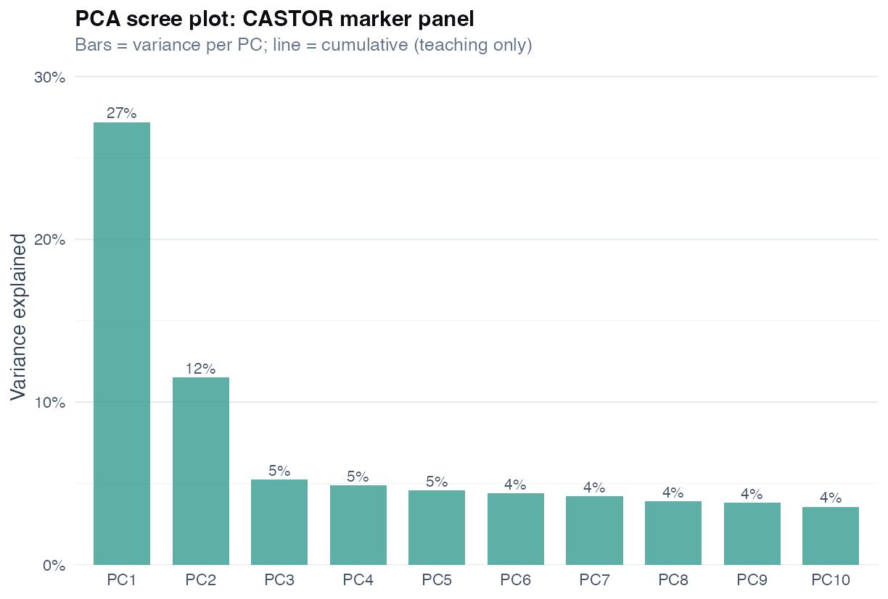
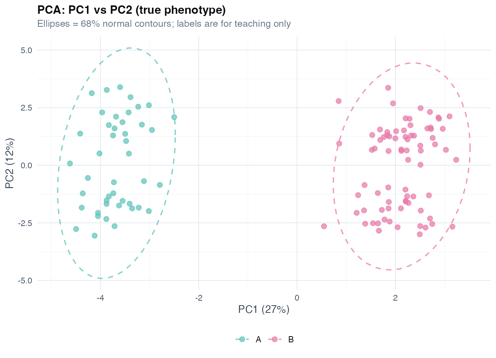
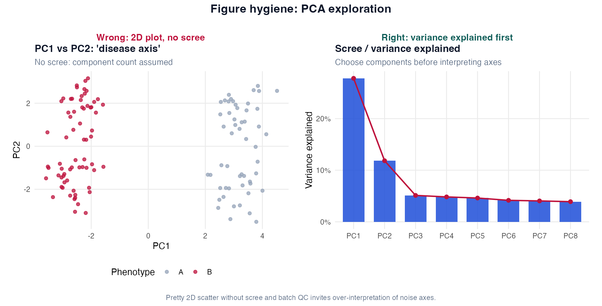

# Chapter 10: Dimensionality Reduction (Toolkit)

> **Part VI: Structure Discovery**

## Opening scene: thirty markers, one slide

CASTOR's marker panel arrives for exploratory work: thirty correlated proteins, true phenotype labels for teaching only. A translational postdoc runs PCA coloured by case/control; the ellipses separate beautifully. Mei asks: *"Colour by processing batch first. Then show me the scree."*

---

## Why this chapter

High-dimensional summaries are exploration tools, not endpoints. PCA and friends reduce noise before clustering or hypothesis tests, when you use them with batch awareness and modest claims.

---

## Start here: choose a dimension-reduction method

PCA is the default for **many continuous markers**, but respiratory datasets often violate PCA’s assumptions (mixed data types, p >> n, batch effects, binary markers).

Use this menu first, then read the relevant technique section.

| Your data / goal | Recommended method | Why | Notes |
|---|---|---|---|
| Many **continuous** correlated markers (p moderate) | **PCA** | Simple, transparent | This chapter §10.2 |
| p >> n (many markers, few patients) | **Sparse PCA** / regularized PCA | Stabilize loadings | “Advanced options” §10.9 |
| Strong outliers / artefacts | **Robust PCA** | Reduce outlier leverage | §10.9 |
| Mixed continuous + categorical variables | **FAMD** | Handles mixed types | §10.9 |
| Mostly categorical (binary/ordinal) | **MCA** | PCA analogue for categorical | §10.9 |
| Binary data but want “PCA-like” latent structure | **Logistic PCA** | Uses Bernoulli likelihood | §10.9 |
| Want supervised reduction to predict Y | **PLS / PLS-DA** | Uses outcome information | §10.10 (with warnings) |

**Wrong analysis ⚠:** pick the method that gives the “best-looking separation” on the same cohort, then name an endotype. Discovery needs stability and external validation (Ch 11) [@mcshane2011biomarker; @wenzel2012asthma].

---

## When PCA is appropriate

| Use | Avoid |
|-----|-------|
| Visualisation, noise reduction | Confirmatory "biomarker axis" without replication |
| Preprocessing before clustering (train only) | Replacing clinical diagnosis |
| Hypothesis generation | p-values on components without plan |

---

## Technique: Principal component analysis (PCA)

**Question:** What orthogonal directions capture most joint variation in many correlated continuous markers?

PC1 is the weighted combination that separates patients most (eigenvector of the correlation matrix; scores are projections). Name an axis only after independent validation, it is a statistical summary, not a biological mechanism [@jolliffe2016pca].

**Use when:** visualisation, noise reduction, preprocessing before clustering (train only). **Avoid when:** confirmatory endpoint; mixed binary/continuous without encoding; replacing clinical diagnosis.

**Caveats:** always `scale. = TRUE` when units differ; outliers and batch can drive top PCs [@mcshane2011biomarker]; p ≫ n needs regularized PCA; fit PCA on **train** only, then rotate test.

Colour points by **batch** before phenotype. PCA on 30 markers dominated by one batch variable is a QC finding, not an endotype.

**Methods template:** Markers were standardised (z-scores). PCA used the correlation matrix. Scree plot and cumulative variance guided component retention (exploratory) [@jolliffe2016pca].

```r
source("R/examples/ch10_pca.R")
omics <- read_csv("data/marker_panel.csv", show_col_types = FALSE)
X <- scale(omics %>% select(starts_with("M")))
pca <- prcomp(X)
summary(pca)
```

---

## Scree, loadings, and biplot (supporting PCA)

**Choosing *k*:** scree elbow, cumulative variance (e.g. 80%), Kaiser (eigenvalue > 1), rules disagree; retain components for **description**, not hypothesis tests. Never keep components until outcome regression is significant (circular).



**Loadings and scores:** scores = patient position on component *k*; loadings = variable weights. High loading on M3 → M3 contributes strongly to that axis. Sign is arbitrary; varimax rotation (`psych::principal`, `rotate = "varimax"`) simplifies loadings for exploration only.

**Biplot:** joint plot of patients and variables, useful for CASTOR `true_phenotype` visual check (teaching only). Colour by batch before phenotype.



**PC regression (preview):** regress outcome on first *k* PCs instead of all markers, loses direct marker interpretability; overfits if *k* chosen from same data.

---

## Advanced options (when PCA is not enough)

When the routing table above points beyond vanilla PCA, these are common in respiratory biomarker papers, decision logic only; none replace external validation.

| Method | When | R pointer | Caveat |
|--------|------|-----------|--------|
| **Sparse PCA** | p ≫ n; interpretable loadings | `elasticnet::spca`, `PMA::SPC` | Tuning is flexible, document choices |
| **Robust PCA** | Outliers / batch artefacts | `rrcov::PcaHubert` | Methods disagree on components |
| **MCA** | Mostly categorical | `FactoMineR::MCA` | Axes reflect category frequencies |
| **FAMD** | Mixed continuous + categorical | `FactoMineR::FAMD` | Scaling/weighting decisions matter |
| **Logistic PCA** | Binary marker matrix | GLM-based latent packages | Convergence / identifiability |
| **Kernel PCA / UMAP** | Nonlinear manifolds | Various | Visualisation only; not “biology axes” |

---

## Supervised dimension reduction: Partial Least Squares (PLS)

PLS is **not** an upgrade of PCA, components maximise covariance with an outcome Y. Use for prediction/exploration when many correlated predictors exist (`pls::plsr`; `mixOmics` for omics workflows). Fit **inside training folds** only; p ≫ n with few events inflates performance; VIP importance ≠ causality. TRIPOD if the goal is prediction; otherwise label exploratory [@moons2015tripod].

Fit PLS on the full dataset, show perfect separation, and call it “validated endotypes” → external validation required (Chapter 11) [@mcshane2011biomarker; @wenzel2012asthma].

---

## CASTOR worked example (PCA as baseline)

1. Scale 30 markers (`marker_panel.csv`).
2. PCA → PC1 ≈ 27% variance.
3. Plot PC1 vs PC2 coloured by `true_phenotype` (synthetic ground truth for teaching).
4. **Conclusion:** separation visible in simulation; would require replication in real omics.

**Sensitivity:** correlation vs covariance PCA; compare scree.

### Figure hygiene: 2D hero plot vs scree



| Panel | Shows | Masks |
|-------|--------|-------|
| **Wrong** | PC1 vs PC2 labelled “disease axis” | How many components matter; batch QC |
| **Right** | Scree / variance explained | Arbitrary 2D storytelling |

---

## Catalog of wrong analyses

| Wrong | Right |
|-------|-------|
| PCA then test outcome without prespecification | Exploratory label |
| No scaling | `scale. = TRUE` when units differ |
| Name PCs "Th2 axis" immediately | Validate clinically |
| Use PCA scores as definitive subtypes | Clustering + external cohort |

---

## Quick reference: methods in this chapter

| Method | When to use | Why |
|--------|-------------|-----|
| **PCA (scaled)** | Many correlated continuous markers; exploration | Unsupervised variance summary; not hypothesis test |
| **Scree / variance explained** | Choose number of components | Defensible truncation; avoid eyeballing only |
| **Sparse PCA** | p ≫ n; want interpretable loadings | Fewer noisy loadings; still exploratory |
| **PLS** | Have outcome Y and many X (supervised reduction) | Maximises covariance with Y; not unsupervised PCA |
| **FAMD / MCA** | Mixed numeric + categorical blocks | Extends PCA to heterogeneous columns |
| **Biplot** | Visualise patients and variables together | Teaching QC; check batch colouring first |

**Extensions:** robust PCA, logistic PCA in chapter alternatives.

---

## Where we go next

**Next:** [Chapter 11](11-clustering.md) for patient groups; [Chapter 13](13-differential-analysis-fdr.md) when the goal is formal per-feature inference with FDR.

## Related chapters

| Chapter | When to open it |
|---------|------------------|
| [Chapter 11: Clustering](11-clustering.md) | Unsupervised subgroups; claim discipline |

## Handbook resources

| Resource | When to use it |
|----------|----------------|
| [Appendix B: Quick reference](../appendix-b-quick-reference.md) | Choose a test or model by outcome and design |

## Further reading

- Jolliffe & Cadima, PCA review [@jolliffe2016pca]
- McShane et al., REMARK biomarker reporting [@mcshane2011biomarker]
- Wenzel, asthma phenotypes/endotypes context [@wenzel2012asthma]
 - ISL (penalization / CV mindset carries over to PLS/omics) [@james2023ISL]

## Exercises ([Solutions](../solutions/ch10_solutions.md))

