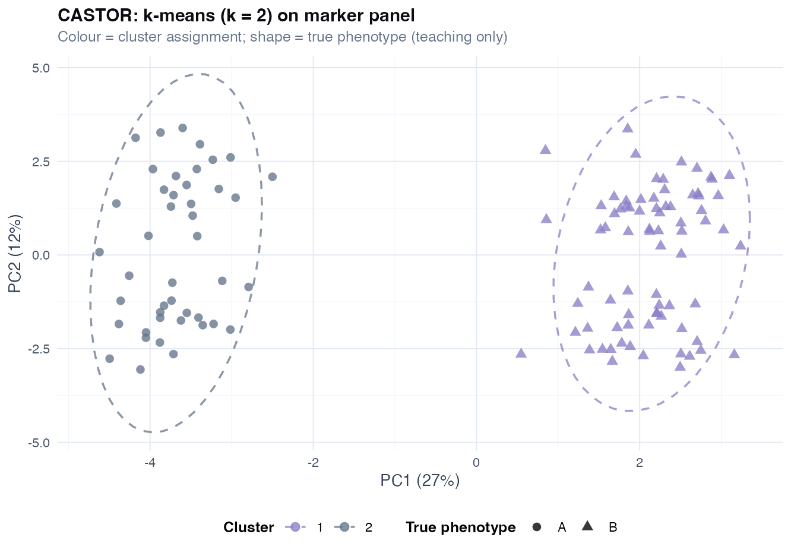
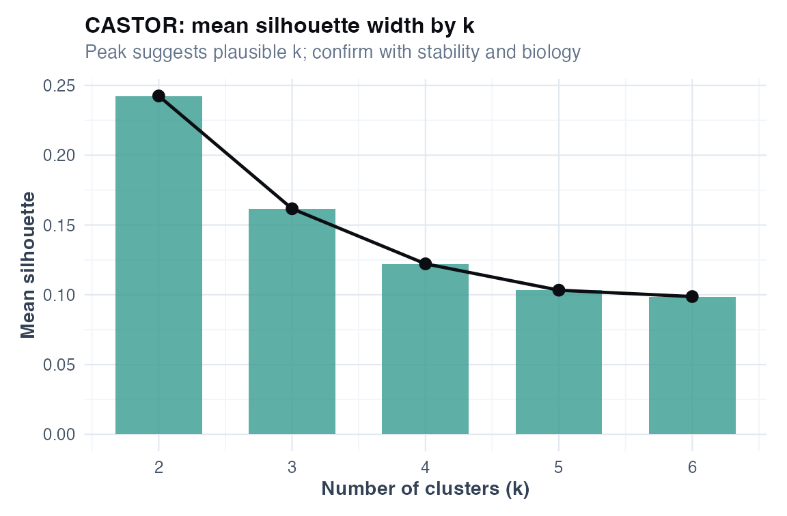
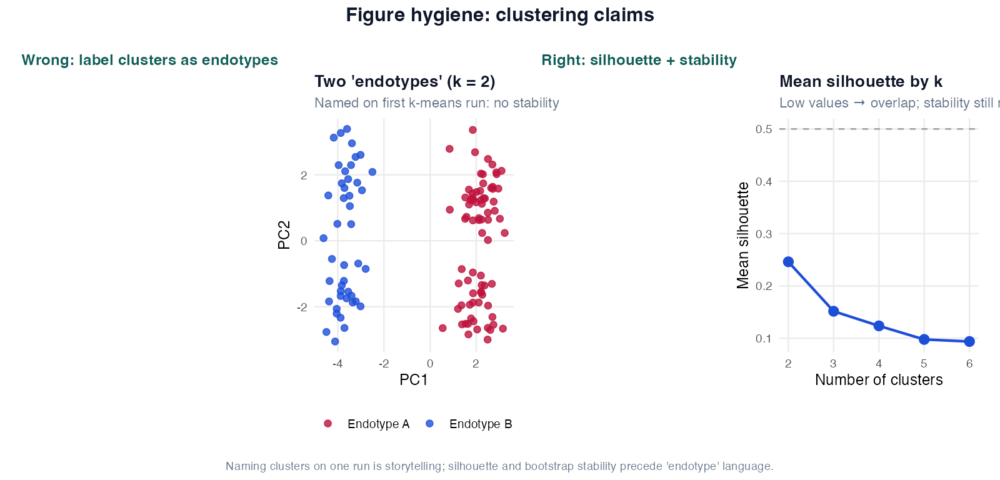
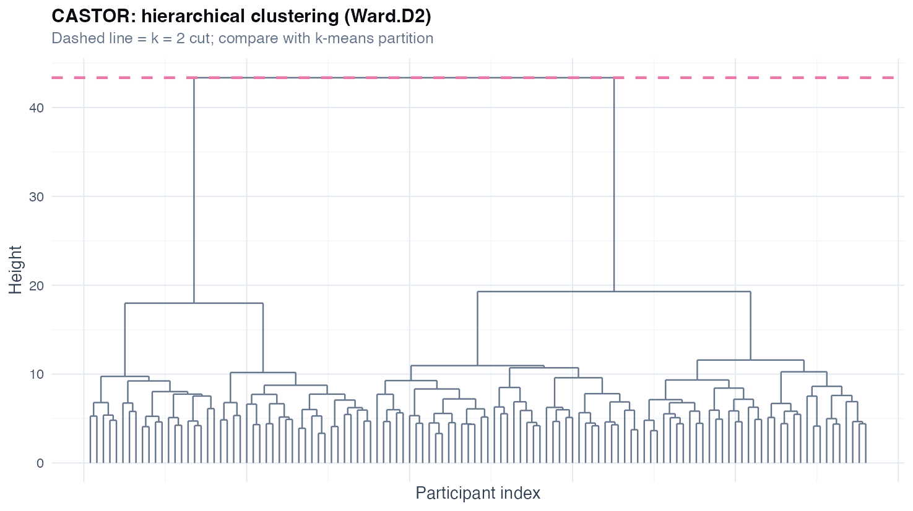
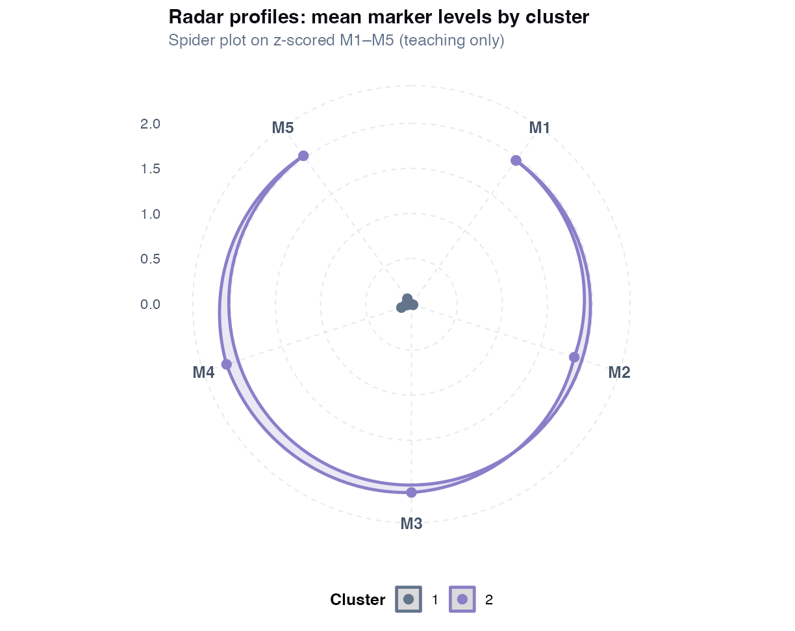
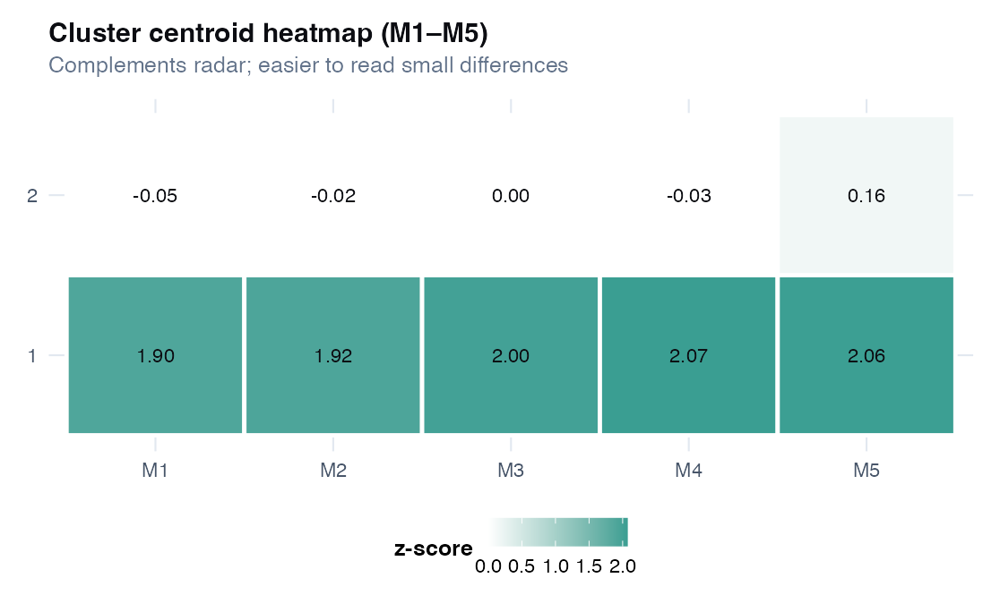

# Chapter 11: Clustering and Phenotype Discovery

> **Part VI: Structure Discovery**

## Opening scene: "Cluster B is the T2-high endotype"

k-means on PCA scores yields three colourful groups. Marketing language writes itself. Mei asks for silhouette, stability, and whether cluster membership was defined **before** looking at treatment response. The claim ladder goes up one rung at a time, or stops.

---

## Why this chapter

Clustering sells endotypes; statistics asks whether groups replicate and what they predict. CASTOR Case C lives here, discovery language only until external validation.

---

## Clustering vs classification

| | Clustering (unsupervised) | Classification (supervised) |
|---|---|---|
| **Uses outcome label?** | No | Yes |
| **Goal** | Discover groups of similar patients | Predict a known label |
| **CASTOR example** | k-means on M1-M30 | Logistic model for 12-month exacerbation (Ch 9) |
| **Typical claim** | “Exploratory subgroups” | “Predictor of outcome” |
| **Validation** | Replication, stability, external cohort | Cross-validation, calibration, TRIPOD [@moons2015tripod] |

Clustering is hypothesis-generating. It does not replace a diagnostic label or a validated risk score.

---

## Technique: k-means clustering

Partition *n* patients into *k* groups minimising within-cluster variation on **scaled** continuous features. Requires *k* in advance; works best for roughly spherical, similar-sized clusters. `kmeans(X, centers = k, nstart = 25)`.

useful for generating hypotheses about subgroups; not for changing care until replicated and linked to outcomes or treatment. Clusters that align with processing batch are a QC finding, not an endotype.

**Caveats:** document how *k* was chosen; never cluster on markers **and** FEV₁ then claim clusters “predict” lung function; small asthma/COPD omics (*n* < 100) → unstable clusters.

**Methods template:** Thirty blood markers were *z*-scored. Exploratory k-means (*k* = 2, 25 random starts). Mean silhouette width and bootstrap item stability (200 resamples) summarised separation. External validation was not performed.

```r
source("R/examples/ch11_clustering.R")
```



**Would this change management today?** Almost always **no** until clusters replicate elsewhere and predict treatment response in a trial.

---

## Other clustering methods 

**Hierarchical clustering** builds a patient “family tree” via agglomerative merging (`hclust(dist(X), method = "ward.D2")`; cut at *k*). Excellent for dendrograms and heatmaps; cut height is subjective; early merges are irreversible; memory *O(n²)* limits large *n*.

**PAM (k-medoids)** uses actual patients as cluster centres, more robust to outliers than k-means means (`cluster::pam`). Medoids are data points, not clinical archetypes until validated.

**Silhouette width** compares within- vs nearest-cluster distance (`cluster::silhouette`), higher is better separation, but low values (< 0.25) mean overlapping groups. Do not pick *k* with highest silhouette then test outcomes on the same data.



**Bootstrap item stability:** resample rows → re-cluster → proportion of draws with same assignment after label alignment [@hennig2007cluster]. Report mean (and min) stability before naming subgroups in a paper.

**Heatmaps** (`pheatmap`, `ComplexHeatmap`): visualise patient × marker matrices, supplement only. If colours align with processing site rather than diagnosis, fix batch before interpreting biology.



```r
hc <- hclust(dist(X), method = "ward.D2")
cl_hc <- cutree(hc, k = 2)
table(km$cluster, omics$processing_batch) # batch QC
```



---

## The endotype claim ladder

This is the **governance framework** for respiratory phenotype papers. Most overclaiming happens by skipping rungs.

| Rung | What you did | Language allowed | Example |
|------|----------------|------------------|---------|
| **1 - Exploratory** | Cluster one cohort once | “Hypothesis-generating subgroups” | k-means on CASTOR markers |
| **2 - Stable** | Bootstrap / consensus / sensitivity analyses | “Internally stable clusters” | Item stability > 0.7 |
| **3 - Replicated** | Same structure in **independent** cohort | “Reproducible subgroups” | U-BIOPRED-style replication |
| **4 - Prognostic** | Clusters predict exacerbations/LRTI **not used in clustering** | “Prognostic phenotypes” | Cluster at baseline → future exacerbations |
| **5 - Predictive of treatment** | Differential treatment response in **RCT** | “Treatment-responsive endotype” (still cautious) | Biomarker-stratified trial |

**You may not use “endotype” in a title until rung 4-5 is credibly addressed.** Rung 1-2 alone → “exploratory clusters” [@wenzel2012asthma].

### Other respiratory settings

Unsupervised clusters in CASTOR-HD are **not** Th2-high asthma or emphysema-predominant COPD until validated on independent data and linked to outcomes. Asthma endotype labels (eosinophils, FeNO) and COPD imaging phenotypes often need variables outside a blood panel. Stay at “exploratory clusters” until the claim ladder in this chapter reaches replication.

### Respiratory phenotype vocabulary (clinical names vs clustering)

Trial teams use rich labels; clustering may or may not recover them:

| Clinical construct | Common markers / features | Clustering caveat |
|--------------------|---------------------------|-------------------|
| **Th2-high asthma** | Eosinophils, FeNO, periostin | May map to one cluster - or overlap heavily |
| **Eosinophilic vs neutrophilic** | Blood/sputum cell counts | Requires validated thresholds, not just k-means |
| **Pauci-granulocytic asthma** | Low inflammation markers | Often a heterogeneous residual cluster |
| **COPD emphysema-dominant** | Low DLCO, low FEV1/FVC | Imaging/clinical variables often needed - not blood panel alone |
| **ACOS overlap** | Asthma + COPD features | Mixed cluster ≠ validated ACOS diagnosis |

**Key sentence:** clinical phenotypes are **constructs**; unsupervised clustering is an **empirical partition**. Alignment must be demonstrated, not assumed.

---

## Validation hierarchy

| Level | Method | What it shows |
|-------|--------|---------------|
| **Internal** | Silhouette, bootstrap item stability, consensus clustering | Clusters not purely noise **in this sample** |
| **External** | Reproduce in independent cohort; transfer centroids/medoids | Structure generalises |
| **Clinical** | Prospective outcome or treatment interaction | Clusters matter for patients |

A cluster earns a clinical name only after replication and outcome linkage. Internal stability only → “validated endotype” in the abstract is overclaiming; batch can be stable but technical [@hennig2007cluster].

**Bootstrap template:** Resample *B* = 200 with k-means (*k* = 2) at each draw; item stability = proportion of draws with same assignment after label alignment. Mean item stability = 0.78 (range 0.52–0.94) is illustrative, low-stability patients warrant sensitivity analysis.

---

## Method shootout (CASTOR)

Run multiple algorithms on the **same scaled markers** and compare - humility is the point.

| Comparison | Adjusted Rand index (illustrative) |
|------------|-------------------------------------|
| k-means vs hierarchical | Partial agreement expected |
| k-means vs PAM | Often high |
| k-means vs `true_phenotype` | Teaching only - never available in practice |
| k-means vs `processing_batch` | **High ARI = red flag** (technical not biological) |

```r
source("R/examples/ch11_clustering.R") # prints shootout table
```

**Interpretation:** partial agreement between algorithms is normal. Perfect agreement with batch is a warning, not a discovery.

---

## Cluster in PC space vs all markers

Chapter 10 reduced 30 markers to a few components. Clustering on **5 PCs** often:

- reduces noise,
- improves stability,
- matches full-marker clustering reasonably well.

```r
# In ch11_clustering.R: ARI between k-means on 5 PCs vs all 30 markers
```

**Wrong analysis ⚠:** PCA on full data including outcome, then cluster on PCs, then test outcome - circular. Fit PCA on markers only; hold outcomes for external validation.

---

## Modern alternatives (pointers, not full treatment)

When k-means is too brittle, escalate deliberately:

| Method | Strength | Chapter |
|--------|----------|---------|
| **Latent class analysis (LCA)** | Mixed discrete/continuous; probabilistic membership | Ch 11 extensions |
| **Gaussian mixture models** | Soft clustering; model-based *k* | Ch 11 extensions |
| **Consensus clustering** | Stability across algorithms and *k* | Mention in sensitivity |
| **DBSCAN / HDBSCAN** | Irregular shapes; noise points | When domain suggests |

**Rule:** name the method in Methods; do not switch post hoc to the algorithm that “looks best” without disclosure.

---

## CASTOR worked example (end-to-end)

**Question:** Are there marker-based subgroups in CASTOR?

**Steps:**

1. *z*-score M1-M30.
2. k-means *k* = 2, `nstart = 25`.
3. Silhouette for *k* = 2…6 (`ch11_silhouette_k.png`).
4. Bootstrap item stability (*B* = 200).
5. Compare k-means, hierarchical, PAM (shootout table).
6. Cluster profiles on M1-M5 (`ch11_cluster_profiles.png`).
7. Check `processing_batch` confounding.
8. Compare clustering on 5 PCs vs 30 markers.
9. Compare to `true_phenotype` (**teaching only**).

**Claims allowed:** “Two exploratory clusters with moderate silhouette and reasonable bootstrap stability; partial alignment with prespecified marker contrasts on M1-M5.”

**Claims NOT allowed:** “Validated COPD endotypes ready for stratified care.”

**Results paragraph (template):**

> Among 120 participants with 30 blood markers, exploratory k-means (*k* = 2) identified two clusters (mean silhouette 0.25; mean bootstrap item stability 1.00). Cluster profiles differed on M1-M5 (Figure). Agreement with hierarchical clustering was high (adjusted Rand index ≈ 1.0). Clusters were not aligned with processing site (adjusted Rand index ≈ 0.0); external validation and outcome linkage were not performed.





Profile plots help name clusters for discussion; they do not validate that clusters generalise to new cohorts.

---

## Catalog of wrong analyses (respiratory-specific)

| Wrong | Why it fails | Do instead |
|-------|--------------|------------|
| Cluster on markers **and** FEV1, then “predict” lung function | FEV1 defined groups | Cluster on markers only; test FEV1 externally |
| Enriched trial from exploratory clusters only | No prospective validation | Rung 5 ladder; prespecify in protocol |
| “Precision medicine” from *n* = 80 | Underpowered for care pathways | Exploratory language; plan replication |
| Latent class on symptoms, then test same biomarkers | Same circularity | Hold out validation markers |
| Ignore `processing_batch` | Technical clusters | Batch correction / sensitivity |
| Endotype in title, rung 1 only | Overclaiming | “Exploratory subgroups” |
| *k* chosen post hoc | Overfit | Document all *k* tried; bootstrap stability |

---

## Explaining to patients and general readers

> “We used computer methods to look for groups of patients with similar test results. This helps researchers form new hypotheses. It does **not** mean we have new diagnoses or that your treatment should change today. Further studies must check whether these groups behave differently over time or respond differently to medicines.”

---

## Quick reference: methods in this chapter

| Method | When to use | Why |
|--------|-------------|-----|
| **k-means** | Spherical clusters; prespecified *k* | Fast; needs scaling; unstable without stability checks |
| **Hierarchical (Ward)** | Explore merge structure; dendrogram | No single *k* upfront; cut height is subjective |
| **PAM (k-medoids)** | Want robust cluster representatives | Less sensitive to outliers than k-means means |
| **Silhouette width** | Compare candidate *k* | Describes separation; low values → overlap |
| **Bootstrap item stability** | Before naming subgroups | Quantifies whether assignments replicate |
| **Adjusted Rand vs batch** | QC technical confounding | Clusters tracking batch ≠ biology |
| **External validation** | Before “endotype” language | Requires replication or outcome linkage |

**Extensions:** consensus clustering, gap statistic in chapter body.

---

## Where we go next

**Next:** [Chapter 12](12-case-studies.md) integrates discovery narratives. Formal omics DE → [Chapter 13](13-differential-analysis-fdr.md).



**Near neighbors:** Ch [10](chapters/10-dimensionality-reduction.md) · Ch [12](chapters/12-case-studies.md) (Case C)

## Further reading

- Hennig, cluster stability assessment [@hennig2007cluster]
- Wenzel, asthma phenotypes and endotypes [@wenzel2012asthma]
- McShane et al., biomarker study reporting [@mcshane2011biomarker]
- Jolliffe & Cadima, PCA (preprocessing for clustering) [@jolliffe2016pca]

## Exercises ([Solutions](../solutions/ch11_solutions.md))
