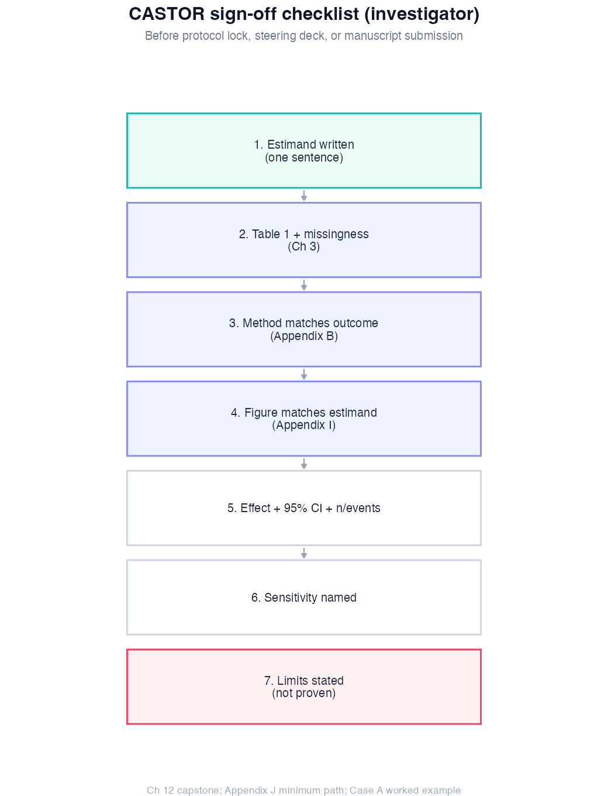

# Chapter 12: Integrated Case Studies

> **Part V: Discovery (core CASTOR capstone)**

## Opening scene: five manuscripts, one cohort

By now you have met CASTOR as trial, registry, and omics substudy. You get **five manuscripts at different stages**: interim deck, journal submission, sponsor omics thread, each walked through estimand, analysis path, Results template, and explicit **does not prove**.

Read Case A if you read nothing else. You saw the week-12 numbers in Chapter 4; here the question is whether the **Discussion** survives a reviewer who reads MCID before *p*-values.

---

## Why this chapter

Technique chapters teach parts. Case studies teach **sequence**, and the sign-off checklist investigators use before Methods goes to the journal.

---

## Sign-off workflow (CASTOR)

The eight-step pipeline lives in Chapter 1 (`analysis_pipeline.png`). Before protocol lock, steering committee, or journal submission, walk these seven gates:

{width=78%}

| Gate | Question | If no → |
|------|----------|---------|
| 1 | Is the estimand one sentence? | Ch 1 |
| 2 | Table 1 + missingness done? | Ch 3 |
| 3 | Method matches outcome type? | Appendix B |
| 4 | Does Figure 1 match the estimand? | Appendix I |
| 5 | Effect + CI + *n*/events reported? | report CIs + limits in Results |
| 6 | At least one sensitivity named? | Chapter technique / Ch 20 |
| 7 | Limits (“not proven”) written? | Case narratives below |

Reporting frameworks by design: CONSORT (RCT) [@schulz2010consort]; STROBE (cohort) [@vonelm2007strobe]; TRIPOD (prediction) [@moons2015tripod]; biomarker discovery [@mcshane2011biomarker].

**In practice:** Manuscripts often mix discovery language (omics hits) with confirmatory language (trial primary endpoint). Use separate paragraphs and separate limitations for each CASTOR case narrative you mirror. Real cohorts: add site clustering, QC exclusions, and protocol deviations; see APATE vignette for the checklist CASTOR does not model.

---

# Case study A: Randomised trial: FEV1 comparison

> **In the room (journal submission):** Reviewer 2 highlights the forest-plot colour and writes: *“Non-significant but numerically favourable, discuss clinical relevance.”* Rivera forwards the line to Mei. *“They want MCID language, not another *t*-test,”* Mei replies. *“We report the prespecified mean difference and CI; superiority was inconclusive at α = 0.05, we do not claim equivalence unless the SAP said so.”*

### Clinical question

Does intervention improve mean FEV1 at 12 weeks compared with standard care in CASTOR?

### Estimand

Difference in mean FEV1 (litres) at 12 weeks: intervention − standard care, intention-to-treat population.

### Design

Parallel RCT; independent groups; continuous outcome [@schulz2010consort].

### Analysis path

| Step | Done |
|------|------|
| Table 1 by `group` | Ch 3 |
| Histogram / QQ FEV1 | Ch 3 |
| Welch t-test (prespecified primary) | Ch 4 [@welch1947t] |
| ANCOVA sensitivity (`spirometry_trial.csv`) | Ch 4-5 |
| Secondary endpoints (FVC, CAT) in Holm family | Ch 4 + SAP |
| Bootstrap CI | optional sensitivity [@efron1993bootstrap] |
| Power note (if negative) | Ch 4 + SAP |

### Before you run the case scripts

For each case, write the estimand and unit of analysis on paper first. Case A is participant-level RCT inference; Case C is exploratory clustering; Case D is a discovery pipeline with stop/go gates. Do not reuse code from one case as if it answered another case’s question.

```r
source("R/examples/ch12_case_a_trial.R")
```

### Results template

> Among 400 participants, mean FEV1 was 3.85 L (SD 0.64) in intervention and 3.76 L (SD 0.64) in standard care. The mean difference was 0.09 L (95% CI −0.04 to 0.21; Welch t, p = 0.20). Results are inconclusive with respect to a prespecified MCID of 0.10 L [@cazzola2008mcid].

### Three-reader interpretation

| Reader | Takeaway |
|--------|----------|
| **Statistician** | CI includes null; non-significant p does not prove equivalence [@harrell2015rms] |
| **Practice** | Cannot claim benefit or futility without MCID/power context |
| **General** | Trial did not show clear average improvement; more data or larger effect needed |

### Caveats

Single time point; CASTOR synthetic; no site clustering modelled. Spirometry per ATS/ERS standards [@graham2019spirometry].

### Wrong analysis ⚠ (Case A)

| Mistake | Correct |
|---------|---------|
| "No significant difference → treatments equal" | CI + equivalence margin if that is goal |
| Compare post-BD FEV1 one arm, pre-BD other | Same spirometry protocol [@graham2019spirometry] |
| Skip Table 1 | Always describe first [@schulz2010consort] |

## What Case A does NOT prove

Causal effect in broader population; long-term FEV1 decline; symptom benefit.

---

# Case study B: Observational cohort: exacerbation risk

> **In the room (Reviewer #2):** *"Smoking is your exposure, but you adjusted for FEV1 % predicted: doesn't that block the effect?"*
> **Response:** For the **total-effect** smoking OR we adjust age, sex, and prior exacerbations only (Ch 21). FEV1 % is on the smoking → exacerbation path and is a **mediator**, not a confounder for that estimand — adjusting it targets the **direct** effect. Report both estimands with labels; do not infer mediation from OR change alone (Ch 22).

### Clinical question

Is smoking associated with ≥1 exacerbation in 12 months after adjusting for age, FEV1 % predicted, and prior exacerbations?

### Estimand

Adjusted odds ratio for smoking (binary exposure).

### Design

Observational cohort; binary outcome; logistic regression [@vonelm2007strobe; @hosmer2013applied].

### Analysis path

| Step | Done |
|------|------|
| Event count / EPV check (~18/350) | Ch 6 [@harrell2015rms] |
| Logistic regression (prespecified covariates) | Ch 6 |
| Marginal risks (`emmeans`) | Ch 6 |
| Firth sensitivity if sparse | Ch 6 [@firth1993bias] |
| No stepwise selection | prespecify covariates in SAP |

```r
source("R/examples/ch12_case_b_exacerbation.R")
```

### Results template

> In 350 patients (18 exacerbation events), prior exacerbation count was associated with higher odds of a new event (OR 1.70, 95% CI 1.12 to 2.59). FEV1 % predicted OR 0.95 per 1% (95% CI 0.91 to 0.99). Smoking OR was imprecise (95% CI included 1.0). Low event count limits precision; Firth sensitivity similar (supplementary).

### Three-reader interpretation

| Reader | Takeaway |
|--------|----------|
| **Statistician** | EPV low; wide CIs; associative not causal [@vonelm2007strobe] |
| **Practice** | Prior history matters most; smoking signal uncertain here |
| **General** | Past flare-ups predict future ones; smoking link not confirmed in this sample |

### Caveats

Unmeasured confounding (adherence, SES); exacerbation definition [@hurst2010exacerbation]; low events.

### Wrong analysis ⚠ (Case B)

| Mistake | Correct |
|---------|---------|
| `lm` on 0/1 outcome | Logistic [@hosmer2013applied] |
| OR reported as "30% higher risk" | Marginal RD or RR model |
| Stepwise 20 predictors, 18 events | Prespecified model [@harrell2015rms] |
| "Smoking causes exacerbation" | "Associated with" |

## What Case B does NOT prove

Causal effect of smoking; prediction model performance (see Case C / Ch 9).

---

# Case study C: Multi-marker panel: PCA + clustering

> **In the room (PI email):** *"Cluster 1 separates well: can we call it the Th2-high endotype in the grant renewal?"*
> **Response:** Unsupervised k-means on 30 markers is **exploratory**; batch colouring and stability checks come first (Ch 11). Name subgroups only after external replication and outcome linkage.

### Clinical question

Is there exploratory evidence of patient subgroups in a 30-marker panel?

### Estimand

None confirmatory - descriptive structure only.

### Design

Cross-sectional marker panel; unsupervised methods [@jolliffe2016pca; @hennig2007cluster].

### Analysis path

| Step | Done |
|------|------|
| Scale markers | Ch 10 |
| PCA scree + PC1/PC2 plot | Ch 10 |
| k-means k = 2, silhouette | Ch 11 |
| Bootstrap stability + batch check | Ch 11 |
| Compare to `true_phenotype` (teaching only) | Ch 11 |
| Plan external validation | Ch 11 |

```r
source("R/examples/ch12_case_c_phenotypes.R")
```

### Results template

> PCA: PC1 explained 27% of variance; loadings highest on M1-M5 [@jolliffe2016pca]. k-means (*k* = 2) yielded clusters with silhouette 0.25. Cluster profiles differed on marker weights (Figure). Analysis was exploratory; clusters were not validated in an independent cohort or against clinical outcomes [@mcshane2011biomarker; @wenzel2012asthma].

### Three-reader interpretation

| Reader | Takeaway |
|--------|----------|
| **Statistician** | Hypothesis-generating; multiplicity uncontrolled |
| **Practice** | Do not change care based on these clusters |
| **General** | Possible groups in data - needs replication |

### Caveats

p >> n risk in real omics; batch effects [@mcshane2011biomarker]; CASTOR has simulated structure.

### Wrong analysis ⚠ (Case C)

| Mistake | Correct |
|---------|---------|
| "Two validated endotypes" | Exploratory clusters [@wenzel2012asthma] |
| Test 30 markers individually then cluster | Pre-specify discovery framework |
| Use outcome to pick k | Unsupervised k selection + stability [@hennig2007cluster] |
| PCA on unscaled markers | Scale |

## What Case C does NOT prove

Biological subtypes; treatment response groups; diagnostic categories.

---

# Case study D: CASTOR-HD discovery bridge (Ch 13–17)

> **In the room (lab manager):** *"The CRO sent 47 'significant' proteins and a volcano PDF: no plate map. Can we add it beside the week-12 FEV1 figure for the primary paper?"*
> **Response:** No batch metadata → stop at QC gate (Ch 14). Discovery results get a **separate** paragraph and limitations; they do not upgrade the trial primary endpoint (Ch 17).

### Clinical question

In the CASTOR-HD extension, which molecular and immune readouts support a coherent discovery story from proteomics through confirmation assays?

### Estimand

Not a single causal estimand; this is a **staged discovery pipeline**: (1) controlled false discovery among proteins; (2) batch-robust shortlist; (3) participant-level immune phenotypes; (4) confirmed antibody binding among screen hits.

### Design

Observational case–control with multi-plate proteomics, RNA-seq, flow summaries, and replicate antibody screens [@mcshane2011biomarker].

### Analysis path

| Step | Chapter | Done |
|------|---------|------|
| Per-protein DE + BH FDR | 13 | Top table, volcano |
| Batch PCA + sensitivity | 14 | Overlap check, discovery count with/without batch |
| Flow proportions (participant n) | 15 | Batch-adjusted cell-type effects |
| Screen hits → PPV + tiers | 16 | Prespecified threshold, Tier 1 clones |
| Integrated narrative + optional elastic net | 17 | `ch17_integrated_castor_hd.R` |

```r
source("R/00_setup.R")
source("R/examples/ch17_integrated_castor_hd.R")
```

### Results template

> We tested ~1000 proteins (linear models with batch/plate covariates; BH FDR). Batch overlap was assessed by PCA and group × batch tables (Figure). After batch adjustment, *N* proteins had q < 0.05; rankings were compared with and without batch covariates. Participant-level flow cytometry (*n* = …) showed … Monocyte proportions differed … (batch-adjusted). Antibody screen hits at prespecified threshold … had PPV … among confirmation assays; Tier 1 clones (3/3 replicate rankings) were … Analysis was discovery-stage; external validation is required [@mcshane2011biomarker].

### Three-reader interpretation

| Reader | Takeaway |
|--------|----------|
| **Statistician** | Multiplicity controlled per modality; batch and stability audited |
| **Practice** | No diagnostic or treatment claims from this pipeline alone |
| **General** | Hypothesis list for targeted follow-up, not a validated signature |

### Wrong analysis ⚠ (Case D)

| Mistake | Correct |
|---------|---------|
| "Proteomics signature validates endotype" | Separate discovery from confirmation; external cohort |
| Ignore batch because FDR "fixes" it | FDR does not fix confounding (Ch 14) |
| Report cell-level p-values as n = cells | Participant-level inference (Ch 15) |
| Screen threshold chosen after seeing PPV | Prespecify threshold; report sensitivity curve |

## What Case D does NOT prove

Causal mechanisms; clinical utility; transportability; antibody therapeutic potential.

**Continue:** Ch 17 integrated pipeline; HIGH_DIM_REPORTING_TEMPLATES

---

# Case study E: Longitudinal FEV1 + time to exacerbation

> **In the room (CRA):** *"We already have week-52 FEV1: why fit a mixed model on four visits?"*
> **Response:** Pooling visits as independent rows inflates precision (Ch 18). Prespecified primary uses mixed model; week-52 *t*-test is **sensitivity** only (Case E table).

### Clinical question

In the CASTOR extension cohort, (1) does intervention improve the **FEV1 trajectory** over 52 weeks, and (2) is smoking associated with **shorter time to first exacerbation** under one-year follow-up?

### Estimands

1. **Longitudinal:** difference in mean FEV1 trajectory (intervention vs standard), weeks 0–52, randomised extension population; slope and level from mixed model.
2. **Survival:** hazard of first exacerbation comparing smokers vs non-smokers, adjusted for FEV1 % predicted, therapy, and age (associational cohort estimand).

### Design

- **Part 1:** parallel-group trial extension with four scheduled spirometry visits per participant (`longitudinal_spirometry.csv`).
- **Part 2:** observational time-to-event cohort with administrative censoring at 365 days (`time_to_exacerbation.csv`) [@vonelm2007strobe].

### Analysis path

| Step | Chapter | Done |
|------|---------|------|
| Spaghetti plot + visit counts | 18 | QC trajectory data |
| Mixed model `fev1 ~ weeks * group + (1\|patient_id)` | 18 | Coefficient table + fitted means |
| Sensitivity: week-52 cross-section vs mixed | 18 | `ch18_sensitivity_mixed_vs_fixed.csv` |
| Kaplan-Meier by smoking + log-rank | 19 | `ch19_km_by_smoking.png` |
| Cox PH + Schoenfeld check | 19 | HR table + PH test |
| Integrated Case E summary | 12 | `ch12_case_e_summary.csv` |

```r
source("R/00_setup.R")
source("R/examples/ch12_case_e_longitudinal_survival.R")
```

### Results template

> **Longitudinal (RCT extension):** Among *n* = … participants (… visits), FEV1 trajectories differed by treatment (Figure). A linear mixed model with random intercepts estimated a week × intervention interaction of … L per week (95% CI …). A sensitivity **week-52 cross-sectional** model gave a similar point estimate with comparable SE (see `ch18_sensitivity_mixed_vs_fixed.csv`); pseudo-replication risk arises when **all visits are stacked** in ordinary `lm()`, not from a single-visit *t*-test alone. **Survival (cohort):** During 365 days of follow-up, … exacerbations occurred. Kaplan-Meier curves separated by smoking (log-rank *p* = …). The adjusted Cox hazard ratio for smoking was … (95% CI …). Proportional hazards diagnostics: … [@harrell2015rms; @vonelm2007strobe].

### Three-reader interpretation

| Reader | Takeaway |
|--------|----------|
| **Statistician** | Correct units: patients for trajectories; events + censoring for survival |
| **Practice** | Trajectory answers “lung function over time”; survival answers “how soon exacerbation” |
| **General** | Two related but distinct questions: do not merge into one headline |

### Wrong analysis ⚠ (Case E)

| Mistake | Correct |
|---------|---------|
| Pool all FEV1 visits as independent *n* | Mixed model with patient random effect |
| Use binary 12-month exacerbation only | Time-to-event with censoring |
| Claim smoking “causes” faster exacerbation without design | Associational Cox + confounding discussion (Ch 21) |
| Report HR without event counts | Table of events, censored, person-time |

## What Case E does NOT prove

That improving FEV1 trajectory prevents exacerbations (different endpoints); causal effect of smoking; transportability to other healthcare systems.

**Continue:** Ch 20 missing data; Ch 21 causal inference

---

## Cross-case comparison

| Case | Question type | Method | Inference? | Key reference |
|------|---------------|--------|------------|---------------|
| A | Treatment effect | Welch t / ANCOVA | Yes (RCT) | [@schulz2010consort] |
| B | Risk factor | Logistic | Associational | [@vonelm2007strobe] |
| C | Structure | PCA + k-means | Exploratory only | [@mcshane2011biomarker] |
| D | Multi-omics discovery | DE + batch + flow + screen | Discovery only | [@mcshane2011biomarker] |
| E | Trajectory + time-to-event | Mixed model + Cox | RCT part + associational survival | [@harrell2015rms; @vonelm2007strobe] |

---

## Handbook synthesis checklist

The sign-off figure above is the visual version of this list:

- [ ] Clinical question and estimand stated
- [ ] Table 1 and missingness [@schulz2010consort; @vonelm2007strobe]
- [ ] Method matches outcome type (Appendix B)
- [ ] Effect size + 95% CI [@harrell2015rms]
- [ ] Event count / n
- [ ] Sensitivity analysis or limitation noted
- [ ] No causal overclaim from observational/exploratory work
- [ ] Reproducible R script

---

## Extended methods (now in this handbook)

- Longitudinal FEV1 → Ch 18
- Time-to-exacerbation → Ch 19
- Missing data / MICE → Ch 20
- Causal inference → Ch 21

---

## Closing

The **core path (Ch 1–12)** is complete when you can run the CASTOR pipeline yourself, including **Case E** (longitudinal + survival). The **advanced discovery path (Ch 13–17)** extends CASTOR-HD; **Part VIII (Ch 18–22)** completes the single-volume handbook for repeated measures, time-to-event, missing data, causal framing, and mediation [@harrell2015rms; @shmueli2010predict].

Adapt CASTOR details to your cohort and have an analyst and investigator review the analysis plan before you submit.

---

## Alternatives & extensions (how these cases would change)

| If your real study has… | Case change | Where it’s covered |
|---|---|---|
| Multiple follow-up visits | Case A → Case E longitudinal | Ch 18, Case E |
| Time to first exacerbation | Case B → Case E survival | Ch 19, Case E |
| Many more predictors (omics) | Case C/D: penalization + validation | Ch 7, 9–11, 13–17 |
| Clustered multi-centre design | SEs must account for centre | Ch 18 |
| Clinical decision thresholds | Add decision-curve / net benefit | Ch 9 extensions |
| Proteomics + flow + screens | Case D → Ch 17 pipeline | Ch 13–17 |

---

## Quick reference: which case to read

| Your study looks like… | Read case | Chapters to open |
|------------------------|-----------|------------------|
| Parallel RCT, continuous FEV1 | **Case A** | 3 → 4 → 8 |
| Cohort, binary exacerbation | **Case B** | 3 → 6 → 21 (if observational) |
| Marker subgroups (unsupervised) | **Case C** | 10 → 11 |
| CASTOR-HD omics pipeline | **Case D** | 13 → 14 → 15 → 16 → 17 |
| Repeated FEV1 + time to event | **Case E** | 18 → 19 → 20 |

Sign-off figure: `viz_signoff_checklist.png` ([Sign-off workflow](#sign-off-workflow-castor)).

## Where we go next

**Next:** CASTOR-HD omics pipeline → [Chapters 13–17](13-differential-analysis-fdr.md). Longitudinal and survival extensions → [Chapters 18–19](18-longitudinal-mixed-models.md).

## Related chapters

| Chapter | When to open it |
|---------|------------------|
| [Chapter 1: Statistical thinking](01-statistical-thinking.md) | Estimand, PICO, CASTOR workflow |
| [Chapter 3: Descriptive analysis](03-descriptive-analysis.md) | Table 1, plots, distribution checks |
| [Chapter 8: Validation & reporting](08-validation-reporting.md) | CONSORT, CIs, limits, calibration |
| [Chapter 11: Clustering](11-clustering.md) | Unsupervised subgroups; claim discipline |
| [Chapter 13: Differential analysis & FDR](13-differential-analysis-fdr.md) | Omics discovery, BH-FDR |
| [Chapter 14: Batch effects](14-batch-effects.md) | Technical confounding before DE |
| [Chapter 17: Integrated CASTOR-HD](17-integrated-castor-hd.md) | Full omics pipeline story |
| [Chapter 18: Longitudinal mixed models](18-longitudinal-mixed-models.md) | Repeated FEV₁, slopes, clustering |
| [Chapter 19: Survival analysis](19-survival-analysis.md) | Time to exacerbation, censoring |
| [Chapter 20: Missing data](20-missing-data.md) | MAR/MNAR, MICE, sensitivity analyses |
| [Chapter 21: Causal inference](21-causal-inference.md) | Confounding, IPW, DAGs |

## Handbook resources

| Resource | When to use it |
|----------|----------------|
| [Appendix B: Quick reference](../appendix-b-quick-reference.md) | Choose a test or model by outcome and design |
| [Appendix I: Figure hygiene](../appendix-i-figure-hygiene.md) | Right vs wrong plot pairs for slides and papers |
| [APATE vignette](../APATE_VIGNETTE.md) | Prose-only messy registry checklist (no CSV) |
| [HIGH_DIM_REPORTING_TEMPLATES](../HIGH_DIM_REPORTING_TEMPLATES.md) | Copy-paste Results paragraphs for omics chapters |

## Further reading

- Full bibliography: [REFERENCES.md](../REFERENCES.md) and `references.bib`
- Harrell, *Regression Modeling Strategies* [@harrell2015rms]
- CONSORT / STROBE / TRIPOD reporting [@schulz2010consort; @vonelm2007strobe; @moons2015tripod]

## Exercises ([Solutions](../solutions/ch12_solutions.md))

**End of core path (Ch 1–12)**. Continue with Ch 13 (CASTOR-HD) or Ch 18 (longitudinal/survival).
