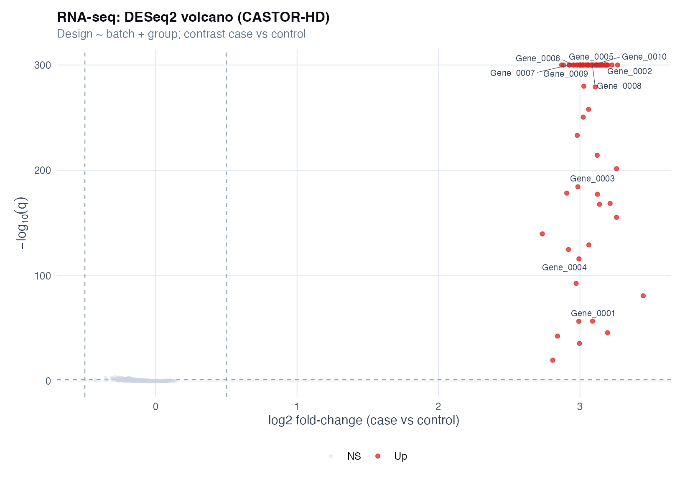
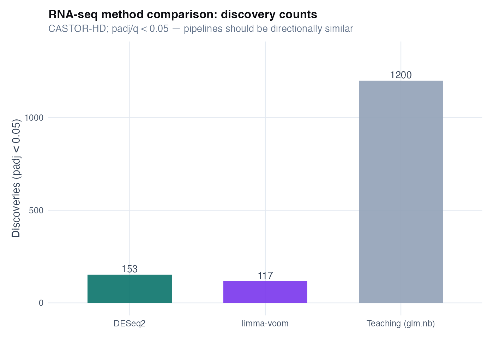
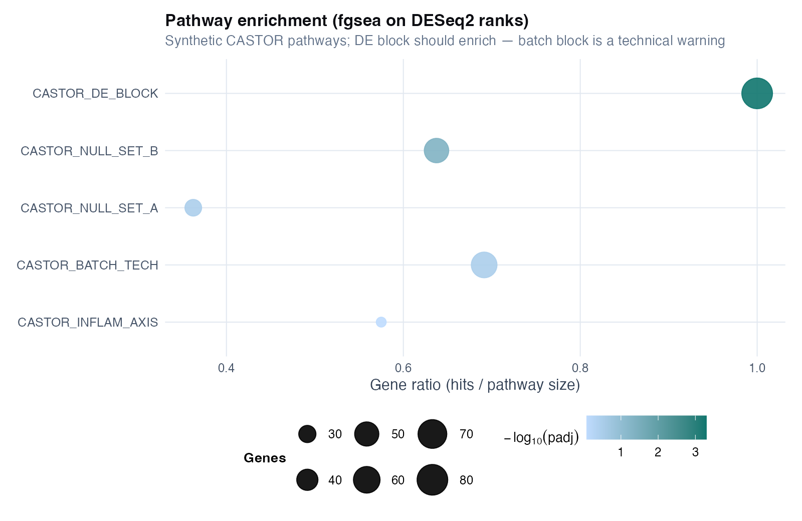

# Chapter 13: Differential analysis and false discovery rate (omics)

> **Part VI: High-dimensional biology and discovery**

## Opening scene: the CRO's week-one email

Nine hundred twenty proteins. Forty-one nominally significant. No batch column attached. Dr Rivera forwards the PDF to Mei with one line: *"Is this our subgroup analysis now?"*

The omics discovery workflow: per-feature models, FDR, volcano plots as **triage**, and language that separates discovery from the week-12 FEV₁ primary.

---

## Why this chapter

Volume intimidates; estimands do not change. CASTOR-HD teaches defensible differential analysis when features outnumber patients, and what to demand before you fund validation.

**Two tracks:** Figures and code here use per-feature `lm` / `glm.nb` loops to teach FDR workflow. **Appendix L** reruns the same files with DESeq2, limma-voom, and fgsea, trust Appendix L for production RNA counts; use this chapter's teaching volcanoes for investigator literacy only.

Volcano plots are **triage**, not treatment decisions. Zero FDR hits after batch adjustment is honest. BH-FDR controls a **family**, state how many features were tested. Run batch sensitivity (Chapter 14) before biological interpretation. LOD/absent proteins are not "low expression"; do not code below-detection as zero without an assay rule.

> **How to read this chapter:** Workflow and one full FDR technique first; RNA/proteomics decision table second; R lab last. [Quick reference](#quick-reference-methods-in-this-chapter) before exercises. Production pipelines: Appendix L.

---

## The differential analysis workflow

1. **QC**: missingness by group, library size (RNA), batch/plate labels recorded (Ch 14).
2. **Per-feature model**: one model per protein/gene with group + prespecified covariates (+ batch when identifiable).
3. **Effect table**: estimate, 95% CI, *p*, *n* used (after missingness).
4. **Multiplicity**: BH FDR across all features tested; report how many tests were run.
5. **Sensitivity**: with vs without batch; overlap of top 50 features.
6. **Claim discipline**: discovery list for follow-up, not mechanistic proof (Ch 17).

---

## Technique: Per-feature differential analysis + BH FDR

**Question:** Which features differ between groups, by how much, with multiplicity control?

One model per protein/gene with group + prespecified covariates (+ batch when identifiable). Report estimate, 95% CI, *p*, *n* used. Apply BH FDR across **all** features tested (`p.adjust(p, method="BH")`). Discovery list for follow-up; not mechanistic proof.

FDR limits false discoveries across many tests, it does not tell you which marker is clinically useful or which volcano point is causal.

### BH-adjusted *p*-values vs Storey *q*-values

These labels are often both called “q” in slides; they are **not** the same object.

| Quantity | What it is | This handbook |
|----------|------------|---------------|
| **Benjamini–Hochberg (BH)** | Adjusted *p*-value controlling FDR across the tested family | Default: `p.adjust(p, method = "BH")` in teaching loops and Appendix L |
| **Storey *q*-value** | Estimate of the proportion of false positives among rejections (π₀-based) | **Not** used in chapter scripts; requires explicit software (e.g. `qvalue` Bioconductor) and assumptions on π₀ |

**Reporting rule:** write “BH-adjusted *p*-value (q)” or “FDR-adjusted *p*”, not “Storey q-value”, unless you actually fit Storey's method. Do not rank hits by nominal *p* when BH was prespecified.

**Caveats:** batch/plate often drives "significant" features; LOD missingness can mimic group differences; small *n* with huge *p* → unstable ranks; confounding from smoking/age/therapy.

**Common mistakes:** nominal *p* hunting; volcano-only hero slides; batch ignored; LOD imputed as zero; imputation before train/test split.

### Worked example (CASTOR-HD proteomics)

From `ch13_proteomics_top_table.csv` (teaching run, batch-adjusted):

| Protein | Effect (control − case) | 95% CI | *p* | *q* |
|---------|-------------------------|--------|-----|-----|
| Prot_0010 | −1.63 | −2.00 to −1.27 | $5.8 \times 10^{-15}$ | $5.8 \times 10^{-12}$ |
| Prot_0007 | −1.47 | −1.81 to −1.13 | $3.0 \times 10^{-14}$ | $1.5 \times 10^{-11}$ |

**Read:** a **negative** effect (control − case) means **cases are higher** on this scale. The current teaching run yields **22 proteins** with BH *q* < 0.05 after batch adjustment (including the prespecified inflammation panel Prot_0001–Prot_0018): enough to illustrate discovery, not genome-wide hype.

Compare to RNA-seq in the same cohort: teaching per-gene NB models **over-call** relative to DESeq2/limma (Appendix L, method-compare figure). Real studies rarely show thousand-gene shifts; always interpret discovery **counts** alongside MA plots, batch QC, and analyst-track sensitivity.

```r
top <- readr::read_csv("volume-01/tables/ch13_proteomics_top_table.csv")
sum(top$q < 0.05, na.rm = TRUE) # ~25 on prespecified panel (teaching data)

rna <- readr::read_csv("volume-01/tables/ch13_rnaseq_top_table.csv")
sum(rna$q < 0.05, na.rm = TRUE) # over-calls vs DESeq2, see method compare
```

A collaborator emails “we have 47 significant proteins.” Ask for effect sizes, q-values, and whether batch was in the model. Zero FDR hits after batch adjustment is a valid result worth reporting.

See [Catalog of wrong analyses (omics discovery)](#catalog-of-wrong-analyses-omics-discovery) for the full audit list.

### Catalog of wrong analyses (omics discovery)

Use this as a pre-submission audit. If any row describes your workflow, rewrite.

| Wrong analysis | Why it fails | Do instead |
|---|---|---|
| **List of hits without effect sizes** (“Protein X significant, q = …”) | You cannot judge clinical or biological importance | Report effect + 95% CI + q-value; rank by effect + stability, not only q |
| **Nominal p-value hunting** (top 20 p-values) | Multiple testing turns this into a false-positive generator | Use BH FDR; show how many tests were run |
| **“Volcano proof”** (figure implies causality) | Volcano plots are descriptive; they do not validate biology | Present as prioritisation; specify validation/confirmation plan |
| **Batch ignored** | Many top hits are technical; FDR cannot fix confounding | Diagnose (Ch 14), include batch/plate/run covariates, run sensitivity |
| **Batch “corrected” without checking confounding** | Overcorrection can erase biology or manufacture differences | Show PCA by batch and group; if confounded, state identifiability limits |
| **LOD missingness imputed as a constant** (e.g., replace NA with 0) | Creates artificial group differences if detection differs by group/batch | Prefer sensitivity: complete-case vs simple within-feature imputation; report missingness by group |
| **CPM-style normalization treated as neutral** (RNA) | If some genes truly change, others can look changed due to compositional constraints | Interpret “global shifts” cautiously; prefer methods designed for counts and composition; validate with spike-ins / external data |
| **Imputation done before train/test split** (prediction) | Information leakage inflates performance | Perform all preprocessing within resampling (see Ch 9 mindset) |
| **Genes/proteins treated as independent evidence** | Correlation means “50 hits” may be 1 pathway signal | Summarise at pathway/module level as a secondary interpretation; keep per-feature results for transparency |
| **“No hits, therefore no biology”** | Low power can hide large effects; FDR can be conservative | Report effect size distributions and uncertainty; discuss detectable effect sizes |
| **Single-cohort “signature” claim** | Signatures are unstable without external validation | Treat as hypothesis; validate on external cohort or held-out batch |

### Reporting template

Use Template A in HIGH_DIM_REPORTING_TEMPLATES.


Volcanoes are **triage slides**, not proof of treatment effect. Pair every volcano with missingness QC and an effect table with *n* used.

### Figure hygiene: volcano without QC context

| Slide mistake | What it masks | Pair with |
|---------------|-------------|-----------|
| Volcano-only hero figure | LOD missingness, batch overlap, low *n* per group | `ch13_proteomics_missingness_by_group.png`, batch PCA (Ch 14) |
| Colour by significance only | Effect size and CI for shortlisted features | Top table with estimate + 95% CI + q-value |


Points in the upper corners are large effects with small q-values; the grey band is the non-significant region after BH: empty corners are as informative as hits.

---

## Decision table: proteomics vs RNA-seq

*Modality contrast. For method **when/why** in one view, see [Method choice at a glance](#method-choice-at-a-glance) above.*

| Feature | Proteomics (Olink-like) | RNA-seq counts |
|---------|-------------------------|----------------|
| **Scale** | Continuous (log abundance) | Non-negative integers |
| **Model** | `lm` per protein + covariates | `glm.nb` per gene + offset(log library) |
| **Missingness** | LOD / NA common | Low counts, zeros |
| **Multiplicity** | BH across proteins | BH across genes |
| **QC first** | Missingness by group; batch PCA | Library size; batch; MA plot |
| **Chapter link** | Ch 14 | Same + NB offset |

---

## Alternatives & extensions (choose by goal)

| Situation | Primary approach | Why |
|---|---|---|
| Very small \(n\), want stable ranking | shrinkage / empirical Bayes (conceptually) | stabilises noisy effects |
| Strong batch structure | handle batch explicitly (Ch 14) | prevents technical discoveries |
| Many missing values (LOD) | sensitivity: complete-case vs simple imputation | avoids imputation-created signal |
| Goal is prediction, not discovery | nested CV + calibration (Ch 9, Ch 17) | prevents leakage and overfit |

### Mini-lab: sparse PCA pointer (exploratory)

When p ≫ n, dense PCA loadings are noisy. For exploratory views only, try sparse PCA (`elasticnet` / `PMA` packages) with a prespecified sparsity penalty; never treat as confirmatory DE.

```r
# Teaching pointer (not run in ch13 script):
# library(PMA)
# sparse.pca(scale(prot_matrix), K = 2, para = c(0.5, 0.5))
```

### Mini-lab: LOD missingness check (proteomics)

```r
# After source("R/examples/ch13_differential_fdr.R"), or inline:
prot <- readr::read_csv(
 file.path(paths$data, "proteomics_olink_like.csv"),
 show_col_types = FALSE
)
prot %>%
 mutate(
 miss = rowMeans(
 is.na(dplyr::select(., starts_with("Prot_")))
 )
 ) %>%
 ggplot(aes(group, miss, fill = group)) +
 geom_boxplot() +
 theme_minimal()
```


Unequal missingness between groups can create artificial DE before any biology is tested: fix or model LOD, do not impute silently.

---


## R lab: Differential analysis on CASTOR-HD

**Script:** `R/examples/ch13_differential_fdr.R`

### 1) Proteomics (Olink-like): per-protein model + BH FDR + top-table

Your minimum output should be a table with:

- **feature** (protein)
- **effect** (control - case or log2FC)
- **95% CI**
- **p-value** and **q-value**
- **n used** (after missingness)

The script writes a copy-ready top-table to `volume-01/tables/`.

```r
source("R/00_setup.R")
library(tidyverse)

prot <- readr::read_csv(
 file.path(paths$data, "proteomics_olink_like.csv"),
 show_col_types = FALSE
)
prot %>% count(group)
```

### 2) RNA-seq counts: negative binomial differential expression

For RNA counts, use a **count model** (negative binomial), not a Gaussian model on raw or log-transformed counts. The teaching workflow fits one NB model per gene with an **offset for library size**:

```r
library(MASS)
rna <- readr::read_csv(
 file.path(paths$data, "rnaseq_counts.csv"),
 show_col_types = FALSE
)
# Per gene: glm.nb(count ~ group + batch + offset(log(library_size)))
# Then BH FDR across genes; see R/examples/ch13_differential_fdr.R
```

**Teaching note:** CASTOR-HD synthetic RNA includes a global expression shift, so many genes can pass FDR in this demo. In real studies, interpret discovery counts alongside MA plots and batch QC.


Systematic curvature or a cloud of outliers at low counts signals model or normalization stress, not a list of genes to chase.


A **uniform** histogram (flat across 0–1) is consistent with mostly null features under a well-specified model. A **spike near zero** suggests real signal, but can also reflect model misspecification, batch leakage, or selective reporting — interpret alongside effect sizes and QC (Ch 14).

### Sensitivity checklist (minimum)

- Run the differential analysis twice:
 - **with** batch/run as covariate
 - **without** batch/run
- Compare overlap of top 50 features and discuss stability.

### Niche figures to include (recommended)

- **Missingness by group** (proteomics): if cases have more missing, LOD is part of the story.
- **MA plot** (RNA): average abundance vs effect to spot mean–variance artefacts.
- **Raw p-value histogram**: flat under null is ideal; spike near 0 needs QC and effect-size follow-up (not a BH q-value diagnostic).

These are generated by the chapter script and saved to `volume-01/figures/`:

- `ch13_proteomics_missingness_by_group.png`
- `ch13_proteomics_qvalue_hist.png`
- `ch13_rnaseq_ma_plot.png`

---

## Analyst track (optional): DESeq2, limma-voom, fgsea

Investigator chapters above stay the default. Analysts who want **production Bioconductor pipelines** on the same CASTOR-HD files should follow Appendix L.

```r
source("R/examples/ch13_analyst_deseq2.R")
source("R/examples/ch13_analyst_limma_voom.R")
source("R/examples/ch13_analyst_fgsea.R")
source("R/examples/ch13_omics_premium_visuals.R")
```








**Teaching point:** per-gene `glm.nb` loops can **over-call** discoveries when normalization and filtering differ from DESeq2/limma. Compare `ch13_rnaseq_method_compare.csv` before pathway spend.


---

---

## Quick reference: methods in this chapter

| Method | When to use | Why |
|--------|-------------|-----|
| **Per-feature linear model (proteomics)** | Olink-like continuous abundance; adjust group + covariates | Teaching default for log-scale proteins; check LOD missingness |
| **NB GLM + library offset (RNA-seq)** | Gene count data; varying library size | Counts need offset; overdispersion common |
| **Benjamini–Hochberg FDR** | Any high-dimensional screen (100s–1000s of features) | Controls expected false discovery rate across the family of tests |
| **Volcano plot** | Exploratory prioritisation after modelling | Descriptive only; not proof of biology |
| **Batch as covariate** | Batch measured; partial group × batch overlap | Reduces technical confounding ([Ch 14](14-batch-effects.md)) |
| **Sensitivity: with vs without batch** | Any DE hit list before follow-up spend | If hits disappear after batch, result is unstable |
| **Complete-case vs simple imputation (LOD)** | Proteomics below detection limit | Imputation can fabricate group differences |
| **Shrinkage / empirical Bayes (conceptual)** | Very small *n*; unstable per-feature estimates | Stabilises rankings; specialist pipelines |

**Extensions** (sparse PCA, prediction): [Alternatives & extensions](#alternatives--extensions-choose-by-goal) at chapter end.

---


## Exercises ([Solutions](../solutions/ch13_solutions.md))

**E13.1** Why is testing 1000 proteins at α = 0.05 a problem even if only 50 are "significant"?

**E13.2** What three columns must appear in a defensible DE/DA top table?

**E13.3** When would you distrust a volcano plot as "proof" of biology?

**E13.4** Why should RNA-seq use count models rather than a t-test on raw counts?

**E13.5** What does it mean when nominal *p* < 0.05 but all *q* > 0.05?

**Applied**

1. Run `source("R/examples/ch13_differential_fdr.R")`.
2. Open `volume-01/tables/ch13_proteomics_top_table.csv` and interpret the top 5 rows (effect + CI + q).
3. Compare proteomics vs RNA discovery counts at q < 0.05.
4. Write a Results paragraph using HIGH_DIM_REPORTING_TEMPLATES Template A.
5. Draft one honest sentence if proteomics yields **zero** BH discoveries.

---

## Where we go next

**Next:** [Chapter 14](14-batch-effects.md) before trusting any hit list. Integrated pipeline → [Chapter 17](17-integrated-castor-hd.md).



**Near neighbors:** Ch [14](chapters/14-batch-effects.md) · [Appendix L](../appendix-l-omics-analyst-track.md)

## Further reading

- Benjamini & Hochberg (1995); McShane et al. biomarker reporting [@mcshane2011biomarker]
- [Ch 14](14-batch-effects.md) before interpreting any hit list
