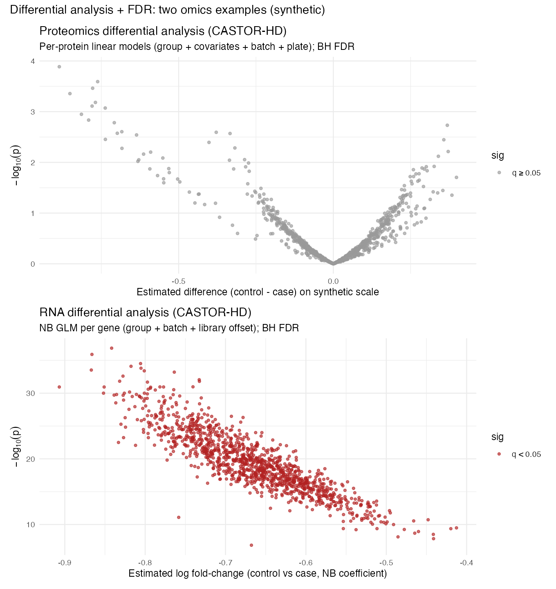
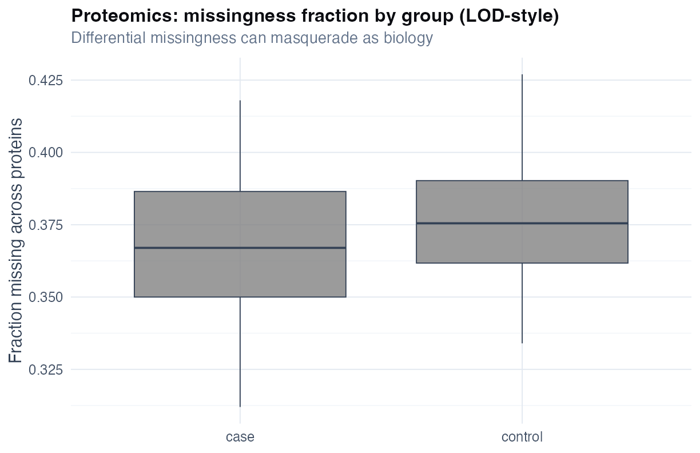
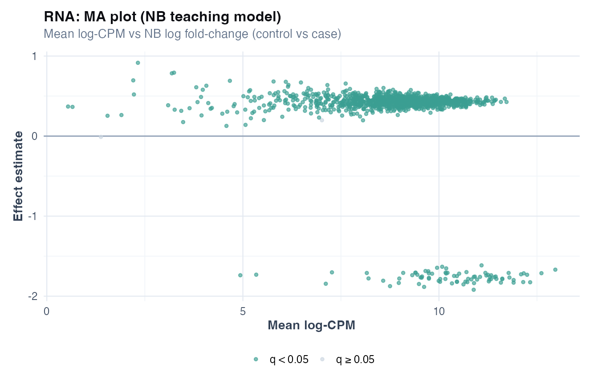
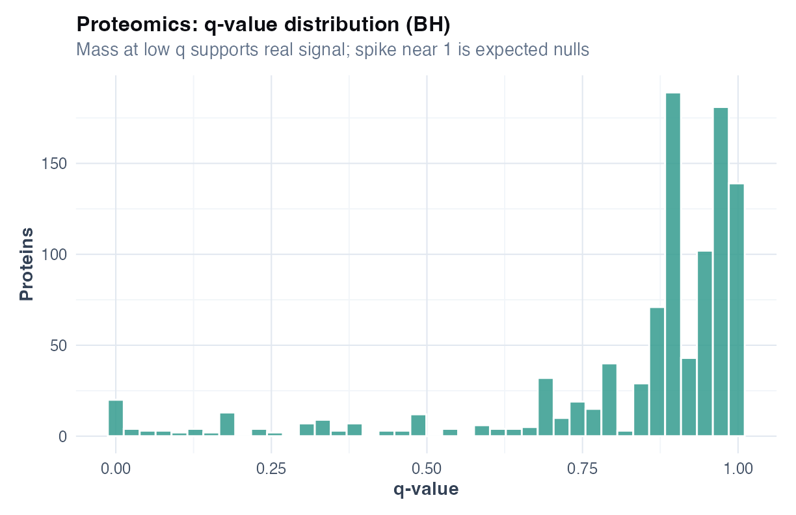

# Chapter 13: Differential analysis and false discovery rate (omics)

> **Part VI: High-dimensional biology and discovery**

## At a glance

| | |
|---|---|
| **Recurring datasets** | `data/proteomics_olink_like.csv`, `data/rnaseq_counts.csv` |
| **Format** | Technique cards + Caveats + Wrong analysis + Reporting ([template](../CHAPTER_TEMPLATE.md)) |
| **Primary goal** | Estimate per-feature effects **and** control false discoveries |
| **Core methods** | per-feature models, Benjamini–Hochberg FDR, volcano plot (descriptive), sensitivity checks |
| **R** | `R/examples/ch13_differential_fdr.R` |
| **Figures** | volcano panel (`ch13_volcano_panel.png`), missingness (`ch13_proteomics_missingness_by_group.png`), RNA MA (`ch13_rnaseq_ma_plot.png`) |
| **Templates** | [HIGH_DIM_REPORTING_TEMPLATES](../HIGH_DIM_REPORTING_TEMPLATES.md) |
| **Exercises** | [Chapter 13 exercises](../exercises/ch13_exercises.md) |

**Also see:** [Ch 14 batch](14-batch-effects.md), [Ch 17 pipeline](17-integrated-castor-hd.md), [Appendix B §1b](../appendix-b-quick-reference.md)

> **Sounds like your lab?** [Story 5](../appendix-k-in-the-room-stories.md#story-5--can-we-predict-endotype-and-prove-the-biologic-works) (proteomics + clusters + FEV1 in one paper) → [Working without a bioinformatics collaborator](#working-without-a-bioinformatics-collaborator).

---

## Investigator path (≈20 min)

You do not need this entire chapter on first pass. Read in order:

1. [Clinical and biostatistics notes](#clinical-and-biostatistics-notes) — volcano plots are triage, not treatment decisions
2. [The differential analysis workflow](#the-differential-analysis-workflow) — QC, model, FDR, sensitivity, claim discipline
3. [Method choice at a glance](#method-choice-at-a-glance) — proteomics vs RNA; Practice read on FDR
4. [Reporting template](#reporting-template) — discovery list wording for Methods/Results
5. [Catalog of wrong analyses](#catalog-of-wrong-analyses-omics-discovery) — batch overlap and overclaiming stops

**Analyst read:** per-feature models, R lab, and decision details below.

---

## Method choice at a glance

| Method | When to use | Why |
|--------|-------------|-----|
| **Per-feature linear model (proteomics)** | Olink-like continuous abundance; adjust group + covariates | Teaching default for log-scale proteins; check LOD missingness |
| **NB GLM + library offset (RNA-seq)** | Gene count data; varying library size | Counts need offset; overdispersion common |
| **Benjamini–Hochberg FDR** | Any high-dimensional screen (100s–1000s of features) | Controls expected false discovery rate across the family of tests |
| **Volcano plot** | Exploratory prioritisation after modelling | Descriptive only; not proof of biology |
| **Batch as covariate** | Batch measured; partial group × batch overlap | Reduces technical confounding ([Ch 14](14-batch-effects.md)) |
| **Sensitivity: with vs without batch** | Any DE hit list before follow-up spend | If hits disappear after batch, result is unstable |
| **Complete-case vs simple imputation (LOD)** | Proteomics below detection limit | Imputation can fabricate group differences |
| **Shrinkage / empirical Bayes (conceptual)** | Very small *n*; unstable per-feature estimates | Stabilises rankings; specialist pipelines |

**Extensions** (sparse PCA, prediction): [Alternatives & extensions](#alternatives--extensions-choose-by-goal) at chapter end.

---

## Learning objectives

1. Understand why “\(p < 0.05\)” becomes meaningless when you test 1000+ features.
2. Report **effect sizes and uncertainty**, not a list of “significant proteins”.
3. Use FDR control (BH) and interpret what it means in plain language.
4. Recognise when differential results are likely batch/plate artefacts.
5. Choose per-feature models appropriate to proteomics (Gaussian) vs RNA-seq (counts).
6. Run sensitivity analyses (with/without batch) before claiming discoveries.

## Prerequisites

Chapter 8 (reporting and multiplicity) and Chapters 10–11 (high-dimensional intuition).

---

*Monday inbox: “Attached: 1,000 proteins, 200 significant (p < 0.05).” No batch column, no effect sizes. **This chapter** is what to ask before approving validation spend.*

## Why this chapter

Omics generates thousands of p-values. Without FDR and effect sizes, you will chase false proteins and genes. This chapter is for anyone with a volcano plot in a manuscript or team readout who cannot yet explain what q = 0.11 means for follow-up budget.

## Opening question (CASTOR-HD)

*Which proteins (or genes) differ between cases and controls - and how many “discoveries” should we expect to be false if we act on them?*

In omics, the two most common failure modes are:

1. **Overclaiming**: treating 50 nominal \(p < 0.05\) hits as biology.
2. **Underreporting uncertainty**: listing q-values without effect sizes.

CASTOR-HD includes ~**150 participants** (case/control) and **~1000 proteins** or **~1200 genes** per modality. That is classic \(p \gg n\) discovery: rankings are noisy and multiplicity control is mandatory.

## Working without a bioinformatics collaborator

This chapter is for pulmonary investigators who receive a **proteomics or RNA export** and must decide what to fund next — often **without** a dedicated bioinformatics group in the lab.

| Situation | What goes wrong | What this chapter gives you |
|-----------|-----------------|------------------------------|
| Vendor delivers a volcano PDF | Batch hidden; *n* per group unclear | Ask for plate map + per-feature table with effect and q ([Reporting template](#reporting-template)) |
| Trainee runs “DE” in Excel | 1,000 uncorrected p-values | FDR vocabulary to **review** any deliverable |
| PI wants hits in the primary trial paper | Discovery mixed with confirmatory FEV1 | Separate families ([Ch 4](04-comparing-groups.md#unadjusted-adjusted-and-multiple-endpoints), [Ch 12 Case D](12-case-studies.md)) |
| No one knows what LOD means | Fabricated group differences after imputation | Missingness plot + sensitivity |
| “We’ll validate top 5 proteins” | Budget before stability check | With/without batch sensitivity ([Ch 14](14-batch-effects.md)) |

**You do not need to code pipelines.** You need to **sign off** on: unit of analysis (patient, not well), multiplicity control, batch audit, effect sizes, and an honest label (**hypothesis-generating**).

**Escalate** when: sample identity is uncertain, single-cell or raw FASTQ work is required, or a registrational biomarker claim is on the table.

---

## Clinical and biostatistics notes

**Clinical:** Volcano plots are **triage**, not treatment decisions. Zero FDR hits after batch adjustment is a valid honest result. Follow-up budget should use **effect size + q**, not rank order alone.

**Biostatistics:** BH-FDR controls a **family** of tests: state how many features were tested. Run batch sensitivity ([Ch 14](14-batch-effects.md)) before biological interpretation. CASTOR-HD RNA includes a **global shift** in the teaching data: treat large hit counts as a didactic warning, not biology.

**Clinical nuance:** LOD/absent proteins are not the same as "low expression": do not code below-detection as zero without an assay rule.

**Biostat nuance:** per-feature Gaussian models on proteomics and NB models on RNA counts are teaching defaults; production pipelines may use specialised packages: but FDR and effect reporting discipline stay the same.

---

## The differential analysis workflow

1. **QC**: missingness by group, library size (RNA), batch/plate labels recorded ([Ch 14](14-batch-effects.md)).
2. **Per-feature model**: one model per protein/gene with group + prespecified covariates (+ batch when identifiable).
3. **Effect table**: estimate, 95% CI, *p*, *n* used (after missingness).
4. **Multiplicity**: BH FDR across all features tested; report how many tests were run.
5. **Sensitivity**: with vs without batch; overlap of top 50 features.
6. **Claim discipline**: discovery list for follow-up, not mechanistic proof ([Ch 17](17-integrated-castor-hd.md)).

---

## Technique: Per-feature differential analysis + BH FDR

### Technique card

| | |
|---|---|
| **Answers** | Which features differ between groups, by how much, with multiplicity control? |
| **Outcome type** | Many continuous features (proteins) or many count features (genes) |
| **Design** | Usually independent groups; may include covariates and batch variables |
| **Data required** | group label, optional covariates, optional batch/plate/run |
| **Assumptions** | Model is approximately correct per feature; independence not required for BH (but strong dependence can distort) |
| **Effect measure** | mean difference or log2 fold-change (plus CI) |
| **Multiplicity** | BH FDR (q-values) for the family of tests |
| **R** | `p.adjust(p, method="BH")` after per-feature p-values |
| **When to use** | discovery with controlled false positives; prioritisation for follow-up |
| **When NOT to use** | mechanistic proof; “endotype” claims without replication |
| **Does NOT prove** | causation; diagnostic utility; pathway truth; transportability |

### Dual interpretation

**Plain language:** we tested many markers and adjusted the results so that only a small fraction of the “discoveries” are expected to be false.

**Precise language:** for each feature \(j\) we fit a model to estimate \(\beta_j\) for group; we then applied Benjamini–Hochberg to control the expected false discovery proportion among features called significant.

**Practice read:** FDR protects you from a “shopping list of biomarkers” that will not replicate. It does not tell you which marker is clinically useful.

### Worked example (CASTOR-HD proteomics)

From `ch13_proteomics_top_table.csv` (teaching run, batch-adjusted):

| Protein | Effect (control − case) | 95% CI | *p* | *q* |
|---------|-------------------------|--------|-----|-----|
| Prot_0127 | −0.89 | −1.33 to −0.44 | $1.3 \times 10^{-4}$ | 0.11 |
| Prot_0147 | −0.85 | −1.32 to −0.38 | $4.4 \times 10^{-4}$ | 0.11 |

**Read:** cases have **lower** abundance on this scale (negative effect = control − case). Nominal *p* is small, but **no protein passes BH *q* < 0.05** in this run after batch adjustment. That is a **valid scientific result**: “no FDR-controlled discoveries,” not a failed analysis.

Compare to RNA-seq in the same cohort: many genes pass FDR because the synthetic data include a **global expression shift** (teaching demo). Real studies rarely show genome-wide shifts; always interpret discovery **counts** alongside MA plots and batch QC.

```r
top <- readr::read_csv("volume-01/tables/ch13_proteomics_top_table.csv")
sum(top$q < 0.05, na.rm = TRUE)  # often 0 with batch in teaching data

rna <- readr::read_csv("volume-01/tables/ch13_rnaseq_top_table.csv")
sum(rna$q < 0.05, na.rm = TRUE)  # many in teaching global-shift demo
```

### Caveats box

| Caveat | Why it matters in respiratory research |
|--------|----------------------------------------|
| Batch and plate effects | “Significant proteins” often track run day/site rather than disease |
| Missingness near LOD (proteomics) | cases can have fewer detectable proteins; naive imputation can create signal |
| Normalization choices | log transform, scaling, library-size normalization change rankings |
| Small \(n\), huge \(p\) | effect estimates are noisy; ranks are unstable without shrinkage |
| Confounding | smoking/age/therapy correlate with both disease and omics; adjust or stratify |
| Interpretation inflation | top q-values are not “most important” without effect size and uncertainty |

### In practice

A collaborator emails “we have 47 significant proteins.” Ask for effect sizes, q-values, and whether batch was in the model. Zero FDR hits after batch adjustment is a valid result worth reporting.

### Wrong analysis ⚠

| | |
|---|---|
| **Mistake** | Run 1000 t-tests and report every \(p < 0.05\) as biology |
| **Why it fails** | expected false positives ≈ 50 even if **no** true differences |
| **Do instead** | control FDR (BH), report effect sizes + uncertainty, plan validation |

| | |
|---|---|
| **Mistake** | Volcano plot + “top hits” without mentioning preprocessing and batch |
| **Why it fails** | rankings are highly sensitive to normalization and technical drift |
| **Do instead** | show QC (PCA by batch), include batch as covariate, run sensitivity |

### Catalog of wrong analyses (omics discovery)

Use this as a pre-submission audit. If any row describes your workflow, rewrite.

| Wrong analysis | Why it fails | Do instead |
|---|---|---|
| **List of hits without effect sizes** (“Protein X significant, q = …”) | You cannot judge clinical or biological importance | Report effect + 95% CI + q-value; rank by effect + stability, not only q |
| **Nominal p-value hunting** (top 20 p-values) | Multiple testing turns this into a false-positive generator | Use BH FDR; show how many tests were run |
| **“Volcano proof”** (figure implies causality) | Volcano plots are descriptive; they do not validate biology | Present as prioritisation; specify validation/confirmation plan |
| **Batch ignored** | Many top hits are technical; FDR cannot fix confounding | Diagnose (Ch 14), include batch/plate/run covariates, run sensitivity |
| **Batch “corrected” without checking confounding** | Overcorrection can erase biology or manufacture differences | Show PCA by batch and group; if confounded, state identifiability limits |
| **LOD missingness imputed as a constant** (e.g., replace NA with 0) | Creates artificial group differences if detection differs by group/batch | Prefer sensitivity: complete-case vs simple within-feature imputation; report missingness by group |
| **CPM-style normalization treated as neutral** (RNA) | If some genes truly change, others can look changed due to compositional constraints | Interpret “global shifts” cautiously; prefer methods designed for counts and composition; validate with spike-ins / external data |
| **Imputation done before train/test split** (prediction) | Information leakage inflates performance | Perform all preprocessing within resampling (see Ch 9 mindset) |
| **Genes/proteins treated as independent evidence** | Correlation means “50 hits” may be 1 pathway signal | Summarise at pathway/module level as a secondary interpretation; keep per-feature results for transparency |
| **“No hits, therefore no biology”** | Low power can hide large effects; FDR can be conservative | Report effect size distributions and uncertainty; discuss detectable effect sizes |
| **Single-cohort “signature” claim** | Signatures are unstable without external validation | Treat as hypothesis; validate on external cohort or held-out batch |

### Reporting template

Use Template A in [HIGH_DIM_REPORTING_TEMPLATES](../HIGH_DIM_REPORTING_TEMPLATES.md).



Volcanoes are **triage slides**, not proof of treatment effect. Pair every volcano with missingness QC and an effect table with *n* used.

### Figure hygiene: volcano without QC context

| Slide mistake | What it masks | Pair with |
|---------------|-------------|-----------|
| Volcano-only hero figure | LOD missingness, batch overlap, low *n* per group | `ch13_proteomics_missingness_by_group.png`, batch PCA ([Ch 14](14-batch-effects.md)) |
| Colour by significance only | Effect size and CI for shortlisted features | Top table with estimate + 95% CI + q-value |

Router: [Appendix I](../appendix-i-figure-hygiene.md).

Points in the upper corners are large effects with small q-values; the grey band is the non-significant region after BH: empty corners are as informative as hits.

---

## Decision table: proteomics vs RNA-seq

*Modality contrast. For method **when/why** in one view, see [Method choice at a glance](#method-choice-at-a-glance) above.*

| Feature | Proteomics (Olink-like) | RNA-seq counts |
|---------|-------------------------|----------------|
| **Scale** | Continuous (log abundance) | Non-negative integers |
| **Model** | `lm` per protein + covariates | `glm.nb` per gene + offset(log library) |
| **Missingness** | LOD / NA common | Low counts, zeros |
| **Multiplicity** | BH across proteins | BH across genes |
| **QC first** | Missingness by group; batch PCA | Library size; batch; MA plot |
| **Chapter link** | [Ch 14](14-batch-effects.md) | Same + NB offset |

---

## Alternatives & extensions (choose by goal)

| Situation | Primary approach | Why |
|---|---|---|
| Very small \(n\), want stable ranking | shrinkage / empirical Bayes (conceptually) | stabilises noisy effects |
| Strong batch structure | handle batch explicitly (Ch 14) | prevents technical discoveries |
| Many missing values (LOD) | sensitivity: complete-case vs simple imputation | avoids imputation-created signal |
| Goal is prediction, not discovery | nested CV + calibration (Ch 9, [Ch 17](17-integrated-castor-hd.md)) | prevents leakage and overfit |

### Mini-lab: sparse PCA pointer (exploratory)

When \(p \gg n\), dense PCA loadings are noisy. For exploratory views only, try sparse PCA (`elasticnet` / `PMA` packages) with a prespecified sparsity penalty; never treat as confirmatory DE.

```r
# Teaching pointer (not run in ch13 script):
# library(PMA)
# sparse.pca(scale(prot_matrix), K = 2, para = c(0.5, 0.5))
```

### Mini-lab: LOD missingness check (proteomics)

```r
# After source("R/examples/ch13_differential_fdr.R"), or inline:
prot <- readr::read_csv(
  file.path(paths$data, "proteomics_olink_like.csv"),
  show_col_types = FALSE
)
prot %>%
  mutate(
    miss = rowMeans(
      is.na(dplyr::select(., starts_with("Prot_")))
    )
  ) %>%
  ggplot(aes(group, miss, fill = group)) +
  geom_boxplot() +
  theme_minimal()
```



Unequal missingness between groups can create artificial DE before any biology is tested: fix or model LOD, do not impute silently.

---


## R lab: Differential analysis on CASTOR-HD

**Script:** `R/examples/ch13_differential_fdr.R`

### 1) Proteomics (Olink-like): per-protein model + BH FDR + top-table

Your minimum output should be a table with:

- **feature** (protein)
- **effect** (control - case or log2FC)
- **95% CI**
- **p-value** and **q-value**
- **n used** (after missingness)

The script writes a copy-ready top-table to `volume-01/tables/`.

```r
source("R/00_setup.R")
library(tidyverse)

prot <- readr::read_csv(
  file.path(paths$data, "proteomics_olink_like.csv"),
  show_col_types = FALSE
)
prot %>% count(group)
```

### 2) RNA-seq counts: negative binomial differential expression

For RNA counts, use a **count model** (negative binomial), not a Gaussian model on raw or log-transformed counts. The teaching workflow fits one NB model per gene with an **offset for library size**:

```r
library(MASS)
rna <- readr::read_csv(
  file.path(paths$data, "rnaseq_counts.csv"),
  show_col_types = FALSE
)
# Per gene: glm.nb(count ~ group + batch + offset(log(library_size)))
# Then BH FDR across genes; see R/examples/ch13_differential_fdr.R
```

**Teaching note:** CASTOR-HD synthetic RNA includes a global expression shift, so many genes can pass FDR in this demo. In real studies, interpret discovery counts alongside MA plots and batch QC.



Systematic curvature or a cloud of outliers at low counts signals model or normalization stress, not a list of genes to chase.



A spike near zero with a flat tail suggests real signal mixed with null features; an all-flat histogram suggests underpower or QC failure.

### Sensitivity checklist (minimum)

- Run the differential analysis twice:
  - **with** batch/run as covariate
  - **without** batch/run
- Compare overlap of top 50 features and discuss stability.

### Niche figures to include (recommended)

- **Missingness by group** (proteomics): if cases have more missing, LOD is part of the story.
- **MA plot** (RNA): average abundance vs effect to spot mean–variance artefacts.
- **q-value distribution**: a flat distribution suggests “mostly null”; a spike near 0 suggests signal.

These are generated by the chapter script and saved to `volume-01/figures/`:

- `ch13_proteomics_missingness_by_group.png`
- `ch13_proteomics_qvalue_hist.png`
- `ch13_rnaseq_ma_plot.png`

## Exercises ([Solutions](../solutions/ch13_solutions.md))

**E13.1** Why is testing 1000 proteins at α = 0.05 a problem even if only 50 are "significant"?

**E13.2** What three columns must appear in a defensible DE/DA top table?

**E13.3** When would you distrust a volcano plot as "proof" of biology?

**E13.4** Why should RNA-seq use count models rather than a t-test on raw counts?

**E13.5** What does it mean when nominal *p* < 0.05 but all *q* > 0.05?

**Applied**

1. Run `source("R/examples/ch13_differential_fdr.R")`.
2. Open `volume-01/tables/ch13_proteomics_top_table.csv` and interpret the top 5 rows (effect + CI + q).
3. Compare proteomics vs RNA discovery counts at q < 0.05.
4. Write a Results paragraph using [HIGH_DIM_REPORTING_TEMPLATES](../HIGH_DIM_REPORTING_TEMPLATES.md) Template A.
5. Draft one honest sentence if proteomics yields **zero** BH discoveries.

---

## Where this chapter leads

**Next:** [Chapter 14](14-batch-effects.md) before trusting any hit list. Integrated pipeline → [Chapter 17](17-integrated-castor-hd.md).

## Further reading

- Benjamini & Hochberg (1995); McShane et al. biomarker reporting [@mcshane2011biomarker]
- [Ch 14](14-batch-effects.md) before interpreting any hit list
