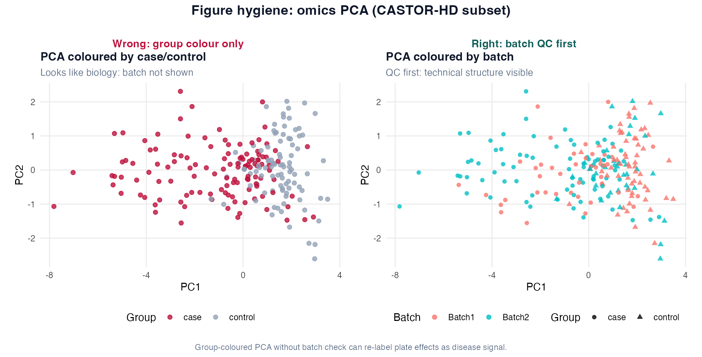
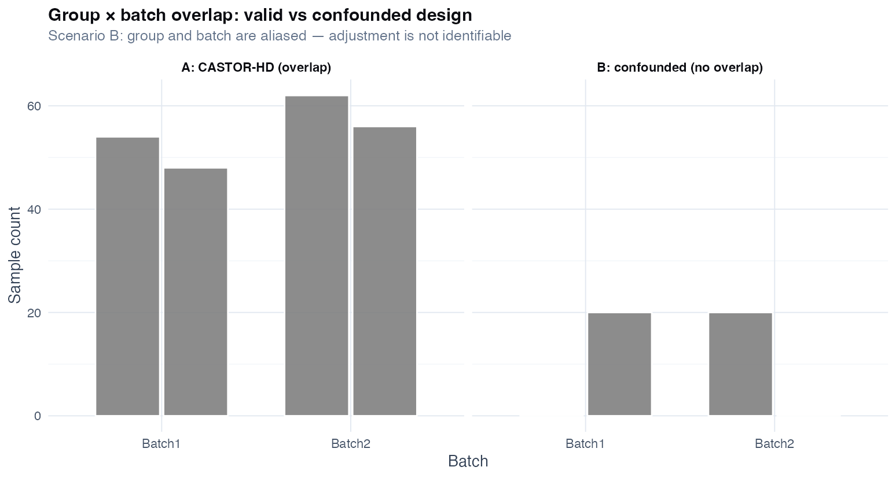
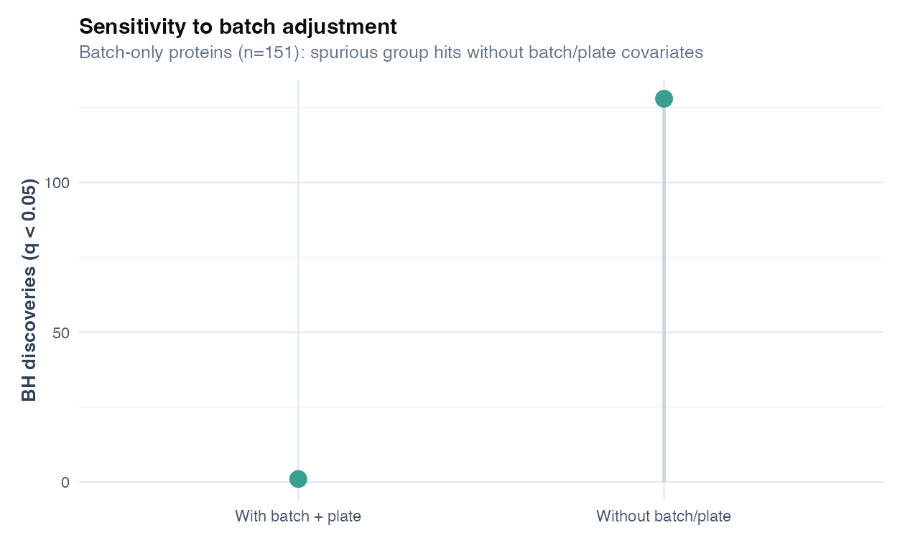
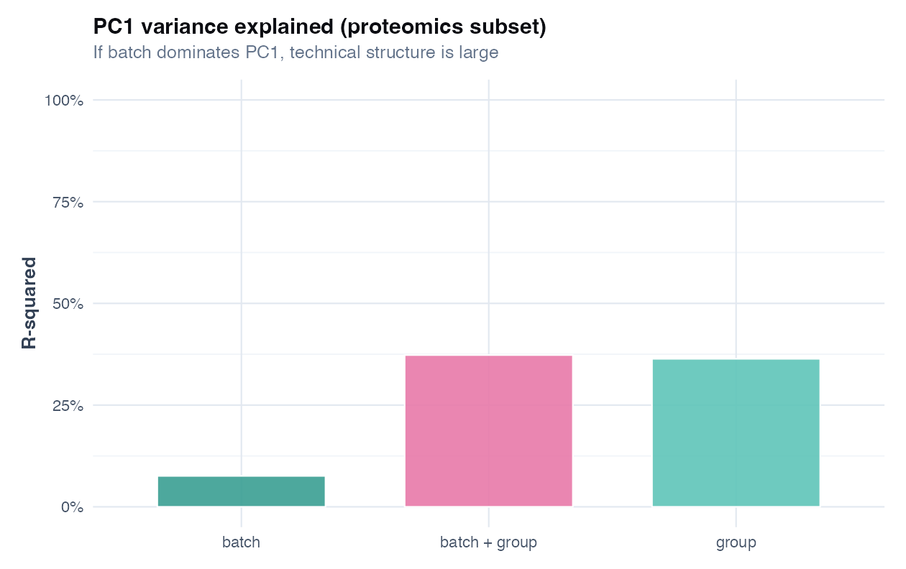
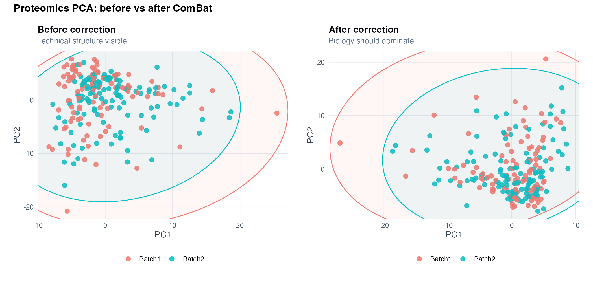
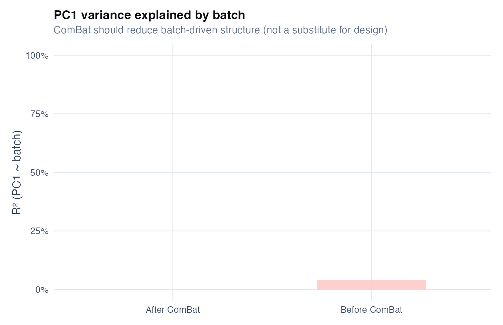

# Chapter 14: Batch effects, plate effects, and unwanted variation

> **Part VI: High-dimensional biology and discovery**

## Opening scene: PCA that looks too good

The first PCA separates cases and controls cleanly until Mei colours points by plate. The same separation tracks batch, not biology. The CRO insists normalisation is "proprietary." The vocabulary for that batch-versus-biology fight.

---

## Why this chapter

Batch is the commonest confounder in omics. You will diagnose it, adjust with prespecified methods, and report sensitivity, before anyone names an endotype.

---

## The batch QC workflow

1. **Record** batch, plate, run day, site, operator (whatever exists).
2. **Tabulate** `group × batch` (and plate if relevant).
3. **Plot** PCA or similar QC embedding coloured by batch **and** group.
4. **Quantify** variance explained by batch on leading PCs (if helpful).
5. **Sensitivity**: fit DE with and without batch; compare discovery counts.
6. **Stop rule**: if batch == group, report non-identifiability; do not force ComBat.

---

## Worked mini-case: when adjustment is valid vs not identifiable

The chapter script compares two designs side by side.

### Case A (CASTOR-HD proteomics): batch overlaps both groups

In `proteomics_olink_like.csv`, cases and controls appear in **both** batches. Batch is measurable technical variation, not a perfect proxy for disease status.

| Design feature | CASTOR-HD proteomics (teaching) |
|---|---|
| Group × batch overlap | Both groups in Batch1 and Batch2 |
| PCA pattern | Batch shifts scores, but groups are not separated by batch alone |
| Covariate adjustment | **Defensible** as sensitivity: `y ~ group + batch + plate + covariates` |
| Interpretation | Group effects are **conditional on measured technical variables**; still need replication |

We can attempt to separate biology from lab process because both patient types were measured under multiple conditions.

**Teaching numbers** (`ch14_batch_mini_case_summary.csv`, batch-only protein block *n* = 151): with batch/plate adjustment, **1** spurious group hit at BH *q* < 0.05 vs **128 without** adjustment; the prespecified biology panel (*n* = 18) retains **18** hits with adjustment. A large flip signals unstable conclusions — here the inflation without batch covariates is the teaching point.

### Case B (synthetic confounding): batch == group

Imagine a study where **all controls** were run on Batch1 and **all cases** on Batch2.

| Design feature | Confounded mini-case |
|---|---|
| Group × batch overlap | **None** (perfect confounding) |
| PCA pattern | Batch and group occupy the same direction in PC space |
| Covariate adjustment | **Not identifiable**: `group` and `batch` are redundant |
| Interpretation | You cannot claim a group effect "after adjusting for batch" |

If disease status and lab day are inseparable, the analysis cannot tell you whether the signal is biology or processing.

### Decision rule (use before any "ComBat" or covariate adjustment)

1. **Tabulate** `group × batch` (and plate/run if available).
2. If any cell has **zero** samples for a group-batch combination you need, treat **overlap as inadequate** for batch adjustment (precision and extrapolation suffer). **Perfect confounding** (batch == group) makes the group effect **non-identifiable** — a stronger failure mode than partial imbalance alone.
3. **Plot** PCA (or another QC embedding) colored by batch **and** group.
4. Fit a **sensitivity model** with and without batch; if the main conclusion flips, report instability.
5. If batch and group are perfectly confounded, stop claiming adjusted group effects; redesign or collect new data.

---

## Technique: Diagnose batch with PCA + simple QC

**Question:** Is technical structure large enough to distort inference?

Always before DE/ML on high-dimensional data: `prcomp(X, scale.=TRUE)` coloured by batch **and** group. Tabulate `group × batch`. PCA is descriptive, large PCs tracking batch suggests trouble; it does not prove correction fixes the problem.

If batch drives the main variation, a "biomarker panel" is probably not real.

ComBat on the full dataset before train/test split has sunk prediction papers. Any correction must respect the same leakage rules as prediction workflows.

**Methods template:** Batch and plate variables were recorded. We tabulated group × batch overlap and examined PCA colored by batch and group. Per-feature models included batch/plate as covariates where identifiable. Sensitivity analyses with and without batch adjustment [changed/did not change] the number of discoveries at FDR q < 0.05.

See [Catalog of wrong analyses (batch effects)](#catalog-of-wrong-analyses-batch-effects) below.

### Catalog of wrong analyses (batch effects)

| Wrong analysis | Why it fails | Do instead |
|---|---|---|
| **Skip batch QC** because "the analyst will fix it" | Technical structure becomes "biology" in DE/ML outputs | Always tabulate group × batch and plot PCA by batch |
| **Adjust for batch when batch == group** | Model is not identifiable; coefficients are arbitrary | Report confounding; redesign (balance batches) or external validation |
| **Report only the batch-adjusted model** | Hides instability and post hoc storytelling | Show with vs without batch; report overlap of top features |
| **Use ComBat on the full matrix before splitting data** (prediction) | Leakage: test set informs correction | Fit correction inside training folds only |
| **Treat plate as "random noise"** | Plates are structured batch effects with known labels | Include plate/run as covariate or blocking factor when measured |
| **Interpret PCA separation as proof** | Embeddings are descriptive; separation can be driven by one outlier feature | Check feature loadings; validate with targeted QC metrics |
| **Remove "batch genes" then test group** | Feature selection using batch information contaminates group tests | Prespecify feature sets or use models that include batch explicitly |
| **Claim transportability across sites** after single-site ComBat | Correction does not create external validity | Validate on held-out site/batch or new cohort |
| **Ignore missingness patterns by batch** (proteomics) | LOD missingness can track batch and mimic disease signal | Plot missingness by group and batch (see Ch 13 figure) |
| **Single sentence: "batch corrected"** in Methods | Not auditable; reviewers cannot assess identifiability | State variables, model structure, and sensitivity outcome |

### Reporting template

> Batch and plate variables were recorded. We tabulated group × batch overlap and examined PCA colored by batch and group. Per-feature models included batch/plate as covariates where identifiable. Sensitivity analyses with and without batch adjustment [changed/did not change] the number of discoveries at FDR q < 0.05. [If confounded: group effects were not identifiable after adjusting for batch.]

---

## Technique: Adjust batch by including it as a covariate

Most defensible first-line strategy for **inference** when batch is not perfectly confounded with group: `lm(feature ~ group + batch + plate + covariates)` per feature.

Adjustment is reasonable only if both groups were measured across batches; if batch == group, report non-identifiability instead of forcing ComBat.


Separation along PC1 by colour (batch) means batch-aware models or redesign, not a raw hit list.



| Panel | Shows | Masks |
|-------|--------|-------|
| **Wrong** | PCA coloured by case/control only | Plate/batch structure driving PC1 |
| **Right** | PCA coloured by batch, shape = group | QC before DE list |



Only the left-hand pattern supports identifiable group effects after batch adjustment; the right-hand pattern is a stop/go gate.

---

## Alternatives & extensions (when covariates are not enough)

| Situation | Primary approach | Notes |
|---|---|---|
| Strong unknown technical variation | RUV / surrogate variable analysis (conceptual) | requires negative controls or careful assumptions |
| Prediction goal | correction inside CV folds | prevents leakage (Ch 9 mindset) |
| Multi-site biology is real | do not "remove site" | site may be effect modifier, not nuisance |
| Batch confounded | blocked redesign / prospective balancing | statistical fix cannot replace design |
| Flow cytometry drift | include run day + control beads in model | see Ch 15 |

### Mini-lab: ComBat is not automatic

ComBat and similar tools can help when batch is measured and **not fully confounded** with group. Always run the overlap + PCA checks in this chapter first. If `table(group, batch)` has empty cells, report non-identifiability instead of forcing correction.

---


## R lab: Batch effects on CASTOR-HD

**Script:** `R/examples/ch14_batch_effects.R`

The script produces:

- PCA diagnostics (`ch14_pca_proteomics_batch.png`, `ch14_pca_proteomics_plate.png`)
- Sensitivity bar chart (`ch14_batch_sensitivity_discoveries.png`)
- **Mini-case figures:**
 - `ch14_group_batch_overlap.png` (valid overlap vs confounding)
 - `ch14_pc1_variance_explained.png` (how much PC1 tracks batch vs group)
- Summary table: `volume-01/tables/ch14_batch_mini_case_summary.csv`

```r
source("R/00_setup.R")
library(tidyverse)

prot <- readr::read_csv(
 file.path(paths$data, "proteomics_olink_like.csv"),
 show_col_types = FALSE
)
table(prot$group, prot$batch)
```

### Sensitivity rule (non-negotiable)

If the *existence* of your main result depends on whether batch is included, say so explicitly and treat the result as **unstable** until replication / better design.

### Niche figures (recommended)

- **Group × batch overlap plot:** the fastest confounding check.
- **PC1 variance explained by batch vs group:** quantifies whether technical structure dominates the leading axis.



A large drop in hit count after batch adjustment means many “discoveries” were technical. Report both numbers.



When batch explains more variance than group on PC1, prioritise batch QC over interpreting loadings.

### Analyst track (optional): ComBat before/after PCA

After overlap checks pass, see Appendix L for hands-on ComBat (not a substitute for balanced design).

```r
source("R/examples/ch14_analyst_combat.R")
```





---

---

## Quick reference: methods in this chapter

| Method | When to use | Why |
|--------|-------------|-----|
| **PCA coloured by batch** | First QC on any omics matrix | Fast visual: does technical structure dominate? |
| **Group × batch table** | Before any DE or ML | Empty cells → group effect not identifiable after batch adjustment |
| **Batch as covariate in DE model** | Batch measured; valid overlap design | Adjusts technical signal while estimating group ([Ch 13](13-differential-analysis-fdr.md)) |
| **Sensitivity: DE with vs without batch** | Any hit list going to validation | Unstable hits should not drive spend |
| **ComBat / SVA (specialist)** | Measured batch; not fully confounded | Can help; never skip overlap checks; not automatic |
| **Blocked redesign / re-run** | Batch perfectly confounded with group | Statistics cannot fix confounding; redesign |
| **Batch correction inside CV folds** | Prediction on omics ([Ch 9](09-prediction-vs-inference.md)) | Prevents leakage from global correction |
| **Do not remove “site” blindly** | Multi-site biology may be real | Site can be effect modifier, not nuisance |

**Extensions:** [Alternatives & extensions](#alternatives--extensions-when-covariates-are-not-enough) at chapter end.

---


## Exercises ([Solutions](../solutions/ch14_solutions.md))

**E14.1** When is including batch as a covariate defensible?

**E14.2** What does perfect confounding of batch and group imply for identifiability?

**E14.3** Why is ComBat before train/test split a leakage problem?

**E14.3** Why is ComBat before train/test split a leakage problem?

**E14.4** What should you report if discoveries go from 50 to 0 when batch is added?

**Applied**

1. Run `source("R/examples/ch14_batch_effects.R")`.
2. Interpret `ch14_group_batch_overlap.png` for Cases A and B.
3. Read `volume-01/tables/ch14_batch_mini_case_summary.csv`.
4. Draft a Methods sentence on batch handling for a proteomics paper.
5. Write a one-sentence **stop** message for a perfectly confounded design.

---

## Where we go next

**Next:** [Chapter 15](15-flow-cytometry.md) for immune summaries; [Chapter 16](16-antibody-discovery.md) for screens. Return to [Chapter 13](13-differential-analysis-fdr.md) sensitivity after batch QC.



**Near neighbors:** Ch [13](chapters/13-differential-analysis-fdr.md) · Ch [17](chapters/17-integrated-castor-hd.md)

## Further reading

- Leek et al. on batch effects; [Chapter 13](13-differential-analysis-fdr.md) for DE context
