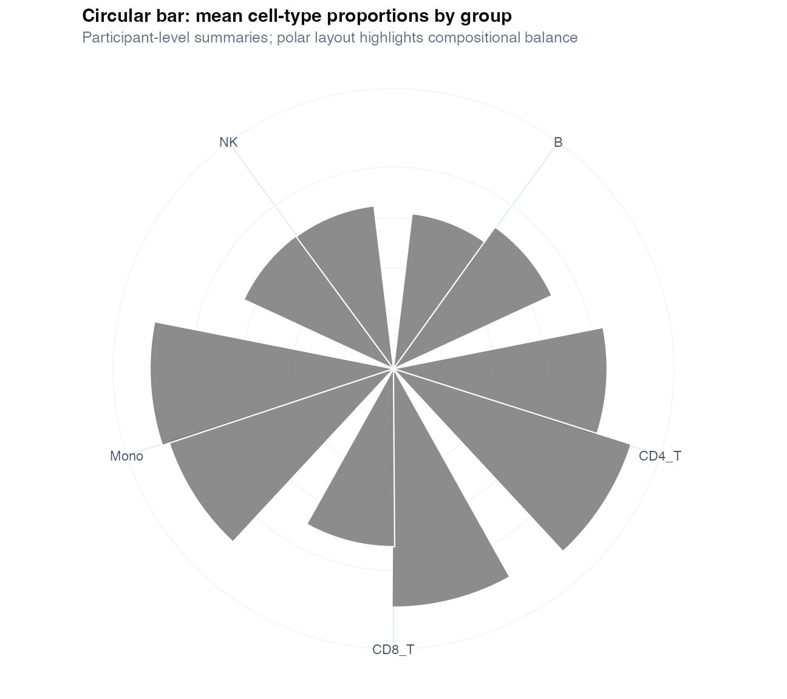
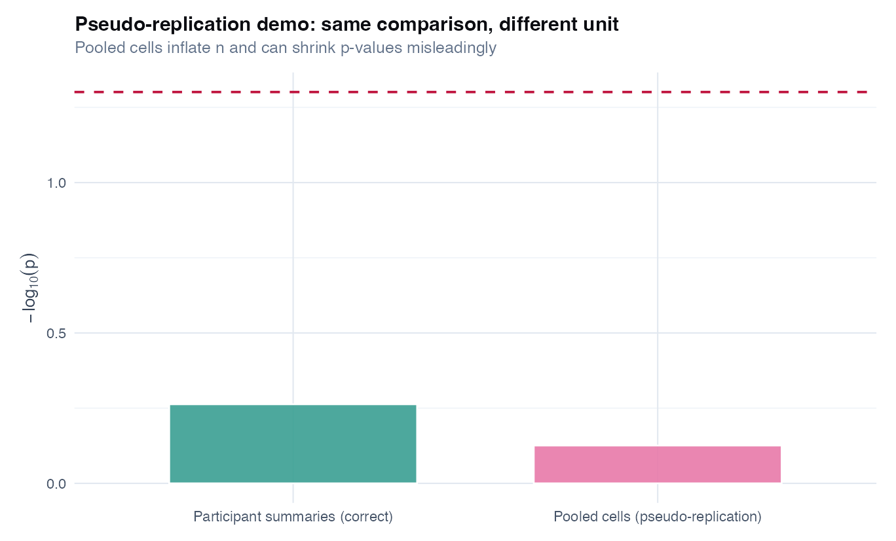
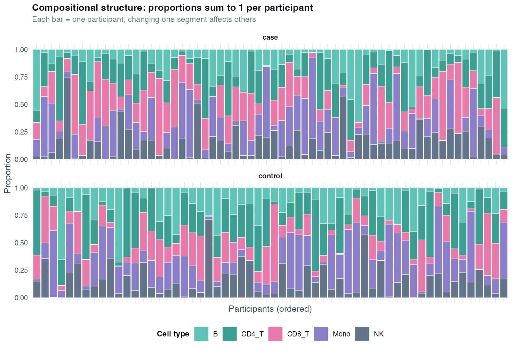
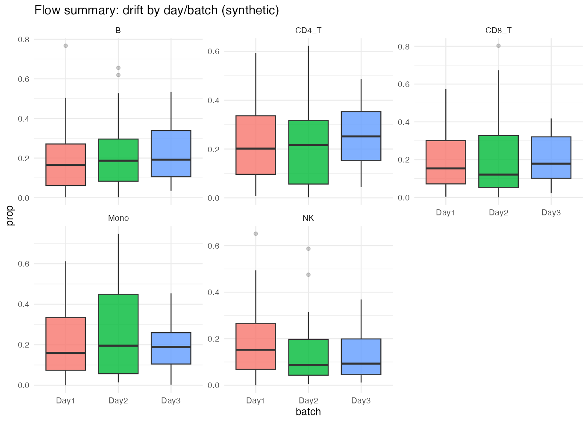

# Chapter 15: Flow cytometry - from summaries to phenotyping

> **Part VI: High-dimensional biology and discovery**

## Opening scene: proportions that sum to one

Flow summaries arrive: sixteen cell populations as percentages per participant. A bar chart shows "more neutrophils in cases." Mei asks whether the increase is composition, more neutrophils **within** patients, or different patient mix. Pseudoreplication waits in the per-cell file.

---

## Why this chapter

Flow data are compositional and hierarchical. This chapter teaches participant-level summaries, drift checks, and when the per-cell toy file is only a warning; not the primary analysis.

---

## The flow analysis workflow

1. **Panel & gating**: document manual or algorithmic strategy.
2. **Summarise per participant**: proportions and/or median intensities.
3. **Drift QC**: plot by batch/run day (Ch 14).
4. **Primary models**: participant-level `lm` or beta regression on prespecified cell types.
5. **Multiplicity**: BH across cell types if many tested (Ch 13).
6. **Embeddings**: UMAP/PCA for QC only unless validated.

---

## Worked mini-case: cells vs participants (pseudo-replication)

The chapter script compares two analysis units on the same CASTOR-HD toy per-cell file.

### Case A (correct): participant-level summaries

| Step | What you do |
|---|---|
| 1 | Gate or classify cells **within each participant** |
| 2 | Compute **one proportion per participant** per cell type (e.g., % monocytes) |
| 3 | Compare groups using **n = number of participants** |
| 4 | Adjust for drift (run day/batch) when measured |
| **n in CASTOR-HD** | 120 participants in `flowcytometry_summary.csv` |

"Among 120 people, cases had a higher median monocyte fraction" - this is the claim you can defend.

### Worked example (CASTOR-HD participant models)

From `ch15_flow_effects_by_celltype.csv` (logit scale, batch-adjusted, *n* = 120 participants):

| Cell type | Logit difference (case vs control) | *q* (BH) | Interpretation |
|-----------|-----------------------------------|----------|----------------|
| Mono | +0.81 | 0.025 | Higher monocyte proportion in cases |
| NK | +0.63 | 0.030 | Higher NK proportion in cases |
| CD8_T | −0.58 | 0.060 | Suggestive lower CD8 (borderline FDR) |
| CD4_T | −0.12 | 0.60 | No FDR evidence |

Report **participant *n***, not cell event counts. The pseudo-replication demo in the chapter script shows pooled-cell *p*-values far smaller than participant-level models for the same comparison.

### Case B (wrong): per-cell analysis as if independent

| Step | What people do (wrong) |
|---|---|
| 1 | Pool all cells across participants |
| 2 | Run a test comparing case vs control **cells** |
| 3 | Report **n = thousands of cells** and tiny p-values |
| **Why it fails** | Cells from the same person are correlated; SEs are far too small |

"We studied 6,000 cells" sounds impressive but does **not** mean 6,000 independent patients.

### Teaching demonstration (script output)

The script fits the same group comparison twice:

1. **Participant model:** `lm(logit(prop_Mono) ~ group + batch)` on `flowcytometry_summary.csv` (n ≈ 120)
2. **Pseudo-replication model:** `lm(CD14 ~ group)` on pooled cells (n ≈ thousands)

The pseudo-replication model will show a much smaller p-value and misleading precision. **Do not report Case B as confirmatory inference.**

### Decision rule

| Question | If yes → |
|---|---|
| Is each row a **cell**? | Summarise to participant first (unless using a proper mixed model with random intercepts for patient) |
| Do proportions **sum to 1**? | Treat compositional structure explicitly or interpret one cell type at a time with caution |
| Is drift (run day) recorded? | Plot by batch; include in model (Ch 14 mindset) |
| Are you showing UMAP/t-SNE? | Label as **descriptive**; support with participant summaries |

---

## Technique: Participant-level summary analysis (default)

Participant-level summary analysis asks whether cell-type proportions or marker medians differ between groups. The unit of analysis is **one row per participant**; outcomes are proportions (0–1) or continuous marker summaries in independent groups, with optional adjustment for covariates and drift. Use `lm(logit(p) ~ group + batch)` for teaching or beta regression for publication. This is the primary reporting approach, transparent, supports CI and covariates, but it does not prove mechanistic cell identity or causal immune pathways, and it should not claim new cell types from one embedding.

summaries like "higher monocyte fraction" are interpretable, but they are not a replacement for validated immunophenotyping.

### Caveats box

| Caveat | Why it matters |
|--------|----------------|
| Compositional constraints | proportions sum to 1; changes are not independent |
| Drift and instrument settings | day effects can mimic disease differences |
| Gating subjectivity | manual gating is a measurement process; report it |
| Rare populations | instability and zero inflation; avoid overinterpretation |
| Multiple comparisons | many cell types/markers -> multiplicity (Ch 13) |
| Unit of analysis | do not treat cells as independent patients |

### In practice

A flow core returns 50,000 events per patient and a beautiful t-SNE. Summarise to participant proportions first; show the embedding in supplementary material as QC.

### Wrong analysis ⚠

| | |
|---|---|
| **Mistake** | Treat 6000 cells as n = 6000 independent observations |
| **Why it fails** | pseudo-replication; SEs become meaningless |
| **Do instead** | summarise per participant (or use mixed models with care) |

| | |
|---|---|
| **Mistake** | Name clusters "new cell types" from one run of UMAP + k-means |
| **Why it fails** | embeddings distort distances; clustering is unstable |
| **Do instead** | call them "patterns", report stability, validate with markers/replication |

### Catalog of wrong analyses (flow cytometry)

| Wrong analysis | Why it fails | Do instead |
|---|---|---|
| **Pooled-cell t-test / logistic on cells** | Pseudo-replication inflates n and shrinks p-values | One summary per participant; n = participants |
| **Report cell count as sample size** | "n = 50,000 events" is not n = 50,000 people | Report participants and events per participant separately |
| **Ignore compositional constraint** | Increasing one population mechanically affects others | Interpret one type at a time; consider compositional methods if core question |
| **Compare proportions without drift check** | Run-day drift mimics group differences | Plot by batch; adjust when identifiable (Ch 14) |
| **UMAP separation = proof of disease subgroup** | Embedding is descriptive and unstable | Show participant summaries + marker validation |
| **Cherry-pick one cell type after scanning many** | Multiplicity without FDR | Prespecify populations or control FDR (Ch 13) |
| **Manual gating undisclosed** | Not reproducible; not auditable | Document gating strategy or algorithm + QC |
| **Rare population overclaim** | 0.1% subsets are noisy with small n | Report uncertainty; avoid mechanistic language |
| **Mixed model without random intercept for patient** | Still treats cells as exchangeable within patient incorrectly if misspecified | Patient random effect when modelling cells directly |
| **"Immune age" from one cohort** | Signature may track batch/site | External validation; drift diagnostics |

### Reporting template

Use Template C in HIGH_DIM_REPORTING_TEMPLATES.

> Flow cytometry was performed on [panel]. Cells were gated [manual/algorithmic strategy]. For each participant we computed the proportion of [cell types] and median marker intensities. Group comparisons used participant-level models adjusting for run day/batch. Per-cell embeddings (PCA/UMAP) were used for **visual QC only**.

---

## Technique: Compositional structure (proportions sum to 1)

When you measure five cell-type proportions, they are **not independent**: if monocytes go up, something else must go down. For most respiratory papers, prespecify 1–3 populations for primary inference and treat the rest as exploratory. When the core question is overall immune rebalancing, consider compositional data analysis (log-ratio transforms, Dirichlet models). These methods help interpret changes in one population given the whole; not which population "caused" the shift.

---

## Technique: Per-cell visualization (secondary)

Embeddings (UMAP/t-SNE) and clustering can help you **see** structure and check gating, but they are not, by themselves, confirmatory inference.

**Rule:** if you show an embedding, also show participant-level summaries that support the claim.



Bars are participant means: the level at which group comparisons belong in a respiratory paper.

### Figure hygiene: participant vs cell-level inference

| Panel / figure | Right use | Wrong use |
|----------------|-----------|-----------|
| `ch15_flow_props_by_group.png` | Participant-level proportions by arm | |
| `ch15_pseudoreplication_demo.png` | Teaching: why pooling cells inflates *p* | Inference at cell *n* |



Inflated significance when cells are pooled is the reason flow claims must stay at participant *n*.

---

## Alternatives & extensions

| Situation | Primary approach | Notes |
|---|---|---|
| Many cell types tested | FDR across populations (Ch 13) | prespecify primary endpoint |
| Strong drift | include batch + control beads QC | see Ch 14 overlap logic |
| Need single-cell discovery | clustering + stability (Ch 11 mindset) | do not call "endotypes" |
| Modelling cells directly | mixed model: `marker ~ group + (1\|patient_id)` | still harder to interpret than summaries |
| Compositional core question | log-ratio between prespecified types | advanced; document clearly |

### Mini-lab: beta regression pointer (proportions)

When proportions are bounded and skewed, `lm(logit(p) ~ ...)` is a teaching default. For publication, consider beta regression (`betareg` package) on (0,1) with jitter away from 0/1.

```r
# Teaching default (Ch 15 script):
fit <- lm(logit_mono ~ group + batch, data = flow_m)
```

---


## R lab: Flow cytometry on CASTOR-HD

**Script:** `R/examples/ch15_flow_cytometry.R`

Outputs:

- Participant proportions by group and batch (`ch15_flow_props_by_group.png`, `ch15_flow_props_by_batch.png`)
- **Compositional check:** stacked proportions (`ch15_compositional_stacked.png`)
- **Pseudo-replication demo:** participant vs pooled-cell p-values (`ch15_pseudoreplication_demo.png`)
- Per-cell PCA (descriptive): `ch15_flow_cells_pca.png`
- Summary table: `volume-01/tables/ch15_flow_mini_case_summary.csv`
- Effect table: `volume-01/tables/ch15_flow_effects_by_celltype.csv`

```r
source("R/00_setup.R")
library(tidyverse)

flow <- readr::read_csv(
 file.path(paths$data, "flowcytometry_summary.csv"),
 show_col_types = FALSE
)
table(flow$group, flow$batch)
```

### Sensitivity (minimum)

- Repeat the comparison for 2-3 cell types.
- Re-fit with and without `batch` and compare effect direction and magnitude.

### Niche figures (recommended)

- **Stacked compositional bars** by group (are shifts global rebalancing?)
- **Pseudo-replication contrast** (participant n vs cell n for the same comparison)



Shifts in one population often accompany opposite shifts elsewhere because proportions are bounded.



Batch-separated bars mean immunology and processing are confounded until drift is modelled or redesigned.

---

## Quick reference: methods in this chapter

| Method | When to use | Why |
|--------|-------------|-----|
| **Participant-level proportions** | Compare arms on cell-type fractions | One row per person; defensible inference |
| **Median / mean proportion by group** | Simple arm comparison | Clear estimand; report n participants |
| **Linear model on proportions** | Adjust for covariates | Watch compositional constraint (sum to 1) |
| **Compositional (log-ratio) transforms** | Formal compositional data analysis | Accounts for closure; specialist |
| **Per-cell mixed models** | Rare; cells nested in patients | Harder to interpret than summaries |
| **Drift plot by batch/run** | QC before biology | Technical drift mimics disease ([Ch 14](14-batch-effects.md)) |
| **UMAP / PCA on cells** | Exploratory gating QC | Descriptive only; not primary inference |

**Extensions:** Dirichlet models in [Alternatives & extensions](#alternatives--extensions).

---


## Exercises ([Solutions](../solutions/ch15_solutions.md))

**E15.1** Why is pooling 6,000 cells as n = 6,000 wrong?

**E15.2** Name one compositional constraint when interpreting flow proportions.

**E15.3** When is a UMAP figure acceptable in a paper?

**E15.4** Why prespecify 1–3 cell types for primary inference?

**Applied**

1. Run `source("R/examples/ch15_flow_cytometry.R")`.
2. Compare participant vs pooled-cell p-values in `ch15_pseudoreplication_demo.png`.
3. Interpret monocyte results in `volume-01/tables/ch15_flow_effects_by_celltype.csv`.
4. Write a Results sentence for monocyte proportion difference with batch adjustment.
5. State the unit of analysis in one Methods sentence.

---

## Where we go next

**Next:** [Chapter 16](16-antibody-discovery.md) for confirmation assays; [Chapter 17](17-integrated-castor-hd.md) for the full CASTOR-HD story.

## Related chapters

| Chapter | When to open it |
|---------|------------------|
| [Chapter 14: Batch effects](14-batch-effects.md) | Technical confounding before DE |

## Handbook resources

| Resource | When to use it |
|----------|----------------|
| [Appendix B: Quick reference](../appendix-b-quick-reference.md) | Choose a test or model by outcome and design |
| [HIGH_DIM_REPORTING_TEMPLATES](../HIGH_DIM_REPORTING_TEMPLATES.md) | Copy-paste Results paragraphs for omics chapters |

## Further reading

- Roederer & Moody flow cytometry guidelines; [Ch 14](14-batch-effects.md) for drift
