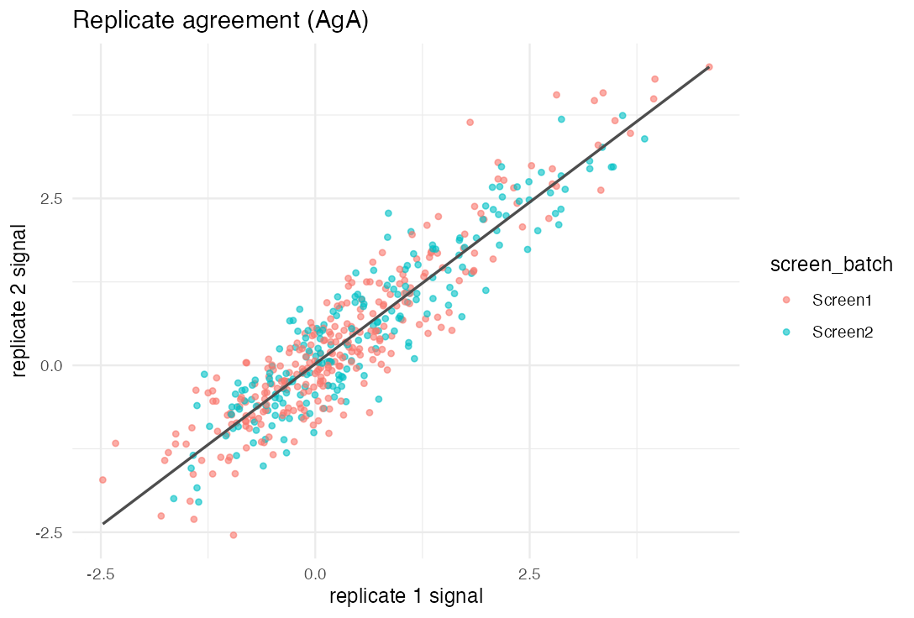
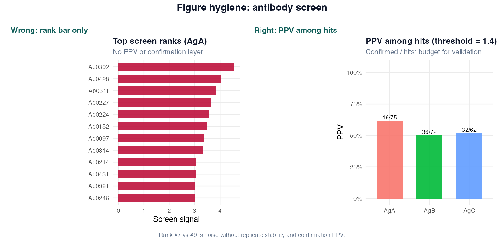
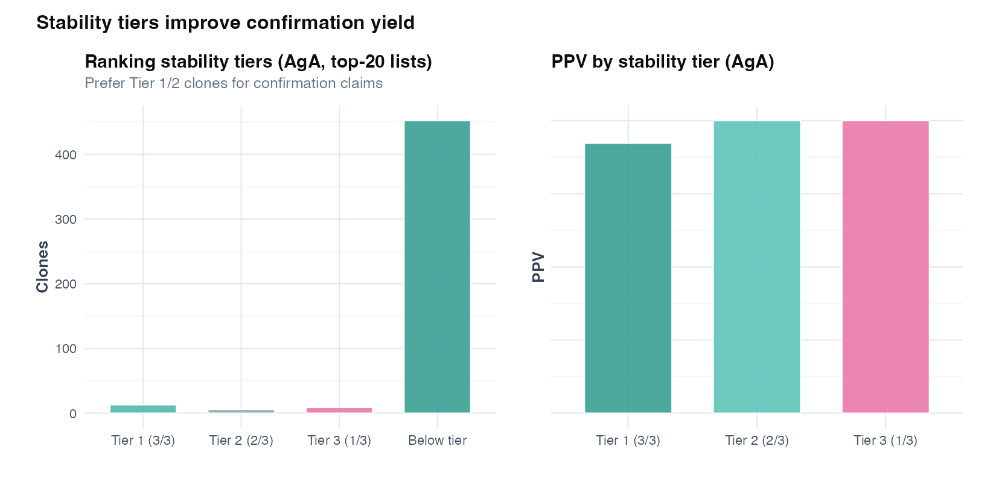
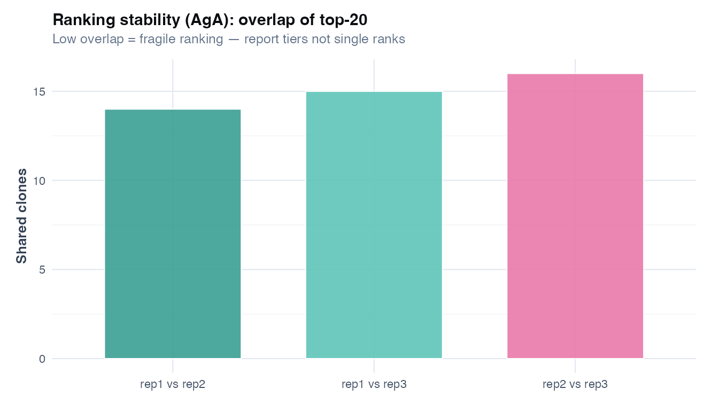

# Chapter 16: Antibody discovery screens - hit calling, confirmation, and stability

> **Part VI: High-dimensional biology and discovery**

## Opening scene: the hit list

A screen ranks four hundred clones; the PI wants the top ten in validation by Friday. Mei asks for replicate agreement, prespecified hit rules, and confirmation positivity before anyone says *"lead candidate."* PPV matters more than the prettiest rank plot.

---

## Why this chapter

Antibody and biomarker screens are triage exercises. This chapter connects screen thresholds, confirmation assays, and honest PPV. CASTOR's `antibody_screen.csv` carries the teaching example.

---

## The screen-to-confirmation workflow

1. **Replicate QC**: agreement between technical replicates; batch plots.
2. **Prespecified hit rule**: threshold or control-based cutoff (not post hoc).
3. **Shortlist**: hits per antigen; report hit count.
4. **Confirmation assay**: orthogonal readout with prespecified positivity (e.g. KD).
5. **PPV**: confirmed hits / screen hits; **per antigen**.
6. **Stability tiers**: top-*K* overlap across replicates; advance Tier 1 first.

---

## Worked mini-case: threshold, PPV, and stability tiers

The chapter script walks through three linked decisions on CASTOR-HD.

### Step 1: Replicate agreement (QC gate)

Before calling hits, check that replicates agree. Poor agreement means ranks are noise.

| QC signal | Interpretation |
|---|---|
| Strong rep1 vs rep2 correlation | Ranking is reasonably stable |
| Batch-separated clouds | Drift may inflate false hits (Ch 14) |
| Wide scatter at low signal | threshold choice matters a lot |

### Step 2: Hit calling with a prespecified threshold

**Teaching rule in the script:** call a hit when mean screen signal > **1.4** (prespecified for illustration).

| Quantity | What it means |
|---|---|
| **Hits** | clones above threshold (screen positives) |
| **Confirmed in hits** | hits with `confirm_positive == TRUE` in confirmation assay |
| **PPV** | confirmed in hits / hits |

PPV answers: *of the clones we would advance, what fraction actually confirm?*

This is more actionable than a screen p-value.

**Teaching numbers** (`ch16_screen_ppv_by_antigen.csv`, threshold = 1.4):

| Antigen | Hits | Confirmed in hits | PPV |
|---------|------|-------------------|-----|
| AgA | 85 | 44 | 0.52 |
| AgB | 69 | 37 | 0.54 |
| AgC | 61 | 34 | 0.56 |

PPV ≈ 50% means **half** of screen hits fail confirmation: normal for screens. Budget confirmation for Tier 1 clones first.

### Step 3: Ranking stability tiers (when ranks are noisy)

Recompute top-20 lists using replicate 1, 2, and 3 separately. Assign each clone to a **stability tier**:

| Tier | Rule (AgA example) | How to report |
|---|---|---|
| **Tier 1** | Top 20 in **all 3** replicates | Highest-priority confirmation |
| **Tier 2** | Top 20 in **2 of 3** replicates | Secondary shortlist |
| **Tier 3** | Top 20 in **1 of 3** replicates | Exploratory only |
| **Below tier** | Never top 20 in any replicate | Do not emphasise in main text |

Tiers are like "high / medium / low confidence shortlist": more honest than pretending rank #7 is meaningfully better than rank #9.

### Decision rule (screen to confirmation)

1. Check **replicate agreement** and batch QC.
2. Apply a **prespecified** hit rule (threshold or control-based).
3. Report **PPV** among hits (and confirmation rate by antigen).
4. Compute **stability tiers**; prefer Tier 1 for claims.
5. Confirm Tier 1/2 candidates; report KD/functional readout with prespecified positivity rule.

---

## Technique: Hit calling + confirmation as the estimand

Hit calling with confirmation asks which candidates exceed a prespecified screen criterion and how many confirm in a stronger assay. Screen signal is continuous; confirmation is binary after follow-up. You need replicates, controls, batch IDs, and a confirmation readout. Summarise with PPV among hits, tiered shortlists, and confirmation rates; not screen *p*-values alone. This applies to any screening workflow (antibodies, CRISPR, drug screens) but does not prove clinical utility, in vivo efficacy, or specificity without orthogonal tests.

a screen is like a triage test: useful if it reliably enriches true positives, but it is not the final diagnosis.

### Caveats box

| Caveat | Why it matters |
|--------|----------------|
| Replicate noise | ranks can change with small measurement noise |
| Batch effects | plates/days shift signals; false positives cluster by batch |
| Threshold fishing | changing the cutoff after seeing results inflates claims |
| Multiple antigens | multiplicity across targets; avoid cherry-picked antigen |
| Confirmation bias | only confirming "pretty" candidates hides failure rates |
| Definition drift | "confirmed positive" must be prespecified (KD cutoff etc.) |

### In practice

Changing the hit threshold after seeing the plate layout is post hoc tuning. Prespecify the rule (or control-based z-score) and show sensitivity across a grid of cutoffs.

### Wrong analysis ⚠

| | |
|---|---|
| **Mistake** | Report the top 10 clones as "best" without confirmation |
| **Why it fails** | screens have false positives; ranks are noisy |
| **Do instead** | report tiers + confirmation rate and PPV |

| | |
|---|---|
| **Mistake** | Pick a threshold that maximises "story" after seeing the data |
| **Why it fails** | post hoc thresholding is hidden multiple testing |
| **Do instead** | prespecify threshold or use controls; report sensitivity analysis |

### Catalog of wrong analyses (antibody / discovery screens)

| Wrong analysis | Why it fails | Do instead |
|---|---|---|
| **Screen p-value as final result** | Screen is triage, not confirmatory endpoint | Report PPV and confirmation outcomes |
| **Post hoc threshold** chosen to maximise hits | Inflates false discovery and PPV looks better than it is | Prespecify threshold; show sensitivity curve |
| **Rank #1..#10 reported as precise ordering** | Ranks are unstable under replicate noise | Use stability tiers |
| **Confirm only "good-looking" clones** | PPV becomes meaningless (selection bias) | Confirm prespecified shortlist rule |
| **Ignore batch in screen QC** | Hits cluster by plate/day | Plot by batch; adjust or block in design |
| **Single replicate** | No assessment of ranking stability | Require replicates or repeat measurements |
| **Mix antigens in one threshold** | Different targets have different background | Threshold/PPV **per antigen** |
| **KD reported without positivity rule** | "Strong binder" becomes subjective | Prespecify KD cutoff for `confirm_positive` |
| **Cherry-pick one antigen for the paper** | Multiplicity and hype | Report all targets or prespecify primary antigen |
| **Claim therapeutic antibody from screen** | No specificity, affinity, or function in context | Confirmation + orthogonal assays + replication |

### Reporting template

Use Template D in HIGH_DIM_REPORTING_TEMPLATES.

> Screening used [R] technical replicates per clone against [antigens]. Replicate agreement was assessed [correlation/plot]. Hits were defined prespecification as mean signal > [threshold] (or control-based rule). Confirmation used [assay] with positivity defined as KD < [X] nM. We report PPV among hits and stability tiers based on overlap of top-[K] lists across replicates.

---

## Technique: Threshold sensitivity (prespecified vs exploratory)

A single threshold is not enough for transparency. Report a **sensitivity curve**:

- x-axis: threshold
- y-axis: number of hits and PPV (where confirmation data exist)

If PPV collapses when you move the threshold slightly, your shortlist is fragile.



Low replicate correlation flags unstable hits before you spend confirmation budget.


A cliff edge in PPV means the shortlist is threshold-dependent: show the curve, not one lucky cutoff.

---

## Technique: Stability tiers (ranking under replicate resampling)

Stability tiers identify clones consistently top-ranked under replicate noise. Recompute top-*K* lists from each replicate and assign Tier 1 (top in all replicates), Tier 2 (two of three), Tier 3 (one of three). Use when confirmation budget is limited, tiers show **stability**, not that a clone is objectively "best."

---

## Alternatives & extensions

| Situation | Approach | Notes |
|---|---|---|
| High background variability | control-normalised signal (e.g., z-score vs negative controls) | more defensible than arbitrary cutoff |
| Many weak binders | FDR across clones (Ch 13 mindset) | still requires confirmation |
| Functional screen endpoint | hit = response in primary assay; confirm in secondary | define two-stage estimands |
| Multi-batch screen | include batch in hit model or stratify | Ch 14 logic |

### Mini-lab: control-normalised screen signal

```r
screen <- readr::read_csv(
 file.path(paths$data, "antibody_screen.csv"),
 show_col_types = FALSE
)
# Teaching: z-score within antigen across clones (exploratory)
screen %>% group_by(antigen) %>%
 mutate(z = as.numeric(scale(signal_mean))) %>%
 filter(z > 1.5) %>% count(antigen)
```

---


## R lab: Antibody screening on CASTOR-HD

**Script:** `R/examples/ch16_antibody_screening.R`

### Figure hygiene: rank bar vs PPV



| Panel | Shows | Masks |
|-------|--------|-------|
| **Wrong** | Top screen ranks only | Confirmation PPV, tier stability |
| **Right** | PPV among hits by antigen | Validation budget reality |

Outputs:

- `ch16_screen_replicate_agreement.png`
- `ch16_screen_ppv.png` (PPV by antigen at prespecified threshold)
- `ch16_threshold_sensitivity.png` (hits and PPV vs threshold)
- `ch16_stability_tiers.png` (tier counts + PPV by tier for AgA)
- `ch16_ranking_stability.png` (top-20 overlap across replicate pairs)
- Tables in `volume-01/tables/`:
 - `ch16_screen_ppv_by_antigen.csv`
 - `ch16_threshold_sensitivity.csv`
 - `ch16_ranking_tiers_aga.csv`
 - `ch16_mini_case_summary.csv`

```r
source("R/00_setup.R")
library(tidyverse)

screen <- readr::read_csv(
 file.path(paths$data, "antibody_screen.csv"),
 show_col_types = FALSE
)
conf <- readr::read_csv(
 file.path(paths$data, "antibody_confirmation.csv"),
 show_col_types = FALSE
)
```

### Sensitivity (minimum)

- Vary threshold over a prespecified grid; show PPV and hit count.
- Report stability tiers and restrict main claims to Tier 1 (and optionally Tier 2).



Tier 1 clones are the only defensible primary shortlist; lower tiers belong in supplementary exploration.



Low overlap between replicate top-20 lists means ranking noise, not biology.

---

## Quick reference: methods in this chapter

| Method | When to use | Why |
|--------|-------------|-----|
| **Prespecified hit threshold** | Primary screen analysis | Avoids post hoc cutoff on ranked list |
| **Replicate agreement** | Two screen runs available | Separates signal from noise before confirmation |
| **PPV at threshold** | Budget for validation | Expected true positives among called hits |
| **Stability tiers (high/med/low)** | Prioritise confirmation spend | Honest triage; not all hits equal |
| **Confirmation assay** | Before binding/clinical claims | Screen OR ≠ validated reagent |
| **Ranking stability across replicates** | Avoid storytelling on small rank shifts | Top-20 overlap more informative than #7 vs #9 |

**Extensions:** [Alternatives & extensions](#alternatives--extensions) at chapter end.

---


## Exercises ([Solutions](../solutions/ch16_solutions.md))

**E16.1** What is PPV among screen hits, and why is it more useful than a screen p-value?

**E16.2** Define Tier 1 stability in this chapter's rule.

**E16.3** Why is post hoc threshold tuning dangerous?

**E16.4** Why report PPV **per antigen**?

**Applied**

1. Run `source("R/examples/ch16_antibody_screening.R")`.
2. Report PPV by antigen from `ch16_screen_ppv_by_antigen.csv`.
3. Interpret `ch16_threshold_sensitivity.png` at the prespecified threshold.
4. List Tier 1 clones from `ch16_ranking_tiers_aga.csv` and their confirmation status.
5. Draft Methods + Results sentences using Template D.

---

## Where we go next

**Next:** [Chapter 17](17-integrated-castor-hd.md) stitches omics, flow, and antibody steps into one report.

## Handbook resources

| Resource | When to use it |
|----------|----------------|
| [Appendix B: Quick reference](../appendix-b-quick-reference.md) | Choose a test or model by outcome and design |
| [HIGH_DIM_REPORTING_TEMPLATES](../HIGH_DIM_REPORTING_TEMPLATES.md) | Copy-paste Results paragraphs for omics chapters |

## Further reading

- Confirmation assay standards; [Ch 17](17-integrated-castor-hd.md) integrated pipeline
