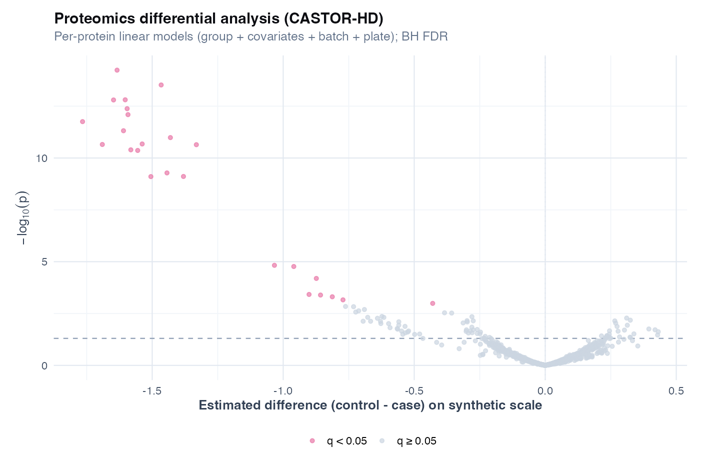
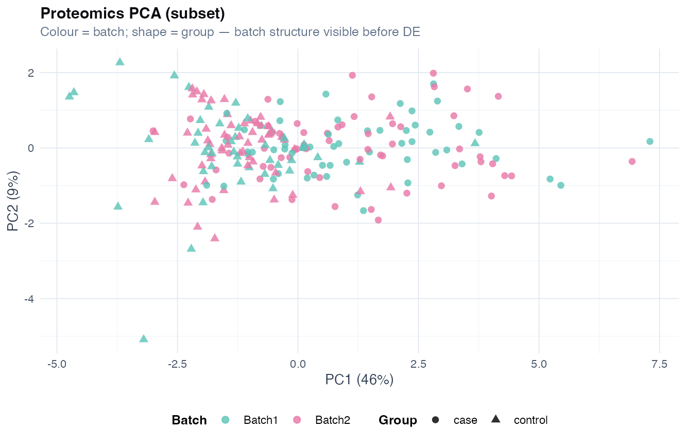
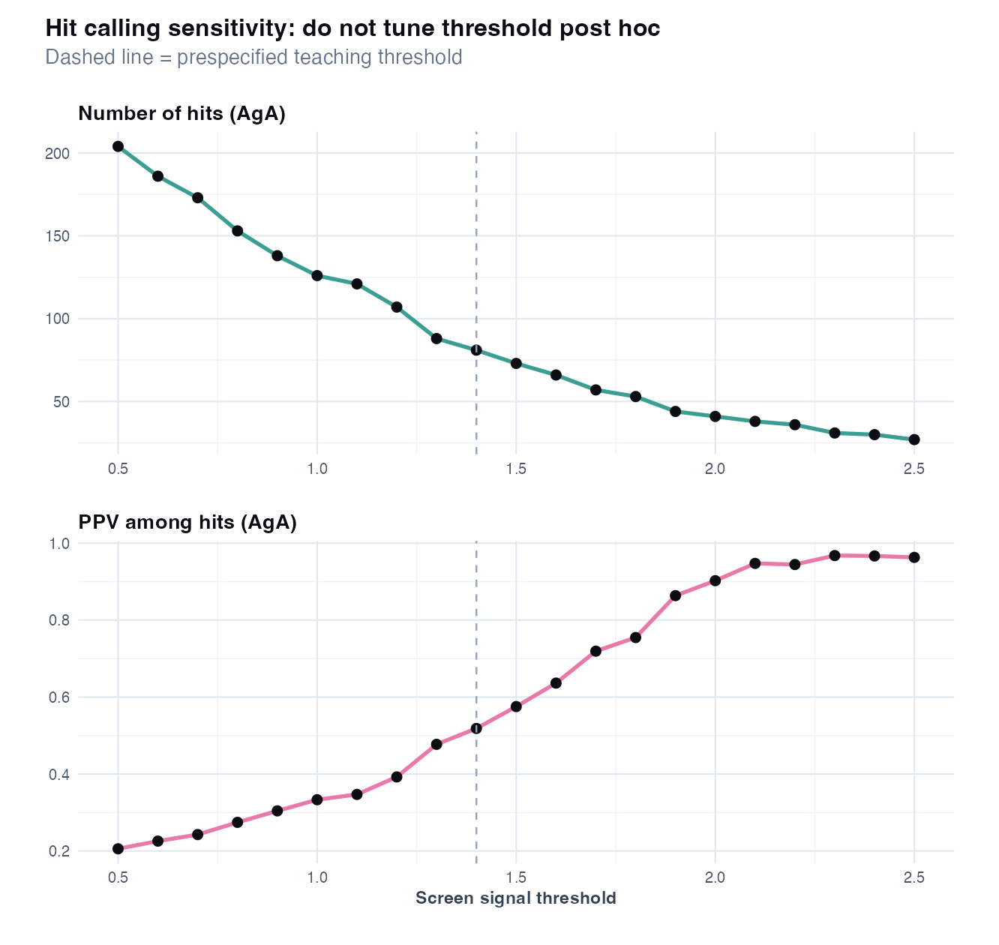
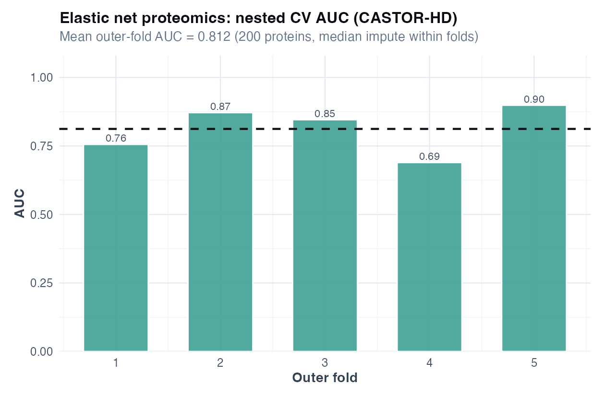

# Chapter 17: Integrated CASTOR-HD discovery pipeline

> **Part VII: Integrated CASTOR-HD capstone**

## Opening scene: one Results section, two worlds

Proteomics hits, RNA fold-changes, and trial FEV₁ all land in the same manuscript draft. Reviewer 2 will ask which claims are confirmatory. Mei splits Results into discovery and clinical paragraphs, and a limitations block that admits what integration **did not** establish.

---

## Why this chapter

Integrated omics capstones need stop/go gates. CASTOR-HD walks bulk matrices plus participant summaries without pretending one volcano plot replaces the SAP.

---

## The discovery claim ladder

| Rung | Evidence | Language allowed |
|------|----------|----------------|
| 1 | DE hit (FDR) | "Candidate feature" |
| 2 | Batch-robust DE | "Candidate after technical sensitivity" |
| 3 | Flow association at participant level | "Immune phenotype association" |
| 4 | Screen + confirmation PPV | "Confirmed binding in replicate assay" |
| 5 | External cohort + clinical outcome | "Validated biomarker" (still not causal) |

Do not skip rungs in a title or abstract.

---

## Master workflow (CASTOR-HD discovery)

**Pipeline steps**

| Step | Action | Chapter | Output |
|------|--------|---------|--------|
| 1 | Per-feature DE + BH FDR | 13 | Top table, volcano |
| 2 | Batch/plate PCA + sensitivity | 14 | Overlap check, discovery count |
| 3 | Shortlist top features | 13 | Ranked list (effect + q) |
| 4 | Flow: participant-level proportions | 15 | Adjusted effects by cell type |
| 5 | Antibody screen → confirmation + tiers | 16 | PPV, Tier 1 clones |
| 6 | Integrated report | Templates | Methods + Results draft |
| 7 | (Optional) Supervised elastic net | 17 R | Nested CV AUC |

**Stopping rules**

| Step | Stop if… |
|------|----------|
| 1 | Model misspecified |
| 2 | Group ⊗ batch confounded |
| 3 | Batch sensitivity reverses rank |
| 4 | Pseudo-replication (cells) |
| 5 | Threshold tuned post hoc |
| 7 | Outer-fold AUC only (no claim beyond internal validation) |

```r
source("R/00_setup.R")
source("R/examples/ch17_integrated_castor_hd.R")
```

---

## Step 1–2: Proteomics DE with batch awareness

Run differential analysis (Ch 13), then immediately run batch diagnostics (Ch 14). **Do not** interpret top hits until overlap is acceptable. Ask whether group differences are identifiable after accounting for batch structure: check PCA coloured by batch and the group × batch contingency. If group and batch are perfectly confounded, report non-identifiability, no amount of statistics replaces redesign.



Volcano plots are **descriptive**; inference lives in the per-feature models and FDR.



If colour tracks batch more than group, technical structure dominates.

**Stopping rule:** if group and batch are perfectly confounded, report non-identifiability and do not claim group-specific protein differences.

## Step 3: Shortlist for follow-up

Export the top 20–50 features by q-value **and** absolute effect. Prioritise features stable with vs without batch adjustment.

See `volume-01/tables/ch17_integrated_shortlist.csv` from the integrated script. Narrow thousands of proteins to a short list for cheaper assays, prespecified ranking by adjusted effect size and BH q-value, with sensitivity to batch covariate inclusion.

---

## Step 4: Flow cytometry summary

Link immune phenotyping to the discovery story at the **participant** level (Ch 15). Cell embeddings are QC only. One row per participant (proportions), not per cell, pooled cells across patients inflate precision.


---

## Step 5: Antibody screen confirmation

Translate screen hits into confirmation PPV and stability tiers (Ch 16). The screen is high-throughput ranking with many false positives expected; confirmation uses replicate binding and PPV among hits. Ranking stability across replicates defines Tier 1 clones, this does not prove in vivo neutralisation or treatment effect.



Prespecify thresholds. Post-hoc threshold tuning inflates apparent PPV.

---

## Step 6: Reporting (integrated)

Use HIGH_DIM_REPORTING_TEMPLATES:

- **Template A** for omics DE (*n*, model, FDR, batch handling)
- **Template B** for batch sensitivity
- **Template C** for flow proportions
- **Template D** for antibody discovery

Write one paragraph per modality; separate “discovery” from “confirmed binding.”

### Example integrated Results paragraph (skeleton)

> In CASTOR-HD (*n* = … cases, … controls), we tested … proteins on … plates. After linear models with batch adjustment, … proteins had BH q < 0.05 (Figure). Batch PCA showed …; sensitivity without batch yielded … discoveries. Participant-level flow cytometry found … cell proportion associated with case status (adjusted …). Antibody screening at prespecified threshold … identified … hits; confirmation PPV was … among Tier 1 stable clones. These findings are **hypothesis-generating** and require external replication.

---

## Technique: Elastic net + nested CV (p ≫ n prediction)

Elastic net with nested CV asks whether proteomics can predict case/control with honest internal performance when p ≫ n. Use `glmnet` inside nested CV for exploratory risk stratification or hypothesis for external validation; not for causal inference or diagnostic approval without an external cohort. Nested CV provides an internally honest AUC when tuning λ; optimism remains for external transport.

Integrated omics slides often show only the volcano. Decision-makers need the stop/go gates: batch overlap, discovery count with/without adjustment, PPV, Tier 1 clones, in that order.

### Wrong analysis ⚠

| Mistake | Do instead |
|---------|------------|
| Tune λ on the same data you evaluate | Nested CV (outer fold = performance, inner = λ) |
| Impute/batch-correct before splitting | All preprocessing inside training folds |
| Report training AUC as validation | Report outer-fold mean AUC ± SD |
| Claim clinical utility from AUC alone | Calibration, decision curve, external cohort |


### R lab

```r
source("R/examples/ch17_elastic_net_proteomics.R")
```



Outer-fold AUC with variability across folds is the honest performance summary; training AUC is not shown here on purpose.

---

## Cross-modality synthesis

| Modality | Inference level | Key metric | Typical failure mode |
|----------|-----------------|------------|----------------------|
| Proteomics DE | Discovery (FDR) | Effect + q; batch sensitivity | Batch confounding |
| RNA-seq DE | Discovery (NB + FDR) | Same; library offset stated | Global shift (teaching data) |
| Flow | Associational | Participant *n*; batch-adjusted proportion | Cell-level pseudo-replication |
| Antibody screen | Prioritisation | PPV + Tier 1 stability | Post-hoc threshold |
| Elastic net | Prediction (internal) | Nested CV AUC | Leakage across folds |

---

## Pipeline failure modes (what to report honestly)

| Failure | Honest sentence |
|---------|-----------------|
| 0 BH hits after batch adjustment | "No proteins met FDR < 0.05 after batch adjustment." |
| Perfect group–batch confounding | "Group effect not identifiable; analysis stopped at Step 2." |
| Unstable antibody ranking | "No Tier 1 clones; hits exploratory only." |
| Nested CV AUC ≈ 0.5 | "No internal predictive signal; not a classifier." |

---

## Quick reference: methods in this chapter

| Step / method | When to use | Why |
|---------------|-------------|-----|
| **DE + FDR (proteomics/RNA)** | First biology screen | Per-feature effects with multiplicity control ([Ch 13](13-differential-analysis-fdr.md)) |
| **Batch QC before DE** | Any multi-site omics | Prevents funding false hits ([Ch 14](14-batch-effects.md)) |
| **Flow participant summaries** | Immune phenotyping arm | Inference at person level ([Ch 15](15-flow-cytometry.md)) |
| **Antibody screen tiers** | Hybridoma / phage triage | PPV and confirmation ([Ch 16](16-antibody-discovery.md)) |
| **Elastic net + nested CV** | p ≫ n prediction on proteins | Tuning without leakage ([Ch 9](09-prediction-vs-inference.md)) |
| **Stop if batch = group** | Confounded design | No amount of stats replaces redesign |
| **Separate discovery vs confirmation prose** | Manuscript writing | Different claim strength per modality |

---


## Exercises ([Solutions](../solutions/ch17_solutions.md))

**E17.1** At which pipeline step would you stop if batch and group are confounded?

**E17.2** Why is nested CV required for elastic net on 1000 proteins?

**E17.3** What is the difference between a Tier 1 antibody clone and a proteomics q < 0.05 hit?

**E17.4** Why must flow analyses use participant-level proportions?

**E17.5** Name one claim that would be **too strong** after this pipeline alone.

**Applied**

1. Run `source("R/examples/ch17_integrated_castor_hd.R")`.
2. Run `source("R/examples/ch17_elastic_net_proteomics.R")`.
3. Draft a 300-word integrated Results section using the templates.
4. List three claims you would **not** make from this pipeline alone.
5. For each pipeline step, write one sentence for Methods and one for Results.

---

## Where we go next

**Next:** [Chapters 18–22](18-longitudinal-mixed-models.md) for repeated measures, survival, missing data, causal framing, and mediation on CASTOR extensions.

## Handbook resources

| Resource | When to use it |
|----------|----------------|
| [Appendix B: Quick reference](../appendix-b-quick-reference.md) | Choose a test or model by outcome and design |
| [HIGH_DIM_REPORTING_TEMPLATES](../HIGH_DIM_REPORTING_TEMPLATES.md) | Copy-paste Results paragraphs for omics chapters |

## Further reading

- McShane et al., biomarker reporting [@mcshane2011biomarker]
- Harrell, *Regression Modeling Strategies* [@harrell2015rms]
- Ch 12 Case D for the bridge from core CASTOR to CASTOR-HD
