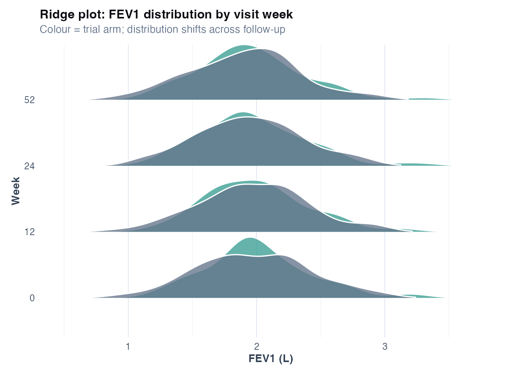
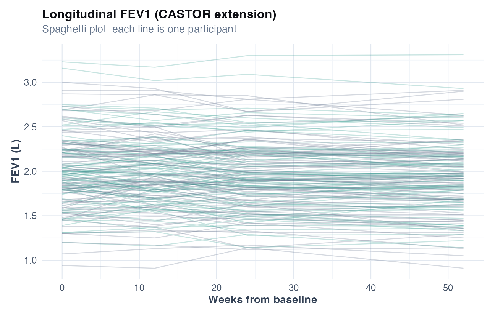
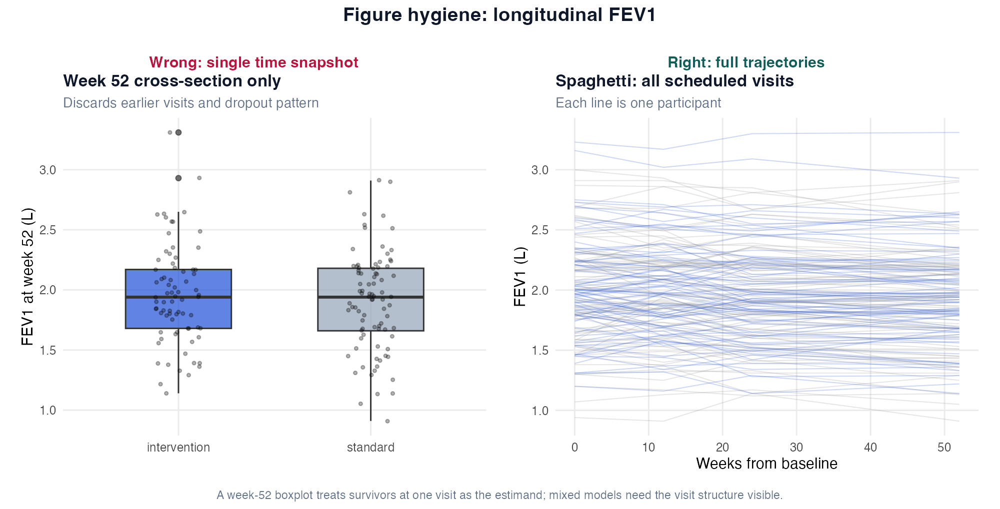
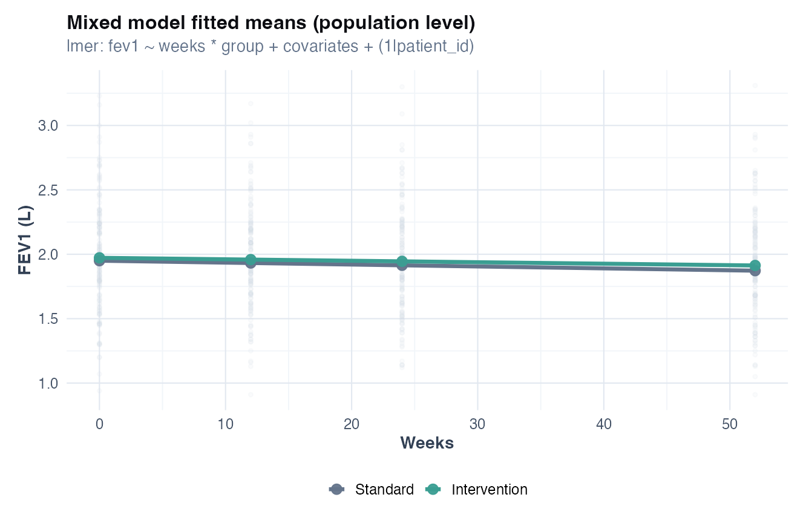

# Chapter 18: Longitudinal data and mixed models

> **Part VIII: Longitudinal, survival, and causal inference**

## Opening scene: week 52 only?

The extension study has four FEV₁ visits per patient. A collaborator pools all rows and runs a *t*-test at week 52. Mei draws spaghetti: dropout visible, slopes heterogeneous, correlation within person ignored. Mixed models use every visit without pretending rows are independent.

---

## Why this chapter

Longitudinal spirometry is the commonest place independence assumptions break. CASTOR's `longitudinal_spirometry.csv` and Case E teach trajectories, random intercepts, and when a single visit snapshot is prespecified instead. Prespecify whether the estimand is **week-52 level**, **slope**, or **change from baseline**; they answer different trial questions. Missed visits and inability to perform manoeuvres are clinical missingness (Ch 20). **Random intercept** is the minimum for repeated FEV1; a significant `weeks:group` term means **differential slope**, not automatically week-52 benefit. Stacking visits in `lm()` or Welch *t* inflates precision. Population fitted lines are **average trajectories**, not individual forecasts for clinic. In the teaching simulation, intervention **slows decline** (differential slope); the mixed-model interaction is the prespecified slope estimand, and the week-52 arm difference is obtained from $\hat\beta_{\text{group}} + 52\hat\beta_{\text{time}\times\text{group}}$.

> **Consult a statistician when:** you need random slopes, unstructured covariance, GEE vs mixed-model choice, cluster-randomised longitudinal designs, or MMRM for regulatory submission.

---

## The longitudinal workflow

Every repeated-measures analysis should follow these steps:

1. **Estimand**: mean difference at week 52? difference in **slope**? area under the curve?
2. **Visit map**: prespecified times; define time origin (randomisation vs first dose).
3. **Plot**: spaghetti or profile plot; check dropout pattern by arm.
4. **Model**: mixed model or GEE matched to estimand; random intercept at minimum.
5. **Sensitivity**: cross-sectional shortcut, complete-case visits, dropout discussion (Ch 20).
6. **Report**: participant *n*, visits per person, fixed effects with CI, not only visit *n*.

---

## When independence fails

| Design | Rows in data | Correct unit of inference | Wrong approach |
|--------|--------------|----------------------------|----------------|
| One FEV1 per patient | 160 | Patient | (none needed) |
| Four visits per patient | 640 | Patient | *t*-test on 640 rows |
| Two centres, 20 patients each | 640 | Patient (centre in model if needed) | Ignore centre |
| Bronchodilator pre/post same day | 2 per patient | Patient (paired) | Two independent groups |

**Rule:** if the same `patient_id` appears more than once, rows are **correlated**. Standard errors from ordinary `lm()` on stacked visits are often **too small** because the model treats each visit as a new person.

---

## Technique: Linear mixed model (random intercept)

A linear mixed model answers mean trajectory over time and group differences in level or slope for repeated continuous FEV1 (litres). The unit of inference is participants (*n* patients); visits are correlated. You need `patient_id`, visit time, outcome, and optional covariates in randomised or observational designs with ≥2 visits per person. Assume a linear trend in time (or splines), random intercepts ~ Normal, and discuss MAR for dropout. Fixed effects for `weeks`, `group`, and `weeks:group` give litres or litres-per-week effects. In R: `lme4::lmer(fev1 ~ weeks * group + covariates + (1 | patient_id), data)`. Use for repeated continuous outcomes; skip when one visit per person (Ch 4–5) or survival is primary (Ch 19). This does not prove causal treatment effect without randomisation, adherence, and a missing-data audit.

Ask whether the modelled gap at 52 weeks is clinically meaningful (MCID ~0.1 L in many COPD contexts). Trajectory matters more than a single visit snapshot [@cazzola2008mcid].

### Worked example (CASTOR extension)

After `source("R/examples/ch18_longitudinal_mixed_models.R")`, the mixed model reports approximately:

| Term | Estimate (L or L/week) | Plain read |
|------|------------------------|------------|
| `weeks` | −0.0015 per week | Both arms decline slightly on average |
| `groupintervention` | +0.022 at week 0 | Level at time origin (should be ~0 in well-randomised trials) |
| `weeks:groupintervention` | +0.00035 per week | Intervention associated with **less decline** per week |
| `(1 \| patient_id)` | random intercept | Each patient has their own baseline FEV1 |

The **interaction** is the prespecified estimand when the trial question is *differential slope*. The **week-52 arm difference** is $\hat\beta_{\text{group}} + 52\hat\beta_{\text{time}\times\text{group}}$ ≈ **0.040 L** in the teaching run (not the main-effect `groupintervention` coefficient alone, which is the level difference at week 0). Over 52 weeks under linearity, the interaction implies roughly $0.00035 \times 52 \approx 0.018$ L extra separation attributable to slope alone; always compare to MCID and CI.

**Sensitivity:** a cross-sectional `lm()` at week 52 (one row per patient) targets the same **week-52 level** estimand and gives a similar point estimate (~0.047 L) with comparable SE. It does **not** commit the pseudo-replication error (that error arises when **all visits are stacked** in ordinary `lm()`). The mixed model uses earlier visits to improve precision under MAR. See `ch18_sensitivity_mixed_vs_fixed.csv`.

```r
long <- readr::read_csv("data/longitudinal_spirometry.csv")
library(lme4)
fit <- lmer(
 fev1 ~ weeks * group + age + sex + smoking + (1 | patient_id),
 data = long
)
summary(fit)
```

### Random intercept and slope (extension)

Add `(weeks | patient_id)` or `(1 + weeks | patient_id)` when patients differ substantially in decline rates, but with only four time points, start with random intercept only; random slopes need more visits and stable convergence.

### GEE (population-averaged alternative)

GEE (`geepack::geeglm(fev1 ~ weeks * group, id = patient_id, corstr = "exchangeable")`) targets **marginal** (population-average) effects with robust SEs. Mixed models are **conditional** (subject-specific). Both are valid; **do not mix estimands** in the same paper without stating which you target.

### Caveats box

| Caveat | Why it matters in respiratory research |
|--------|----------------------------------------|
| Dropout / informative missingness | Sicker patients skip visits; complete-case trajectories can bias treatment effects |
| Unequal visit spacing | Irregular spirometry schedules need time variables in appropriate units |
| Learning / training effects | First post-baseline visit can differ from steady state |
| Non-linear decline | FEV1 decline may accelerate; consider splines (Ch 7) |
| Clustered centres | Patients nested in hospitals need centre random effects or robust SEs |
| Cross-sectional shortcut | Week-52 *t*-test ignores baseline and correlation |

### In practice

Week-52 t-tests on last observation carried forward still appear in extension studies. Mixed models or principled missing-data methods (Ch 20) are the defensible default when visits are scheduled.

### In practice (GEE vs mixed)

One analyst proposes GEE; another fits `lmer`. Both can be correct; they answer **slightly different estimands**. Ask: do we want **subject-specific** trajectories (mixed model) or **population-averaged** marginal effects (GEE)? For most COPD trial reports, either is acceptable if prespecified; do not swap after seeing results ([technique card below](#technique-mixed-models-vs-gee)).

### Wrong analysis ⚠

| Mistake | Why it fails | Do instead |
|---------|--------------|------------|
| *t*-test at one visit only | Discards information; wrong SEs | Mixed model on all visits |
| Pooled visits as independent rows | Pseudo-replication | `(1 \| patient_id)` random intercept |
| Change score without baseline adjustment | Noisy; regression to mean | Mixed model or ANCOVA with baseline |
| Ignore dropout pattern | Biased if missingness relates to health | Compare attenders; Ch 20 sensitivity |
| Claim causal effect from observational trajectories | Confounding by indication | State associational estimand; Ch 21 |

### Catalog of wrong analyses (longitudinal FEV1)

| Wrong analysis | Why it fails | Do instead |
|---|---|---|
| **Last observation carried forward** for dropouts | Fabricates stability | Model available data; discuss bias direction |
| **Per-visit ANOVA without patient** | Inflated *n* | Mixed model / GEE with patient cluster |
| **Plot spaghetti only, no model** | Descriptive only | Participant *n* + modelled trajectories |
| **Spline hunting** without prespecification | Overfit | Prespecify linear vs spline in protocol |

### Reporting template

> Longitudinal FEV1 (litres) was analysed in *n* = … participants contributing … visits (weeks 0, 12, 24, 52). We fitted a linear mixed model with random intercepts for patient: FEV1 ~ time × treatment + age + sex + smoking + (1\|patient). The estimated difference in slope (intervention − standard) was … L per week (95% CI …). Sensitivity analysis compared a cross-sectional model at week 52 only. Missing visits were …%.

**Results (CASTOR extension):** Among 160 participants (640 visits), mean FEV1 declined by approximately 0.0015 L per week in the standard arm (fixed effect for `weeks`). The intervention × time interaction was **0.00035 L per week** (95% CI −0.0003 to 0.0010), corresponding to a modelled **≈0.04 L** week-52 separation via $\hat\beta_{\text{group}} + 52\hat\beta_{\text{interaction}}$. Spaghetti plots showed heterogeneous trajectories; population-level fitted means are in Figure.

---

## Decision table: which longitudinal method?

*Quick lookup. For **when** and **why**, see [Method choice at a glance](#method-choice-at-a-glance) above.*

| Situation | Primary method | Chapter |
|-----------|----------------|---------|
| RCT, continuous FEV1, 2+ visits | Mixed model, random intercept | This chapter |
| Population-average estimand explicit | GEE | This chapter §GEE |
| Single post-baseline visit only | ANCOVA with baseline FEV1 | Ch 5 |
| Time to first exacerbation | Survival model | Ch 19 |
| Informative dropout suspected | Mixed model + missing-data sensitivity | Ch 20 |
| Non-linear decline prespecified | Splines in `weeks` | prespecify in SAP |

---


## R lab

```r
source("R/00_setup.R")
source("R/examples/ch18_longitudinal_mixed_models.R")
```





Each line is one participant. Use this plot to spot outliers, dropout, and whether a linear trend is plausible before trusting the mixed model.

### Figure hygiene: week-52 snapshot vs full trajectories



| Panel | Shows | Masks |
|-------|--------|-------|
| **Wrong** | Boxplot at week 52 only | Earlier visits, dropout, heterogeneous slopes |
| **Right** | Spaghetti across scheduled visits |: (motivates mixed model / GEE) |

a week-52 *t*-test figure should not be your only longitudinal slide if the estimand is change over time.



Fitted lines are **population-level** predictions (random effects set to zero), not individual patient forecasts.

**Tables:** `ch18_mixed_model_coefficients.csv`, `ch18_visit_counts_by_group.csv`, `ch18_sensitivity_mixed_vs_fixed.csv`

### Mini-lab: read the interaction

```r
coefs <- readr::read_csv(
 "volume-01/tables/ch18_mixed_model_coefficients.csv"
)
coefs %>% filter(term == "weeks:groupintervention")
```

Ask: if the interaction is positive, does intervention **slow** or **accelerate** decline relative to standard care?

### Mini-lab: week-52 shortcut vs mixed model

```r
sens <- readr::read_csv(
 "volume-01/tables/ch18_sensitivity_mixed_vs_fixed.csv"
)
sens
```

Compare `std.error` for the **week-52 contrast** across models (`intervention_vs_standard_at_week52`). Smaller SE in a model that stacks all visits without `(1|patient_id)` would suggest pseudo-replication; the week-52-only `lm()` does not stack visits.

---

## Technique: Mixed models vs GEE {#technique-mixed-models-vs-gee}

Mixed models let each patient have their own baseline FEV1 and estimate **conditional** (subject-specific) trajectories; GEE averages over patients with a chosen correlation pattern and yields **marginal** (population-averaged) coefficients. For parallel-group trials with linear FEV1 trends, both usually give **similar direction**; prespecify one primary approach in the SAP ([`geepack`](https://cran.r-project.org/package=geepack) sensitivity on the same `longitudinal_spirometry.csv`).

| | **Mixed model** | **GEE** |
|---|---|---|
| **R** | `lme4::lmer(fev1 ~ weeks * group + (1 \| patient_id))` | `geepack::geeglm(..., id = patient_id, corstr = "exchangeable")` |
| **Prefer when** | Random slopes clinically meaningful; centre random effects | Robustness to correlation misspecification; marginal estimand is target |

### Wrong analysis ⚠

| Mistake | Why it fails | Do instead |
|---------|--------------|------------|
| Stack visits in `lm()` without patient | Pseudo-replication | `(1 \| patient_id)` or GEE with `id` |
| Report only week-52 *t*-test | Discards visits | Mixed / GEE on all scheduled times |
| Switch from mixed to GEE after NS interaction | Analysis shopping | Prespecify; report sensitivity |

CASTOR script fits mixed models: `R/examples/ch18_longitudinal_mixed_models.R`.

---

## Alternatives & extensions

| Situation | Method | Note |
|-----------|--------|------|
| Marginal estimand, robust SE | **GEE** | [Mixed vs GEE](#technique-mixed-models-vs-gee) |
| Non-linear FEV1 decline | Splines in `weeks` | Prespecify knots |
| Clustered centres | `(1 \| centre)` or GEE | Multi-centre trials |
| Binary event over time | Survival model | Ch 19 |
| Informative dropout | Joint model / sensitivity | Ch 20 |

---

## Quick reference: methods in this chapter

| Method | When to use | Why |
|--------|-------------|-----|
| **Linear mixed model (random intercept)** | Repeated continuous FEV1; ≥2 visits per patient | Accounts for within-person correlation; uses all visits |
| **Random intercept + slope** | Heterogeneous decline rates across patients | Allows individual trajectories; needs enough visits |
| **GEE** | Population-averaged marginal effects; robust SE focus | Alternative estimand to subject-specific mixed model |
| **Cross-sectional *t* at one visit** | Prespecified single timepoint only (e.g. week 52) | Simpler but discards other visits; prespecify in SAP |
| **`lm()` on stacked visits** | Never as primary analysis | Pseudo-replication; SEs too small |
| **ANCOVA with baseline** | One follow-up visit + baseline FEV1 | Alternative to change score when one post-randomisation visit |
| **Spline in time** | Non-linear decline suspected | Prespecify; avoid post hoc curvature hunting ([Ch 7](07-model-building.md)) |
| **Cluster-robust SE / `(1 \| centre)`** | Multi-centre trials | Patients nested in sites |

**Extensions** (LOCF, per-visit ANOVA): [Alternatives & extensions](#alternatives--extensions) at chapter end.

---


## Exercises ([Solutions](../solutions/ch18_solutions.md))

**E18.1** Why is independence violated with repeated FEV1?

**E18.2** What does `(1|patient_id)` represent?

**E18.3** When is a week-52 *t*-test misleading compared with a mixed model?

**E18.4** If `weeks:groupintervention` is positive, how do you describe the intervention effect on **slope**?

**E18.5** Mixed model vs GEE: which estimand is population-averaged?

**Applied**

1. Run `source("R/examples/ch18_longitudinal_mixed_models.R")`.
2. Interpret `weeks:groupintervention` from the coefficient table.
3. Compare `ch18_sensitivity_mixed_vs_fixed.csv`; which SE is smaller, and why is that suspicious?
4. From the spaghetti plot, would you prespecify a random slope? Why or why not?
5. Draft one Results sentence using the reporting template.

**Capstone:** Case E in Ch 12.

---

## Where we go next

**Next:** [Chapter 19](19-survival-analysis.md) for time-to-exacerbation; [Chapter 20](20-missing-data.md) when dropout is informative.

## Related chapters

| Chapter | When to open it |
|---------|------------------|
| [Chapter 12: Case studies](12-case-studies.md#case-study-e-longitudinal-fev1--time-to-exacerbation) | Integrated CASTOR narratives A–E |
| [Chapter 19: Survival analysis](19-survival-analysis.md) | Time to exacerbation, censoring |
| [Chapter 20: Missing data](20-missing-data.md) | MAR/MNAR, MICE, sensitivity analyses |

## Handbook resources

| Resource | When to use it |
|----------|----------------|
| [Appendix B: Quick reference](../appendix-b-quick-reference.md) | Choose a test or model by outcome and design |

## Further reading

- Harrell, *Regression Modeling Strategies* [@harrell2015rms]
- Fitzmaurice, Laird & Ware, *Applied Longitudinal Analysis* (mixed models / GEE)
