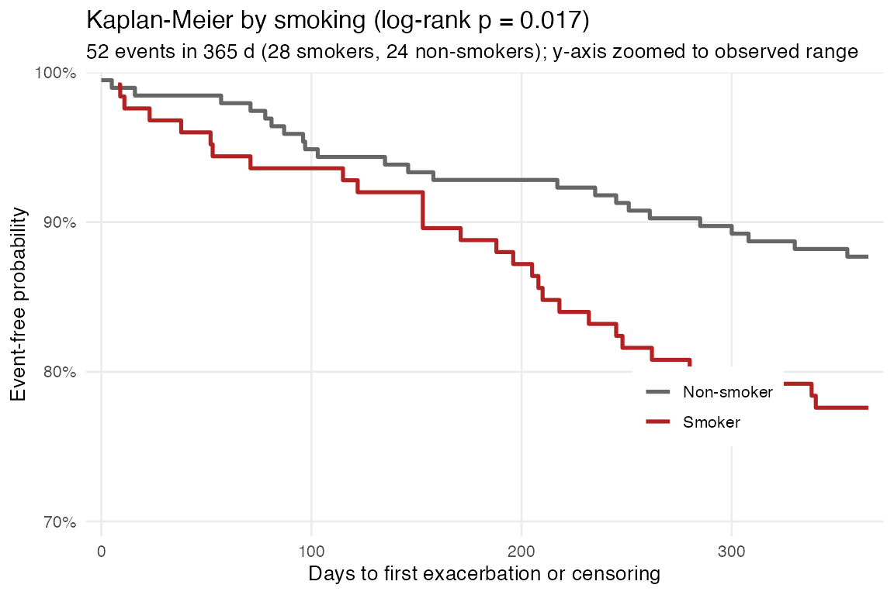
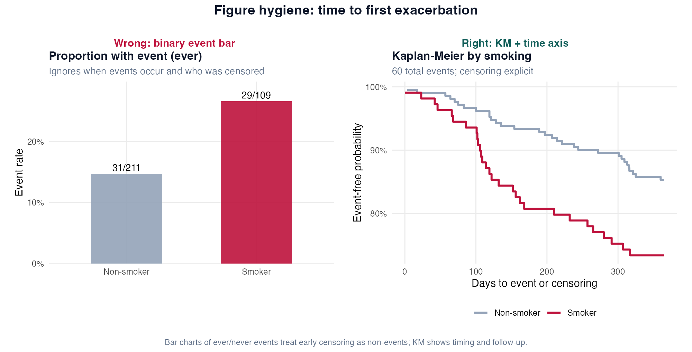
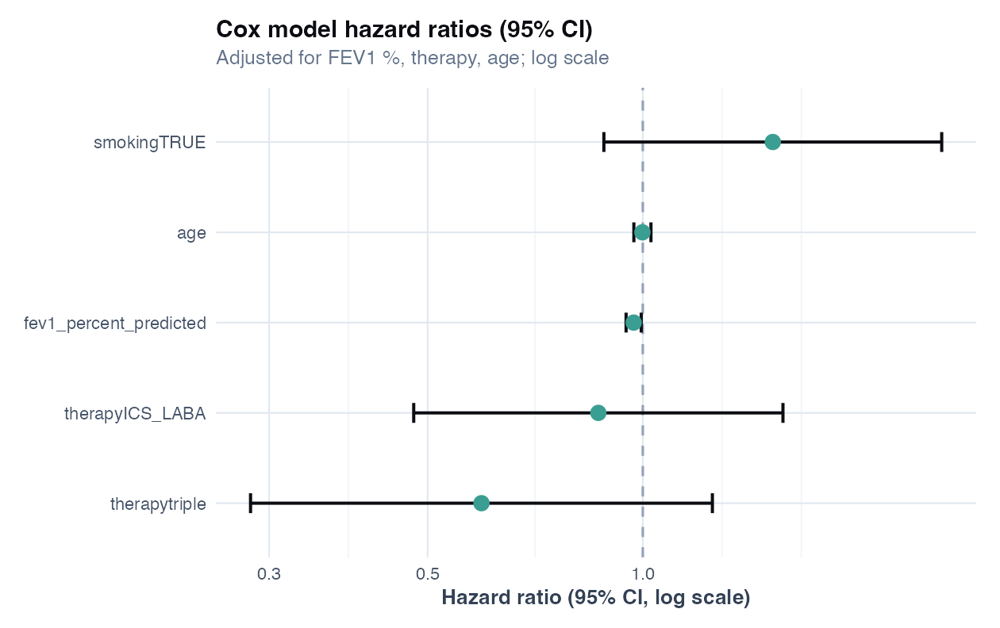

# Chapter 19: Survival analysis and time-to-event outcomes

> **Part VIII: Longitudinal, survival, and causal inference**

## Opening scene: "% with an event" on a bar chart

Twelve-month follow-up, censored at day 365, exacerbation events unevenly spaced. A bar chart of *"percent exacerbated"* throws away timing. Mei replaces it with Kaplan–Meier: curves, censoring marks, log-rank only if prespecified.

---

## Why this chapter

Time-to-event endpoints need time in the model. CASTOR's `time_to_exacerbation.csv` teaches censoring, Cox models, and why a proportion bar is the wrong plot.

> **Consult a statistician when:** you have competing events (death vs exacerbation), recurrent events, interval censoring, time-varying covariates, or fragile proportional-hazards assumptions. This chapter covers **first-event Cox** basics; not the full competing-risks literature.

---

## The survival workflow

1. **Define the event**: first moderate-to-severe exacerbation? hospitalisation? death?
2. **Time origin**: randomisation, enrolment, or first maintenance therapy?
3. **Censoring rule**: administrative cut-off (365 d), loss to follow-up, competing events?
4. **Describe follow-up**: KM curves by group; event table with *n* and % censored.
5. **Model**: Cox PH with prespecified covariates; test proportional hazards.
6. **Report**: HR + CI + events per arm + absolute risk at clinically relevant times.

---

## Core definitions (respiratory examples)

| Concept | COPD trial example | Common mistake |
|---------|-------------------|----------------|
| **Event** | First protocol-defined exacerbation | Counting recurrent events in first-event Cox |
| **Time** | Days from randomisation to event | Mixing calendar year with study day |
| **Censoring** | No event by day 365 | Coding censored patients as “no exacerbation ever” |
| **Risk set** | Patients event-free just before time *t* | Including patients after their event |
| **Hazard** | Instantaneous event rate given event-free so far | Calling hazard the same as 12-month risk |

---

## Technique: Kaplan-Meier

Kaplan-Meier estimates what fraction remain event-free over time by group using `Surv(time, event)`, the product-limit estimator for \(S(t) = P(T > t)\) with right-censored data. Report survival probabilities at prespecified times and median survival if estimable. In R: `survival::survfit(Surv(time_days, event) ~ smoking, data)` with log-rank comparison via `survdiff`. In **randomized trials**, unadjusted KM curves and log-rank by arm are **valid ITT** comparisons; covariate-adjusted Cox is optional for precision or prespecified adjustment, not automatically more valid. Use Cox when confounding control or adjusted estimands are prespecified (observational cohorts). KM does not prove causation.

Read off event-free probability at 6 and 12 months; compare arms visually before trusting a single *p*-value.

### Worked example (CASTOR extension)

Event table from `ch19_events_by_smoking.csv`:

| Smoking | *n* | Events | Censored |
|---------|-----|--------|----------|
| No | 195 | 24 | 171 |
| Yes | 125 | 28 | 97 |

Smokers have more events in a smaller group → higher event rate. Log-rank *p* ≈ 0.017 in the teaching run. The KM plot y-axis is **zoomed** to the observed range so separation is visible; with ~16% events overall, a full 0–100% axis would look nearly flat.

```r
library(survival)
surv <- readr::read_csv("data/time_to_exacerbation.csv")
fit_km <- survfit(Surv(time_days, event) ~ smoking, data = surv)
summary(fit_km, times = c(180, 365))
```

---

## Technique: Cox proportional hazards

Cox proportional hazards models the instantaneous hazard of first exacerbation adjusted for covariates, reporting hazard ratios with 95% CI. In R: `coxph(Surv(time_days, event) ~ smoking + fev1_pct + therapy + age, data)` with proportional hazards checked via `cox.zph`. Use for time-to-first-event with right censoring; avoid when competing events (death) dominate without a competing-risks model. HR > 1 means higher **rate**, not necessarily a specific absolute risk difference; report events and person-time. Cox does not prove causation.

HR > 1 for smoking means higher **rate** of first exacerbation, not necessarily a specific absolute risk difference. Report events and person-time.

### Worked example (CASTOR extension)

From `ch19_cox_hazard_ratios.csv` (approximate teaching run):

| Covariate | HR (95% CI) | Read |
|-----------|-------------|------|
| Smoking | 1.69 (0.97 to 2.97) | Higher hazard; CI includes 1 |
| FEV1 % pred | 0.98 (0.95 to 1.00) per % | Lower FEV1 → higher hazard (HR < 1 per unit increase) |

The smoking HR is **associational** in this observational extension. Wide CI reflects sparse events. Always pair with the event table above.

```r
fit_cox <- coxph(
 Surv(time_days, event) ~ smoking +
 fev1_percent_predicted + therapy + age,
 data = surv
)
summary(fit_cox)
cox.zph(fit_cox) # proportional hazards check
```

### Kaplan-Meier vs Cox vs logistic

| Method | Uses timing? | Adjusts covariates? | Output |
|--------|--------------|---------------------|--------|
| Logistic (12-month Y/N) | No | Yes | OR |
| Kaplan-Meier | Yes | No (unadjusted curves) | Survival % |
| Cox PH | Yes | Yes | HR |

If follow-up is equal and censoring is independent, a 12-month logistic model and Cox model often agree **directionally**, but Cox uses the full timeline.

### Caveats box

| Caveat | Why it matters |
|--------|----------------|
| Censoring assumed independent | Informative dropout biases HRs |
| Proportional hazards | HR interpretation fails if hazards cross |
| Sparse events | HRs unstable; report event counts |
| Competing risk of death | First exacerbation model mis-specified |
| Calendar time vs study time | Define time origin clearly (enrolment vs diagnosis) |
| HR ≠ risk difference | Common with frequent events |

### In practice

Censored patients are not “event-free forever.” Administrative censoring at 365 days must appear in the Methods; person-time and event counts belong in Results alongside any hazard ratio.

### In practice (competing risk of death)

In severe COPD, **death prevents future exacerbations**. Treating death as ordinary censoring in a Kaplan–Meier or Cox model for exacerbation can **overstate cumulative exacerbation probability** (1 − KM overestimates cumulative incidence when competing events are censored). **Cause-specific Cox** still treats competing events as censored but estimates the **cause-specific hazard** for exacerbation (what happens while patients remain alive). **Fine–Gray** models the **subdistribution hazard** and links to cumulative incidence under competing risks. Report **cumulative incidence functions (CIF)** by group when death rates differ, not hazard ratios alone.

### Wrong analysis ⚠

| Mistake | Why it fails | Do instead |
|---------|--------------|------------|
| Logistic regression ignoring follow-up time | Discards when events occur | Cox or KM |
| Treat censored subjects as “no event ever” | Understates event rate | Censor at last follow-up |
| HR reported without events / *n* | Uninterpretable precision | Events per arm + person-time |
| Ignore PH assumption | Misleading adjusted HRs | `cox.zph` diagnostic |
| Use survival for recurrent events without extension | Multiple events per patient | Recurrent-event models (advanced) |

### Catalog of wrong analyses (time-to-exacerbation)

| Analysis | Issue | When it is acceptable |
|---|---|---|
| **Fixed 12-month binary endpoint only** | Different estimand — discards **when** events occur | Prespecified risk-by-365-days endpoint (report with CI, not as time-to-event) |
| **Exclude early censoring** | Selection bias | Never for ITT-style follow-up |
| **Unadjusted KM + log-rank in RCT** | Different estimand from adjusted Cox — not invalid | **Valid** prespecified ITT comparison by randomized arm; adjusted Cox may improve precision or match SAP covariates |
| **Present HR as “% risk reduction”** without context | Misleading with frequent events | HR + absolute risks or NNT if appropriate |
| **Cox for first exacerbation; death coded as censored** | Cumulative incidence may be overstated when death is common | CIF / Fine–Gray for absolute risk; cause-specific Cox for cause-specific hazard ([below](#technique-competing-risks-death-vs-exacerbation)) |

### Reporting template

> The primary endpoint was time to first moderate-to-severe exacerbation. Patients were followed from enrolment to event or administrative censoring at 365 days. Kaplan-Meier curves compared smokers and non-smokers (log-rank *p* = …). A Cox proportional hazards model adjusted for FEV1 % predicted, therapy class, and age. The adjusted hazard ratio for smoking was … (95% CI …). There were *n* events among *N* patients (…% censored). Proportional hazards was assessed with Schoenfeld residuals (*p* = …).

---


## R lab

```r
source("R/00_setup.R")
source("R/examples/ch19_survival_analysis.R")
```



The y-axis is zoomed to the observed event-free range so curve separation is visible; with only ~50 events in 320 patients a full 0–100% scale would look nearly flat.

### Figure hygiene: event bar vs Kaplan-Meier



| Panel | Shows | Masks |
|-------|--------|-------|
| **Wrong** | Bar chart of ever/never event % | When events occur; censored follow-up |
| **Right** | KM curve with time on *x* |: (censoring explicit on step plot) |

Treating censored patients as “no event” inflates the wrong bar; KM keeps them on the risk set until censoring.



Hazard ratios compare instantaneous event rates between groups holding covariates fixed; translate to absolute risks if the trial team will act on the result.

**Tables:** `ch19_events_by_smoking.csv`, `ch19_cox_hazard_ratios.csv`, `ch19_cox_ph_test.csv`

### Mini-lab: absolute risk at 12 months

Trial teams often need absolute risks, not only HRs.

```r
library(survival)
surv <- readr::read_csv("data/time_to_exacerbation.csv")
fit <- survfit(Surv(time_days, event) ~ smoking, data = surv)
summary(fit, times = 365)
# Event-free probability at 365 d:
# 1 - S(365) ≈ cumulative event probability
```

Report absolute risk difference between groups at 365 days alongside the smoking HR.

### Mini-lab: proportional hazards

```r
ph <- readr::read_csv("volume-01/tables/ch19_cox_ph_test.csv")
ph
```

If global *p* is small, consider stratified Cox or time-varying coefficients (advanced). In teaching data, PH may hold approximately.

---

## Technique: Competing risks (death vs exacerbation) {#technique-competing-risks-death-vs-exacerbation}

When death prevents future exacerbations, distinguish **what each method estimates**:

| Method | Estimand | Competing death handled as |
|--------|----------|---------------------------|
| **Kaplan–Meier / standard Cox** (exacerbation) | Event-free survival / hazard treating death as censor | Censoring → **cumulative incidence can be overstated** |
| **Cause-specific Cox** | Cause-specific hazard of exacerbation | Censored at death (hazard while alive) |
| **Fine–Gray** | Subdistribution hazard → cumulative incidence under competing risks | Competing event in denominator |
| **CIF (Aalen–Johansen / `cmprsk`)** | Absolute probability of exacerbation by time | Direct cumulative incidence |

Use **CIF curves** and/or Fine–Gray when mortality differs by arm and absolute risk matters [@harrell2015rms]. Cause-specific Cox answers a different question (hazard while still at risk), not a shortcut fix for overstated cumulative incidence from 1 − KM. R packages: `cmprsk`, `riskRegression`, `survival` (CIF extensions). When mortality is <1% and balanced, standard Cox may suffice with a sensitivity note.

Ask for **cumulative incidence curves** by arm, not only hazard ratios, when death rates differ [@harrell2015rms].

### Wrong analysis ⚠

| Mistake | Why it fails | Do instead |
|---------|--------------|------------|
| Report 1 − KM as cumulative exacerbation risk when death is common | Death treated as censor inflates cumulative incidence | CIF or Fine–Gray; tabulate deaths by arm |
| Conflate cause-specific Cox with cumulative incidence | Cause-specific hazard ≠ absolute probability | CIF / Fine–Gray for absolute risk |
| Report HR without event types | Hides competing events | Table: exacerbations, deaths, censoring by arm |

#### Reporting template (competing risk sensitivity)

> Standard Cox models treated death as censoring. In sensitivity analyses accounting for death as a competing event, cumulative incidence of first exacerbation at 365 days was …% (intervention) vs …% (control) (Fine–Gray subdistribution HR …, 95% CI …). Event types are tabulated in Supplementary Table ….

---

## Alternatives & extensions

| Situation | Method | Note |
|-----------|--------|------|
| Competing risk (death) | Fine–Gray; cause-specific Cox; CIF | [Technique above](#technique-competing-risks-death-vs-exacerbation) |
| Recurrent exacerbations | Andersen-Gill / PWP | Not first-event Cox |
| Non-proportional hazards | Stratified Cox, splines | Check `cox.zph` |
| Discrete time | Complementary log-log | Links to Ch 6 |
| Equal follow-up, rare censoring | Logistic at fixed horizon | Simpler; loses timing detail |

---

## Quick reference: methods in this chapter

| Method | When to use | Why |
|--------|-------------|-----|
| **Kaplan-Meier + log-rank** | Compare time-to-first-event curves between groups | Uses all follow-up; handles censoring nonparametrically |
| **Cox proportional hazards** | Adjust for covariates; report hazard ratios | Standard for time-to-event with censoring; check PH assumption |
| **Logistic at fixed horizon (12 mo)** | Equal follow-up; only care about event Y/N at one date | Simpler; loses timing information |
| **Fine–Gray / competing risks** | Death prevents future exacerbations; mortality differs by arm | CIF or Fine–Gray for cumulative incidence; cause-specific Cox for cause-specific hazard |
| **Cause-specific Cox** | Mechanistic hazard while patients remain at risk | Not interchangeable with cumulative incidence |
| **Stratified Cox** | Non-proportional hazards across subgroups | When PH fails for a covariate |
| **Andersen-Gill / PWP** | **Recurrent** exacerbations (not first event only) | First-event Cox is wrong for repeats |

**Extensions:** [Alternatives & extensions](#alternatives--extensions) at chapter end.

---


## Exercises ([Solutions](../solutions/ch19_solutions.md))

**E19.1** What does censoring mean at 365 days without an event?

**E19.2** When is a hazard ratio misleading on its own?

**E19.3** What does a log-rank test compare?

**E19.4** Why report events per group in addition to HR?

**E19.5** When would you prefer Cox over 12-month logistic regression?

**Applied**

1. Run `source("R/examples/ch19_survival_analysis.R")`.
2. Report smoking HR from `ch19_cox_hazard_ratios.csv`.
3. Read `ch19_cox_ph_test.csv`: is proportional hazards plausible in this teaching run?
4. From the KM summary at 365 days, estimate absolute event risk by smoking group.
5. Draft a Results paragraph using the reporting template with CASTOR numbers.

**Capstone:** Case E in Ch 12.

---

## Where we go next

**Next:** [Chapter 20](20-missing-data.md) for spirometry missingness; [Chapter 21](21-causal-inference.md) for observational effect language.

## Related chapters

| Chapter | When to open it |
|---------|------------------|
| [Chapter 6: GLMs](06-generalized-linear-models.md) | Logistic, Poisson, count and binary outcomes |
| [Chapter 12: Case studies](12-case-studies.md#case-study-e-longitudinal-fev1--time-to-exacerbation) | Integrated CASTOR narratives A–E |

## Handbook resources

| Resource | When to use it |
|----------|----------------|
| [Appendix B: Quick reference](../appendix-b-quick-reference.md) | Choose a test or model by outcome and design |

## Further reading

- Harrell, *Regression Modeling Strategies* [@harrell2015rms]
- Therneau & Grambsch, *Modeling Survival Data* (Cox models, diagnostics)
