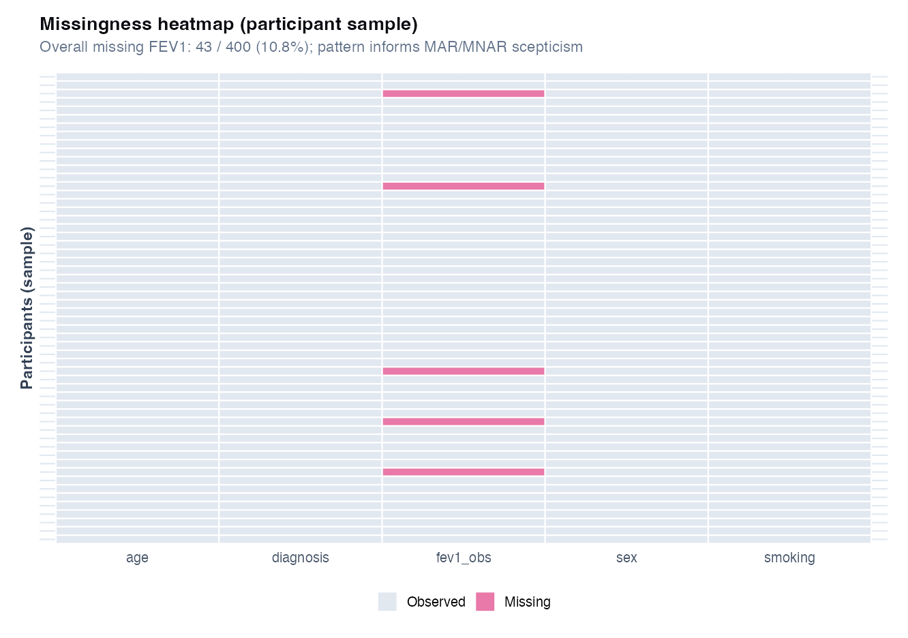
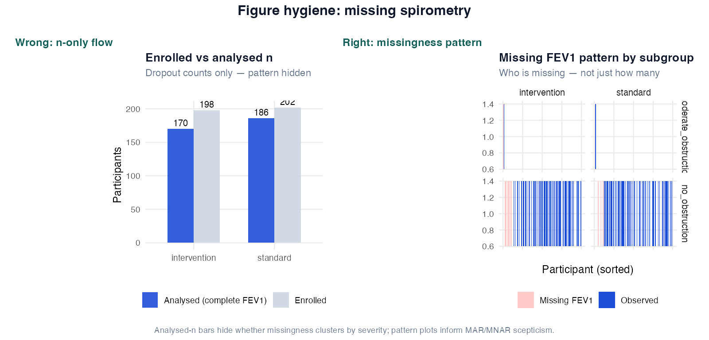
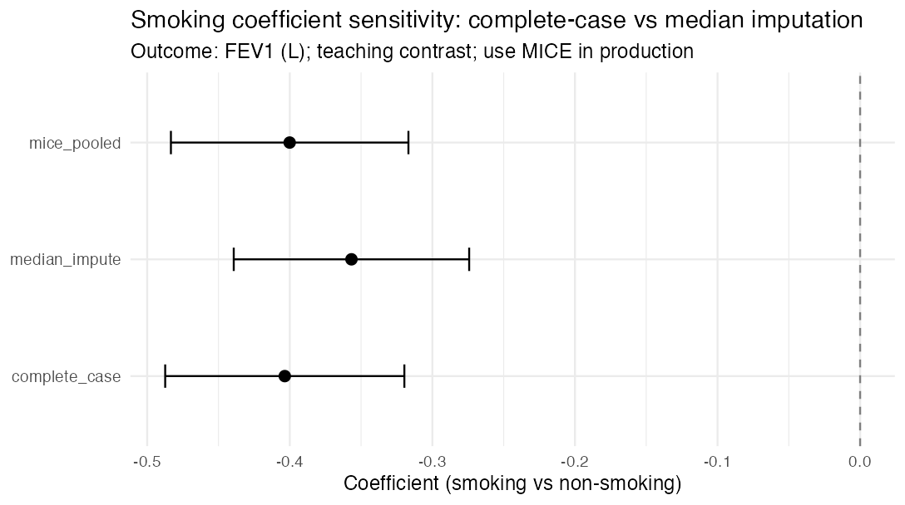
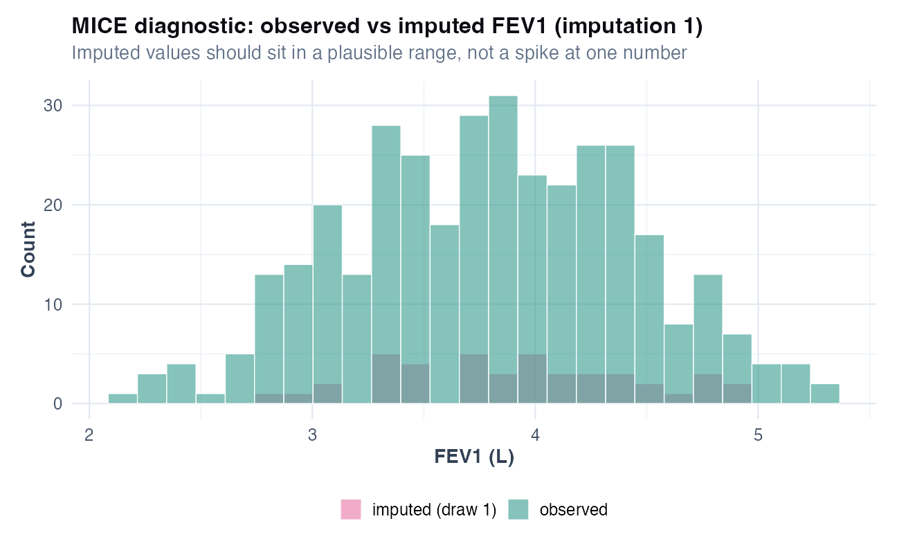

# Chapter 20: Missing data and sensitivity analysis

> **Part VIII: Longitudinal, survival, and causal inference**

## At a glance

| | |
|---|---|
| **Recurring dataset** | `data/spirometry.csv` (MAR-like missingness induced in script) |
| **Format** | Technique cards + Caveats + Wrong analysis + Reporting ([template](../CHAPTER_TEMPLATE.md)) |
| **Question** | How does missing FEV1 affect regression coefficients, and what should we report? |
| **Core methods** | MCAR/MAR/MNAR framing, complete-case, median sensitivity, **MICE + Rubin pooling** |
| **R** | `R/examples/ch20_missing_data.R` (`install.packages("mice")` for full demo) |
| **Figures** | missingness pattern (`ch20_missingness_pattern.png`), coef sensitivity (`ch20_smoking_coef_sensitivity.png`), MICE diagnostic (`ch20_mice_density.png`) |
| **Links** | [Ch 8 reporting](08-validation-reporting.md), [Ch 13 LOD](13-differential-analysis-fdr.md), [Ch 18 dropout](18-longitudinal-mixed-models.md), [Appendix D checklists](../appendix-d-missing-data-checklists.md) |
| **Exercises** | [Chapter 20 exercises](../exercises/ch20_exercises.md) |

---

## Investigator path (≈20 min)

1. [Clinical and biostatistics notes](#clinical-and-biostatistics-notes) — MCAR/MAR/MNAR in plain language
2. [Method choice at a glance](#method-choice-at-a-glance) — complete-case vs MI vs sensitivity
3. [Reporting template](#reporting-template) — enrolled vs analysed *n*
4. [Catalog of wrong analyses](#catalog-of-wrong-analyses-missing-data) — listwise deletion by default
5. [Appendix D](../appendix-d-missing-data-checklists.md) checklists

**Analyst read:** MICE workflow, R lab below.

---

## Method choice at a glance

| Method | When to use | Why |
|--------|-------------|-----|
| **Complete-case analysis** | &lt;5% missing; MCAR plausible; sensitivity only | Simple; can bias if missingness relates to severity |
| **Median / single imputation (sensitivity)** | Quick robustness check | Shows whether coefficient is stable; not production default |
| **Multiple imputation (MICE) + pool** | MAR plausible; regression inference | Rubin pooling gives valid SEs if model is correct |
| **Pattern-mixture / tipping point** | MNAR suspected (sicker patients miss visits) | Stress-tests how extreme dropout would need to be |
| **Mixed model (no explicit MI)** | Longitudinal MAR dropout | Uses all observed visits under MAR ([Ch 18](18-longitudinal-mixed-models.md)) |
| **IPW for dropout** | Informative missingness modelled | Weights complete cases; sensitivity to model |
| **MI inside CV folds** | Prediction with missing predictors ([Ch 9](09-prediction-vs-inference.md)) | Prevents leakage |
| **Per-feature rules (omics)** | Platform LOD / detection limits | Do not MI 1000+ features blindly ([Ch 13](13-differential-analysis-fdr.md)) |

**Extensions:** [Decision table](#decision-table) and [Alternatives & extensions](#alternatives--extensions) below.

---

## Learning objectives

1. Distinguish MCAR, MAR, and MNAR in plain language with respiratory examples.
2. Report *n* enrolled vs *n* analysed vs missingness by variable and subgroup.
3. Run complete-case vs imputation sensitivity and interpret bias direction.
4. Describe the MICE workflow and Rubin's pooling rules at a high level.
5. Know when multiple imputation is the production default.
6. Avoid leakage when imputing before prediction or cross-validation.

## Prerequisites

Chapters 3, 5, 8 (reporting); Ch 18 (informative dropout context).

---

## Why this chapter

Missing FEV1 is rarely random in severe COPD. Complete-case analysis can quietly describe healthier subsets. This chapter makes missingness visible in tables and figures before you defend an association.

## Opening question (CASTOR)

*Among CASTOR participants, FEV1 is missing more often in severe obstruction. If we drop those rows, does the smoking–FEV1 association change, and is that change a feature or a bug?*

Missing data is not a technical footnote. In spirometry trials and cohorts, **missing lung function often tracks disease severity**, therapy intolerance, or inability to perform the manoeuvre [@harrell2015rms].

The teaching script induces missing FEV1 related to obstruction severity (MAR-like). **43 of 400** enrolled participants lack observed FEV1 in the analysis; complete-case and median-imputation analyses give **different smoking coefficients** (−0.40 vs −0.36 L), illustrating why the analysis population must be explicit.

---

## Clinical and biostatistics notes

**Clinical:** Missing spirometry in severe COPD often reflects **inability to test**, not random noise. LOCF on FEV1 trajectories can fake stability. Structural missingness (e.g. sputum in non-producers) must not be imputed to the full cohort.

**Biostatistics:** **MAR is not testable**: defend with subject-matter reasoning. Median imputation is **sensitivity only**. Production default is **MICE + Rubin pooling** when MAR is plausible. Imputation belongs **inside CV folds** for prediction ([Ch 9](09-prediction-vs-inference.md)).

**Clinical nuance:** Table 1 should show missingness by severity and arm before the primary model is debated.

**Biostat nuance:** report enrolled *n*, analysed *n*, and sensitivity side-by-side: Appendix D checklists support DAP/manuscript sign-off.

---

## The missing-data workflow

1. **Flow diagram**: enrolled → excluded → analysed; separate from CONSORT if needed.
2. **Describe missingness**: % missing per variable; by treatment arm and severity.
3. **Mechanism**: defend MCAR/MAR/MNAR with subject-matter reasoning (not a test).
4. **Primary analysis**: complete-case or MI under stated assumptions.
5. **Sensitivity**: alternative imputation, MNAR scenarios, tipping-point (advanced).
6. **Report**: all of the above in Methods; compare key estimates in Results.

---

## Structural vs non-structural missingness

Not every empty cell should be imputed.

| Type | Plain language | Respiratory examples | Default action |
|------|----------------|----------------------|----------------|
| **Structural** | Missing by design or eligibility | Question not asked in subgroup; sputum assay only in producers; visit not scheduled | **Do not** impute into full cohort; report separately; define denominator |
| **Non-structural (random)** | Failed collection, loss to follow-up, lab failure | Missed spirometry visit; corrupted file; participant refused | Describe, model mechanism, impute or use likelihood-based method if justified |

**Handbook rule:** calculate % missing for inference using the **eligible denominator** (exclude structural missing from the “could have been observed” set). Still report structural missing counts in a separate column.

**Wrong move:** imputing sputum biomarkers for participants who cannot produce sputum as if they were MCAR across the whole cohort.

Full checklists for analysis plans and manuscripts: [Appendix D](../appendix-d-missing-data-checklists.md).

---

## Missingness thresholds (starting points, not automatic rules)

The **role** of the variable (primary outcome vs optional covariate) and the **likely mechanism** matter more than the percentage alone. Use this table to structure discussion in the analysis plan; see Appendix D for reporting templates.

| Proportion missing (non-structural) | Suggested starting interpretation |
|-------------------------------------|-----------------------------------|
| **0% to &lt;5%** | Complete-case often acceptable if not clearly differential; document missingness |
| **5% to &lt;20%** | Assess mechanism and bias; consider MI or model-based approaches for key variables |
| **20% to &lt;40%** | Complete-case alone usually insufficient for primary inference; MI, IPW, or mixed models + sensitivity |
| **40% to &lt;60%** | Interpret cautiously; imputation only if mechanism understood and rich auxiliaries exist |
| **60%+** | Avoid strong inferential claims; consider exclusion, subgroup analysis, or descriptive reporting |

Primary **outcome** missingness always needs explicit discussion and sensitivity analysis unless negligible.

---

## Longitudinal missingness: intermittent vs dropout

| Pattern | Plain language | Typical cause | Methods to consider |
|---------|----------------|---------------|---------------------|
| **Intermittent** | Gap at one visit, later visits observed | Missed clinic, interim exacerbation | Mixed models using all visits under MAR; MI optional |
| **Monotone (dropout)** | No data after a visit | Withdrawal, death, inability to continue | Mixed models, IPW for dropout, pattern-mixture sensitivity |

Under MAR, **likelihood-based mixed models** (Ch 18) often use observed outcomes without imputing missing visits. Imputation is not the automatic default for longitudinal FEV1.

Distinguish **per-protocol deletion of missed visits** (changes estimand) from principled handling under ITT.

---

## LOD, below-detection, and ordinary missingness

Proteomics and assay data conflate three different absences ([Ch 13](13-differential-analysis-fdr.md)):

| Situation | What it is | Do not |
|-----------|------------|--------|
| **True NA** | No measurement attempted or failed QC | Code as zero |
| **Below LOD** | Censored low abundance | Treat as missing without assay-aware rule |
| **Structural** | Assay not run in subgroup | Impute to full cohort |

DAPs should state LOD handling **separately** from MAR/MNAR discussion. Sensitivity across LOD/2, complete-case, and bound-respecting imputation is minimum good practice for discovery proteomics.

---

## MCAR, MAR, MNAR (respiratory vignettes)

| Mechanism | Plain definition | Respiratory example | Complete-case OK? |
|-----------|------------------|---------------------|-------------------|
| **MCAR** | Missingness unrelated to any values | Lab freezer failure on random aliquots | Often unbiased if mild |
| **MAR** | Missingness depends on **observed** data only | FEV1 missing more in severe obstruction **given** diagnosis in the chart | MI or model-based if correct |
| **MNAR** | Missingness depends on the **missing value** | Missing because FEV1 was too low to measure reliably | Dedicated sensitivity |

**MAR is not testable.** You document why it is plausible and stress-test with sensitivity analyses.

---

## Technique: Missing data analysis and multiple imputation (overview)

### Technique card

| | |
|---|---|
| **Answers** | Estimates under explicit missingness assumptions; sensitivity to those assumptions |
| **Outcome** | Any (here: continuous FEV1 in `lm`) |
| **Key quantities** | % missing per variable; enrolled *n*; analysed *n* |
| **MCAR** | Missingness unrelated to observed or unobserved values |
| **MAR** | Missingness depends on observed data only (given a rich enough model) |
| **MNAR** | Missingness depends on the unobserved value itself |
| **Teaching script** | Complete-case `lm` vs median imputation |
| **Production default** | MICE (`mice` package) + pooled estimates (Rubin's rules) when MAR is plausible |
| **R (teaching)** | `R/examples/ch20_missing_data.R` |
| **When to use** | Any non-trivial missingness in Table 1 or outcomes |
| **When NOT to use** | Single imputation without sensitivity when MNAR is plausible |
| **Does NOT prove** | That MAR holds: sensitivity and design discussion required |

### Dual interpretation

**Takeaway:** compare complete-case vs imputed FEV1; if conclusions change, missingness is driving the story (formal: MAR/MNAR assumptions matter for valid inference).

**Practice read:** if sicker patients are missing spirometry, "complete-case FEV1" may describe **healthier** subsets, not the enrolled trial population.

### Worked example (CASTOR)

From `ch20_smoking_coef_sensitivity.csv`:

| Analysis | Smoking coefficient (L) | 95% CI (approx.) |
|----------|-------------------------|------------------|
| Complete-case | −0.404 | −0.487 to −0.320 |
| Median imputation | −0.357 | −0.439 to −0.274 |
| **MICE pooled (m = 20)** | −0.400 | −0.483 to −0.317 |

Both naive approaches show smokers lower FEV1, but the **magnitude** shifts. **MICE** is the defensible primary analysis under MAR; complete-case and median imputation are **sensitivity** contrasts in this teaching script.

```r
source("R/examples/ch20_missing_data.R")
flow <- readr::read_csv("volume-01/tables/ch20_enrollment_flow.csv")
miss <- readr::read_csv(
  "volume-01/tables/ch20_missingness_by_diagnosis.csv"
)
```

### Technique: MICE (production workflow)

| Step | Action |
|------|--------|
| 1 | Specify imputation model for each variable with missing values |
| 2 | Include predictors of missingness (diagnosis, baseline FEV1, arm) |
| 3 | Create *m* imputed datasets (often 20–50) |
| 4 | Fit analysis model in each dataset |
| 5 | Pool estimates with Rubin's rules (`mice::pool`) |
| 6 | Report enrolled *n*, imputation variables, and sensitivity |

**Missing outcomes:** modern MI often **includes the outcome** in the imputation model (to preserve associations) when imputing covariates. Whether imputed outcomes enter the **final** analysis must match the estimand. For longitudinal outcomes, observed-data mixed models may be preferable to imputing outcomes directly.

**Derived variables:** recalculate BMI categories, change scores, and responder flags **after** imputation from components (passive imputation), rather than imputing the derived variable alone.

**Number of imputations:** practical minimum **m = 20** for most MI analyses; consider m at least on the order of the % of incomplete cases when missingness is moderate/high.

**Never** impute using future outcomes or test-set labels in prediction workflows (Ch 9, 17). Imputation belongs **inside** training folds.

### Imputation diagnostics (minimum)

Before trusting pooled estimates, check:

| Diagnostic | What to look for |
|------------|------------------|
| Observed vs imputed distributions | Means, medians, ranges, histograms: imputed values should be plausible |
| Clinical/biological bounds | FEV1 &gt; 0; valid categories; impossible dates |
| Convergence (MICE) | Trace plots stable across iterations |
| Association preservation | Key exposure–outcome direction unchanged vs complete-case |
| Imputation log | % imputed per variable; seed; software version |

Implausible imputations (e.g. FEV1 of 8 L in severe COPD) signal a wrong imputation model, not a successful fill.

### Caveats box

| Caveat | Why it matters in respiratory research |
|--------|----------------------------------------|
| Informative spirometry missingness | Severe dyspnoea, exacerbation, poor effort tests |
| MAR is untestable | You defend it with subject-matter reasoning + sensitivity |
| Median imputation | Shrinks variance; SEs wrong if treated as observed |
| Imputing then splitting train/test | Leakage in prediction workflows (Ch 9, 17) |
| LOCF for FEV1 trajectories | Can create false stability (Ch 18) |
| MNAR for death/discontinuation | Requires dedicated models, not silent deletion |

### In practice

“No missing data” sometimes means missing was coded as zero or carried forward. Audit the raw CRF before trusting `complete.cases()`.

### In practice (SAP language)

The analysis plan says “complete cases.” Translators for the DSMB: report enrolled *n*, analysed *n*, and reasons excluded in one sentence before any coefficient. If missing differs by arm, complete-case is already a **treatment-dependent** selection; flag it before unblinding.

### In practice (longitudinal dropout)

Missed spirometry visits in extension trials are often **MAR** (sicker patients skip) or **MNAR** (cannot perform manoeuvre). A mixed model on observed visits is not a free pass; compare complete-case, available-case, and prespecified sensitivity ([Ch 18](18-longitudinal-mixed-models.md), [Ch 21](21-causal-inference.md) IPW pointer).

### Wrong analysis ⚠

| Mistake | Why it fails | Do instead |
|---------|--------------|------------|
| Drop missing without table | Hides selection | Report missing % by arm/severity |
| Listwise deletion as default | Biased under MAR/MNAR | MI or principled model |
| Single imputation, ignore uncertainty | SEs too small | MICE + Rubin pooling |
| Impute using future/outcome information | Leakage | Imputation model uses only past/ baseline covariates per protocol |
| "No missing data" when LOCF used | Hidden imputation | State imputation rule explicitly |
| Structural missingness imputed like MCAR | Wrong estimand and population | Separate structural from random missing; define denominator |
| Below-LOD coded as zero | Artificial group differences | Assay-aware handling ([Ch 13](13-differential-analysis-fdr.md)) |

### Sensitivity analysis menu

When missingness is moderate/high, outcome-related, or plausibly MNAR, compare the primary analysis to one or more of:

- complete-case analysis;
- available-case descriptives;
- alternative imputation model or fewer/more imputations;
- observed-outcome mixed model (longitudinal);
- IPW for dropout or visit attendance (Ch 21);
- MNAR scenario, delta adjustment, or tipping-point analysis (advanced).

If conclusions **change materially**, report that uncertainty explicitly: do not report only the favourable analysis.

### Catalog of wrong analyses (missing data)

| Wrong analysis | Why it fails | Do instead |
|---|---|---|
| **Per-protocol deletion of missed visits** without estimand | Changes population | Align with ITT or prespecified estimand |
| **Replace missing FEV1 with 0** | Meaningless scale abuse | Model missingness or impute within plausible range |
| **Complete-case ML with 40% missing predictors** | Biased + overfit | MI inside CV folds |
| **"Sensitivity analysis: repeat without missing"** only | One-direction sensitivity | Multiple plausible MNAR scenarios |

### Reporting template

> Of *N* = … participants enrolled, *n* = … had observed FEV1 at the analysis visit (…% missing). Missingness differed by obstruction severity (Figure). The primary model used … (complete-case / multiple imputation with *m* = … imputations). Variables in the imputation model were …. Pooled estimates for smoking were … (95% CI …). Results were similar / materially changed in complete-case analysis (Table).

**STROBE-style checklist (missing data):**

- Number with missing outcome and/or covariates, by group
- Reasons for missing if collected
- Assumed mechanism (MCAR/MAR/MNAR) with justification
- How missing values were handled in each analysis
- Sensitivity analyses performed

---

## Decision table

*Quick lookup. For **when** and **why**, see [Method choice at a glance](#method-choice-at-a-glance) above.*

| Situation | Approach | Chapter |
|-----------|----------|---------|
| Structural missing (subgroup assay) | Define eligible *n*; no cohort-wide imputation | This chapter; [Appendix D](../appendix-d-missing-data-checklists.md) |
| &lt;5% missing, MCAR plausible | Complete-case + document | This chapter |
| MAR, regression inference | MICE + pool + diagnostics | This chapter |
| Longitudinal intermittent/dropout | Mixed model; IPW sensitivity | Ch 18, 21 |
| Prediction with missing predictors | MI inside CV | Ch 9, 17 |
| Omics feature missingness | QC filter; per-feature rules; not generic MI on 1000+ features | Ch 13 |
| Below-LOD proteomics | Separate from NA; sensitivity analysis | Ch 13 |
| MNAR suspected (severity) | Pattern-mixture / tipping point | Advanced |

---

## High-dimensional and multi-centre notes

**Omics:** standard MI on thousands of features with small *n* is often unstable. Prefer platform QC, feature filtering by detection rate, batch-aware models ([Ch 14](14-batch-effects.md)), and sensitivity with/without imputation. Treat heavy imputation in discovery as a **robustness check**, not the only analysis.

**Multi-centre studies:** if core covariates (age, sex, site) are imputed for consortium-wide use, prefer a **documented central pipeline** with raw and imputed layers clearly labelled (`_imp` suffix or separate file). Analysts should not silently overwrite raw values. Details: [Appendix D](../appendix-d-missing-data-checklists.md).

---


## R lab

```r
source("R/00_setup.R")
source("R/examples/ch20_missing_data.R")
```



Higher missingness in severe obstruction supports MAR-like missingness tied to observed severity, not random noise.

### Figure hygiene: analysed *n* vs missingness pattern



| Panel | Shows | Masks |
|-------|--------|-------|
| **Wrong** | Enrolled vs analysed *n* bars only | **Who** is missing and whether pattern clusters |
| **Right** | Missingness strip by diagnosis × arm | — (informs MAR/MNAR scepticism) |

**Practice read:** if analysed *n* drops mainly in severe obstruction, complete-case regression is not a neutral default.



A large shift between complete-case and single imputation suggests the missingness mechanism matters. Report both, not only the nicer estimate.

**Tables:** `ch20_enrollment_flow.csv`, `ch20_missingness_by_diagnosis.csv`, `ch20_smoking_coef_sensitivity.csv`

### Mini-lab: MICE (production)

Requires `install.packages("mice")`. The chapter script fits **m = 20** imputations, pools `lm(fev1_obs ~ smoking + age + sex)`, and writes `ch20_mice_density.png`.

```r
source("R/00_setup.R")
source("R/examples/ch20_missing_data.R")

readr::read_csv("volume-01/tables/ch20_smoking_coef_sensitivity.csv")
```

```r
# Reproduce pooling step only (after mice installed):
library(tidyverse)
library(mice)
library(broom)

spirometry <- readr::read_csv(
  "data/spirometry.csv",
  show_col_types = FALSE
)
set.seed(20250618)
spirometry_miss <- spirometry %>%
  mutate(
    missing_fev1 = rbinom(
      n(), 1,
      prob = plogis(-2 + 0.8 * (diagnosis != "no_obstruction"))
    ) == 1,
    fev1_obs = if_else(missing_fev1, NA_real_, fev1),
    diagnosis = factor(diagnosis),
    sex = factor(sex),
    smoking = factor(smoking)
  )

imp_df <- spirometry_miss %>%
  select(fev1_obs, age, sex, smoking, diagnosis)
imp <- mice(
  imp_df,
  m = 20,
  maxit = 5,
  printFlag = FALSE,
  seed = 20250618
)
pooled <- mice::pool(with(imp, lm(fev1_obs ~ smoking + age + sex)))
summary(pooled)
```

Use an imputation model that includes predictors of missingness (e.g. `diagnosis`) but avoid outcome leakage per study protocol.



Imputed draws should spread across a plausible FEV1 range: a single spike at the median signals a too-simple imputation rule.

### Mini-lab: enrollment flow

```r
readr::read_csv("volume-01/tables/ch20_enrollment_flow.csv")
```

Every paper should state enrolled *n* and analysed *n* explicitly.

---

## Alternatives & extensions

| Situation | Method | Note |
|-----------|--------|------|
| Longitudinal dropout | Mixed model / joint model | Ch 18 + sensitivity |
| MNAR for spirometry | Pattern-mixture / selection models | Expert sensitivity |
| Prediction with missing predictors | MI inside resampling | Ch 9, 17 |
| Single missing covariate, few missing | Firth / exact methods | Ch 6 sparse events |

---

## Exercises ([Solutions](../solutions/ch20_solutions.md))

**E20.1** Define MAR in one sentence.

**E20.2** Why is complete-case analysis risky when missingness relates to obstruction severity?

**E20.3** Why is median imputation inadequate as a final analysis?

**E20.4** What should appear in a CONSORT/STROBE flow diagram regarding missing data?

**E20.5** Why must imputation be inside CV folds for prediction (Ch 9)?

**E20.6** Give one example of structural missingness in respiratory research. Should it be imputed?

**Applied**

1. Run `source("R/examples/ch20_missing_data.R")`.
2. Report enrolled vs analysed *n* from `ch20_enrollment_flow.csv`.
3. Compare smoking coefficients in `ch20_smoking_coef_sensitivity.csv`.
4. From the missingness figure, argue MAR vs MNAR in one paragraph.
5. List variables you would include in a MICE imputation model for CASTOR FEV1.

---

## Where this chapter leads

**Next:** [Chapter 21](21-causal-inference.md) for confounding and IPW. Revisit [Chapter 18](18-longitudinal-mixed-models.md) if missing visits drove the sensitivity analysis. For DAP and manuscript checklists, use [Appendix D](../appendix-d-missing-data-checklists.md).

## Further reading

- Harrell, *Regression Modeling Strategies* (missing data chapter) [@harrell2015rms]
- van Buuren, *Flexible Imputation of Missing Data* (MICE)
- STROBE and CONSORT extensions for missing data in observational and trial reporting [@vonelm2007strobe; @schulz2010consort]
