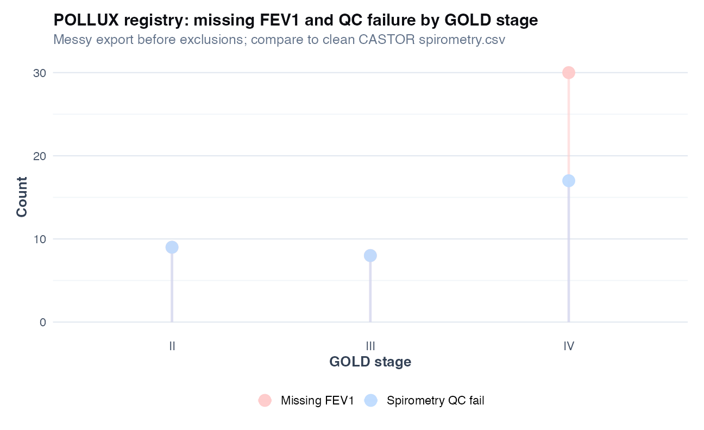

# Chapter 20: Missing data and sensitivity analysis

> **Part VIII: Longitudinal, survival, and causal inference**

## Opening scene: twelve percent missing FEV₁

Week-12 spirometry missing for forty-eight participants, clinic closure, COVID, plain refusal. ITT says analyse everyone randomised. Mei maps missingness by arm and diagnosis before choosing complete-case, multiple imputation, or a principled sensitivity.

---

## Why this chapter

Missing data is where ITT meets reality. This chapter connects patterns, mechanisms, and sensitivity, so missingness is a result, not a footnote. Missing spirometry in severe COPD often reflects **inability to test**, not random noise; LOCF on FEV1 trajectories can fake stability. Structural missingness (e.g. sputum in non-producers) must not be imputed to the full cohort. **MAR is not testable**, defend with subject-matter reasoning. Median imputation is **sensitivity only**; **multiple imputation (MICE) with Rubin pooling** is a common principled option under MAR, alongside likelihood-based mixed models, controlled MI, IPW, and pattern-mixture approaches depending on estimand. Imputation belongs **inside CV folds** for prediction (Ch 9). Table 1 should show missingness by severity and arm before the primary model is debated; report enrolled *n*, analysed *n*, and sensitivity side-by-side (Appendix D checklists support DAP/manuscript sign-off).

> **Consult a statistician when:** MNAR tipping-point analysis, joint modelling of dropout, pattern-mixture models, or imputation in cluster/survival settings is on the SAP. This chapter teaches **describe → assume → sensitivity**; not every missing-data method.

---

## The missing-data workflow

1. **Flow diagram**: enrolled → excluded → analysed; separate from CONSORT if needed.
2. **Describe missingness**: % missing per variable; by treatment arm and severity.
3. **Mechanism**: defend MCAR/MAR/MNAR with subject-matter reasoning (not a test).
4. **Primary analysis**: complete-case or MI under stated assumptions.
5. **Sensitivity**: alternative imputation, MNAR scenarios, tipping-point (advanced).
6. **Report**: all of the above in Methods; compare key estimates in Results.

---

## Structural vs non-structural missingness

Not every empty cell should be imputed.

| Type | Plain language | Respiratory examples | Default action |
|------|----------------|----------------------|----------------|
| **Structural** | Missing by design or eligibility | Question not asked in subgroup; sputum assay only in producers; visit not scheduled | **Do not** impute into full cohort; report separately; define denominator |
| **Non-structural (random)** | Failed collection, loss to follow-up, lab failure | Missed spirometry visit; corrupted file; participant refused | Describe, model mechanism, impute or use likelihood-based method if justified |

**Handbook rule:** calculate % missing for inference using the **eligible denominator** (exclude structural missing from the “could have been observed” set). Still report structural missing counts in a separate column.

**Wrong move:** imputing sputum biomarkers for participants who cannot produce sputum as if they were MCAR across the whole cohort.

Full checklists for analysis plans and manuscripts: Appendix D.

---

## Missingness thresholds (starting points, not automatic rules)

The **role** of the variable (primary outcome vs optional covariate) and the **likely mechanism** matter more than the percentage alone. Use this table to structure discussion in the analysis plan; see Appendix D for reporting templates.

| Proportion missing (non-structural) | Suggested starting interpretation |
|-------------------------------------|-----------------------------------|
| **0% to &lt;5%** | Complete-case often acceptable if not clearly differential; document missingness |
| **5% to &lt;20%** | Assess mechanism and bias; consider MI or model-based approaches for key variables |
| **20% to &lt;40%** | Complete-case alone usually insufficient for primary inference; MI, IPW, or mixed models + sensitivity |
| **40% to &lt;60%** | Interpret cautiously; imputation only if mechanism understood and rich auxiliaries exist |
| **60%+** | Avoid strong inferential claims; consider exclusion, subgroup analysis, or descriptive reporting |

Primary **outcome** missingness always needs explicit discussion and sensitivity analysis unless negligible.

---

## Longitudinal missingness: intermittent vs dropout

| Pattern | Plain language | Typical cause | Methods to consider |
|---------|----------------|---------------|---------------------|
| **Intermittent** | Gap at one visit, later visits observed | Missed clinic, interim exacerbation | Mixed models using all visits under MAR; MI optional |
| **Monotone (dropout)** | No data after a visit | Withdrawal, death, inability to continue | Mixed models, IPW for dropout, pattern-mixture sensitivity |

Under MAR, **likelihood-based mixed models** (Ch 18) often use observed outcomes without imputing missing visits. Imputation is not the automatic default for longitudinal FEV1.

Distinguish **per-protocol deletion of missed visits** (changes estimand) from principled handling under ITT.

---

## LOD, below-detection, and ordinary missingness

Proteomics and assay data conflate three different absences (Ch 13):

| Situation | What it is | Do not |
|-----------|------------|--------|
| **True NA** | No measurement attempted or failed QC | Code as zero |
| **Below LOD** | Censored low abundance | Treat as missing without assay-aware rule |
| **Structural** | Assay not run in subgroup | Impute to full cohort |

DAPs should state LOD handling **separately** from MAR/MNAR discussion. Sensitivity across LOD/2, complete-case, and bound-respecting imputation is minimum good practice for discovery proteomics.

---

## MCAR, MAR, MNAR (respiratory vignettes)

| Mechanism | Plain definition | Respiratory example | Complete-case OK? |
|-----------|------------------|---------------------|-------------------|
| **MCAR** | Missingness unrelated to any values | Lab freezer failure on random aliquots | Often unbiased if mild |
| **MAR** | Missingness depends on **observed** data only | FEV1 missing more in severe obstruction **given** diagnosis in the chart | MI or model-based if correct |
| **MNAR** | Missingness depends on the **missing value** | Missing because FEV1 was too low to measure reliably | Dedicated sensitivity |

**MAR is not testable.** You document why it is plausible and stress-test with sensitivity analyses.

---

## Technique: Missing data analysis and multiple imputation (overview)

Missing-data analysis produces estimates under explicit assumptions and stress-tests them with sensitivity analyses. Key quantities are % missing per variable, enrolled *n*, and analysed *n*. **MCAR** means missingness is unrelated to any values; **MAR** means it depends on observed data only; **MNAR** means it depends on the missing value itself. The teaching script contrasts complete-case `lm` vs median imputation; **MICE** (`mice` package) with Rubin pooling is the worked MAR example when MAR is plausible. Use whenever Table 1 or outcomes have non-trivial missingness; never treat single imputation as final when MNAR is plausible. MAR assumptions are not provable, sensitivity and design discussion are required.

If sicker patients are missing spirometry, "complete-case FEV1" may describe **healthier** subsets, not the enrolled trial population.

### Worked example (CASTOR)

From `ch20_smoking_coef_sensitivity.csv`:

| Analysis | Smoking coefficient (L) | 95% CI (approx.) |
|----------|-------------------------|------------------|
| Complete-case | −0.404 | −0.487 to −0.320 |
| Median imputation | −0.357 | −0.439 to −0.274 |
| **MICE pooled (m = 20)** | −0.400 | −0.483 to −0.317 |

Both naive approaches show smokers lower FEV1, but the **magnitude** shifts. **Median imputation** uses the median of **observed** FEV1 only (`median(fev1_obs, na.rm = TRUE)`), never the complete simulated values that would be unknown in real data. **MICE** is the defensible primary **MAR sensitivity** in this teaching script under stated assumptions; complete-case and median imputation are **contrasts**. In production, prespecify whether MICE, mixed models, or other MAR/MNAR methods match the estimand.

```r
source("R/examples/ch20_missing_data.R")
flow <- readr::read_csv("volume-01/tables/ch20_enrollment_flow.csv")
miss <- readr::read_csv(
 "volume-01/tables/ch20_missingness_by_diagnosis.csv"
)
```

### Extension: POLLUX registry missingness

CASTOR missingness is MAR-leaning by simulation. **POLLUX** (`pollux_registry_messy.csv`) adds QC failure and higher missing FEV1 in GOLD IV:

```r
source("R/examples/pollux_clean_registry.R")
readr::read_csv("volume-01/tables/pollux_missingness_by_gold.csv")
```

Compare enrolled *n* to analysis-ready *n* in `pollux_enrollment_flow.csv` before interpreting any complete-case model. Discuss MNAR if severity predicts both missing FEV1 and outcomes.



### MICE (worked MAR example)

Specify an imputation model for each variable with missing values, including predictors of missingness (diagnosis, baseline FEV1, arm). Create *m* imputed datasets (often 20–50), fit the analysis model in each, and pool with Rubin's rules (`mice::pool`). Report enrolled *n*, imputation variables, and sensitivity.

**Inferential MI (association / trial estimands):** include the **analysis outcome** in the imputation model when imputing covariates — this is standard MAR practice, not “leakage” [@vanbuuren2011mice]. Recalculate derived variables (BMI, change scores) **after** imputation.

**Predictive MI (Ch 9, 17):** fit imputation **inside training folds only**; never use test-set labels or future outcomes when building deployment pipelines.

### Imputation diagnostics (minimum)

Before trusting pooled estimates, check:

| Diagnostic | What to look for |
|------------|------------------|
| Observed vs imputed distributions | Means, medians, ranges, histograms: imputed values should be plausible |
| Clinical/biological bounds | FEV1 &gt; 0; valid categories; impossible dates |
| Convergence (MICE) | Trace plots stable across iterations |
| Association preservation | Key exposure–outcome direction unchanged vs complete-case |
| Imputation log | % imputed per variable; seed; software version |

Implausible imputations (e.g. FEV1 of 8 L in severe COPD) signal a wrong imputation model, not a successful fill.

### Caveats box

| Caveat | Why it matters in respiratory research |
|--------|----------------------------------------|
| Informative spirometry missingness | Severe dyspnoea, exacerbation, poor effort tests |
| MAR is untestable | You defend it with subject-matter reasoning + sensitivity |
| Median imputation | Shrinks variance; SEs wrong if treated as observed |
| Imputing then splitting train/test | Leakage in **prediction** workflows (Ch 9, 17) |
| Outcome in inferential MI | Expected under MAR when imputing covariates — not prediction leakage |
| LOCF for FEV1 trajectories | Can create false stability (Ch 18) |
| MNAR for death/discontinuation | Requires dedicated models, not silent deletion |

### In practice

“No missing data” sometimes means missing was coded as zero or carried forward. Audit the raw CRF before trusting `complete.cases()`.

### In practice (SAP language)

The analysis plan says “complete cases.” Translators for the DSMB: report enrolled *n*, analysed *n*, and reasons excluded in one sentence before any coefficient. If missing differs by arm, complete-case is already a **treatment-dependent** selection; flag it before unblinding.

### In practice (longitudinal dropout)

Missed spirometry visits in extension trials are often **MAR** (sicker patients skip) or **MNAR** (cannot perform manoeuvre). A mixed model on observed visits is not a free pass; compare complete-case, available-case, and prespecified sensitivity (Ch 18, Ch 21 IPW pointer).

### Wrong analysis ⚠

| Mistake | Why it fails | Do instead |
|---------|--------------|------------|
| Drop missing without table | Hides selection | Report missing % by arm/severity |
| Listwise deletion as default | Biased under MAR/MNAR | MI or principled model |
| Single imputation, ignore uncertainty | SEs too small | MICE + Rubin pooling |
| Impute using future/outcome information | Leakage | Imputation model uses only past/ baseline covariates per protocol |
| "No missing data" when LOCF used | Hidden imputation | State imputation rule explicitly |
| Structural missingness imputed like MCAR | Wrong estimand and population | Separate structural from random missing; define denominator |
| Below-LOD coded as zero | Artificial group differences | Assay-aware handling (Ch 13) |

### Sensitivity analysis menu

When missingness is moderate/high, outcome-related, or plausibly MNAR, compare the primary analysis to one or more of:

- complete-case analysis;
- available-case descriptives;
- alternative imputation model or fewer/more imputations;
- observed-outcome mixed model (longitudinal);
- IPW for dropout or visit attendance (Ch 21);
- MNAR scenario, delta adjustment, or tipping-point analysis (advanced).

If conclusions **change materially**, report that uncertainty explicitly: do not report only the favourable analysis.

### Catalog of wrong analyses (missing data)

| Wrong analysis | Why it fails | Do instead |
|---|---|---|
| **Per-protocol deletion of missed visits** without estimand | Changes population | Align with ITT or prespecified estimand |
| **Replace missing FEV1 with 0** | Meaningless scale abuse | Model missingness or impute within plausible range |
| **Complete-case ML with 40% missing predictors** | Biased + overfit | MI inside CV folds |
| **"Sensitivity analysis: repeat without missing"** only | One-direction sensitivity | Multiple plausible MNAR scenarios |

### Reporting template

> Of *N* = … participants enrolled, *n* = … had observed FEV1 at the analysis visit (…% missing). Missingness differed by obstruction severity (Figure). The primary model used … (complete-case / multiple imputation with *m* = … imputations). Variables in the imputation model were …. Pooled estimates for smoking were … (95% CI …). Results were similar / materially changed in complete-case analysis (Table).

**STROBE-style checklist (missing data):**

- Number with missing outcome and/or covariates, by group
- Reasons for missing if collected
- Assumed mechanism (MCAR/MAR/MNAR) with justification
- How missing values were handled in each analysis
- Sensitivity analyses performed

---

## Decision table

*Quick lookup. For **when** and **why**, see [Method choice at a glance](#method-choice-at-a-glance) above.*

| Situation | Approach | Chapter |
|-----------|----------|---------|
| Structural missing (subgroup assay) | Define eligible *n*; no cohort-wide imputation | This chapter; Appendix D |
| &lt;5% missing, MCAR plausible | Complete-case + document | This chapter |
| MAR, regression inference | MICE + pool + diagnostics | This chapter |
| Longitudinal intermittent/dropout | Mixed model; IPW sensitivity | Ch 18, 21 |
| Prediction with missing predictors | MI inside CV | Ch 9, 17 |
| Omics feature missingness | QC filter; per-feature rules; not generic MI on 1000+ features | Ch 13 |
| Below-LOD proteomics | Separate from NA; sensitivity analysis | Ch 13 |
| MNAR suspected (severity) | Pattern-mixture / tipping point | Advanced |

---

## High-dimensional and multi-centre notes

**Omics:** standard MI on thousands of features with small *n* is often unstable. Prefer platform QC, feature filtering by detection rate, batch-aware models (Ch 14), and sensitivity with/without imputation. Treat heavy imputation in discovery as a **robustness check**, not the only analysis.

**Multi-centre studies:** if core covariates (age, sex, site) are imputed for consortium-wide use, prefer a **documented central pipeline** with raw and imputed layers clearly labelled (`_imp` suffix or separate file). Analysts should not silently overwrite raw values. Details: Appendix D.

---


## R lab

```r
source("R/00_setup.R")
source("R/examples/ch20_missing_data.R")
```


Higher missingness in severe obstruction supports MAR-like missingness tied to observed severity, not random noise.

### Figure hygiene: analysed *n* vs missingness pattern


| Panel | Shows | Masks |
|-------|--------|-------|
| **Wrong** | Enrolled vs analysed *n* bars only | **Who** is missing and whether pattern clusters |
| **Right** | Missingness strip by diagnosis × arm |: (informs MAR/MNAR scepticism) |

If analysed *n* drops mainly in severe obstruction, complete-case regression is not a neutral default.


A large shift between complete-case and single imputation suggests the missingness mechanism matters. Report both, not only the nicer estimate.

**Tables:** `ch20_enrollment_flow.csv`, `ch20_missingness_by_diagnosis.csv`, `ch20_smoking_coef_sensitivity.csv`

### Mini-lab: MICE (MAR example)

Requires `install.packages("mice")`. The chapter script fits **m = 20** imputations, pools `lm(fev1_obs ~ smoking + age + sex)`, and writes `ch20_mice_density.png`.

```r
source("R/00_setup.R")
source("R/examples/ch20_missing_data.R")

readr::read_csv("volume-01/tables/ch20_smoking_coef_sensitivity.csv")
```

```r
# Reproduce pooling step only (after mice installed):
library(tidyverse)
library(mice)
library(broom)

spirometry <- readr::read_csv(
 "data/spirometry.csv",
 show_col_types = FALSE
)
set.seed(20250618)
spirometry_miss <- spirometry %>%
 mutate(
 missing_fev1 = rbinom(
 n(), 1,
 prob = plogis(-2 + 0.8 * (diagnosis != "no_obstruction"))
 ) == 1,
 fev1_obs = if_else(missing_fev1, NA_real_, fev1),
 diagnosis = factor(diagnosis),
 sex = factor(sex),
 smoking = factor(smoking)
 )

imp_df <- spirometry_miss %>%
 select(fev1_obs, age, sex, smoking, diagnosis)
imp <- mice(
 imp_df,
 m = 20,
 maxit = 5,
 printFlag = FALSE,
 seed = 20250618
)
pooled <- mice::pool(with(imp, lm(fev1_obs ~ smoking + age + sex)))
summary(pooled)
```

Use an imputation model that includes predictors of missingness (e.g. `diagnosis`) but avoid outcome leakage per study protocol.


Imputed draws should spread across a plausible FEV1 range: a single spike at the median signals a too-simple imputation rule.

### Mini-lab: enrollment flow

```r
readr::read_csv("volume-01/tables/ch20_enrollment_flow.csv")
```

Every paper should state enrolled *n* and analysed *n* explicitly.

---

## Alternatives & extensions

| Situation | Method | Note |
|-----------|--------|------|
| Longitudinal dropout | Mixed model / joint model | Ch 18 + sensitivity |
| MNAR for spirometry | Pattern-mixture / selection models | Expert sensitivity |
| Prediction with missing predictors | MI inside resampling | Ch 9, 17 |
| Single missing covariate, few missing | Firth / exact methods | Ch 6 sparse events |

---

## Quick reference: methods in this chapter

| Method | When to use | Why |
|--------|-------------|-----|
| **Complete-case analysis** | &lt;5% missing; MCAR plausible; sensitivity only | Simple; can bias if missingness relates to severity |
| **Median / single imputation (sensitivity)** | Quick robustness check | Shows whether coefficient is stable; not production default |
| **Multiple imputation (MICE) + pool** | MAR plausible; regression inference | Rubin pooling gives valid SEs if model is correct |
| **Pattern-mixture / tipping point** | MNAR suspected (sicker patients miss visits) | Stress-tests how extreme dropout would need to be |
| **Mixed model (no explicit MI)** | Longitudinal MAR dropout | Uses all observed visits under MAR ([Ch 18](18-longitudinal-mixed-models.md)) |
| **IPW for dropout** | Informative missingness modelled | Weights complete cases; sensitivity to model |
| **MI inside CV folds** | Prediction with missing predictors ([Ch 9](09-prediction-vs-inference.md)) | Prevents leakage |
| **Per-feature rules (omics)** | Platform LOD / detection limits | Do not MI 1000+ features blindly ([Ch 13](13-differential-analysis-fdr.md)) |

**Extensions:** [Decision table](#decision-table) and [Alternatives & extensions](#alternatives--extensions) below.

---


## Exercises ([Solutions](../solutions/ch20_solutions.md))

**E20.1** Define MAR in one sentence.

**E20.2** Why is complete-case analysis risky when missingness relates to obstruction severity?

**E20.3** Why is median imputation inadequate as a final analysis?

**E20.4** What should appear in a CONSORT/STROBE flow diagram regarding missing data?

**E20.5** Why must imputation be inside CV folds for prediction (Ch 9)?

**E20.6** Give one example of structural missingness in respiratory research. Should it be imputed?

**Applied**

1. Run `source("R/examples/ch20_missing_data.R")`.
2. Report enrolled vs analysed *n* from `ch20_enrollment_flow.csv`.
3. Compare smoking coefficients in `ch20_smoking_coef_sensitivity.csv`.
4. From the missingness figure, argue MAR vs MNAR in one paragraph.
5. List variables you would include in a MICE imputation model for CASTOR FEV1.

---

## Where we go next

**Next:** [Chapter 21](21-causal-inference.md) for confounding and IPW. Revisit [Chapter 18](18-longitudinal-mixed-models.md) if missing visits drove the sensitivity analysis. For DAP and manuscript checklists, use Appendix D.



**Near neighbors:** Ch [9](chapters/09-prediction-vs-inference.md) (leakage) · Ch [18](chapters/18-longitudinal-mixed-models.md)

## Further reading

- Harrell, *Regression Modeling Strategies* (missing data chapter) [@harrell2015rms]
- van Buuren, *Flexible Imputation of Missing Data* (MICE)
- STROBE and CONSORT extensions for missing data in observational and trial reporting [@vonelm2007strobe; @schulz2010consort]
