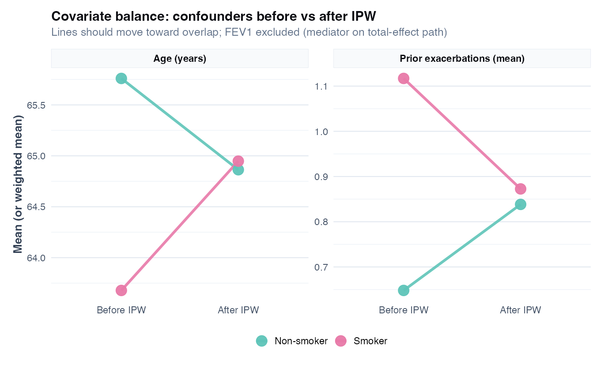
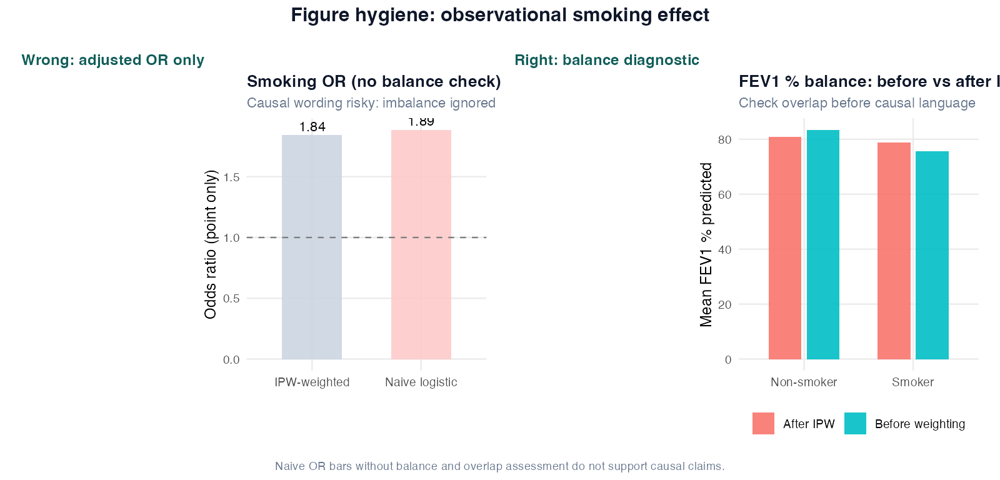
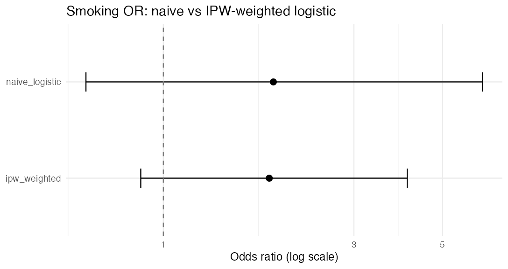

# Chapter 21: Causal inference, confounding and IPW

> **Part VIII: Longitudinal, survival, and causal inference**

## Opening scene: "Smoking reduces exacerbation risk"

The observational CASTOR cohort shows a significant adjusted OR after `lm()` on 0/1 was finally replaced by logistic regression. A fellow drafts causation language. Mei rewrites: **association**, confounding, positivity, and what randomisation would have required to claim more.

---

## Why this chapter

Observational respiratory studies dominate the literature. This chapter gives IPW, matching, and honest limits, without selling association as intervention effect.

> **Consult a statistician when:** target-trial emulation, g-methods, IV analysis, or causal claims will appear in a label, guideline, or HTA submission.

---

## The causal workflow

1. **Estimand**: total effect? direct effect? risk difference at 12 months?
2. **DAG / subject-matter map**: what causes what; what must not be adjusted for?
3. **Design**: RCT (Case A) vs observational (Case B, this chapter).
4. **Analysis**: regression, IPW, matching aligned to estimand.
5. **Diagnostics**: balance, positivity, weight distribution.
6. **Humility**: unmeasured confounding sensitivity; avoid causal verbs unless justified.

---

## Association vs causation (respiratory)

**Regression asks what associations remain under a model. Causal inference asks what contrast would have been observed under different interventions**—requiring assumptions data alone cannot verify (exchangeability, positivity, correct timing). This chapter introduces IPW and matching as **sensitivity tools**, not substitutes for randomisation.

| Claim type | Example sentence | Supported by observational logistic? |
|------------|------------------|--------------------------------------|
| **Association** | Smoking is associated with higher exacerbation odds after adjusting for FEV1 | Yes, with STROBE limits |
| **Prediction** | Smoking improves risk model AUC | Ch 9 framing |
| **Causation** | Smoking **causes** excess exacerbations | Needs design + assumptions |

Randomised trials (Case A) support causal **treatment** claims for the randomised factor. Observational smoking studies do not, without stronger design and sensitivity.

---

## Confounding structure (CASTOR)

**Smoking** → lower **FEV1** and higher **exacerbation** risk. In this cross-sectional snapshot, **post-exposure FEV1 %** lies on the smoking → exacerbation pathway (partial **mediator** for a total smoking effect). **Prior lung function measured before smoking exposure** could be a **confounder**; measured FEV1 here is **not** a confounder of smoking → exacerbation merely because other factors also predict FEV1 and exacerbation — those are **mediator–outcome confounders** (adjust in mediation if prespecified), not reasons to put FEV1 in a total-effect propensity model.

```
Smoking -----> Exacerbation (12m)
 | ^
 v |
 FEV1 ---------------+
```

**Adjust for FEV1** when the estimand is the association of smoking **not explained by** measured lung function (or when FEV1 is a confounder per protocol). **Do not adjust** for FEV1 when the **total effect** of smoking including its impact via FEV1 is the target, unless using a mediation framework prespecified in advance.

---

## Confounder, mediator, collider (quick reference)

| Variable role | Adjust? | Respiratory trap |
|---------------|---------|------------------|
| **Confounder** | Yes (if measured) | Omitting prior exacerbation history |
| **Mediator** | Only for direct effect estimand | Adjusting FEV1 when total smoking effect wanted |
| **Collider** | **No** | Adjusting for hospitalisation that is caused by both smoking and exacerbation |
| **Instrument** | Special methods | Rare in basic COPD cohorts |

---

## Technique: Associational vs causal estimands; introductory IPW

**Associational logistic regression** asks whether smoking is associated with exacerbation after adjusting for measured covariates. The estimand is a conditional odds ratio: hypothesis generation and STROBE cohort descriptions, not proof that smoking causes exacerbations. In R: `glm(exacerbation_12m ~ smoking + fev1_pct, family = binomial)`.

**Introductory IPW** reweights patients so exposure groups look more comparable on **measured confounders** (not mediators), then estimates a **marginal** smoking–exacerbation association without adjusting for FEV1 on the outcome path. Model `smoking ~ confounders` → **stabilised** weights → weighted outcome model `exacerbation ~ smoking` with **robust standard errors**. Assumes no unmeasured confounding, positivity, and a correct exposure model. **Good balance on measured covariates does not prove absence of confounding.** Inspect the weight distribution, report **effective sample size (ESS)**, and treat **truncation** as a **sensitivity analysis** (document extreme weights), not an invisible repair. Doubly robust estimation (outcome model + weighting) is a specialist extension. Use as sensitivity for a **total-effect** estimand; do not treat as automatic proof of causation.

"Adjusted OR" and "IPW OR" still describe **observational** data; randomised trials (Case A) remain the gold standard for causal treatment effects.

### Worked example (CASTOR)

From `ch21_smoking_or_naive_vs_ipw.csv` (teaching run, **total-effect** estimand; FEV1 excluded):

| Model | Smoking OR (95% CI) |
|-------|----------------------|
| Adjusted for confounders (age, sex, prior exacerbations) | 2.11 (0.73 to 7.00) |
| IPW marginal (robust SE) | 2.29 (0.76 to 6.90) |

ORs are similar here because overlap on confounders is adequate. The lesson is **process**: specify estimand (total vs direct), exclude mediators from the IPW path, check balance on **confounders**, inspect weights, and use robust uncertainty for the weighted outcome model. Wide CIs reflect sparse events.

```r
source("R/examples/ch21_causal_inference.R")
or_tbl <- readr::read_csv(
 "volume-01/tables/ch21_smoking_or_naive_vs_ipw.csv"
)
wt <- readr::read_csv("volume-01/tables/ch21_ipw_weight_summary.csv")
```

### Target trial (concept)

Ask: *What randomized experiment would answer this question?* Then emulate its eligibility, treatment strategies, assignment, follow-up, and outcomes using observational data. Misalignment at any step introduces bias.

| Target trial component | CASTOR observational analogue |
|------------------------|------------------------------|
| Eligibility | COPD cohort inclusion criteria |
| Treatment strategies | Smoker vs non-smoker (not well-defined intervention) |
| Assignment | Not random → confounding |
| Follow-up | 12 months |
| Outcome | `exacerbation_12m` |

Smoking is **not** a randomised exposure in CASTOR; causal language is especially fragile.

### Caveats box

| Caveat | Why it matters |
|--------|----------------|
| Unmeasured confounding | Adherence, SES, exacerbation history incompletely captured |
| Collider adjustment | Conditioning on post-exposure variables (e.g. antibiotics) opens bias |
| Mediator adjustment | Adjusting for variables on causal path blocks total effect |
| Positivity / extreme weights | Sparse cells → unstable weights; trim and report **ESS** |
| Overlap | No empirical overlap → estimand not supported in data |
| Transportability | CASTOR-like synthetic cohort ≠ your clinic population |

### In practice

“Adjusted for confounders” in an abstract is not causal language. Match verbs to design: randomised trial → effect; observational cohort → association unless prespecified causal framework and sensitivity are in place.

### Wrong analysis ⚠

| What went wrong? | Why it matters | Better approach | What to report |
|------------------|----------------|-----------------|----------------|
| "Adjusted OR proves smoking causes exacerbations" | Observational design | Associational estimand; Ch 12 Case B limits | "Associated with" + STROBE |
| Throw all predictors into propensity model | Overfit PS; biased weights | DAG / prespecified confounder set | Balance on confounders only |
| IPW without checking weights | Extreme weights dominate | Weight summary, ESS, truncation sensitivity | Weight range + robust SE |
| Adjust mediators when total effect is target | Blocks part of effect | Prespecify total vs direct (Ch 22) | Estimand label in Methods |

> **Extended catalogue:** [Appendix R — Chapters 20–22](../appendix-r-wrong-analysis-catalog.md#chapter-20-22).

### Reporting template

> We estimated the association between smoking and 12-month exacerbation in an observational cohort (*n* = …). The confounder-adjusted logistic model (age, sex, prior exacerbations; **FEV1 excluded** for total-effect estimand) yielded OR = … (95% CI …). As a sensitivity analysis, we applied inverse probability weights for smoking based on the same confounders (weight range …; mean …) and fitted a marginal weighted outcome model with robust standard errors. The IPW OR was … (95% CI …). These analyses assume no unmeasured confounding and sufficient overlap of smokers and non-smokers within confounder strata. Causal interpretation is not claimed; findings are associational [@vonelm2007strobe].

---

## RCT vs observational (when to say "cause")

| Design | Causal treatment claim | Key chapter |
|--------|------------------------|-------------|
| RCT (Case A) | Supported for randomised factor | Ch 12 Case A |
| Observational cohort (Case B) | Associational only | Ch 12 Case B, this chapter |
| IPW / propensity | Sensitivity; not proof | This chapter |

---


## R lab

```r
source("R/00_setup.R")
source("R/examples/ch21_causal_inference.R")
```



Check whether **age** and **prior exacerbations** means are closer across smoking groups after weighting. FEV1 is a mediator on the total-effect path and is intentionally not balanced by this IPW scheme. Poor confounder balance after weighting → revisit exposure model or overlap.

### Figure hygiene: naive OR vs balance check



| Panel | Shows | Masks |
|-------|--------|-------|
| **Wrong** | Adjusted OR bar (causal wording) | Covariate overlap, weight diagnostics |
| **Right** | Balance before vs after IPW | Whether weighting achieved exchangeability |



Material movement between naive and IPW-adjusted ORs is a sensitivity flag, not proof of a causal smoking effect.

**Tables:** `ch21_smoking_or_naive_vs_ipw.csv`, `ch21_balance_before_after_ipw.csv`, `ch21_ipw_weight_summary.csv`

### Mini-lab: propensity score pointer

Full propensity score workflow: estimate `e(X) = P(smoking=1|X)`, check overlap, weight or match, then outcome model. Packages: `WeightIt`, `MatchIt`. Always report balance diagnostics (standardised mean differences).

```r
# Illustrative only — match total-effect estimand (FEV1 is a mediator, not in PS):
# library(WeightIt)
# w <- weightit(
#   smoking ~ age + sex + prior_exacerbations,
#   data = exac,
#   method = "ps"
# )
# summary(w)
# # Outcome: exacerbation_12m ~ smoking with robust SEs; do not adjust FEV1 for total effect
```

### Mini-lab: E-value pointer

When unmeasured confounding is plausible, E-values quantify how strong an unmeasured confounder would need to be to explain away the observed association (advanced; see [@hernan2020whatif]).

---

## Alternatives & extensions

| Situation | Method | Note |
|-----------|--------|------|
| Binary treatment, many covariates | Propensity matching / weighting | Overlap plots |
| Time-varying treatment | Marginal structural models | Advanced |
| Unmeasured confounding | Sensitivity analysis (E-values) | Report bounds |
| RCT subgroup | No causal adjustment needed for randomisation | Case A |
| Mechanism through FEV1 % | Mediation (total / direct / indirect) | Chapter 22 |

---

## Quick reference: methods in this chapter

| Method | When to use | Why |
|--------|-------------|-----|
| **Adjusted logistic / Cox (associational)** | Observational; report adjusted OR/HR | Controls measured confounders; still not RCT |
| **IPW (propensity weights)** | Treatment/exposure imbalance; overlap adequate | Reweights to pseudo-population with balance |
| **Propensity score matching** | Want comparable treated/untreated pairs | Visual overlap; reduces model dependence |
| **Target trial emulation** | Framing observational analysis | Aligns time zero, eligibility, treatment strategies |
| **DAG + confounder set** | Planning adjustment | Separates confounders from mediators/colliders |
| **E-value / sensitivity** | Unmeasured confounding concern | Quantifies how strong hidden bias would need to be |
| **No causal adjustment** | RCT primary analysis | Randomisation supports causal contrast ([Case A](12-case-studies.md)) |
| **Do not adjust mediators** | Total effect estimand | Blocks part of causal path |
| **Mediation analysis** | Mechanism through measured mediator prespecified | Total vs direct decomposition ([Ch 22](22-mediation-analysis.md)) |

**Extensions:** MSM, matching details in [Alternatives & extensions](#alternatives--extensions).

---


## Exercises ([Solutions](../solutions/ch21_solutions.md))

**E21.1** Name one confounder on the smoking → exacerbation path in CASTOR.

**E21.2** What does the "no unmeasured confounding" assumption mean?

**E21.3** Why check weight distributions after IPW?

**E21.4** Is FEV1 a confounder, mediator, or both? Why does it matter?

**E21.5** What is one component of a target trial emulation?

**Applied**

1. Run `source("R/examples/ch21_causal_inference.R")`.
2. Compare naive vs IPW OR in `ch21_smoking_or_naive_vs_ipw.csv`.
3. Read `ch21_ipw_weight_summary.csv`: any extreme weights?
4. From the balance plot, did IPW improve **confounder** balance (age, prior exacerbations)? FEV1 is excluded from this total-effect weighting scheme.
5. Rewrite a causal-sounding sentence as an associational sentence suitable for STROBE.

**Capstone link:** Case B (associational logistic) vs this chapter (explicit causal framing).

---

## Where we go next

When FEV1 sits on the smoking → exacerbation path and reviewers ask *how much goes through lung function*, continue to [Chapter 22: Mediation analysis](22-mediation-analysis.md). Otherwise return to [Chapter 12](12-case-studies.md) for integrated discussions or Appendix B for day-to-day method choice.



**Near neighbors:** Ch [22](chapters/22-mediation-analysis.md) · Ch [12](chapters/12-case-studies.md) (Case B)

## Further reading

- Hernán & Robins, *Causal Inference: What If* [@hernan2020whatif]
- Harrell, *Regression Modeling Strategies* [@harrell2015rms]
- STROBE reporting for observational studies [@vonelm2007strobe]
