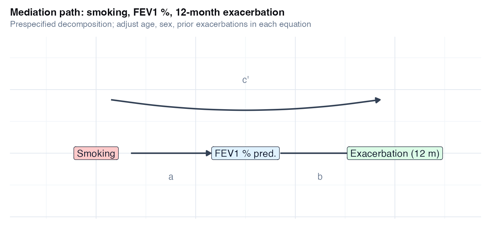
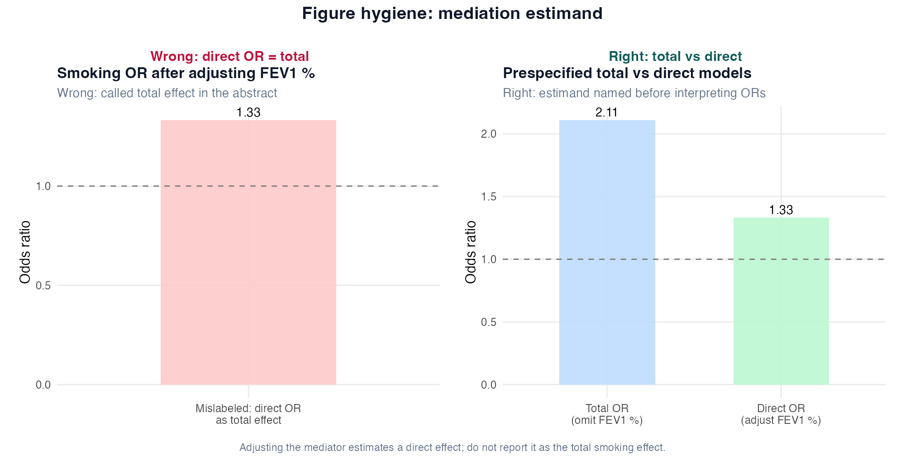
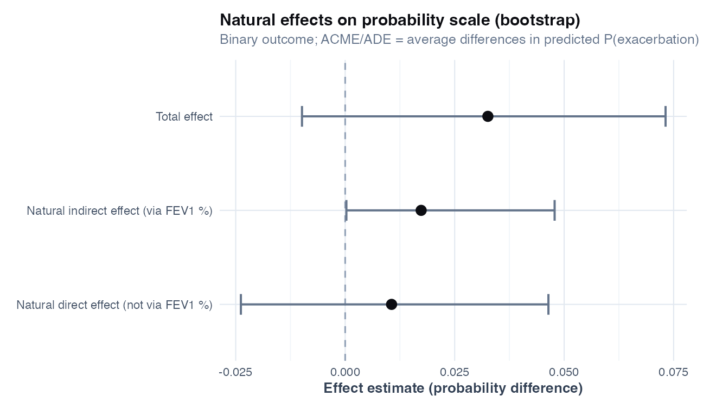
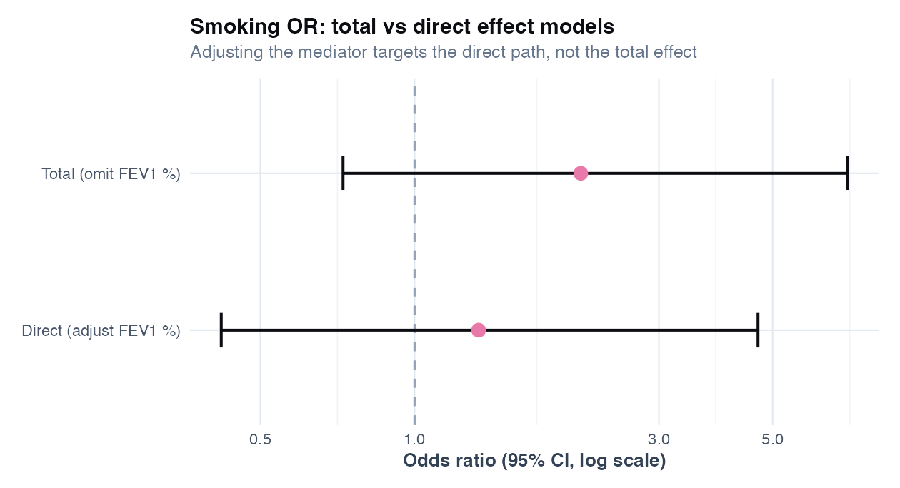

# Chapter 22: Mediation analysis

> **Part VIII: Longitudinal, survival, and causal inference**

## Opening scene: "Is it mediated by FEV₁?"

Smoking associates with exacerbation; FEV₁ sits on the path. A PI asks how much is **direct** vs **through** lung function. Mediation decomposes associational paths; not mechanistic proof, when prespecified and interpreted with humility.

---

## Why this chapter

Mediation answers a specific estimand question. CASTOR closes the volume here: total, direct, and indirect language tied to bootstrap CIs, and explicit limits on causal reading. Lower FEV1 % is a plausible **mechanism** linking smoking to exacerbation in COPD, but not the only one (airway inflammation, colonisation, adherence). A mediation analysis quantifies association through **one measured mediator**, not the full biology. Mediation requires **three no-confounding** structures (exposure–mediator, exposure–outcome, mediator–outcome) and correct **temporal ordering**. CASTOR `exacerbation.csv` is a **single time-point teaching snapshot**, treat results as **illustrative**, not as proof that smoking causes exacerbations through FEV1. If the indirect effect is small and the direct path dominates, policy discussion may still focus on total smoking burden rather than lung-function pathways alone.

> **Consult a statistician when:** mediation will support mechanism claims, policy decomposition, or sensitivity to unmeasured mediator–outcome confounding. This chapter teaches **one-mediator bootstrap workflow**; not causal mediation theory in full.

---

## The mediation workflow

1. **Estimand**: total, direct, indirect, or proportion mediated?
2. **DAG**: draw smoking → FEV1 % → exacerbation; list confounders **not** on the path.
3. **Timing**: mediator measured before outcome window (defend in protocol).
4. **Models**: mediator model (M ~ A + C); outcome model (Y ~ A + M + C).
5. **Effects**: compare total vs direct ORs; bootstrap natural effects.
6. **Sensitivity**: unmeasured confounding of mediator–outcome link; avoid causal verbs without design support.

---

## Total vs direct vs indirect (plain language)

| Estimand | Model includes FEV1 %? | Smoking coefficient means | CASTOR teaching OR |
|----------|------------------------|---------------------------|--------------------|
| **Total effect** | No | Combined effect through all paths | **2.11** (0.73 to 7.00) |
| **Direct effect** | Yes | Effect not through measured FEV1 % | **1.33** (0.42 to 4.68) |
| **Indirect effect** | Derived | Effect through FEV1 % path | ACME **0.017** probability difference (bootstrap) |

The gap between total OR (2.11) and direct OR (1.33) is the **practical signature** that FEV1 % sits on the path. Formal decomposition uses bootstrap **ACME** (average causal mediation effect / natural indirect effect) and **ADE** (average direct effect) on the **probability scale** when the outcome model is logistic [@imai2010identification; @tingley2014mediation].

---

## Confounders in mediation models

Adjust the **same prespecified confounder set** in **both** the mediator and outcome models unless the DAG says otherwise.

| Variable | Role in CASTOR path | Include in M and Y models? |
|----------|---------------------|----------------------------|
| **Age** | Confounder | Yes |
| **Sex** | Confounder | Yes |
| **Prior exacerbations** | Confounder (severity) | Yes |
| **FEV1 %** | Mediator | Outcome model only (not mediator model) |
| **Therapy** | Possible confounder / collider | Prespecify; not in teaching script |

**Never** adjust a **collider** or a **mediator–outcome confounder affected by smoking** without DAG guidance (Ch 21).

---

## Technique: Path models and natural effects (CASTOR)

Path models with natural effects ask how much of the smoking–exacerbation association is consistent with a path through FEV1 % predicted. Exposure (A) is smoking; mediator (M) is FEV1 % predicted; outcome (Y) is 12-month exacerbation; confounders (C) are age, sex, and prior exacerbations. Fit a linear mediator model and logistic outcome model, then bootstrap natural effects with `mediation::mediate(..., boot = TRUE)`. Use when a mechanism hypothesis is prespecified and the mediator precedes the outcome; not for exploratory mediator fishing or reverse causation. Does not prove smoking **causes** exacerbation through FEV1; biology is multi-path.

In the teaching run, the **total** smoking OR is **2.11**; adjusting FEV1 % moves the OR to **1.33**; bootstrap **ACME** is **0.017** on the **probability scale** (average difference in predicted P(exacerbation); 95% bootstrap interval 0.000 to 0.048). Do not report ACME/ADE as log-odds effects when `mediation::mediate()` is used with a logistic outcome. If your steering committee cares about **total public-health burden of smoking**, report the total-effect model. If the scientific question is **lung-function pathway**, prespecify mediation and report ACME/ADE with sensitivity analysis.

### Worked example (CASTOR)

From `ch22_total_vs_direct_or.csv` and `ch22_mediation_effects.csv`:

| Quantity | Estimate | 95% interval | *p* (bootstrap / model) |
|----------|----------|--------------|-------------------------|
| Total OR (no FEV1 %) | 2.11 | 0.73 to 7.00 | 0.19 |
| Direct OR (with FEV1 %) | 1.33 | 0.42 to 4.68 | 0.63 |
| ACME (indirect, probability scale) | 0.017 | 0.000 to 0.048 | 0.04 |
| ADE (direct, probability scale) | 0.011 | −0.024 to 0.046 | 0.63 |
| Total effect (probability scale) | 0.033 | −0.010 to 0.073 | 0.15 |

Path coefficients (`ch22_path_coefficients.csv`): smoking lowers FEV1 % (a path ≈ **−8.5** percentage points); lower FEV1 % raises exacerbation odds (b path OR ≈ **0.95** per 1 % unit on the logistic scale after exponentiation).

### Caveats box

| Caveat | Why it matters in respiratory research |
|--------|----------------------------------------|
| **Cross-sectional snapshot** | FEV1 % and 12-month exacerbation in one row do not prove temporal order |
| **Single mediator** | Inflammation, adherence, and infections are unmeasured parallel paths |
| **No unmeasured mediator–outcome confounding** | Severity may affect both FEV1 and exacerbation beyond prior counts |
| **Nonlinear GLM** | Product-of-coefficients shortcuts fail; use simulation/bootstrap (`mediate`) |
| **Rare events / separation** | Unstable logistic fits; check events per cell |
| **Proportion mediated** | Can be unstable when total effect is near zero; interpret cautiously |

### Wrong analysis ⚠

**Common mistake:** adjust for FEV1 % in logistic regression and report the smoking OR as the **total effect of smoking**.

**Why it fails:** conditioning on a mediator blocks part of the causal path from smoking to exacerbation. The coefficient is a **direct effect**, not the total effect (Ch 21, E21.4).

**Do instead:** prespecify total vs direct estimands; fit both models or use `mediate()`; label ORs correctly in tables and slides.

### Wrong analysis ⚠ (Baron–Kenny ritual)

**Common mistake:** require all four Baron–Kenny steps (significant a and b paths) before claiming mediation.

**Why it fails:** stepwise significance ignores modern causal identification and low power on paths [@vanderweele2015explanation].

**Do instead:** estimate natural effects with bootstrap CIs; report whether the indirect CI excludes the null, not a checklist of *p*-values.

### Reporting template

**Methods (mediation paragraph)**

> We prespecified a mediation analysis of smoking on 12-month exacerbation with FEV1 % predicted as mediator and adjustment for age, sex, and prior exacerbations. The mediator model was linear (FEV1 % ~ smoking + covariates). The outcome model was logistic (exacerbation ~ smoking + FEV1 % + covariates). We report the total-effect odds ratio (outcome model without mediator), the direct-effect odds ratio (outcome model with mediator), and bootstrap natural indirect (ACME) and direct (ADE) effects as **average differences in predicted probability** (500 simulations) using the `mediation` package [@tingley2014mediation]. Cross-sectional CASTOR data provide an associational decomposition under stated no-unmeasured-confounding assumptions; causal interpretation requires stronger design.

**Results (one sentence)**

> The total smoking OR was 2.11 (95% CI 0.73 to 7.00); adjusting FEV1 % yielded a direct OR of 1.33 (0.42 to 4.68). The bootstrap natural indirect effect (ACME) was 0.017 on the probability scale (95% CI 0.000 to 0.048).

**Limitations**

> Single-mediator, single-time-point snapshot; unmeasured severity and inflammatory pathways may confound the mediator–outcome relation.

---

## In practice

Sponsor question: *“Does smoking drive exacerbations through lung function?”*
Answer in two sentences: (1) name the estimand (indirect via FEV1 %); (2) show total vs direct ORs **and** bootstrap ACME with CI. Do not upgrade to causal language unless the protocol prespecified mediation and sensitivity analyses.

---

## Before you open R

- **Estimand:** natural indirect and direct effects of smoking on 12-month exacerbation through FEV1 % predicted.
- **Unit:** patient (`exacerbation.csv`).
- **Confounders:** age, sex, prior exacerbations in **both** models.
- **Sensitivity:** compare total vs direct ORs; discuss cross-sectional limits.

---

## R lab

```r
source("R/00_setup.R")
source("R/examples/ch22_mediation.R")
```

### Path diagram



### Figure hygiene: total vs direct estimand



| Panel | Shows | Masks |
|-------|--------|-------|
| **Wrong** | Direct OR labeled “total smoking effect” | That FEV1 adjustment changed the estimand |
| **Right** | Total vs direct OR comparison | Whether indirect bootstrap CI excludes zero |

### Natural effects and OR comparison





**Tables:** `ch22_path_coefficients.csv`, `ch22_total_vs_direct_or.csv`, `ch22_mediation_effects.csv`

### Core code (excerpt)

```r
library(tidyverse)
library(mediation)

exac <- readr::read_csv("data/exacerbation.csv") %>%
  mutate(smoking_num = as.integer(smoking), sex = factor(sex))

fit_m <- lm(
  fev1_percent_predicted ~ smoking_num + age + sex + prior_exacerbations,
  data = exac
)

fit_y <- glm(
  exacerbation_12m ~ smoking_num + fev1_percent_predicted +
    age + sex + prior_exacerbations,
  data = exac,
  family = binomial()
)

fit_total <- glm(
  exacerbation_12m ~ smoking_num + age + sex + prior_exacerbations,
  data = exac,
  family = binomial()
)

set.seed(20260628)
med_out <- mediate(
  fit_m, fit_y,
  treat = "smoking_num",
  mediator = "fev1_percent_predicted",
  boot = TRUE, sims = 500
)
summary(med_out)
```

### Mini-lab: sensitivity pointer

When reviewers worry about unmeasured confounding of the FEV1 % → exacerbation link, report **sensitivity parameters** (how strong an unmeasured confounder would need to be to nullify ACME). See VanderWeele [-@vanderweele2015explanation] and package `mediation` sensitivity functions for advanced workflows.

---

## Alternatives & extensions

| Situation | Method | Note |
|-----------|--------|------|
| Longitudinal mediator | Latent growth or cross-lagged models | Time ordering explicit |
| Time-to-event outcome | Survival mediation extensions | Rare events; specialist software |
| Multiple mediators | Multivariate mediation | Prespecify paths |
| Binary mediator | Logistic mediator model | Different `mediate` setup |
| RCT of smoking cessation | Stronger causal mediation | Randomised exposure helps |
| Observational COPD | Sensitivity analysis | Default for CASTOR teaching |

---

## Quick reference: methods in this chapter

| Method | When to use | Why |
|--------|-------------|-----|
| **Total effect model (omit mediator)** | Policy or exposure effect including all paths | Smoking OR without FEV1 % in the model |
| **Direct effect model (adjust mediator)** | Effect **not through** measured mediator | Smoking OR with FEV1 % in the model |
| **Product-of-coefficients (Baron–Kenny style)** | Teaching decomposition; continuous mediator on linear scale | Quick a×b intuition; fragile with GLMs |
| **Natural effects (`mediate`)** | Prespecified binary exposure, continuous mediator, binary outcome | Bootstrap ACME, ADE, total on **probability scale** (logistic outcome) |
| **Causal mediation with sensitivity** | Reviewer asks about unmeasured mediator–outcome confounding | VanderWeele sensitivity parameters |
| **Do not run mediation** | Cross-sectional snapshot; mediator measured after outcome | Temporal order unclear; estimand not defensible |
| **Do not adjust mediator for total effect** | Total smoking impact is the question | Blocks part of the causal path ([Ch 21](21-causal-inference.md)) |

**Extensions:** longitudinal mediators, competing risks, and time-varying treatments in [Alternatives & extensions](#alternatives--extensions).

---


## Exercises ([Solutions](../solutions/ch22_solutions.md))

**E22.1** What is the difference between total and direct effect of smoking on exacerbation?

**E22.2** Why must age and prior exacerbations appear in **both** mediator and outcome models here?

**E22.3** What does ACME quantify in this chapter's path diagram?

**E22.4** Why is proportion mediated unstable when the total effect is near zero?

**E22.5** Give one reason CASTOR cross-sectional data limit causal mediation claims.

**Applied**

1. Run `source("R/examples/ch22_mediation.R")`.
2. Compare total vs direct ORs in `ch22_total_vs_direct_or.csv`.
3. Read ACME and ADE in `ch22_mediation_effects.csv`.
4. From `ch22_path_coefficients.csv`, interpret the smoking coefficient in the mediator model.
5. Write a one-paragraph Results section using the reporting template.

**Capstone link:** Case B logistic model vs this chapter's explicit decomposition.

---

## Where we go next

You have completed the extended causal path (Ch 18–22). Return to [Chapter 12](12-case-studies.md) for integrated case discussions, [Chapter 21](21-causal-inference.md) for IPW and DAGs without mediation, or Appendix B for day-to-day method choice.

## Related chapters

| Chapter | When to open it |
|---------|------------------|
| [Chapter 12: Case studies](12-case-studies.md) | Integrated CASTOR narratives A–E |
| [Chapter 21: Causal inference](21-causal-inference.md) | Confounding, IPW, DAGs |

## Handbook resources

| Resource | When to use it |
|----------|----------------|
| [Appendix B: Quick reference](../appendix-b-quick-reference.md) | Choose a test or model by outcome and design |

## Further reading

- VanderWeele, *Explanation in Causal Inference* [@vanderweele2015explanation]
- Imai, Keele, and Tingley on causal mediation [@imai2010identification; @tingley2014mediation]
- Hernán & Robins, *Causal Inference: What If* (free online)
